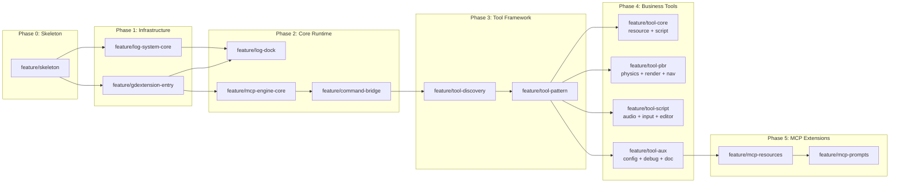

# Godot-Self-Driving — Agent Guide

## ⚠️ Rules — Verified from Implementation

### R1: WHOLEARCHIVE Required for godot-cpp

`target_link_libraries(godot-self-driving PRIVATE godot-cpp)` 传播 include 路径，但链接器会丢弃未被引用的静态初始化代码（`ClassDB::register_class` 等）。必须额外加 `target_link_options(godot-self-driving PRIVATE "/WHOLEARCHIVE:$<TARGET_FILE:godot-cpp>")`。`-Wl,/WHOLEARCHIVE:godot-cpp` 的写法不传播 include 路径——永远用上面这种拆分写法。

### R2: GDExtension Init — SCENE Before EDITOR

`ClassDB::register_class<T>()` 必须在 `EditorPlugins::add_by_type<T>()` 之前调用。继承 `EditorDock` 的类必须在 `MODULE_INITIALIZATION_LEVEL_EDITOR` 阶段注册（EditorDock 父类在 SCENE 阶段不可用）。普通 Control 在 SCENE 阶段注册。

### R3: Logging — Single Mechanism

全程使用 `LogSystem::instance().log()`。`UtilityFunctions::print`、`godot::print_line`、`std::cout` 的日志不会出现在 MCP Log Dock 中。

### R4: MCP Server — stateless=true Required

`StreamableHttpServerOptions.stateless` 必须设为 `true`。为 `false` 时 POST 响应走 SSE 流（返回 202 + 异步推送），不走直接 HTTP 返回，MCP 客户端收不到同步响应。

### R5: Thread Model — libhv Internal Threads + EditorPlugin::_process()

libhv 在内部线程处理 HTTP/MCP。`Node::_process()` 在编辑器模式下不会被调用——只有 `EditorPlugin::_process()` 是可靠的。`CommandQueue::drain()` 必须放在 `EditorPlugin::_process()` 里每帧调用。

### R6: CommandQueue — Exception Safety

`Task::execute()` 必须用 `try-catch` 包裹 `fn()`。异常时调 `promise.set_exception()`，否则 `future.get()` 在 libhv 线程上永远挂起。

### R7: Tool Architecture — Two-Tier (Direct vs Proxy)

Meta-tools（ping、search_tools、list_categories、get_tool_detail、call_tool）直接通过 `server_->RegisterTool()` 注册到 MCP server。所有业务工具（scene_*、property_*、resource_*、script_* 等）注册在 `g_handlers` 内部映射中，通过 `call_tool` 代理调用。`ToolHandler` 签名是 `mcp::JsonValue(const mcp::JsonValue&)`——handler 返回原始 JSON，`call_tool` 负责包装成 `CallToolResult`。这样业务 handler 无需感知 MCP 协议。

### R8: UndoRedo for State-Changing Operations

修改 Godot 编辑器状态的操作（property_set、script_attach_to_node、script_detach_from_node 等）必须通过 `EditorInterface::get_editor_undo_redo()` 创建 UndoRedo action。用 `add_do_method` / `add_undo_method` / `commit_action()` 包裹，不要直接调用 `node->set()` 或 `node->set_script()`。

### R9: Server API (RID-based) vs Node API (Path-based)

physics_ops、render_ops、nav_ops 使用 Godot 的 Server 级 API（`RenderingServer`、`PhysicsServer2D/3D`、`NavigationServer2D/3D`），参数基于 RID（Resource ID），不依赖 `EditorInterface`。这是 Node 级 API 之外的独立路径——Server API 在无场景打开时也可用，但需要调用方通过 `call_tool` 传入 RID（如 `space_rid`、`body_rid`），而非节点路径。`scene_ops`/`property_ops` 的 Node 路径解析逻辑不适用于 Server API 工具。

### R10: ctx Capture — NEVER Capture By Reference

`ctx` (RequestContext) is destroyed after the handler lambda returns. Capturing `ctx` by reference into the `queue.submit()` lambda causes use-after-free in `drain()`. **Always copy needed params as `mcp::JsonValue` before submitting.** Inside the submit lambda, use the copy — never `ctx`.

### R11: BM25 Index Population — Must Be After All Tools

`index.add_entry()` must be called **after** both `catalog.populate_default_tools()` AND all `catalog.add_tool()` calls from `register_all_tools()`. If called before, `search_tools` won't find the newly registered tools. (Done via `for (auto* tool : catalog.get_all_tools())` loop in `register_all.cpp`.)

### R12: Ref\<T\> Requires Complete Type — Include Class Headers

Any `.cpp` using `Ref<SomeGodotClass>` (e.g. `Ref<AudioBusLayout>`, `Ref<AudioEffect>`, `Ref<AudioStream>`, `Ref<Resource>`) **must** `#include` the corresponding class header from `godot_cpp/classes/`. Forward declarations are insufficient — `Ref<T>` destructor calls `unref()` which requires the complete type for `memdelete`. When in doubt, include the header for any `Ref<T>` you construct, receive from a singleton, or return.

### R13: Editor Alignment — Tool Behavior Must Match Godot Editor

Every tool that modifies resources or scene state must replicate what the Godot editor does for the equivalent human operation. Key rules derived from Godot engine source analysis:

**Resource rename**: After `DirAccess::rename_absolute()`, must also:

- Update `ResourceCache` via `ResourceLoader::get_cached_ref()` → `set_path(new_path)`
- If renamed file is the edited scene → `root->set_scene_file_path(new_path)`
- Update `EditorFileSystem::update_file()` for both old and new paths

**Resource delete**: After file removal, must:

- Unregister from `ResourceCache` by loading cached ref and calling `set_path("")`
- Update `EditorFileSystem::update_file()` with removed path

**Resource save to new path**: After `ResourceSaver::save()`, if `dest_path != path`:

- Check if saved file is the edited scene → `root->set_scene_file_path(new_path)`
- Update `EditorFileSystem::update_file()` for both paths

**Script attach/detach**: Must go through `EditorUndoRedoManager` to mark scene as modified:

- `undo_redo->create_action("Attach/Detach Script")`
- `add_do_method(node, "set_script", new_script)` / `add_undo_method(node, "set_script", old_script)`
- `commit_action()`
- Without this, the scene tab won't show the unsaved indicator (asterisk) and undo won't work

---

## Project Nature

GDExtension plugin (`.dll` / `.so` / `.dylib`) that runs in-process in Godot editor/runtime. Opens an MCP Streamable HTTP server at `http://127.0.0.1:9527/mcp`. No standalone process — starts/stops with the Godot project.

Tech: CMake 3.28+ / C++17 / godot-cpp (FetchContent) / [mcp-cpp-sdk 0.2.1](https://github.com/jesspig/modelcontextprotocol-cpp-sdk) (FetchContent). SDK 0.2.1 uses libhv internally, and `mcp::JsonValue` is the native JSON type.

## Build & Deploy

```bash
uv run build.py              # Debug build → example/addons/ (no cleanup)
uv run build.py --release    # Clean .godot/ + addons/, then Release build → example/addons/
```

Raw CMake:

```bash
cmake --preset debug
cmake --build --preset debug
```

**Do NOT pass `-j`** — Ninja job pools handle parallelism via `cmake/BuildOptimization.cmake`.

Output: `build/debug/godot-self-driving.dll` (Debug, ~9 MB) or `build/release/godot-self-driving.dll` (Release, ~4.5 MB).

`.gdextension` file is **generated** by `build.py` at deploy time, never committed.

If Godot loads a stale plugin after rebuild, use `--release` to clear `.godot/` metadata cache.

## Dependency Fetch Gotchas

All dependencies fetched from GitHub via FetchContent — **never use local paths or local clones**. CMake must clone from the declared GitHub URLs. **Never delete `_deps/`** — forces full re-download. If network unavailable, copy `_deps/` from prior successful build (e.g. from mcp-cpp-sdk's `build/release/_deps/`).

**Release build `_deps`**: When updating SDK version, release build's `build/release/_deps/` may be stale (empty or wrong content). Copy `build/debug/_deps/mcp-cpp-sdk-*` to `build/release/_deps/` to avoid re-fetch.

## Architecture Design

### Thread Model

```
libhv thread (HTTP + MCP) ──submit()──→ CommandQueue ──drain()──→ Godot main thread (engine APIs)
                                       ↑ captured args (R10)
```

- **libhv** handles HTTP and MCP protocol on internal threads
- **Godot main thread** is the ONLY thread allowed to call engine APIs
- **CommandQueue** bridges them: tool handlers `submit()`, `EditorPlugin::_process()` calls `drain()` each frame
- **Do NOT use `GodotNode::_process()`** — in editor mode, only `EditorPlugin::_process()` is called reliably (R5)

### GDExtension Initialization (Two Levels)

```
MODULE_INITIALIZATION_LEVEL_SCENE   → ClassDB::register_class<CustomNode>()
                                       (McpStatusBar at SCENE)
MODULE_INITIALIZATION_LEVEL_EDITOR  → ClassDB::register_class<McpLogDock>()
                                       ClassDB::register_class<EditorPlugin>()
                                       EditorPlugins::add_by_type<EditorPlugin>()
                                       new ServerContext() + start()
```

**Important**: `ClassDB::register_class<T>()` REQUIRED before `EditorPlugins::add_by_type<T>()`. Classes inheriting `EditorDock` must be registered at EDITOR level (EditorDock parent class not available at SCENE). All other Controls at SCENE level. (R2)

### EditorPlugin + Dock

- Toolbar: `add_control_to_container(CONTAINER_TOOLBAR, control)`
- Panels: Use **EditorDock** (inherit, `add_dock()`), NOT `add_control_to_dock()`
- `DOCK_SLOT_BOTTOM` for log panel
- Theme: `EditorInterface::get_singleton()->get_base_control()->get_theme()`
- Editor icon names (from `editor/editor_log.cpp`):
  - Clear → `"Clear"`, Collapse → `"CombineLines"`
  - Debug → `"Debug"`, Info → `"Popup"`, Warning → `"StatusWarning"`, Error → `"StatusError"`
  - All under `"EditorIcons"` theme type

### MCP Server (ServerContext)

Created at EDITOR level. Manages `StreamableHttpServerTransport` + `McpServer`. libhv handles HTTP on internal threads — no background thread needed.

**SDK 0.2.1 event callbacks** (configured via `ServerOptions`):

- `on_method_called` — logs every MCP method call (Debug, Transport)
- `on_client_connected` — logs client name+version on initialize (Info, Transport)
- `on_initialized` — logs when notifications/initialized received (Info, Transport)
- `on_protocol_error` — logs protocol errors (Error, Transport)
- `on_transport_close` / `on_transport_error` — transport-level events

All callbacks write through `LogSystem::instance().log()` from the libhv thread — no Godot API calls in these paths (R3, R5).

**Must use `stateless=true`** — non-stateless returns 202 with hardcoded `resultType`, actual response goes through SSE. (R4)

**MCP requires initialization handshake** before tools work:

```bash
curl -s -X POST http://127.0.0.1:9527/mcp -H "Content-Type: application/json" \
  -d '{"jsonrpc":"2.0","id":1,"method":"initialize","params":{"protocolVersion":"2026-07-28","capabilities":{},"clientInfo":{"name":"test","version":"1.0"}}}'
curl -s -X POST http://127.0.0.1:9527/mcp -H "Content-Type: application/json" \
  -d '{"jsonrpc":"2.0","method":"notifications/initialized"}'
curl -s -X POST http://127.0.0.1:9527/mcp -H "Content-Type: application/json" \
  -d '{"jsonrpc":"2.0","id":2,"method":"tools/list"}'
```

Expected response (only 5 meta-tools, per R7):

```json
{"tools":[{"name":"ping","description":"Health check"},{"name":"search_tools","description":"Search available tools by query"},{"name":"list_categories","description":"List all tool categories"},{"name":"get_tool_detail","description":"Get complete schema for one tool"},{"name":"call_tool","description":"Execute any tool by name"}]}
```

### Log System (R3)

Custom `LogSystem` (thread-safe ring buffer, NOT `add_error_handler()`). **Single logging mechanism for the plugin.**

Subsystems: `System/Transport/Tools/Resources/Prompts`. Max 10000 entries (FIFO). Thread-safe via `std::mutex`.

Access via `LogSystem::instance()` (Meyer's singleton) — needed because `ClassDB::register_class<>()` needs default constructors.

**Data race fix**: `log()` copies `on_new_entry_` callback under the lock before invoking it outside — never read the callback without holding `mutex_`.

### Log Dock (McpLogDock)

`EditorDock` bottom panel (`DOCK_SLOT_BOTTOM`). Shows filtered logs:

- Level toggle buttons with editor icons + counts
- Category filter dropdown
- Text search (case-insensitive)
- Collapse/merge duplicates, Clear button
- Theme colors, 5000 line FIFO limit
- **Auto-refresh**: `poll_new_entries()` called each frame from `_process()`. No callbacks, no `call_deferred`.
- **Collapse mode** (segment-based): build global freq map → lines with `freq == 1` are separators → split log at separators → within each segment, group identical messages and show `(N)message`. See `_rebuild_log()`.

### Port

Default 9527. Override: `GODOT_SELF_DRIVING_PORT` env > default. SDK retries +1 on conflict.

---

## Tool Architecture

### Server-side Progressive Discovery (R7)

```
tools/list → ping, search_tools, list_categories, get_tool_detail, call_tool (5 tools)
                    ↓
              search_tools("create node")
                    ↓
              [{name: "scene_node_create", score: 5.22}]
                    ↓
              get_tool_detail({name: "scene_node_create"})
                    ↓
              {full schema with inputSchema}
                    ↓
              call_tool({name: "scene_node_create", arguments: {...}})
                    ↓
              Internal handler map → result
```

Only 5 meta-tools are registered with MCP `RegisterTool`:

1. `ping` — health check
2. `search_tools` — BM25 keyword search across tool catalog
3. `list_categories` — list tool categories with counts
4. `get_tool_detail` — get full `inputSchema` for one tool
5. `call_tool({name, arguments})` — **execute any non-meta tool**

All other tools live in an internal `unordered_map<string, ToolHandler>` in `register_all.cpp` and are routed through `call_tool`. **Do NOT call `server.RegisterTool()` for non-meta tools.** (R7)

### Handler Registration Pattern

1. **Populate handler registry** (R7): Add entries to `g_handlers` map — `g_handlers["tool_name"] = handler_fn`. Each handler returns `{"result": ...}` or `{"error": "..."}`.
2. **Register meta-tools with MCP**: Only `ping`, `search_tools`, `list_categories`, `get_tool_detail`, `call_tool` use `server.RegisterTool()`.
3. **Add catalog entries**: `catalog.add_tool({name, desc, category, tags, schema})` — makes tool discoverable via `search_tools` / `get_tool_detail`.

### Handler Function Guidelines

- **Signature**: `mcp::JsonValue handler(const mcp::JsonValue& args)` — called on Godot main thread (R5)
- **Returns**: `{"result": value}` on success, `{"error": "message"}` on failure
- **Args validation**: Check `args.Find("key")` and type with `IsString()`, `IsObject()`, etc.
- **Error messages**: Descriptive: `"parent node not found: " + path`, not `"not found"`
- **Logging**: Always log entry + completion via `LogSystem::instance().log()` (R3)
- **Null safety**: Check every Godot API call return for null. `EditorInterface::get_singleton()` can be null outside editor. `get_edited_scene_root()` returns null if no scene open.

### Scene Path Convention

| Node | Path format | Example |
|------|-------------|---------|
| Edited scene root | Node name only | `Node2D` |
| Direct child | Child name only | `Sprite` |
| Deep child | Slash-separated relative | `Sprite/Mesh` |

`find_node(path_str)` and `resolve_node(path_str)` always:

1. Strip leading `/` if present
2. If path matches root's name or is empty → return root
3. Call `root->get_node_or_null(NodePath(clean_path))`

**Critical**: `get_node_or_null()` with a leading `/` (`/Node2D/Sprite`) creates an absolute NodePath that searches from the window root — this traverses the editor UI tree, not the edited scene. Always strip leading `/` first.

### Variant → JSON Mapping

| Godot Type | JSON | Example |
|-----------|------|---------|
| VECTOR3 | `{x,y,z}` | `{"x":1,"y":2,"z":3}` |
| TRANSFORM3D | `{basis,origin}` | `{"basis":[[1,0,0],[0,1,0],[0,0,1]],"origin":[0,0,0]}` |
| COLOR | `{r,g,b,a}` | `{"r":1.0,"g":0.0,"b":0.0,"a":1.0}` |
| NODE_PATH | string | `"Node2D/Sprite"` |
| OBJECT | `{id,class}` | `{"object_id":42,"class":"Node3D"}` |

### Common Pitfalls Checklist

- [ ] `ctx` captured by reference in `queue.submit()` lambda? → **Must** copy to `mcp::JsonValue` first (R10)
- [ ] `Node::_process()` used for draining? → **Must** use `EditorPlugin::_process()` (R5)
- [ ] UtilityFunctions::print or std::cout used? → **Must** use `LogSystem::instance().log()` (R3)
- [ ] `server.RegisterTool()` called for scene_*/property_* tool? → **Must** only call for meta-tools (R7)
- [ ] BM25 index populated before all tools registered? → **Must** after all catalog entries are added (R11)
- [ ] Path has leading `/`? → Strip before `get_node_or_null()`
- [ ] `get_edited_scene_root()` not checked for null? → Can return null if no scene open
- [ ] EditorInterface::get_singleton() not checked for null? → Can be null in runtime mode
- [ ] File rename/delete without ResourceCache cleanup? → **Must** update cache + notify EditorFileSystem (R13)
- [ ] Script attach/detach without EditorUndoRedoManager? → **Must** use undo_redo to mark scene modified (R13)
- [ ] `Ref<T>` used without complete type header? → **Must** `#include` the class header (R12)

---

## Key Dependencies

| Dependency | FetchContent URL | Tag |
|------------|-----------------|-----|
| godot-cpp | `https://github.com/godotengine/godot-cpp.git` | 10.0.0-rc1 |
| mcp-cpp-sdk | `https://github.com/jesspig/modelcontextprotocol-cpp-sdk.git` | 0.2.1 |

## Style & Conventions

- No comments unless logic requires explanation
- **Tool names**: underscore-separated (`scene_node_create`, `physics_3d_ray_cast`). **NOT** dot-notation.
- **Meta-tools**: `ping`, `search_tools`, `list_categories`, `get_tool_detail`, `call_tool`
- **Non-meta tools**: stored in `g_handlers` map, called via `call_tool` (R7)
- Each category gets one `*_ops.hpp/cpp` pair in `src/tools/`
- All tool registration centralized in `src/tools/register_all.cpp`
- Global singletons: `LogSystem::instance()`, `get_log_system()`, `get_server_ctx()`

---

## Feature Branch DAG — Execution Plan



### Serial Execution Order

| # | Branch | Description | Files | Status |
|:-:|--------|-------------|:-----:|:------:|
| 1 | `feature/skeleton` | CMake skeleton + empty .dll + build script | 12 | ✅ |
| 2 | `feature/gdextension-entry` | Two-level init + EditorPlugin + status bar | 5 | ✅ |
| 3 | `feature/log-system-core` | Thread-safe log system | 2 | ✅ |
| 4 | `feature/log-dock` | EditorDock bottom log panel | 2 | ✅ |
| 5 | `feature/mcp-engine-core` | libhv + McpServer + Streamable HTTP | 4 | ✅ |
| 6 | `feature/command-bridge` | CommandQueue + libhv↔Godot bridge | 1 | ✅ |
| 7 | `feature/tool-discovery` | BM25 search + 3 meta-tools | 6 | ✅ |
| 8 | `feature/tool-pattern` | VariantJson + scene_ops + property_ops + call_tool | 8 | ✅ |
| 9 | `feature/tool-core` | resource + script tools | 4 | ✅ |
| 10 | `feature/tool-pbr` | physics + render + nav tools | 6 | ✅ |
| 11 | `feature/tool-script` | audio + input + editor tools | 6 | ✅ |
| 12 | `feature/tool-aux` | config + debug + doc tools | 6 | ✅ |
| 13 | `feature/mcp-resources` | MCP Resource URI scheme | 1 | ✅ |
| 14 | `feature/mcp-prompts` | MCP Prompt templates | 1 | ⬜ |

### Current Status

**Current branch**: `feature/mcp-resources` (completed)
**Next branch**: `feature/mcp-prompts`

---

### Phase 0: Skeleton

#### 1. feature/skeleton

**Goal**: CMake project skeleton, empty GDExtension .dll that loads in Godot without crash.

**Files**:

- `CMakeLists.txt` — Top-level CMake 3.28+, C++17, FetchContent for godot-cpp + mcp-cpp-sdk
- `cmake/Platform.cmake` — Architecture/CI detection (GSD_ARCH, GSD_IS_CI)
- `cmake/BuildOptimization.cmake` — Ninja job pools, Unity Build (CPU+memory aware)
- `cmake/CompilerOptions.cmake` — Clang-first compiler flags (clang-cl on Windows)
- `cmake/Cache.cmake` — sccache/ccache auto-detection
- `cmake/Lto.cmake` — ThinLTO (Clang) / LTCG (MSVC) / IPO (GCC), Release only
- `cmake/FetchDependencies.cmake` — godot-cpp + mcp-cpp-sdk via FetchContent
- `CMakePresets.json` — debug + release presets, Ninja generator
- `src/main.cpp` — Minimal GDExtension entry point with `__declspec(dllexport)`
- `godot-self-driving.gdextension` — **Generated** by build.py, never committed
- `build.py` — `uv run build.py [--release]` builds + deploys to `example/addons/`
- `.gitignore`, `LICENSE`, `README.md`, `README_zh.md`

**Verification**: `cmake --preset debug && cmake --build --preset debug` produces a .dll that loads in Godot without errors.

---

### Phase 1: Infrastructure

#### 2. feature/gdextension-entry

**Goal**: Two-level GDExtension initialization, EditorPlugin registration, toolbar status bar.

**Files**:

- `src/main.cpp` — `GDExtensionEntryPoint` with two-level init:
  - SCENE level: `ClassDB::register_class<McpStatusBar>()`
  - EDITOR level: `ClassDB::register_class<McpLogDock>()`, `ClassDB::register_class<EditorPlugin>()`, `EditorPlugins::add_by_type<>()`
- `src/core/mode_detector.hpp/cpp` — `RuntimeMode` enum (`Editor`/`Game`/`Unknown`), `ModeDetector::is_editor()`, `is_runtime()`, `detect()`
- `src/ui/mcp_status_bar.hpp/cpp` — `McpStatusBar` (HBoxContainer), editor theme icon + "GSD: initializing..." label, `set_status_text()`, `set_status_ok()` color switching

**Gotchas**:

- `ClassDB::register_class<T>()` MUST come before `EditorPlugins::add_by_type<T>()` (R2)
- EditorDock subclasses must be registered at EDITOR level (EditorDock not available at SCENE)
- Status bar uses `EditorPlugin::CONTAINER_TOOLBAR`

---

#### 3. feature/log-system-core

**Goal**: Thread-safe log system with filtering.

**Files**:

- `src/core/log_system.hpp/cpp` — `LogEntry` (timestamp, level, category, message), `LogSystem` class
  - `log(LogLevel, LogCategory, string_view)` — thread-safe, FIFO ring buffer (10k limit)
  - `query({min_level, filter_text, category})` — filtered query returns const pointers
  - `set_on_new_entry(callback)` — subscribe for UI updates (callback invoked outside lock)
  - `LogSystem::instance()` — Meyer's singleton (required for ClassDB default constructors)

**Log Levels**: Debug, Info, Warning, Error
**Log Categories**: System, Transport, Tools, Resources, Prompts

---

#### 4. feature/log-dock

**Goal**: EditorDock bottom panel showing filtered MCP logs.

**Files**:

- `src/ui/mcp_log_dock.hpp/cpp` — `McpLogDock` extending `godot::EditorDock`
  - UI: toolbar (Clear/Collapse buttons + search box + category dropdown) → filter bar (4 level toggle buttons) → RichTextLabel
  - Editor icons: Clear→"Clear", Collapse→"CombineLines", Debug→"Debug", Info→"Popup", Warning→"StatusWarning", Error→"StatusError"
  - Theme colors: `EditorInterface::get_singleton()->get_base_control()->get_theme()`
  - Thread safety: callback pushes to pending queue under mutex → `poll_new_entries()` in `_process()` (R5)
- `src/main.cpp` — `register_class<McpLogDock>()` at EDITOR level, `add_dock(log_dock)` in EditorPlugin

---

### Phase 2: Core Runtime

#### 5. feature/mcp-engine-core

**Goal**: McpServer + StreamableHttpServerTransport (libhv).

**Files**:

- `src/core/server_context.hpp/cpp` — `ServerContext` class managing lifecycle:
  - `start()`: StreamableHttpServerTransport(port 9527, stateless=true) → McpServer → register_tools → Start() (non-blocking, libhv handles threading internally)
  - `stop()`: Close server → close transport
  - `get_port()`: returns actual port (handles auto-increment)
  - Port resolution: `GODOT_SELF_DRIVING_PORT` env > 9527 default
- Tools registered at startup (all tools callable via `call_tool` proxy, per R7):
  - `ping` — health check, returns "pong" (meta-tool, directly registered)
  - `system_status` — returns JSON with version/port/uptime

**Critical**: `stateless=true` is required. Without it, POST returns 202 with hardcoded `{"resultType":"complete"}` and actual response goes through SSE stream. (R4)

---

#### 6. feature/command-bridge

**Goal**: Thread-safe command queue bridging libhv thread to Godot main thread via `EditorPlugin::_process()`.

**Files**:

- `src/core/command_queue.hpp` — Header-only template class:
  - `submit(Fn&& fn) → std::future<ResultType>` — enqueue from any thread, returns future
  - `drain()` — dequeue all pending tasks, execute on calling thread, set promises
- `src/main.cpp` — `GodotSelfDrivingPlugin` holds static `CommandQueue`, overrides `_process()` to call `drain()` each frame

**Critical**: `Node::_process()` is NOT called in editor mode. Only `EditorPlugin::_process()` is reliable. (R5)

**Exception safety**: `Task::execute()` wraps `fn()` in try-catch. On exception, `promise.set_exception()` is called instead of silently leaving the promise unresolved, which would hang `future.get()` on the libhv thread forever. (R6)

---

### Phase 3: Tool Framework

#### 7. feature/tool-discovery

**Goal**: Three-tier progressive tool discovery with BM25 keyword search.

**Files**:

- `src/util/bm25_index.hpp/cpp` — BM25 inverted index over tool names + descriptions + tags
- `src/tools/register_all.hpp` — `register_all_tools(McpServer&, CommandQueue&, ToolCatalog&, Bm25Index&, int port)` declaration
- `src/tools/tool_catalog.hpp/cpp` — `ToolInfo` struct + `ToolCatalog` singleton with `populate_default_tools()`
- `src/core/server_context.cpp` — Register meta-tools, populate catalog + BM25 index (R11)

**Meta-Tools**:

| Tool | Input | Output | Description |
|------|-------|--------|-------------|
| `search_tools` | `{query, category?, tags?}` | `[{name, score}]` | BM25 search across tool catalog |
| `list_categories` | `{}` | `[{id, name, tool_count}]` | List all tool categories |
| `get_tool_detail` | `{name}` | full ToolInfo JSON | Complete schema for one tool |

**Dependency**: feature/command-bridge

---

#### 8. feature/tool-pattern

**Goal**: Variant↔JSON conversion, first real engine tools, server-side progressive discovery via `call_tool`.

**Files**:

- `src/util/variant_json.hpp/cpp` — `VariantJson::serialize(Variant) → mcp::JsonValue`, `VariantJson::deserialize(mcp::JsonValue, type_hint) → Variant`
- `src/tools/scene_ops.hpp/cpp` — `scene_node_create`, `scene_node_delete`, `scene_tree_get`
- `src/tools/property_ops.hpp/cpp` — `property_get`, `property_set`, `property_get_list`, `signal_connect`
- `src/tools/register_all.cpp` — Register 4 meta-tools + `call_tool` proxy. All non-meta tools stored in internal handler map and routed through `call_tool`. (R7)
- `src/core/server_context.cpp` — Removed inline `_ping`/`system.status` registration
- `src/tools/tool_catalog.cpp` — Updated tool metadata

**Dependency**: feature/tool-discovery

---

### Phase 4: Business Tools

#### 9. feature/tool-core

**Goal**: Resource management + script execution tools.

**Files**:

- `src/tools/resource_ops.hpp/cpp` — 20 tools (load, save, create, rename, delete, import, etc.)
- `src/tools/script_ops.hpp/cpp` — 10 tools (execute, load, create, attach, detach, etc.)
- `src/tools/register_all.cpp` — 30 handler registrations + 30 catalog entries

**Editor alignment fixes** (R13):

- `resource_rename` — updates `ResourceCache` + `scene_file_path` + `EditorFileSystem`
- `resource_remove` — unregisters from `ResourceCache` + refreshes `EditorFileSystem`
- `resource_save` to new path — updates `scene_file_path` + refreshes `EditorFileSystem`
- `script_attach_to_node` / `script_detach_from_node` — uses `EditorUndoRedoManager` to mark scene modified

**Dependency**: feature/tool-pattern

---

#### 10. feature/tool-pbr

**Goal**: Physics + rendering + navigation direct server control.

**Files**:

- `src/tools/physics_ops.hpp/cpp` — 40 tools (2D + 3D physics queries, body/joint/area creation)
- `src/tools/render_ops.hpp/cpp` — 30 tools (canvas, mesh, material, camera, light, particle, viewport)
- `src/tools/nav_ops.hpp/cpp` — 15 tools (2D + 3D navigation, maps, regions, agents)

**physics_2d_* tools** (15):
`physics_2d_space_get_direct_state`, `physics_2d_ray_cast`, `physics_2d_shape_cast`, `physics_2d_point_query`, `physics_2d_intersect_shape`, `physics_2d_intersect_point`, `physics_2d_body_create`, `physics_2d_body_set_mode`, `physics_2d_body_apply_force`, `physics_2d_body_apply_impulse`, `physics_2d_body_set_state`, `physics_2d_body_get_state`, `physics_2d_joint_create`, `physics_2d_area_create`, `physics_2d_area_set_monitorable`

**physics_3d_* tools** (25):
Same as 2D plus `physics_3d_body_apply_torque`, `physics_3d_body_set_axis_lock`, `physics_3d_body_add_collision_exception`, `physics_3d_body_remove_collision_exception`, `physics_3d_joint_set_param`, `physics_3d_area_set_space_override`, `physics_3d_space_set_gravity`, `physics_3d_space_set_debug`, `physics_3d_soft_body_create`, `physics_3d_soft_body_set_mesh`

**render_* tools** (30):
`canvas_item_create`, `canvas_item_draw_rect`, `canvas_item_draw_circle`, `canvas_item_draw_texture`, `canvas_item_draw_line`, `canvas_item_set_transform`, `canvas_item_set_visible`, `scenario_create`, `scenario_set_environment`, `camera_create`, `camera_set_transform`, `camera_set_perspective`, `camera_set_orthogonal`, `light_create`, `light_set_param`, `light_set_color`, `mesh_create`, `mesh_add_surface`, `mesh_set_material`, `material_create`, `material_set_param`, `viewport_create`, `viewport_set_size`, `viewport_set_clear_mode`, `particle_create`, `environment_set_bg_color`, `environment_set_ambient`, `fog_create`, `shader_create`

**nav_2d_* tools** (5):
`nav_2d_map_create`, `nav_2d_region_create`, `nav_2d_path_query`, `nav_2d_agent_create`, `nav_2d_agent_set_target`

**nav_3d_* tools** (10):
`nav_3d_map_create`, `nav_3d_map_set_cell_size`, `nav_3d_region_create`, `nav_3d_region_set_nav_mesh`, `nav_3d_path_query`, `nav_3d_path_query_segment`, `nav_3d_agent_create`, `nav_3d_agent_set_velocity`, `nav_3d_agent_get_next_path`, `nav_3d_obstacle_create`

**Dependency**: feature/tool-pattern

---

#### 11. feature/tool-script

**Goal**: Audio + input simulation + editor integration tools.

**Files**:

- `src/tools/audio_ops.hpp/cpp` — 15 tools (bus, effect, stream playback)
- `src/tools/input_ops.hpp/cpp` — 10 tools (action/key/mouse/gamepad simulation)
- `src/tools/editor_ops.hpp/cpp` — 20 tools (selection, scene, undo redo, file system, plugins)

**audio_* tools** (15):
`audio_bus_get_layout`, `audio_bus_set_layout`, `audio_bus_get_count`, `audio_bus_get_name`, `audio_bus_set_volume`, `audio_bus_set_mute`, `audio_bus_set_bypass`, `audio_effect_add`, `audio_effect_remove`, `audio_stream_play`, `audio_stream_stop`, `audio_stream_set_volume`, `audio_stream_set_pitch`, `audio_stream_get_playback_position`, `audio_stream_seek`

**input_* tools** (10):
`input_action_press`, `input_action_release`, `input_is_action_pressed`, `input_is_action_just_pressed`, `input_key_press`, `input_key_release`, `input_mouse_move`, `input_mouse_button_press`, `input_mouse_button_release`, `input_gamepad_simulate`

**editor_* tools** (20):
`editor_get_selection`, `editor_set_selection`, `editor_get_edited_scene_root`, `editor_save_scene`, `editor_save_all_scenes`, `editor_reload_scene`, `editor_inspect_object`, `editor_undo_redo_start`, `editor_undo_redo_commit`, `editor_undo_redo_add_do`, `editor_undo_redo_add_undo`, `editor_file_system_get_resources`, `editor_file_system_scan`, `editor_import_resource`, `editor_set_main_scene`, `editor_play_current_scene`, `editor_stop_playing`, `editor_get_resource_filesystem`, `editor_get_plugin_list`, `editor_set_plugin_enabled`

**Dependency**: feature/tool-pattern

---

#### 12. feature/tool-aux

**Goal**: Configuration, debug, and documentation query tools.

**Files**:

- `src/tools/config_ops.hpp/cpp` — 13 tools (project settings, engine, editor settings)
- `src/tools/debug_ops.hpp/cpp` — 15 tools (performance, profiling, debug visualization)
- `src/tools/doc_ops.hpp/cpp` — 4 tools (class reference via `ClassDBSingleton` runtime reflection)

**config_* tools** (13):
`project_settings_get/set/has/save`, `engine_get_version/get_fps/get_frames_drawn`, `engine_set/get_time_scale`, `engine_set_max_fps`, `editor_settings_get/set/has`

**debug_* tools** (15):
`debug_print`, `debug_print_stack`, `debug_get_performance_monitor`, `debug_list_performance_monitors`, `debug_get_object_count`, `debug_get_object_count_by_class` (not available), `debug_get_memory_usage`, `debug_profile_start/stop/get_data` (not available), `debug_set_fps_limit`, `debug_set_physics_fps`, `debug_collision_debug`, `debug_navigation_debug`, `debug_performance_debug`

**doc_* tools** (4):
`doc_get_class({class: "Node3D"})` → full class reference via runtime reflection (methods/properties/signals/enums/constants, no docstrings)
`doc_search({query: "ray_cast"})` → search registered classes by name
`doc_get_method({class: "Node3D", method: "set_position"})` → method signature
`doc_get_property({class: "Node3D", property: "position"})` → property metadata

**Notes**:
- `EditorSettings` accessed via `EditorInterface::get_singleton()->get_editor_settings()` (no `get_singleton()` in godot-cpp)
- `ScriptBacktrace` API verified matching `script_backtrace.hpp` (get_language_name, get_frame_count/function/file/line, *variable_count/name/value)
- 4 "not available" handlers (`debug_get_object_count_by_class`, `debug_profile_*`) return proper `{"error": "..."}` messages (not stubs)
- `doc_*` tools use `ClassDBSingleton` runtime reflection — no docstrings, all handlers include `"note"` field

**Dependency**: feature/tool-pattern

---

### Phase 5: MCP Extensions

#### 13. feature/mcp-resources

**Goal**: Expose Godot engine state as MCP Resource URI scheme.

**Files**:

- `src/resources/resource_handlers.hpp/cpp` — 8 resource handlers (engine-version, scene-tree, scene-node, filesystem-tree, filesystem-path, editor-selection, editor-setting, log-recent)

**Resource URI Scheme**:

| URI | Registration | Description |
|-----|------------|-------------|
| `godot://engine/version` | `RegisterResource` | Engine version info as JSON |
| `godot://scene/tree` | `RegisterResource` | Current scene node tree (JSON) |
| `godot://scene/{path}` | `RegisterResourceTemplate` | Get node properties by path |
| `godot://filesystem/tree` | `RegisterResource` | Project file system structure |
| `godot://filesystem/{path}` | `RegisterResourceTemplate` | File content or directory listing |
| `godot://editor/selection` | `RegisterResource` | Currently selected nodes/resources |
| `godot://editor/settings/{key}` | `RegisterResourceTemplate` | Editor setting value |
| `godot://log/recent` | `RegisterResource` | Last N log entries |

**Dependency**: feature/tool-aux

---

#### 14. feature/mcp-prompts

**Goal**: MCP Prompt templates for common engine tasks.

**Modified Files**:

- `src/tools/register_all.cpp` — Register Prompts

**Prompts**: `create-3d-scene`, `setup-character`, `debug-physics`, `setup-input-map`, `setup-gui`

Each prompt returns `PromptMessage[]` with pre-written instructions and tool call examples guiding the LLM through the task step by step.

**Dependency**: feature/mcp-resources
