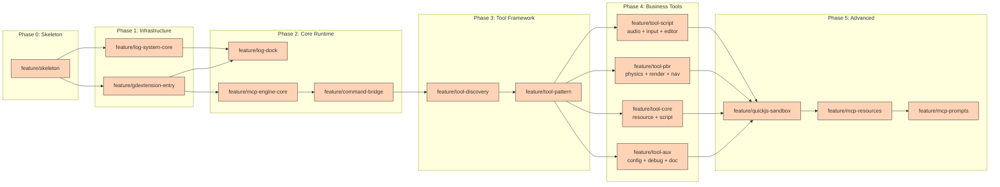
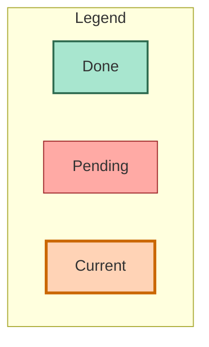

## Project Nature

GDExtension plugin (`.dll` / `.so` / `.dylib`) that runs in-process in Godot editor/runtime. Opens an MCP Streamable HTTP server at `http://127.0.0.1:9527/mcp`. No standalone process — starts/stops with the Godot project.

Tech: CMake 3.28+ / C++17 / godot-cpp (FetchContent) / [mcp-cpp-sdk 0.2.1](https://github.com/jesspig/modelcontextprotocol-cpp-sdk) (FetchContent). SDK 0.2.1 uses libhv internally (no asio), and `mcp::JsonValue` replaces `nlohmann::json`.

## Build & Deploy

```bash
uv run build.py              # Debug build → example/addons/ (no cleanup)
uv run build.py --release    # Clean .godot/ + addons/, then Release build → example/addons/
```

Raw CMake:

```bash
cmake --preset debug
cmake --build --preset debug
```

**Do NOT pass `-j`** — Ninja job pools handle parallelism via `cmake/BuildOptimization.cmake`.

Output: `build/debug/godot-self-driving.dll` (Debug, ~9 MB) or `build/release/godot-self-driving.dll` (Release, ~3.5 MB).

`.gdextension` file is **generated** by `build.py` at deploy time, never committed.

If Godot loads a stale plugin after rebuild, use `--release` to clear `.godot/` metadata cache.

## Testing

```bash
cd build/debug
./tests/test_log_system.exe
./tests/test_bm25_index.exe
./tests/test_tool_catalog.exe
```

Tests compiled when `GSD_BUILD_TESTS=ON` (default in CMakePresets).

## Dependency Fetch Gotchas

All dependencies fetched from GitHub via FetchContent — **never use local paths or local clones**. CMake must clone from the declared GitHub URLs. **Never delete `_deps/`** — forces full re-download. If network unavailable, copy `_deps/` from prior successful build (e.g. from mcp-cpp-sdk's `build/release/_deps/`). Required: `libhv-src`, `simdjson-src`. `build.py` preserves `_deps/` automatically.

**Release build `_deps`**: When updating SDK version, release build's `build/release/_deps/` may be stale (empty or wrong content). Copy `build/debug/_deps/mcp-cpp-sdk-*` to `build/release/_deps/` to avoid re-fetch.

## Architecture Must-Knows

### Thread Model

```
libhv thread (HTTP + MCP) ──submit()──→ CommandQueue ──drain()──→ Godot main thread (engine APIs)
                                       ↑ captured args
```

- **libhv** handles HTTP and MCP protocol on internal threads (replaces asio)
- **Godot main thread** is the ONLY thread allowed to call engine APIs
- **CommandQueue** bridges them: tool handlers `submit()`, `EditorPlugin::_process()` calls `drain()` each frame
- **Do NOT use `GodotNode::_process()`** — in editor mode, only `EditorPlugin::_process()` is called reliably

### GDExtension Initialization (Two Levels)

```
MODULE_INITIALIZATION_LEVEL_SCENE   → ClassDB::register_class<CustomNode>()
                                       (McpStatusBar at SCENE)
MODULE_INITIALIZATION_LEVEL_EDITOR  → ClassDB::register_class<McpLogDock>()
                                       ClassDB::register_class<EditorPlugin>()
                                       EditorPlugins::add_by_type<EditorPlugin>()
                                       new ServerContext() + start()
```

**Important**: `ClassDB::register_class<T>()` REQUIRED before `EditorPlugins::add_by_type<T>()`. Classes inheriting `EditorDock` must be registered at EDITOR level (EditorDock parent class not available at SCENE). All other Controls at SCENE level.

### EditorPlugin + Dock

- Toolbar: `add_control_to_container(CONTAINER_TOOLBAR, control)`
- Panels: Use **EditorDock** (inherit, `add_dock()`), NOT `add_control_to_dock()`
- `DOCK_SLOT_BOTTOM` for log panel
- Theme: `EditorInterface::get_singleton()->get_base_control()->get_theme()`
- Editor icon names (from `editor/editor_log.cpp`):
  - Clear → `"Clear"`, Collapse → `"CombineLines"`
  - Debug → `"Debug"`, Info → `"Popup"`, Warning → `"StatusWarning"`, Error → `"StatusError"`
  - All under `"EditorIcons"` theme type

### MCP Server (ServerContext)

Created at EDITOR level. Manages `StreamableHttpServerTransport` + `McpServer`. libhv handles HTTP on internal threads — no background thread needed.

**SDK 0.2.1 event callbacks** (configured via `ServerOptions`):

- `on_method_called` — logs every MCP method call (Debug, Transport)
- `on_client_connected` — logs client name+version on initialize (Info, Transport)
- `on_initialized` — logs when notifications/initialized received (Info, Transport)
- `on_protocol_error` — logs protocol errors (Error, Transport)
- `on_transport_close` / `on_transport_error` — transport-level events

All callbacks write through `LogSystem::instance().log()` from the libhv thread — no Godot API calls in these paths.

**io thread safety**: wrapped in try-catch to prevent silent termination on exception.

**Must use `stateless=true`** — non-stateless returns 202 with hardcoded `resultType`, actual response goes through SSE.

**MCP requires initialization handshake** before tools work:

```bash
curl -s -X POST http://127.0.0.1:9527/mcp -H "Content-Type: application/json" \
  -d '{"jsonrpc":"2.0","id":1,"method":"initialize","params":{"protocolVersion":"2026-07-28","capabilities":{},"clientInfo":{"name":"test","version":"1.0"}}}'
curl -s -X POST http://127.0.0.1:9527/mcp -H "Content-Type: application/json" \
  -d '{"jsonrpc":"2.0","method":"notifications/initialized"}'
curl -s -X POST http://127.0.0.1:9527/mcp -H "Content-Type: application/json" \
  -d '{"jsonrpc":"2.0","id":2,"method":"tools/list"}'
```

Expected response (only 5 meta-tools):

```json
{"tools":[{"name":"ping","description":"Health check"},{"name":"search_tools","description":"Search available tools by query"},{"name":"list_categories","description":"List all tool categories"},{"name":"get_tool_detail","description":"Get complete schema for one tool"},{"name":"call_tool","description":"Execute any tool by name"}]}
```

### Log System

Custom `LogSystem` (thread-safe ring buffer, NOT `add_error_handler()`). **Single logging mechanism for the plugin.**

Subsystems: `System/Transport/Tools/Sandbox/Resources/Prompts`. Max 10000 entries (FIFO). Thread-safe via `std::mutex`.

Access via `LogSystem::instance()` (Meyer's singleton) — needed because `ClassDB::register_class<>()` needs default constructors.

**Data race fix**: `log()` copies `on_new_entry_` callback under the lock before invoking it outside — never read the callback without holding `mutex_`.

### Log Dock (McpLogDock)

`EditorDock` bottom panel (`DOCK_SLOT_BOTTOM`). Shows filtered logs:

- Level toggle buttons with editor icons + counts
- Category filter dropdown
- Text search (case-insensitive)
- Collapse/merge duplicates, Clear button
- Theme colors, 5000 line FIFO limit
- **Auto-refresh**: `poll_new_entries()` called each frame from `_process()`. No callbacks, no `call_deferred`.
- **Collapse mode** (segment-based): build global freq map → lines with `freq == 1` are separators → split log at separators → within each segment, group identical messages and show `(N)message`. See `_rebuild_log()`.

### Port

Default 9527. Override: `GODOT_SELF_DRIVING_PORT` env > default. SDK retries +1 on conflict.

---

## Tool Architecture

### Server-side Progressive Discovery

```
tools/list → ping, search_tools, list_categories, get_tool_detail, call_tool (5 tools)
                    ↓
              search_tools("create node")
                    ↓
              [{name: "scene_node_create", score: 5.22}]
                    ↓
              get_tool_detail({name: "scene_node_create"})
                    ↓
              {full schema with inputSchema}
                    ↓
              call_tool({name: "scene_node_create", arguments: {...}})
                    ↓
              Internal handler map → result
```

Only 5 meta-tools are registered with MCP `RegisterTool`:

1. `ping` — health check
2. `search_tools` — BM25 keyword search across tool catalog
3. `list_categories` — list tool categories with counts
4. `get_tool_detail` — get full `inputSchema` for one tool
5. `call_tool({name, arguments})` — **execute any non-meta tool**

All other tools are in an internal `unordered_map<string, ToolHandler>` in `register_all.cpp` and routed through `call_tool`. **Do NOT call `server.RegisterTool()` for non-meta tools.**

### Handler Registration Pattern

1. **Populate handler registry**: Add entries to `g_handlers` map — `g_handlers["tool_name"] = handler_fn`. Each handler returns `{"result": ...}` or `{"error": "..."}`.
2. **Register meta-tools with MCP**: Only `ping`, `search_tools`, `list_categories`, `get_tool_detail`, `call_tool` use `server.RegisterTool()`.
3. **Add catalog entries**: `catalog.add_tool({name, desc, category, tags, schema})` — makes tool discoverable via `search_tools` / `get_tool_detail`.

### Handler Function Guidelines

- **Signature**: `mcp::JsonValue handler(const mcp::JsonValue& args)` — called on Godot main thread
- **Returns**: `{"result": value}` on success, `{"error": "message"}` on failure
- **Args validation**: Check `args.Find("key")` and type with `IsString()`, `IsObject()`, etc.
- **Error messages**: Descriptive: `"parent node not found: " + path`, not `"not found"`
- **Logging**: Always log entry + completion via `LogSystem::instance().log()`
- **Null safety**: Check every Godot API call return for null. `EditorInterface::get_singleton()` can be null outside editor. `get_edited_scene_root()` returns null if no scene open.

### Scene Path Convention

| Node | Path format | Example |
|------|-------------|---------|
| Edited scene root | Node name only | `Node2D` |
| Direct child | Child name only | `Sprite` |
| Deep child | Slash-separated relative | `Sprite/Mesh` |

`find_node(path_str)` and `resolve_node(path_str)` always:

1. Strip leading `/` if present
2. If path matches root's name or is empty → return root
3. Call `root->get_node_or_null(NodePath(clean_path))`

**Critical**: `get_node_or_null()` with a leading `/` (`/Node2D/Sprite`) creates an absolute NodePath that searches from the window root — this traverses the editor UI tree, not the edited scene. Always strip leading `/` first.

### Variant → JSON Mapping

| Godot Type | JSON | Example |
|-----------|------|---------|
| VECTOR3 | `{x,y,z}` | `{"x":1,"y":2,"z":3}` |
| TRANSFORM3D | `{basis,origin}` | `{"basis":[[1,0,0],[0,1,0],[0,0,1]],"origin":[0,0,0]}` |
| COLOR | `{r,g,b,a}` | `{"r":1.0,"g":0.0,"b":0.0,"a":1.0}` |
| NODE_PATH | string | `"Node2D/Sprite"` |
| OBJECT | `{id,class}` | `{"object_id":42,"class":"Node3D"}` |

---

## Key Dependencies

| Dependency | FetchContent URL | Tag |
|------------|-----------------|-----|
| godot-cpp | `https://github.com/godotengine/godot-cpp.git` | 10.0.0-rc1 |
| mcp-cpp-sdk | `https://github.com/jesspig/modelcontextprotocol-cpp-sdk.git` | 0.2.1 |
| googletest | `https://github.com/google/googletest.git` | v1.15.2 |
| quickjs | `https://github.com/bellard/quickjs.git` | `04be246001599f5995fa2f2d8c91a0f198d3f34c` |

## Style & Conventions

- No comments unless logic requires explanation
- **Tool names**: underscore-separated (`scene_node_create`, `physics_3d_ray_cast`). **NOT** dot-notation.
- **Meta-tools**: `ping`, `search_tools`, `list_categories`, `get_tool_detail`, `call_tool`
- **Non-meta tools**: stored in `g_handlers` map, called via `call_tool`
- Each category gets one `*_ops.hpp/cpp` pair in `src/tools/`
- All tool registration centralized in `src/tools/register_all.cpp`
- Global singletons: `LogSystem::instance()`, `get_log_system()`, `get_server_ctx()`

---
## Feature Branch DAG — Execution Plan





### Serial Execution Order

| # | Branch | Description | Tools | Status |
|:-:|--------|-------------|:-----:|:------:|
| 1 | `feature/skeleton` | CMake skeleton + empty .dll + build script | 0 | ⬜ |
| 2 | `feature/gdextension-entry` | Two-level init + EditorPlugin + status bar | 0 | ⬜ |
| 3 | `feature/log-system-core` | Thread-safe log system + Google Test | 0 | ⬜ |
| 4 | `feature/log-dock` | EditorDock bottom log panel | 0 | ⬜ |
| 5 | `feature/mcp-engine-core` | asio + McpServer + Streamable HTTP | 2 | ⬜ |
| 6 | `feature/command-bridge` | CommandQueue + asio↔Godot bridge | 0 | ⬜ |
| 7 | `feature/tool-discovery` | BM25 search + 3 meta-tools | 3 | ⬜ |
| 8 | `feature/tool-pattern` | VariantJson + scene_ops + property_ops + call_tool | 12 | ⬜ |
| 9 | `feature/tool-core` | resource + script tools | 30 | ⬜ |
| 10 | `feature/tool-pbr` | physics + render + nav tools | 85 | ⬜ |
| 11 | `feature/tool-script` | audio + input + editor tools | 45 | ⬜ |
| 12 | `feature/tool-aux` | config + debug + doc tools | 32 | ⬜ |
| 13 | `feature/quickjs-sandbox` | QuickJS programmatic sandbox | 1 | ⬜ |
| 14 | `feature/mcp-resources` | MCP Resource URI scheme | 0 | ⬜ |
| 15 | `feature/mcp-prompts` | MCP Prompt templates | 0 | ⬜ |
| | **Total** | | **~205** | |

### Current Status

**Current branch**: `master`
**Next branch**: `feature/skeleton` (ready to start)

---

### ⬜ Phase 0: Skeleton

#### 1. feature/skeleton

**Goal**: CMake project skeleton, empty GDExtension .dll that loads in Godot without crash.

**Files**:

- `CMakeLists.txt` — Top-level CMake 3.28+, C++17, FetchContent for godot-cpp + mcp-cpp-sdk
- `cmake/Platform.cmake` — Architecture/CI detection (GSD_ARCH, GSD_IS_CI)
- `cmake/BuildOptimization.cmake` — Ninja job pools, Unity Build (CPU+memory aware)
- `cmake/CompilerOptions.cmake` — Clang-first compiler flags (clang-cl on Windows)
- `cmake/Cache.cmake` — sccache/ccache auto-detection
- `cmake/Lto.cmake` — ThinLTO (Clang) / LTCG (MSVC) / IPO (GCC), Release only
- `cmake/FetchDependencies.cmake` — godot-cpp + mcp-cpp-sdk via FetchContent
- `CMakePresets.json` — debug + release presets, Ninja generator
- `src/main.cpp` — Minimal GDExtension entry point with `__declspec(dllexport)`
- `godot-self-driving.gdextension` — **Generated** by build.py, never committed
- `build.py` — `uv run build.py [--release]` builds + deploys to `example/addons/`
- `.gitignore`, `LICENSE`, `README.md`, `README_zh.md`

**Verification**: `cmake --preset debug && cmake --build --preset debug` produces a .dll that loads in Godot without errors.

---

#### 2. feature/gdextension-entry

**Goal**: Two-level GDExtension initialization, EditorPlugin registration, toolbar status bar.

**Files**:

- `src/main.cpp` — `GDExtensionEntryPoint` with two-level init:
  - SCENE level: `ClassDB::register_class<McpStatusBar>()`
  - EDITOR level: `ClassDB::register_class<McpLogDock>()`, `ClassDB::register_class<EditorPlugin>()`, `EditorPlugins::add_by_type<>()`
- `src/core/mode_detector.hpp/cpp` — `RuntimeMode` enum (`Editor`/`Game`/`Unknown`), `ModeDetector::is_editor()`, `is_runtime()`, `detect()`
- `src/ui/mcp_status_bar.hpp/cpp` — `McpStatusBar` (HBoxContainer), editor theme icon + "GSD: initializing..." label, `set_status_text()`, `set_status_ok()` color switching

**Gotchas**:

- `ClassDB::register_class<T>()` MUST come before `EditorPlugins::add_by_type<T>()`
- EditorDock subclasses must be registered at EDITOR level (EditorDock not available at SCENE)
- Status bar uses `EditorPlugin::CONTAINER_TOOLBAR`

---

#### 3. feature/log-system-core

**Goal**: Thread-safe log system with filtering + Google Test integration.

**Files**:

- `src/core/log_system.hpp/cpp` — `LogEntry` (timestamp, level, category, message), `LogSystem` class
  - `log(LogLevel, LogCategory, string_view)` — thread-safe, FIFO ring buffer (10k limit)
  - `query({min_level, filter_text, category})` — filtered query returns const pointers
  - `set_on_new_entry(callback)` — subscribe for UI updates (callback invoked outside lock)
  - `LogSystem::instance()` — Meyer's singleton (required for ClassDB default constructors)
- `CMakeLists.txt` — Added `GSD_BUILD_TESTS` option with Google Test v1.15.2 FetchContent
- `tests/CMakeLists.txt` — test_log_system target
- `tests/test_log_system.cpp` — 8 test cases

**Log Levels**: Debug, Info, Warning, Error
**Log Categories**: System, Transport, Tools, Sandbox, Resources, Prompts

**Tests** (8 total, all pass):

1. EmptyQuery, BasicLogAndQuery, LevelFilter, TextFilter, CategoryFilter, RingBufferLimit, CallbackNotification, ThreadSafety

---

#### 4. feature/log-dock

**Goal**: EditorDock bottom panel showing filtered MCP logs.

**Files**:

- `src/ui/mcp_log_dock.hpp/cpp` — `McpLogDock` extending `godot::EditorDock`
  - UI: toolbar (Clear/Collapse buttons + search box + category dropdown) → filter bar (4 level toggle buttons) → RichTextLabel
  - Editor icons: Clear→"Clear", Collapse→"CombineLines", Debug→"Debug", Info→"Popup", Warning→"StatusWarning", Error→"StatusError"
  - Theme colors: `EditorInterface::get_singleton()->get_base_control()->get_theme()`
  - Thread safety: callback pushes to pending queue under mutex → `poll_new_entries()` in `_process()`
- `src/main.cpp` — `register_class<McpLogDock>()` at EDITOR level, `add_dock(log_dock)` in EditorPlugin

---

#### 5. feature/mcp-engine-core

**Goal**: McpServer + StreamableHttpServerTransport (libhv replaces asio).

**Files**:

- `src/core/server_context.hpp/cpp` — `ServerContext` class managing lifecycle:
  - `start()`: StreamableHttpServerTransport(port 9527, stateless=true) → McpServer → register_tools → Start() (non-blocking, libhv handles threading internally)
  - `stop()`: Close server → close transport
  - `get_port()`: returns actual port (handles auto-increment)
  - Port resolution: `GODOT_SELF_DRIVING_PORT` env > 9527 default
- Tools registered at startup (all tools callable via `call_tool` proxy):
  - `ping` — health check, returns "pong" (meta-tool, directly registered)
  - `system_status` — returns JSON with version/port/uptime

**Critical**: `stateless=true` is required. Without it, POST returns 202 with hardcoded `{"resultType":"complete"}` and actual response goes through SSE stream.

---

#### 6. feature/command-bridge

**Goal**: Thread-safe command queue bridging libhv thread to Godot main thread via `EditorPlugin::_process()`.

**Files**:

- `src/core/command_queue.hpp` — Header-only template class:
  - `submit(Fn&& fn) → std::future<ResultType>` — enqueue from any thread, returns future
  - `drain()` — dequeue all pending tasks, execute on calling thread, set promises
- `src/main.cpp` — `GodotSelfDrivingPlugin` holds static `CommandQueue`, overrides `_process()` to call `drain()` each frame

**Critical**: `Node::_process()` is NOT called in editor mode. Only `EditorPlugin::_process()` is reliable.

**Exception safety**: `Task::execute()` wraps `fn()` in try-catch. On exception, `promise.set_exception()` is called instead of silently leaving the promise unresolved (which would hang `result.get()` on the libhv thread forever).

---

### ⬜ Phase 3: Tool Framework

#### 7. feature/tool-discovery

**Goal**: Three-tier progressive tool discovery with BM25 keyword search.

**New Files**:

- `src/util/bm25_index.hpp/cpp` — BM25 inverted index over tool names + descriptions + tags
- `src/tools/register_all.hpp` — `register_all_tools(McpServer&, CommandQueue&, ToolCatalog&, Bm25Index&, int port)` declaration
- `src/tools/tool_catalog.hpp/cpp` — `ToolInfo` struct + `ToolCatalog` singleton with `populate_default_tools()`

**Modified Files**:

- `src/core/server_context.cpp` — Register meta-tools, populate catalog + BM25 index

**Meta-Tools** (Layer 1 + Layer 2):

| Tool | Input | Output | Description |
|------|-------|--------|-------------|
| `search_tools` | `{query, category?, tags?}` | `[{name, score}]` | BM25 search across tool catalog |
| `list_categories` | `{}` | `[{id, name, tool_count}]` | List all tool categories |
| `get_tool_detail` | `{name}` | full ToolInfo JSON | Complete schema for one tool |

**Dependency**: feature/command-bridge
**Tools**: 3 meta-tools

---

#### 8. feature/tool-pattern

**Goal**: Variant↔JSON conversion, first real engine tools, server-side progressive discovery via `call_tool`.

**New Files**:

- `src/util/variant_json.hpp/cpp` — `VariantJson::serialize(Variant) → mcp::JsonValue`, `VariantJson::deserialize(mcp::JsonValue, type_hint) → Variant`
- `src/tools/scene_ops.hpp/cpp` — `scene_node_create`, `scene_node_delete`, `scene_tree_get`
- `src/tools/property_ops.hpp/cpp` — `property_get`, `property_set`, `property_get_list`, `signal_connect`

**Modified Files**:

- `src/tools/register_all.cpp` — Register 4 meta-tools (`ping`, `search_tools`, `list_categories`, `get_tool_detail`) + `call_tool` proxy with MCP. All non-meta tools stored in internal handler map and routed through `call_tool`.
- `src/core/server_context.cpp` — Removed inline `_ping`/`system.status` registration. Now all non-meta tools go through `call_tool`.
- `src/tools/tool_catalog.cpp` — Updated tool metadata to match new naming
- `CMakeLists.txt` — Added `variant_json.cpp`, `scene_ops.cpp`, `property_ops.cpp`
- `tests/CMakeLists.txt` — Added test_tool_catalog target
- `tests/test_tool_catalog.cpp` — 6 ToolCatalog tests

**Dependency**: feature/tool-discovery
**Tools**: 12 (3 meta + 1 call_tool + 3 scene + 4 property + 1 signal)

---

### ⬜ Phase 4: Business Tools

#### 9. feature/tool-core

**Goal**: Resource management + script execution tools.

**New Files**:

- `src/tools/resource_ops.hpp/cpp` — 20 tools
- `src/tools/script_ops.hpp/cpp` — 10 tools

**Modified Files**:

- `src/tools/register_all.cpp` — 30 handler registrations + 30 catalog entries
- `CMakeLists.txt` — Added `resource_ops.cpp`, `script_ops.cpp`

**resource_* tools** (20):
`resource_load`, `resource_load_threaded`, `resource_load_threaded_get_status`, `resource_load_threaded_wait`, `resource_save`, `resource_create`, `resource_duplicate`, `resource_get_type`, `resource_exists`, `resource_list_types`, `resource_get_extensions`, `resource_list_dir`, `resource_get_uid`, `resource_set_uid`, `resource_remove`, `resource_rename`, `resource_get_dependencies`, `resource_has_dependency`, `resource_import`, `resource_reimport`

**script_* tools** (10):
`script_execute_gdscript`, `script_load`, `script_create`, `script_attach_to_node`, `script_detach_from_node`, `script_get_property`, `script_set_property`, `script_call_function`, `script_reload`, `script_get_variable_list`

**Editor alignment fixes**:

- `resource_rename` — updates `ResourceCache` + `scene_file_path` + `EditorFileSystem`
- `resource_remove` — unregisters from `ResourceCache` + refreshes `EditorFileSystem`
- `resource_save` to new path — updates `scene_file_path` + refreshes `EditorFileSystem`
- `script_attach_to_node` / `script_detach_from_node` — uses `EditorUndoRedoManager` to mark scene modified

**Dependency**: feature/tool-pattern
**Tools**: 30

---

#### 10. feature/tool-pbr
**Goal**: Physics + rendering + navigation direct server control.

**New Files**:

- `src/tools/physics_ops.hpp/cpp` — 40 tools
- `src/tools/render_ops.hpp/cpp` — 30 tools
- `src/tools/nav_ops.hpp/cpp` — 15 tools

**physics_2d_* tools** (15):
`physics_2d_space_get_direct_state`, `physics_2d_ray_cast`, `physics_2d_shape_cast`, `physics_2d_point_query`, `physics_2d_intersect_shape`, `physics_2d_intersect_point`, `physics_2d_body_create`, `physics_2d_body_set_mode`, `physics_2d_body_apply_force`, `physics_2d_body_apply_impulse`, `physics_2d_body_set_state`, `physics_2d_body_get_state`, `physics_2d_joint_create`, `physics_2d_area_create`, `physics_2d_area_set_monitorable`

**physics_3d_* tools** (25):
Same as 2D plus `physics_3d_body_apply_torque`, `physics_3d_body_set_axis_lock`, `physics_3d_body_add_collision_exception`, `physics_3d_body_remove_collision_exception`, `physics_3d_joint_set_param`, `physics_3d_area_set_space_override`, `physics_3d_space_set_gravity`, `physics_3d_space_set_debug`, `physics_3d_soft_body_create`, `physics_3d_soft_body_set_mesh`

**render_* tools** (30):
`render_canvas_item_create`, `render_canvas_item_draw_rect`, `render_canvas_item_draw_circle`, `render_canvas_item_draw_texture`, `render_canvas_item_draw_line`, `render_canvas_item_set_transform`, `render_canvas_item_set_visible`, `render_scenario_create`, `render_scenario_set_environment`, `render_camera_create`, `render_camera_set_transform`, `render_camera_set_perspective`, `render_camera_set_orthogonal`, `render_light_create`, `render_light_set_param`, `render_light_set_color`, `render_mesh_create`, `render_mesh_add_surface`, `render_mesh_set_material`, `render_material_create`, `render_material_set_param`, `render_viewport_create`, `render_viewport_set_size`, `render_viewport_set_clear_mode`, `render_particle_create`, `render_environment_set_bg_color`, `render_environment_set_ambient`, `render_fog_create`, `render_shader_create`

**navigation_2d_* tools** (5):
`navigation_2d_map_create`, `navigation_2d_region_create`, `navigation_2d_path_query`, `navigation_2d_agent_create`, `navigation_2d_agent_set_target`

**navigation_3d_* tools** (10):
`navigation_3d_map_set_cell_size`, `navigation_3d_region_set_nav_mesh`, `navigation_3d_path_query_segment`, `navigation_3d_agent_set_velocity`, `navigation_3d_agent_get_next_path`

**Dependency**: feature/tool-pattern
**Tools**: 85

---

#### 11. feature/tool-script
**Goal**: Audio + input simulation + editor integration tools.

**New Files**:

- `src/tools/audio_ops.hpp/cpp` — 15 tools
- `src/tools/input_ops.hpp/cpp` — 10 tools
- `src/tools/editor_ops.hpp/cpp` — 20 tools

**audio_* tools** (15):
`audio_bus_get_layout`, `audio_bus_set_layout`, `audio_bus_get_count`, `audio_bus_get_name`, `audio_bus_set_volume`, `audio_bus_set_mute`, `audio_bus_set_bypass`, `audio_effect_add`, `audio_effect_remove`, `audio_stream_play`, `audio_stream_stop`, `audio_stream_set_volume`, `audio_stream_set_pitch`, `audio_stream_get_playback_position`, `audio_stream_seek`

**input_* tools** (10):
`input_action_press`, `input_action_release`, `input_is_action_pressed`, `input_is_action_just_pressed`, `input_key_press`, `input_key_release`, `input_mouse_move`, `input_mouse_button_press`, `input_mouse_button_release`, `input_gamepad_simulate`

**editor_* tools** (20):
`editor_get_selection`, `editor_set_selection`, `editor_get_edited_scene_root`, `editor_save_scene`, `editor_save_all_scenes`, `editor_reload_scene`, `editor_inspect_object`, `editor_undo_redo_start`, `editor_undo_redo_commit`, `editor_undo_redo_add_do_method`, `editor_undo_redo_add_undo_method`, `editor_file_system_get_resources`, `editor_file_system_scan`, `editor_import_resource`, `editor_set_main_scene`, `editor_play_current_scene`, `editor_stop_playing`, `editor_get_resource_filesystem`, `editor_get_plugin_list`, `editor_set_plugin_enabled`

**Dependency**: feature/tool-pattern
**Tools**: 45

---

#### 12. feature/tool-aux
**Goal**: Configuration, debug, and documentation query tools.

**New Files**:

- `src/tools/config_ops.hpp/cpp` — 13 tools (project settings, engine, editor settings)
- `src/tools/debug_ops.hpp/cpp` — 15 tools (performance, profiling, debug visualization)
- `src/tools/doc_ops.hpp/cpp` — 4 tools (class reference via `ClassDBSingleton` runtime reflection)

**config_* tools** (13):
`project_settings_get/set/has/save`, `engine_get_version/get_fps/get_frames_drawn`, `engine_set/get_time_scale`, `engine_set_max_fps`, `editor_settings_get/set/has`

**debug_* tools** (15):
`debug_print`, `debug_print_stack`, `debug_get_performance_monitor`, `debug_list_performance_monitors`, `debug_get_object_count`, `debug_get_object_count_by_class` (not available), `debug_get_memory_usage`, `debug_profile_start/stop/get_data` (not available), `debug_set_fps_limit`, `debug_set_physics_fps`, `debug_collision_debug`, `debug_navigation_debug`, `debug_performance_debug`

**documentation_* tools** (4):
`documentation_get_class({class: "Node3D"})` → full class reference via runtime reflection (methods/properties/signals/enums/constants, no docstrings)
`documentation_search({query: "ray_cast"})` → search registered classes by name
`documentation_get_method({class: "Node3D", method: "set_position"})` → method signature
`documentation_get_property({class: "Node3D", property: "position"})` → property metadata

**Notes**:
- `EditorSettings` accessed via `EditorInterface::get_singleton()->get_editor_settings()` (no `get_singleton()` in godot-cpp)
- `ScriptBacktrace` API verified matching `script_backtrace.hpp` (get_language_name, get_frame_count/function/file/line, *variable_count/name/value)
- 4 "not available" handlers (`debug_get_object_count_by_class`, `debug_profile_*`) return proper `{"error": "..."}` messages (not stubs)
- `documentation_*` tools use `ClassDBSingleton` runtime reflection — no docstrings, all handlers include `"note"` field

**Dependency**: feature/tool-pattern
**Tools**: 32

---

### ⬜ Phase 5: Advanced

#### 13. feature/quickjs-sandbox
**Goal**: QuickJS sandbox for programmatic tool composition (async/await support).

**New Files**:

- `src/sandbox/script_sandbox.hpp/cpp` — `ScriptSandbox` class:
  - `initialize()`: create JSRuntime + JSContext, set memory/stack/GC limits
  - `execute(script, timeout_ms) → ScriptResult{result_json, console_output, error, execution_time_ms}`
  - Async event loop: `JS_Eval(JS_EVAL_TYPE_GLOBAL | JS_EVAL_FLAG_ASYNC)` → `JS_ExecutePendingJob()` loop → `JS_PromiseState()`/`JS_PromiseResult()`
  - `inject_builtins()`: exposes `console.log/warn/error` (captures output) + `_mcpCall(name, args_json)` (bridges to `g_handlers`)
  - Interrupt handler for timeout enforcement
- `src/sandbox/tool_stubs_generator.hpp/cpp` — `generate_stubs(catalog)`: iterates `get_all_tools()`, generates `const tool_name = async (args) => JSON.parse(_mcpCall("tool_name", JSON.stringify(args)));` stubs

**Modified Files**:

- `CMakeLists.txt` — FetchContent for QuickJS (commit `04be2460`), LANGUAGES C CXX, 5 source files (`quickjs.c`, `libunicode.c`, `cutils.c`, `libregexp.c`, `dtoa.c`), compiler-rt for 128-bit division
- `src/tools/register_all.hpp/cpp` — Added `ScriptSandbox&` param to `register_all_tools()`, exposed `call_handler()` for sandbox `_mcpCall`, registered `sandbox_execute` handler + catalog entry
- `src/core/server_context.hpp/cpp` — Added `ScriptSandbox sandbox_` member, init sandbox + inject stubs after BM25 population

**Security**: QuickJS memory limit (64MB via `JS_SetMemoryLimit`), stack limit (1MB), execution timeout via `JS_SetInterruptHandler`, no file/network/process (quickjs-libc excluded), console output truncated at 4096 chars.

**Windows compat**: `sys/time.h` stub for `gettimeofday`/`clock_gettime`, `pthread.h` stub for mutex/condvar (atomics disabled via `-UCONFIG_ATOMICS`), `alloca` via `-Dalloca=__builtin_alloca`, `CONFIG_VERSION` read from VERSION file.

**Dependency**: feature/tool-aux + feature/tool-discovery
**Tools**: 1 (`sandbox_execute`)

---

#### 14. feature/mcp-resources

**Goal**: Expose Godot engine state as MCP Resource URI scheme.

**Modified Files**:

- `src/tools/register_all.cpp` — Register Resource URIs

**Resource URI Scheme**:

| URI | Registration | Description |
|-----|------------|-------------|
| `godot://engine/version` | `RegisterResource` | Engine version info as JSON |
| `godot://scene/tree` | `RegisterResource` | Current scene node tree (JSON) |
| `godot://scene/{path}` | `RegisterResourceTemplate` | Get node properties by path |
| `godot://filesystem/tree` | `RegisterResource` | Project file system structure |
| `godot://filesystem/{path}` | `RegisterResourceTemplate` | File content or directory listing |
| `godot://editor/selection` | `RegisterResource` | Currently selected nodes/resources |
| `godot://editor/settings/{key}` | `RegisterResourceTemplate` | Editor setting value |
| `godot://log/recent` | `RegisterResource` | Last N log entries |

**Dependency**: feature/quickjs-sandbox
**Tools**: 0 (Resource endpoints, not tools)

---

#### 15. feature/mcp-prompts

**Goal**: MCP Prompt templates for common engine tasks.

**Modified Files**:

- `src/tools/register_all.cpp` — Register Prompts

**Prompts**:

| Name | Description |
|------|-------------|
| `create-3d-scene` | Create a basic 3D scene with lighting + ground |
| `setup-character` | Configure a character controller |
| `debug-physics` | Enable physics debugging visualization |
| `setup-input-map` | Configure input actions |
| `setup-gui` | Create a basic UI layout |

Each prompt returns `PromptMessage[]` with pre-written instructions and tool call examples guiding the LLM through the task step by step.

**Dependency**: feature/mcp-resources
**Tools**: 0 (Prompt endpoints, not tools)
