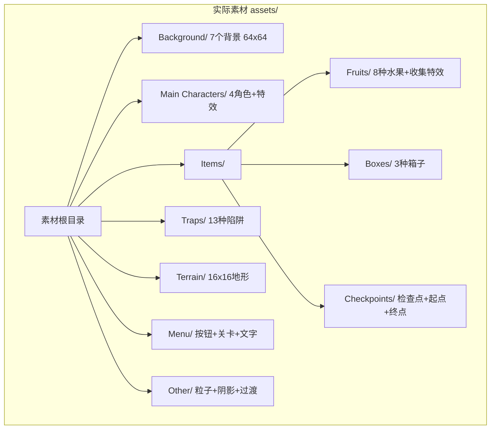
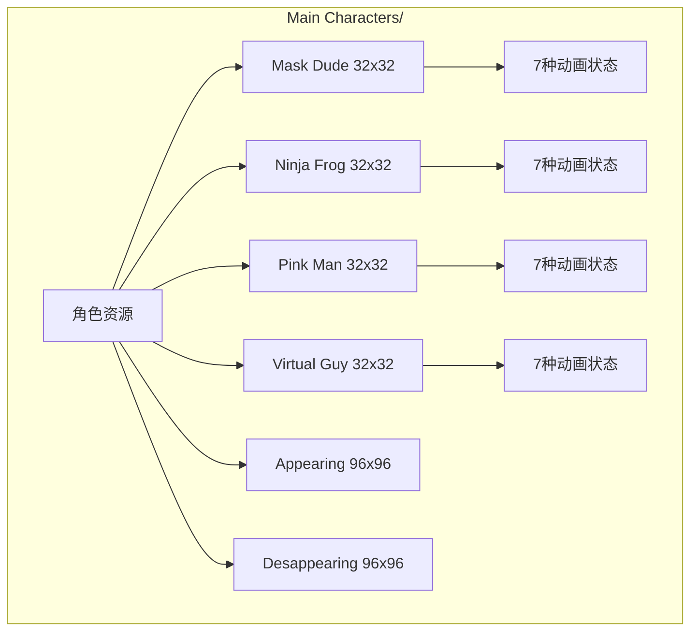
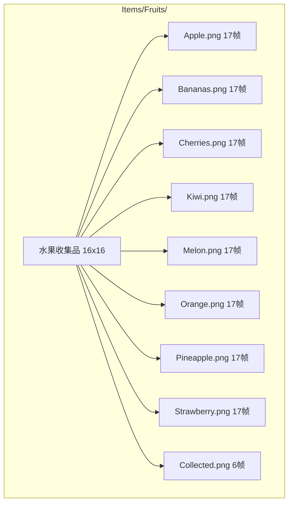
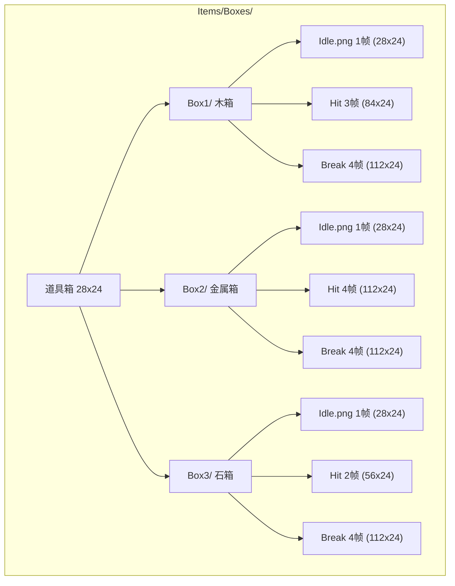
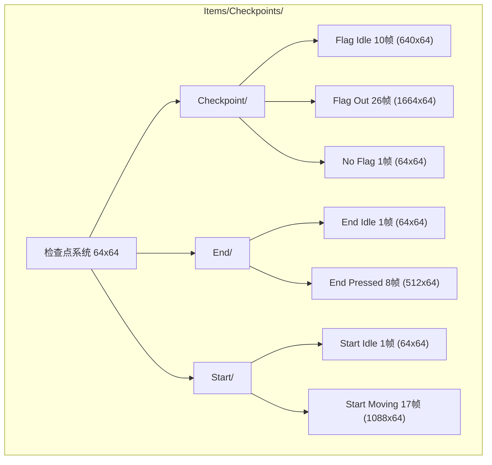
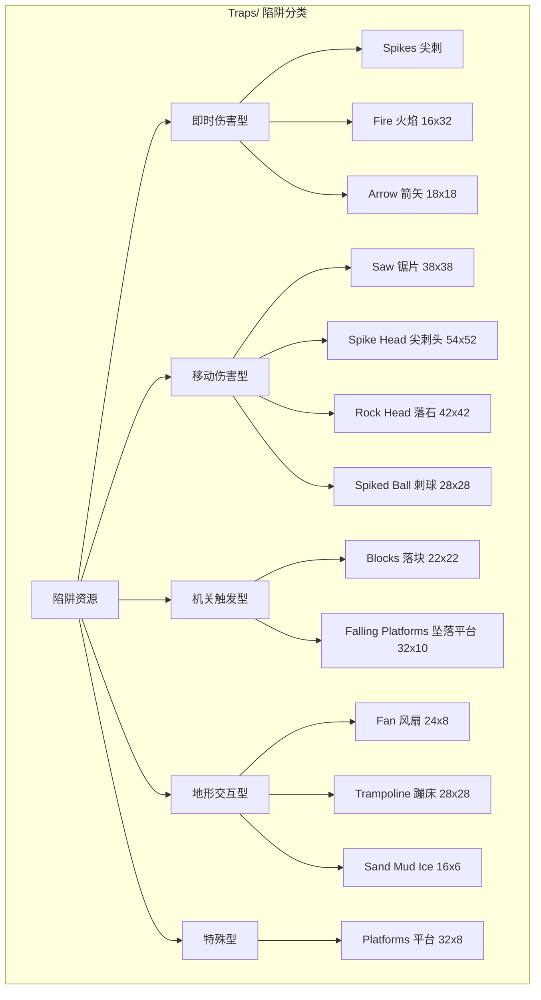
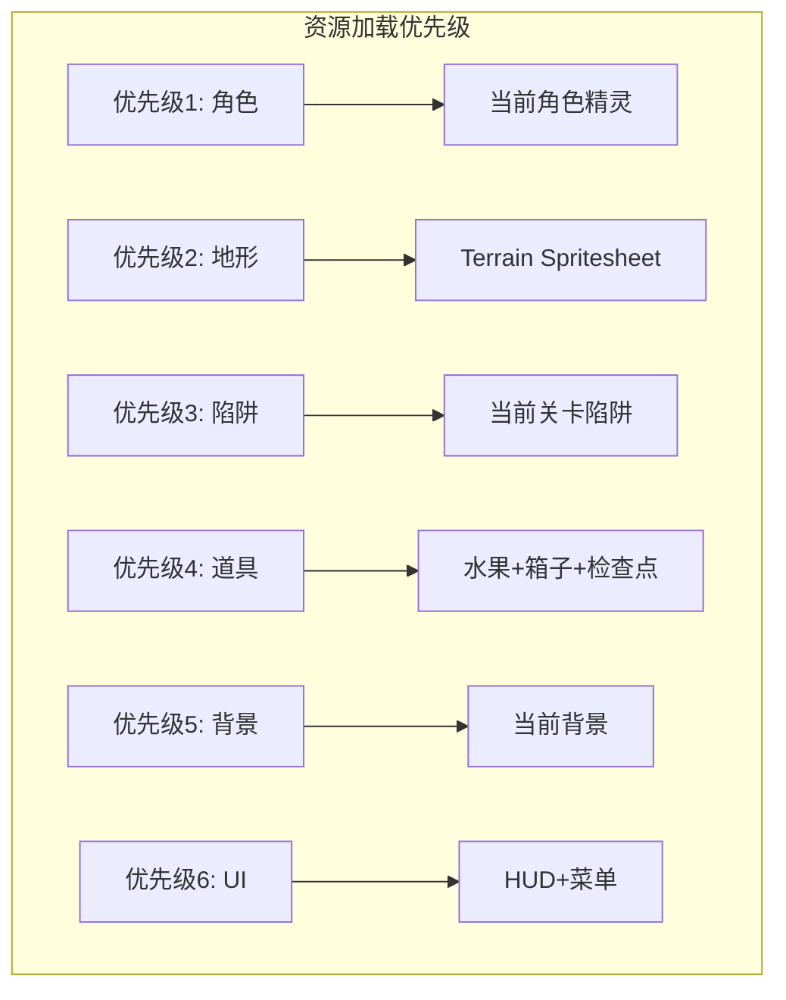

# 美术资源文档 - Pixel Adventure

**最后更新**: 2026-07-31  
**状态**: 基于实际素材 + 精确像素尺寸 + 精灵分割规格

> **重要**: 本文档严格基于 `assets/` 目录中的实际素材编写。所有尺寸通过读取 PNG 文件 IHDR 头获得，帧数通过 `总宽度 / 单帧宽度` 精确计算。每个资源都标注了**图片实际大小**、**精灵分割规格**和**行列数**。

---

## 目录

1. [资源总览](#1-资源总览)
2. [背景资源 Background](#2-背景资源-background)
3. [角色资源 Main Characters](#3-角色资源-main-characters)
4. [道具资源 Items](#4-道具资源-items)
5. [陷阱资源 Traps](#5-陷阱资源-traps)
6. [地形资源 Terrain](#6-地形资源-terrain)
7. [菜单资源 Menu](#7-菜单资源-menu)
8. [其他资源 Other](#8-其他资源-other)
9. [资源规格汇总](#9-资源规格汇总)

---

## 1. 资源总览

### 1.1 资源体系架构

### 1.2 资源规格总表

| 资源类别 | 目录 | 单帧尺寸 | 文件数 | 总帧数 | 说明 |
|---------|------|---------|--------|--------|------|
| 背景 | Background/ | 64x64 | 7 | 7 | 纯色背景，各1帧 |
| 角色动画 | Main Characters/ | 32x32 | 28 | 172 | 4角色×7状态(43帧/角色) |
| 角色特效 | Main Characters/ | 96x96 | 2 | 14 | Appearing 7帧 + Desappearing 7帧 |
| 水果 | Items/Fruits/ | 32x32 | 9 | 142 | 8种×17帧 + Collected 6帧 |
| 箱子 | Items/Boxes/ | 28x24 | 9 | 24 | 3种×(Idle 1帧+Hit+Break) |
| 检查点 | Items/Checkpoints/ | 64x64 | 7 | 64 | 检查点+起点+终点 |
| 陷阱 | Traps/ | 多种 | 46 | 274+ | 13种陷阱 |
| 地形 | Terrain/ | 16x16 | 1 | 242 | 22列×11行 Spritesheet |
| 菜单按钮 | Menu/Buttons/ | 多种 | 11 | 11 | UI按钮 |
| 关卡缩略图 | Menu/Levels/ | 19x17 | 50 | 50 | 50关缩略图 |
| 文字 | Menu/Text/ | 8x10 | 2 | 100 | 10列×5行字符集 |
| 其他 | Other/ | 混合 | 4 | 8 | 粒子/阴影/过渡 |

---

## 2. 背景资源 Background

### 2.1 背景文件清单

| 文件名 | 实际尺寸 | 帧数 | 用途 | 对应世界主题 |
|--------|---------|------|------|-------------|
| Blue.png | 64x64 | 1 | 蓝色天空背景 | 世界 1 (草地), 世界 5 (城堡) |
| Brown.png | 64x64 | 1 | 棕色背景 | 世界 3 (洞穴) |
| Gray.png | 64x64 | 1 | 灰色背景 | 世界 6 (工业/城堡) |
| Green.png | 64x64 | 1 | 绿色背景 | 世界 1-2 (草地/森林) |
| Pink.png | 64x64 | 1 | 粉色背景 | 隐藏/奖励关卡 |
| Purple.png | 64x64 | 1 | 紫色背景 | 世界 4 (神秘/夜晚) |
| Yellow.png | 64x64 | 1 | 黄色背景 | 世界 2 (沙漠/黄昏) |

### 2.2 背景使用规则

| 规则 | 说明 |
|------|------|
| 显示方式 | 全屏平铺或拉伸 |
| 视差效果 | 可选，单层静态背景 |
| 切换方式 | 按关卡/世界自动切换 |
| 调色 | 每种背景对应独立色调 |

---

## 3. 角色资源 Main Characters

### 3.1 角色总览

### 3.2 可选角色对比表

| 角色 | 目录名 | 精灵尺寸 | 视觉风格 | 主色调 |
|------|--------|---------|---------|--------|
| Mask Dude | Mask Dude/ | 32x32 | 戴面具的忍者 | 棕色系 |
| Ninja Frog | Ninja Frog/ | 32x32 | 青蛙忍者 | 绿色系 |
| Pink Man | Pink Man/ | 32x32 | 粉色人形角色 | 粉色系 |
| Virtual Guy | Virtual Guy/ | 32x32 | 蓝色虚拟人 | 蓝色系 |

### 3.3 角色动画状态表 (精确帧数)

每个角色拥有完全相同的 7 种动画状态文件，帧数一致：

| 状态 | 文件名 | 单帧尺寸 | 图片实际大小 | 分割规格 | 列数×行数 | 帧数 | 用途 | 建议帧率 |
|------|--------|---------|-----------|---------|----------|------|------|---------|
| Idle | Idle (32x32).png | 32x32 | 352x32 | 按32x32网格 | 11列×1行 | **11帧** | 待机呼吸 | 0.1s/帧 |
| Run | Run (32x32).png | 32x32 | 384x32 | 按32x32网格 | 12列×1行 | **12帧** | 奔跑循环 | 0.08s/帧 |
| Jump | Jump (32x32).png | 32x32 | 32x32 | 按32x32网格 | 1列×1行 | **1帧** | 跳跃上升 | 静态 |
| Fall | Fall (32x32).png | 32x32 | 32x32 | 按32x32网格 | 1列×1行 | **1帧** | 下落 | 静态 |
| Double Jump | Double Jump (32x32).png | 32x32 | 192x32 | 按32x32网格 | 6列×1行 | **6帧** | 二段跳 | 0.08s/帧 |
| Hit | Hit (32x32).png | 32x32 | 224x32 | 按32x32网格 | 7列×1行 | **7帧** | 受伤/死亡 | 0.1s/帧 |
| Wall Jump | Wall Jump (32x32).png | 32x32 | 160x32 | 按32x32网格 | 5列×1行 | **5帧** | 蹬墙跳 | 0.08s/帧 |

**每角色总帧数**: 11+12+1+1+6+7+5 = **43帧**  
**4角色总帧数**: 43×4 = **172帧**

### 3.4 特殊精灵 (精确帧数)

| 文件名 | 单帧尺寸 | 图片实际大小 | 分割规格 | 列数×行数 | 帧数 | 用途 | 触发时机 |
|--------|---------|-----------|---------|----------|------|------|---------|
| Appearing (96x96).png | 96x96 | 672x96 | 按96x96网格 | 7列×1行 | **7帧** | 角色登场特效 | 关卡开始时 |
| Desappearing (96x96).png | 96x96 | 672x96 | 按96x96网格 | 7列×1行 | **7帧** | 角色消失/死亡特效 | 死亡/关卡结束时 |

### 3.5 角色碰撞箱

| 参数 | 数值 | 说明 |
|------|------|------|
| 精灵尺寸 | 32x32 | 视觉尺寸 |
| 碰撞箱宽度 | 20 | 约为精灵宽度的 62% |
| 碰撞箱高度 | 28 | 约为精灵高度的 87% |
| 碰撞箱偏移 | 居中 | 水平居中，底部对齐 |

---

## 4. 道具资源 Items

### 4.1 水果收集品 (Items/Fruits/)

#### 水果详细参数表 (精确帧数)

| 水果 | 文件名 | 单帧尺寸 | 文件总尺寸 | 列数×行数 | 帧数 | 分值 | 动画说明 |
|------|--------|---------|-----------|----------|------|------|---------|
| 苹果 | Apple.png | 32x32 | 544x32 | 17列×1行 | **17帧** | 10 | 旋转闪烁 |
| 香蕉 | Bananas.png | 32x32 | 544x32 | 17列×1行 | **17帧** | 10 | 旋转闪烁 |
| 樱桃 | Cherries.png | 32x32 | 544x32 | 17列×1行 | **17帧** | 10 | 旋转闪烁 |
| 猕猴桃 | Kiwi.png | 32x32 | 544x32 | 17列×1行 | **17帧** | 10 | 旋转闪烁 |
| 甜瓜 | Melon.png | 32x32 | 544x32 | 17列×1行 | **17帧** | 10 | 旋转闪烁 |
| 橙子 | Orange.png | 32x32 | 544x32 | 17列×1行 | **17帧** | 10 | 旋转闪烁 |
| 菠萝 | Pineapple.png | 32x32 | 544x32 | 17列×1行 | **17帧** | 10 | 旋转闪烁 |
| 草莓 | Strawberry.png | 32x32 | 544x32 | 17列×1行 | **17帧** | 10 | 旋转闪烁 |
| 收集特效 | Collected.png | 32x32 | 192x32 | 6列×1行 | **6帧** | - | 收集时的粒子特效 |

**水果总帧数**: 8×17 + 6 = **142帧**

### 4.2 道具箱 (Items/Boxes/)

#### 箱子详细参数表 (精确帧数)

| 箱子 | 状态 | 文件名 | 单帧尺寸 | 文件总尺寸 | 帧数 | 用途 |
|------|------|--------|---------|-----------|------|------|
| Box1 | 待机 | Idle.png | 28x24 | 28x24 | **1帧** | 木箱静止状态 |
| Box1 | 被击 | Hit (28x24).png | 28x24 | 84x24 | **3帧** | 从下方顶击时的动画 |
| Box1 | 破碎 | Break.png | 28x24 | 112x24 | **4帧** | 破碎特效帧 |
| Box2 | 待机 | Idle.png | 28x24 | 28x24 | **1帧** | 金属箱静止状态 |
| Box2 | 被击 | Hit (28x24).png | 28x24 | 112x24 | **4帧** | 从下方顶击时的动画 |
| Box2 | 破碎 | Break.png | 28x24 | 112x24 | **4帧** | 破碎特效帧 |
| Box3 | 待机 | Idle.png | 28x24 | 28x24 | **1帧** | 石箱静止状态 |
| Box3 | 被击 | Hit (28x24).png | 28x24 | 56x24 | **2帧** | 从下方顶击时的动画 |
| Box3 | 破碎 | Break.png | 28x24 | 112x24 | **4帧** | 破碎特效帧 |

**箱子总帧数**: (1+3+4) + (1+4+4) + (1+2+4) = **24帧**

### 4.3 检查点系统 (Items/Checkpoints/)

#### 检查点详细参数表 (精确帧数)

| 类型 | 文件名 | 单帧尺寸 | 文件总尺寸 | 帧数 | 用途 | 动画说明 |
|------|--------|---------|-----------|------|------|---------|
| 检查点(旗帜飘动) | Checkpoint (Flag Idle)(64x64).png | 64x64 | 640x64 | **10帧** | 已激活检查点 | 旗帜飘动循环 |
| 检查点(旗帜展开) | Checkpoint (Flag Out) (64x64).png | 64x64 | 1664x64 | **26帧** | 刚被激活 | 旗帜展开动画 |
| 检查点(无旗帜) | Checkpoint (No Flag).png | 64x64 | 64x64 | **1帧** | 未激活检查点 | 静态 |
| 终点(静止) | End (Idle).png | 64x64 | 64x64 | **1帧** | 关卡终点 | 静态 |
| 终点(按下) | End (Pressed) (64x64).png | 64x64 | 512x64 | **8帧** | 终点触发 | 按下动画 |
| 起点(静止) | Start (Idle).png | 64x64 | 64x64 | **1帧** | 关卡起点 | 静态 |
| 起点(移动) | Start (Moving) (64x64).png | 64x64 | 1088x64 | **17帧** | 起点动画 | 移动特效 |

**检查点总帧数**: 10+26+1+1+8+1+17 = **64帧**

---

## 5. 陷阱资源 Traps

### 5.1 陷阱总览

### 5.2 陷阱详细参数表 (精确帧数)

#### 5.2.1 Saw 锯片 (Traps/Saw/)

| 文件 | 单帧尺寸 | 文件总尺寸 | 帧数 | 用途 | 说明 |
|------|---------|-----------|------|------|------|
| Off.png | 38x38 | 38x38 | **1帧** | 锯片静止(关闭) | 未激活状态 |
| On (38x38).png | 38x38 | 304x38 | **8帧** | 锯片旋转(开启) | 旋转动画帧 |
| Chain.png | 8x8 | 8x8 | **1帧** | 链条 | 锯片悬挂链条 |

**行为模式**: 沿链条路径移动或旋转，接触即死

#### 5.2.2 Spikes 尖刺 (Traps/Spikes/)

| 文件 | 单帧尺寸 | 文件总尺寸 | 帧数 | 用途 | 说明 |
|------|---------|-----------|------|------|------|
| Idle.png | 16x16 | 16x16 | **1帧** | 尖刺静止 | 静态放置，方向可变 |

**行为模式**: 静态陷阱，接触即死。可放置在地面/墙壁/天花板

#### 5.2.3 Fire 火焰 (Traps/Fire/)

| 文件 | 单帧尺寸 | 文件总尺寸 | 帧数 | 用途 | 说明 |
|------|---------|-----------|------|------|------|
| Off.png | 16x32 | 16x32 | **1帧** | 火焰关闭 | 未激活状态 |
| On (16x32).png | 16x32 | 48x32 | **3帧** | 火焰燃烧 | 燃烧动画帧 |
| Hit (16x32).png | 16x32 | 64x32 | **4帧** | 火焰命中 | 触发伤害时的特效 |

**行为模式**: 静态/开关控制，接触即死

#### 5.2.4 Arrow 箭矢 (Traps/Arrow/)

| 文件 | 单帧尺寸 | 文件总尺寸 | 帧数 | 用途 | 说明 |
|------|---------|-----------|------|------|------|
| Idle (18x18).png | 18x18 | 180x18 | **10帧** | 箭矢静止 | 等待发射状态 |
| Hit (18x18).png | 18x18 | 72x18 | **4帧** | 箭矢命中 | 击中目标时的特效 |

**行为模式**: 定时发射，直线飞行，接触即死

#### 5.2.5 Spike Head 尖刺头 (Traps/Spike Head/)

| 文件 | 单帧尺寸 | 文件总尺寸 | 帧数 | 用途 | 说明 |
|------|---------|-----------|------|------|------|
| Idle.png | 54x52 | 54x52 | **1帧** | 静止状态 | 等待触发 |
| Blink (54x52).png | 54x52 | 216x52 | **4帧** | 眨眼预警 | 攻击前的警告动画 |
| Top Hit (54x52).png | 54x52 | 216x52 | **4帧** | 向上攻击 | 向上伸缩 |
| Bottom Hit (54x52).png | 54x52 | 216x52 | **4帧** | 向下攻击 | 向下伸缩 |
| Left Hit (54x52).png | 54x52 | 216x52 | **4帧** | 向左攻击 | 向左伸缩 |
| Right Hit (54x52).png | 54x52 | 216x52 | **4帧** | 向右攻击 | 向右伸缩 |

**行为模式**: 检测玩家后伸缩攻击，接触即死  
**总帧数**: 1+4+4+4+4+4 = **21帧**

#### 5.2.6 Rock Head 落石 (Traps/Rock Head/)

| 文件 | 单帧尺寸 | 文件总尺寸 | 帧数 | 用途 | 说明 |
|------|---------|-----------|------|------|------|
| Idle.png | 42x42 | 42x42 | **1帧** | 静止状态 | 等待触发 |
| Blink (42x42).png | 42x42 | 168x42 | **4帧** | 闪烁预警 | 攻击前的警告动画 |
| Top Hit (42x42).png | 42x42 | 168x42 | **4帧** | 向上攻击 | 向上弹射 |
| Bottom Hit (42x42).png | 42x42 | 168x42 | **4帧** | 向下攻击 | 向下坠落 |
| Left Hit (42x42).png | 42x42 | 168x42 | **4帧** | 向左攻击 | 向左弹射 |
| Right Hit (42x42).png | 42x42 | 168x42 | **4帧** | 向右攻击 | 向右弹射 |

**行为模式**: 类似 Spike Head，石头材质，接触即死  
**总帧数**: 1+4+4+4+4+4 = **21帧**

#### 5.2.7 Blocks 落块 (Traps/Blocks/)

| 文件 | 单帧尺寸 | 文件总尺寸 | 帧数 | 用途 | 说明 |
|------|---------|-----------|------|------|------|
| Idle.png | 22x22 | 22x22 | **1帧** | 静止状态 | 悬挂在上方 |
| Part 1 (22x22).png | 22x22 | 66x22 | **3帧** | 碎片1 | 破碎碎片 |
| Part 2 (22x22).png | 22x22 | 66x22 | **3帧** | 碎片2 | 破碎碎片 |
| HitTop (22x22).png | 22x22 | 66x22 | **3帧** | 顶部撞击 | 从上方撞击玩家 |
| HitSide (22x22).png | 22x22 | 66x22 | **3帧** | 侧面撞击 | 从侧面撞击玩家 |

**行为模式**: 玩家接近时落下，接触即死  
**总帧数**: 1+3+3+3+3 = **13帧**

#### 5.2.8 Falling Platforms 坠落平台 (Traps/Falling Platforms/)

| 文件 | 单帧尺寸 | 文件总尺寸 | 帧数 | 用途 | 说明 |
|------|---------|-----------|------|------|------|
| Off.png | 32x10 | 32x10 | **1帧** | 平台关闭 | 已坠落/未激活 |
| On (32x10).png | 32x10 | 128x10 | **4帧** | 平台开启 | 可站立状态 |

**行为模式**: 玩家踩上后延迟坠落，可重新刷新

#### 5.2.9 Fan 风扇 (Traps/Fan/)

| 文件 | 单帧尺寸 | 文件总尺寸 | 帧数 | 用途 | 说明 |
|------|---------|-----------|------|------|------|
| Off.png | 24x8 | 24x8 | **1帧** | 风扇关闭 | 无风状态 |
| On (24x8).png | 24x8 | 96x8 | **4帧** | 风扇开启 | 吹风动画 |

**行为模式**: 无伤害，向上吹动玩家，影响跳跃轨迹

#### 5.2.10 Trampoline 蹦床 (Traps/Trampoline/)

| 文件 | 单帧尺寸 | 文件总尺寸 | 帧数 | 用途 | 说明 |
|------|---------|-----------|------|------|------|
| Idle.png | 28x28 | 28x28 | **1帧** | 蹦床静止 | 等待踩踏 |
| Jump (28x28).png | 28x28 | 224x28 | **8帧** | 蹦床弹跳 | 弹跳动画 |

**行为模式**: 无伤害，踩上后将玩家弹射到高处

#### 5.2.11 Sand Mud Ice 沙泥冰 (Traps/Sand Mud Ice/)

| 文件 | 单帧尺寸 | 文件总尺寸 | 帧数 | 用途 | 说明 |
|------|---------|-----------|------|------|------|
| Sand Mud Ice (16x6).png | 16x6 | 176x80 | **11列×13行=143帧** | 地形表面 | 沙/泥/冰三种材质 |
| Sand Particle.png | 16x16 | 16x16 | **1帧** | 沙粒子 | 沙地行走特效 |
| Mud Particle.png | 16x16 | 16x16 | **1帧** | 泥粒子 | 泥地行走特效 |
| Ice Particle.png | 16x16 | 16x16 | **1帧** | 冰粒子 | 冰面滑行特效 |

**行为模式**: 无伤害，改变移动物理特性
- 沙地: 减速
- 泥地: 大幅减速
- 冰面: 低摩擦滑行

#### 5.2.12 Platforms 移动平台 (Traps/Platforms/)

| 文件 | 单帧尺寸 | 文件总尺寸 | 帧数 | 用途 | 说明 |
|------|---------|-----------|------|------|------|
| Brown Off.png | 32x8 | 32x8 | **1帧** | 棕色平台(关) | 未激活 |
| Brown On (32x8).png | 32x8 | 256x8 | **8帧** | 棕色平台(开) | 激活状态 |
| Grey Off.png | 32x8 | 32x8 | **1帧** | 灰色平台(关) | 未激活 |
| Grey On (32x8).png | 32x8 | 256x8 | **8帧** | 灰色平台(开) | 激活状态 |
| Chain.png | 8x8 | 8x8 | **1帧** | 链条 | 平台悬挂链条 |

**行为模式**: 沿路径移动的平台，无伤害

#### 5.2.13 Spiked Ball 刺球 (Traps/Spiked Ball/)

| 文件 | 单帧尺寸 | 文件总尺寸 | 帧数 | 用途 | 说明 |
|------|---------|-----------|------|------|------|
| Spiked Ball.png | 28x28 | 28x28 | **1帧** | 刺球本体 | 球体带刺 |
| Chain.png | 8x8 | 8x8 | **1帧** | 链条 | 刺球悬挂链条 |

**行为模式**: 钟摆式摆动，接触即死

### 5.3 陷阱尺寸汇总表

| 陷阱 | 单帧尺寸 | 碰撞箱 | 伤害类型 | 行为分类 | 总帧数 |
|------|---------|--------|---------|---------|--------|
| Saw | 38x38 | 圆形 38x38 | 即死 | 移动伤害 | 10 |
| Spikes | 16x16 | 尖刺区域 | 即死 | 即时伤害 | 1 |
| Fire | 16x32 | 16x32 | 即死 | 即时伤害 | 8 |
| Arrow | 18x18 | 18x18 | 即死 | 即时伤害 | 14 |
| Spike Head | 54x52 | 54x52 | 即死 | 移动伤害 | 21 |
| Rock Head | 42x42 | 42x42 | 即死 | 移动伤害 | 21 |
| Blocks | 22x22 | 22x22 | 即死 | 机关触发 | 13 |
| Falling Platform | 32x10 | 32x10 | 坠落死 | 机关触发 | 5 |
| Fan | 24x8 | 24x8 | 无伤害 | 地形交互 | 5 |
| Trampoline | 28x28 | 28x28 | 无伤害 | 地形交互 | 9 |
| Sand Mud Ice | 16x6 | 16x6 | 无伤害 | 地形交互 | 146 |
| Platforms | 32x8 | 32x8 | 无伤害 | 移动平台 | 19 |
| Spiked Ball | 28x28 | 圆形 | 即死 | 移动伤害 | 2 |

---

## 6. 地形资源 Terrain

### 6.1 地形 Spritesheet

| 文件名 | 单帧尺寸 | 文件总尺寸 | 列数×行数 | 总图块数 | 说明 |
|--------|---------|-----------|----------|---------|------|
| Terrain (16x16).png | 16x16 | 352x176 | 22列×11行 | **244图块** | 包含所有地形图块的 Spritesheet |

### 6.2 地形类型推测表

基于 Spritesheet 中可能包含的地形类型：

| 地形类型 | 图块尺寸 | 碰撞类型 | 物理特性 | 对应世界 |
|---------|---------|---------|---------|---------|
| 草地 | 16x16 | 完整方块 | 正常 | 世界 1-2 |
| 泥土 | 16x16 | 完整方块 | 正常 | 地下层 |
| 石头 | 16x16 | 完整方块 | 正常 | 世界 3 洞穴 |
| 冰面 | 16x16 | 完整方块 | 低摩擦 | 世界 4 冰雪 |
| 沙地 | 16x16 | 完整方块 | 减速 | 沙漠区域 |
| 砖块 | 16x16 | 完整方块 | 正常 | 城堡区域 |

### 6.3 地形图块用途

| 图块类型 | 用途 | 位置 |
|---------|------|------|
| 地面图块 | 构建关卡地面 | 关卡底部 |
| 平台图块 | 构建浮空平台 | 关卡中部 |
| 墙壁图块 | 构建墙壁/边界 | 关卡两侧 |
| 装饰图块 | 背景装饰 | 无碰撞 |
| 斜坡图块 | 地形过渡 | 地形变化处 |

---

## 7. 菜单资源 Menu

### 7.1 菜单按钮 (Menu/Buttons/)

| 文件名 | 实际尺寸 | 用途 | 位置 | 交互 |
|--------|---------|------|------|------|
| Play.png | 21x22 | 开始游戏 | 主菜单 | 点击进入角色选择 |
| Settings.png | 21x22 | 设置 | 主菜单 | 点击进入设置 |
| Volume.png | 21x22 | 音量设置 | 设置菜单 | 滑动调节 |
| Levels.png | 21x22 | 关卡选择 | 主菜单 | 点击进入关卡列表 |
| Achievements.png | 21x22 | 成就 | 主菜单 | 点击查看成就列表 |
| Leaderboard.png | 21x22 | 排行榜 | 主菜单 | 点击查看排行 |
| Next.png | 21x22 | 下一关 | 关卡完成界面 | 点击进入下一关 |
| Previous.png | 21x22 | 上一关 | 关卡选择 | 返回上一组关卡 |
| Restart.png | 21x22 | 重新开始 | 游戏中/死亡界面 | 重新开始当前关 |
| Back.png | 15x16 | 返回 | 子菜单 | 返回上级菜单 |
| Close.png | 15x16 | 关闭 | 弹窗 | 关闭弹窗 |

### 7.2 关卡缩略图 (Menu/Levels/)

| 文件名范围 | 单图尺寸 | 数量 | 用途 | 说明 |
|-----------|---------|------|------|------|
| 01.png ~ 50.png | 19x17 | 50 | 关卡缩略图 | 每关的预览图/图标 |

### 7.3 文字字体 (Menu/Text/)

| 文件名 | 字符尺寸 | 文件总尺寸 | 列数×行数 | 字符数 | 用途 | 说明 |
|--------|---------|-----------|----------|--------|------|------|
| Text (Black) (8x10).png | 8x10 | 80x50 | 10列×5行 | **50字符** | 浅色背景文字 | 黑色像素字体 |
| Text (White) (8x10).png | 8x10 | 80x50 | 10列×5行 | **50字符** | 深色背景文字 | 白色像素字体 |

---

## 8. 其他资源 Other

| 文件名 | 单帧尺寸 | 文件总尺寸 | 帧数 | 用途 | 说明 |
|--------|---------|-----------|------|------|------|
| Confetti (16x16).png | 16x16 | 96x16 | **6帧** | 五彩纸屑 | 通关/庆祝特效 |
| Dust Particle.png | 16x16 | 16x16 | **1帧** | 灰尘粒子 | 落地/奔跑灰尘 |
| Shadow.png | 16x16 | 16x16 | **1帧** | 阴影 | 角色脚下阴影 |
| Transition.png | 44x44 | 44x44 | **1帧** | 过渡效果 | 场景切换过渡 |

---

## 9. 资源规格汇总

### 9.1 尺寸分类表

| 尺寸 | 资源类型 | 文件列表 |
|------|---------|---------|
| 8x8 | 链条/粒子 | Saw Chain, Platforms Chain, Spiked Ball Chain |
| 8x10 | 字体字符 | Text (Black/White) |
| 15x16 | 小按钮 | Back, Close |
| 16x6 | 地形表面 | Sand Mud Ice |
| 16x16 | 水果/地形/粒子 | 8种水果、Collected、Terrain、Confetti、Dust、Shadow、Spikes、Ice/Sand/Mud Particle |
| 16x32 | 火焰 | Fire Off/On/Hit |
| 18x18 | 箭矢 | Arrow Idle/Hit |
| 19x17 | 关卡缩略图 | 01~50.png |
| 21x22 | 菜单按钮 | Play/Settings/Volume/Levels 等 9个 |
| 22x22 | 落块 | Blocks 系列 |
| 24x8 | 风扇 | Fan Off/On |
| 28x24 | 箱子 | Box Idle/Hit/Break |
| 28x28 | 蹦床/刺球 | Trampoline, Spiked Ball |
| 32x8 | 移动平台 | Platforms Off/On |
| 32x10 | 坠落平台 | Falling Platform Off/On |
| 32x32 | 角色动画 | 4角色×7状态 = 28个文件 |
| 38x38 | 锯片 | Saw Off/On |
| 42x42 | 落石 | Rock Head 系列 |
| 44x44 | 过渡效果 | Transition |
| 54x52 | 尖刺头 | Spike Head 系列 |
| 64x64 | 检查点/背景 | Checkpoint/Start/End, Background |
| 80x50 | 字体集 | Text (Black/White) |
| 96x96 | 角色特效 | Appearing/Desappearing |
| 352x176 | 地形集 | Terrain (22×11) |

### 9.2 帧数统计

| 类别 | 文件数 | 总帧数 | 说明 |
|------|--------|--------|------|
| 背景 | 7 | 7 | 7种颜色背景，各1帧 |
| 角色动画 | 28 | 172 | 4角色×43帧/角色 |
| 角色特效 | 2 | 14 | Appearing 7帧 + Desappearing 7帧 |
| 水果 | 9 | 142 | 8种×17帧 + Collected 6帧 |
| 箱子 | 9 | 24 | 3种箱子的所有状态 |
| 检查点 | 7 | 64 | 检查点+起点+终点 |
| 陷阱 | 46 | 274+ | 13种陷阱的所有状态 |
| 地形 | 1 | 244 | 22列×11行 Spritesheet |
| 菜单按钮 | 11 | 11 | UI按钮，各1帧 |
| 关卡缩略图 | 50 | 50 | 50关，各1帧 |
| 字体 | 2 | 100 | 10列×5行×2套 |
| 其他 | 4 | 9 | 粒子/阴影/过渡 |
| **总计** | **~176** | **~1111+** | - |

### 9.3 资源使用优先级

---

## 附录: 素材与文档对照表

| 文档中的概念 | 实际素材 | 状态 |
|-------------|---------|------|
| 4个可选角色 | Mask Dude/Ninja Frog/Pink Man/Virtual Guy | ✅ 完全匹配 |
| 8种水果 | Apple/Bananas/Cherries/Kiwi/Melon/Orange/Pineapple/Strawberry | ✅ 完全匹配 |
| 13种陷阱 | Saw/Spikes/Fire/Arrow/Spike Head/Rock Head/Blocks/Falling Platform/Fan/Trampoline/Sand Mud Ice/Platforms/Spiked Ball | ✅ 完全匹配 |
| 检查点系统 | Checkpoint + Start + End | ✅ 完全匹配 |
| 道具箱 | Box1/Box2/Box3 | ✅ 完全匹配 |
| 纯色背景 | 7种颜色背景 64x64 | ✅ 完全匹配 |
| 敌人/Boss | **无** |  不存在 |
| NPC | **无** | ❌ 不存在 |
| 金币 | **无** (用水果替代) | ❌ 不存在 |

---

**文档结束**
