# 角色设计文档 - 像素冒险

**最后更新**: 2026-07-31  
**状态**: 基于实际素材重写

> **重要**: 本文档严格基于 `assets/Main Characters/` 目录中的实际素材编写。本作无敌人/Boss/NPC，仅有 4 个可选角色和 2 个特效精灵。

---

## 目录

1. [角色总览](#1-角色总览)
2. [Mask Dude 面具小子](#2-mask-dude-面具小子)
3. [Ninja Frog 忍者蛙](#3-ninja-frog-忍者蛙)
4. [Pink Man 粉红人](#4-pink-man-粉红人)
5. [Virtual Guy 虚拟人](#5-virtual-guy-虚拟人)
6. [角色特效精灵](#6-角色特效精灵)
7. [动画系统详解](#7-动画系统详解)
8. [角色对比与选择](#8-角色对比与选择)
9. [碰撞与物理参数](#9-碰撞与物理参数)

---

## 1. 角色总览

### 1.1 角色体系架构

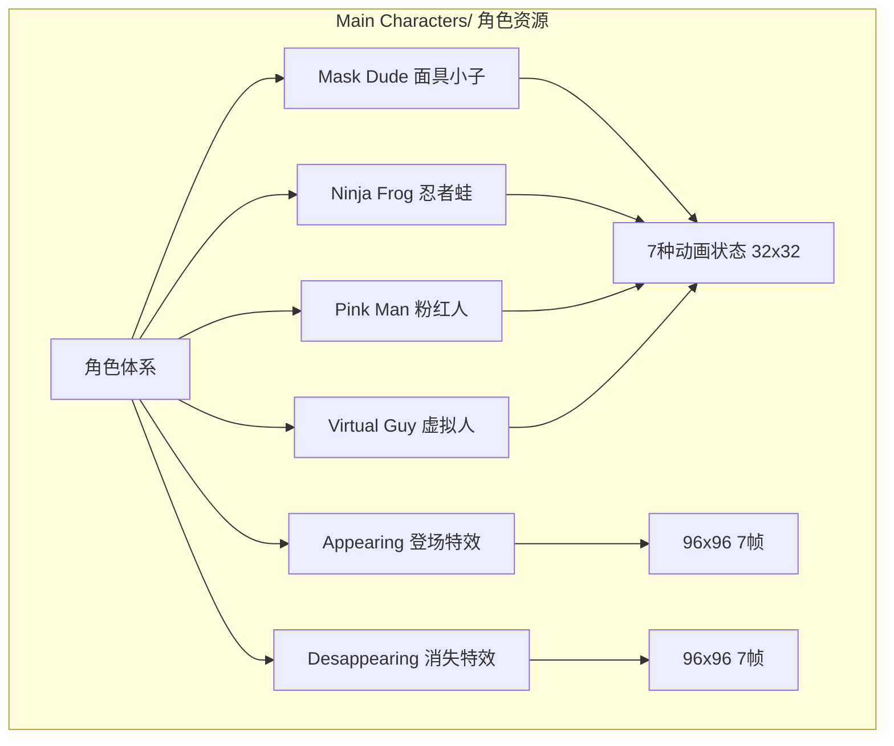

### 1.2 四角色对比速览

| 属性 | Mask Dude | Ninja Frog | Pink Man | Virtual Guy |
|------|-----------|------------|----------|-------------|
| 目录名 | Mask Dude/ | Ninja Frog/ | Pink Man/ | Virtual Guy/ |
| 精灵尺寸 | 32x32 | 32x32 | 32x32 | 32x32 |
| 视觉风格 | 戴面具的冒险者 | 青蛙忍者 | 粉色圆胖人形 | 蓝色头盔虚拟人 |
| 主色调 | 棕色/米色 | 绿色/黄色 | 粉色/白色 | 蓝色/深蓝色 |
| 体型特征 | 中等身材 | 矮胖 | 圆胖 | 瘦长 |
| 头饰 | 棕色面具 | 绿色忍者头巾 | 无（光头圆脸） | 蓝色全覆头盔 |
| 动画帧数 | 43帧 | 43帧 | 43帧 | 43帧 |
| 动画状态 | 7种（完全一致） | 7种（完全一致） | 7种（完全一致） | 7种（完全一致） |

### 1.3 动画状态总表（所有角色通用）

| 状态 | 文件名 | 单帧尺寸 | 文件总尺寸 | 帧数 | 循环 | 建议帧率 |
|------|--------|---------|-----------|------|------|---------|
| Idle 待机 | Idle (32x32).png | 32x32 | 352x32 | **11帧** | 是 | 0.10s/帧 |
| Run 奔跑 | Run (32x32).png | 32x32 | 384x32 | **12帧** | 是 | 0.08s/帧 |
| Jump 跳跃 | Jump (32x32).png | 32x32 | 32x32 | **1帧** | 否 | 静态 |
| Fall 下落 | Fall (32x32).png | 32x32 | 32x32 | **1帧** | 否 | 静态 |
| Double Jump 二段跳 | Double Jump (32x32).png | 32x32 | 192x32 | **6帧** | 否 | 0.08s/帧 |
| Hit 受击 | Hit (32x32).png | 32x32 | 224x32 | **7帧** | 否 | 0.10s/帧 |
| Wall Jump 蹬墙跳 | Wall Jump (32x32).png | 32x32 | 160x32 | **5帧** | 否 | 0.08s/帧 |

**每角色总帧数**: 11 + 12 + 1 + 1 + 6 + 7 + 5 = **43帧**  
**四角色总帧数**: 43 × 4 = **172帧**

### 1.4 角色动画状态机

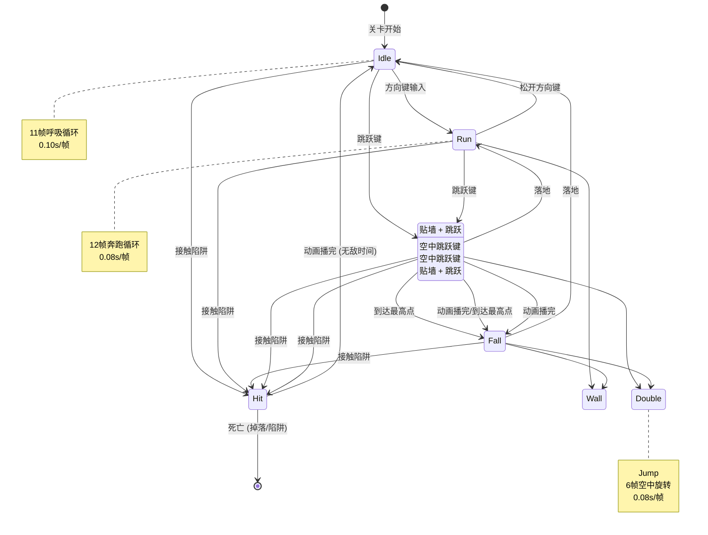

---

## 2. Mask Dude 面具小子

### 2.1 角色概述

```
角色名称: Mask Dude (面具小子)
目录路径: assets/Main Characters/Mask Dude/
精灵尺寸: 32x32 像素
视觉风格: 戴棕色面具的年轻冒险者
主色调: 棕色/米色系
性格定位: 稳重型冒险者
```

### 2.2 视觉设计

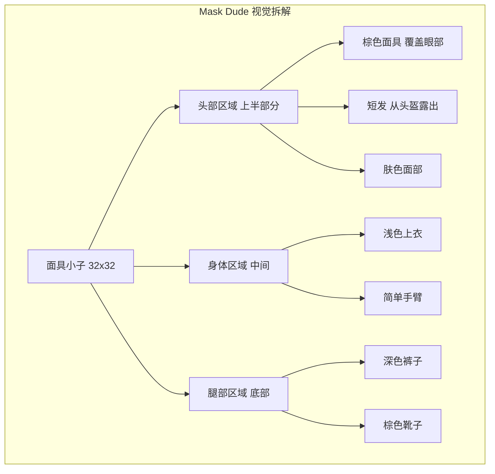

#### 配色方案

| 部位 | 颜色描述 | 参考色值 | 像素占比 |
|------|---------|---------|---------|
| 面具 | 棕色 | #8B6914 | ~15% |
| 头发 | 深棕色 | #5C4033 | ~8% |
| 皮肤 | 肤色 | #FFDAB9 | ~12% |
| 上衣 | 米色/浅棕 | #D2B48C | ~20% |
| 裤子 | 深棕色 | #654321 | ~18% |
| 靴子 | 棕色 | #8B4513 | ~12% |
| 眼睛 | 黑色 | #000000 | ~3% |
| 背景 | 透明 | - | ~12% |

### 2.3 动画帧详解

#### Idle 待机 (11帧)


| 帧号 | 身体偏移 | 动作描述 |
|------|---------|---------|
| 1 | 0 | 自然站立 |
| 2 | -1px | 吸气微升 |
| 3 | -1px | 继续上升 |
| 4 | 0 | 最高点停顿 |
| 5 | 0 | 开始呼气 |
| 6 | +1px | 微降 |
| 7 | +1px | 最低点 |
| 8 | +1px | 继续下沉 |
| 9 | 0 | 回升 |
| 10 | 0 | 回到中间 |
| 11 | -1px | 准备下一循环 |

**动画要点**: 呼吸效果通过身体上下 1-2 像素实现，面具带轻微晃动

#### Run 奔跑 (12帧)

| 帧号 | 动作描述 | 脚步位置 | 身体倾斜 |
|------|---------|---------|---------|
| 1 | 左脚前迈 | 左前右后 | 前倾2px |
| 2 | 右脚跟进 | 右前左后 | 直立 |
| 3 | 左脚蹬地 | 左后右前 | 前倾3px |
| 4 | 腾空瞬间 | 双脚并拢 | 前倾2px |
| 5 | 右脚前迈 | 右前左后 | 前倾2px |
| 6 | 左脚跟进 | 左前右后 | 直立 |
| 7 | 右脚蹬地 | 右后左前 | 前倾3px |
| 8 | 腾空瞬间 | 双脚并拢 | 前倾2px |
| 9 | 过渡帧 | 左脚前 | 前倾1px |
| 10 | 过渡帧 | 右脚前 | 直立 |
| 11 | 过渡帧 | 左脚前 | 前倾1px |
| 12 | 过渡帧 | 回到帧1 | 前倾2px |

**动画要点**: 完整跑步循环，身体上下浮动 2-3 像素，面具带飘动效果

#### Double Jump 二段跳 (6帧)

| 帧号 | 动作描述 | 身体旋转 |
|------|---------|---------|
| 1 | 起跳准备 | 0° |
| 2 | 蜷缩上升 | 0° |
| 3 | 开始旋转 | 45° |
| 4 | 旋转中 | 90° |
| 5 | 继续旋转 | 180° |
| 6 | 旋转完成 | 360° |

**动画要点**: 空中 360° 旋转，蜷缩姿态，面具带飘动

#### Hit 受击 (7帧)

| 帧号 | 动作描述 | 闪烁 |
|------|---------|------|
| 1 | 受击后仰 | 否 |
| 2 | 身体蜷缩 | 是(50%) |
| 3 | 弹开 | 否 |
| 4 | 翻滚 | 是(50%) |
| 5 | 倒地 | 否 |
| 6 | 挣扎 | 是(50%) |
| 7 | 消失/死亡 | 是(0%) |

**动画要点**: 受击后仰 + 闪烁效果，最终帧角色消失触发死亡流程

#### Wall Jump 蹬墙跳 (5帧)

| 帧号 | 动作描述 | 方向 |
|------|---------|------|
| 1 | 贴墙下蹲 | 面向墙 |
| 2 | 蹬墙发力 | 面向墙 |
| 3 | 弹开瞬间 | 背离墙 |
| 4 | 空中蜷缩 | 背离墙 |
| 5 | 展开姿态 | 背离墙 |

**动画要点**: 贴墙→弹开的快速过渡，体现蹬墙力量感

---

## 3. Ninja Frog 忍者蛙

### 3.1 角色概述

```
角色名称: Ninja Frog (忍者蛙)
目录路径: assets/Main Characters/Ninja Frog/
精灵尺寸: 32x32 像素
视觉风格: 绿色青蛙忍者
主色调: 绿色/黄色系
性格定位: 敏捷型忍者
```

### 3.2 视觉设计

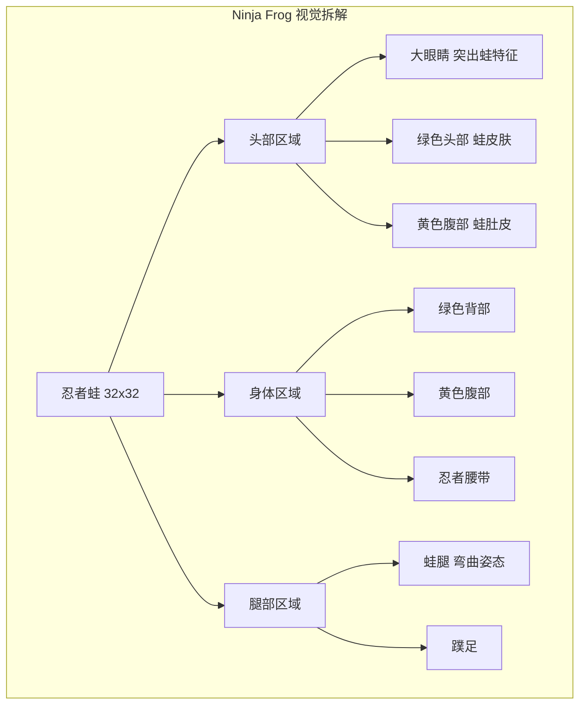

#### 配色方案

| 部位 | 颜色描述 | 参考色值 | 像素占比 |
|------|---------|---------|---------|
| 蛙皮 | 亮绿色 | #4CAF50 | ~30% |
| 肚皮 | 黄色 | #FFEB3B | ~20% |
| 眼睛 | 白色+黑瞳 | #FFFFFF/#000000 | ~10% |
| 腰带 | 深绿色 | #2E7D32 | ~8% |
| 蹼足 | 深绿色 | #388E3C | ~12% |
| 阴影 | 深绿 | #1B5E20 | ~8% |
| 背景 | 透明 | - | ~12% |

### 3.3 与 Mask Dude 差异

| 差异点 | Mask Dude | Ninja Frog |
|--------|-----------|------------|
| 体型 | 中等人形 | 矮胖蛙形 |
| 重心 | 居中偏上 | 居中偏下 |
| 头部占比 | ~40% | ~50% |
| 腿部特征 | 直立行走 | 弯曲蛙腿 |
| 视觉宽度 | 较窄 | 较宽 |
| 动画差异 | 仅精灵图不同 | 仅精灵图不同 |

> **注意**: 四角色动画帧数、帧率完全一致，仅精灵视觉不同。碰撞箱尺寸相同。

---

## 4. Pink Man 粉红人

### 4.1 角色概述

```
角色名称: Pink Man (粉红人)
目录路径: assets/Main Characters/Pink Man/
精灵尺寸: 32x32 像素
视觉风格: 粉色圆胖人形角色
主色调: 粉色/白色系
性格定位: 可爱型角色
```

### 4.2 视觉设计

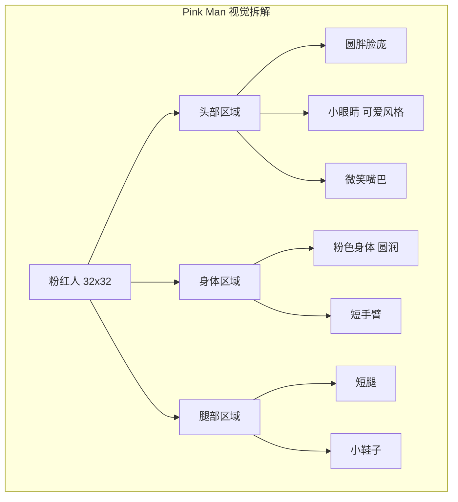

#### 配色方案

| 部位 | 颜色描述 | 参考色值 | 像素占比 |
|------|---------|---------|---------|
| 身体 | 粉色 | #FF69B4 | ~35% |
| 面部 | 浅粉 | #FFB6C1 | ~15% |
| 眼睛 | 黑色 | #000000 | ~5% |
| 鞋子 | 深粉 | #C71585 | ~8% |
| 高光 | 白色 | #FFFFFF | ~5% |
| 阴影 | 深粉 | #DB7093 | ~10% |
| 背景 | 透明 | - | ~22% |

### 4.3 体型特征

| 特征 | 数值 | 说明 |
|------|------|------|
| 视觉宽度 | 较宽 | 圆胖体型 |
| 视觉高度 | 较矮 | 矮胖比例 |
| 头身比 | 1:1 | 大头小身体 |
| 可见度 | 高 | 粉色在深色背景突出 |

---

## 5. Virtual Guy 虚拟人

### 5.1 角色概述

```
角色名称: Virtual Guy (虚拟人)
目录路径: assets/Main Characters/Virtual Guy/
精灵尺寸: 32x32 像素
视觉风格: 蓝色全覆头盔虚拟人
主色调: 蓝色/深蓝色系
性格定位: 科技型角色
```

### 5.2 视觉设计

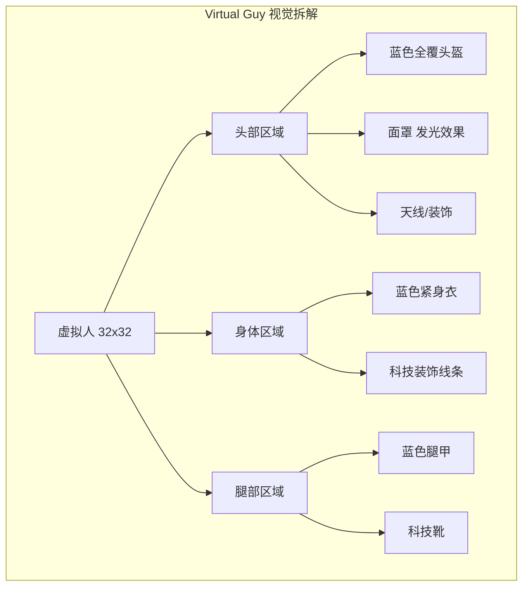

#### 配色方案

| 部位 | 颜色描述 | 参考色值 | 像素占比 |
|------|---------|---------|---------|
| 头盔 | 蓝色 | #2196F3 | ~25% |
| 面罩 | 深蓝/黑 | #0D47A1 | ~10% |
| 紧身衣 | 深蓝 | #1565C0 | ~25% |
| 装饰线 | 亮蓝 | #64B5F6 | ~8% |
| 靴子 | 深灰蓝 | #263238 | ~10% |
| 发光 | 青色 | #00BCD4 | ~5% |
| 背景 | 透明 | - | ~17% |

### 5.3 体型特征

| 特征 | 数值 | 说明 |
|------|------|------|
| 视觉宽度 | 中等 | 标准人形 |
| 视觉高度 | 偏高 | 头盔增加高度 |
| 头身比 | 1:1.5 | 正常比例 |
| 可见度 | 中 | 蓝色在多数背景可辨 |

---

## 6. 角色特效精灵

### 6.1 特效总览

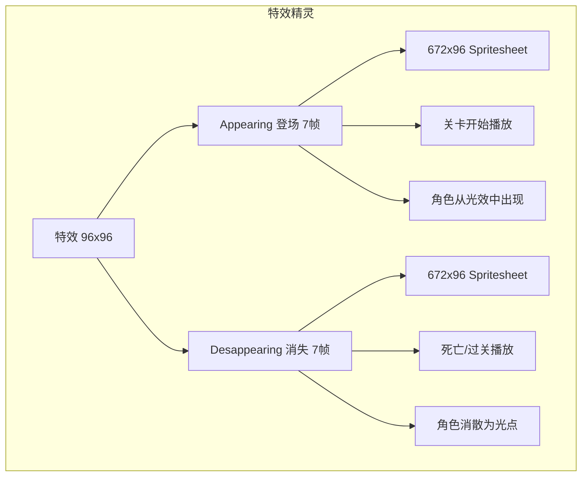

### 6.2 Appearing 登场特效

| 属性 | 数值 |
|------|------|
| 文件名 | Appearing (96x96).png |
| 单帧尺寸 | 96x96 |
| 文件总尺寸 | 672x96 |
| 帧数 | **7帧** |
| 触发时机 | 关卡开始、从检查点复活 |
| 播放方式 | 播放一次后切换角色 Idle |
| 帧率建议 | 0.10s/帧 |

#### 帧描述

| 帧号 | 效果描述 |
|------|---------|
| 1 | 光点聚集，微弱闪光 |
| 2 | 光球扩大，角色轮廓出现 |
| 3 | 光球最亮，角色半透明 |
| 4 | 光球收缩，角色更清晰 |
| 5 | 光点扩散，角色实体化 |
| 6 | 残余光点，角色完全显现 |
| 7 | 光点消失，切换至 Idle |

### 6.3 Desappearing 消失特效

| 属性 | 数值 |
|------|------|
| 文件名 | Desappearing (96x96).png |
| 单帧尺寸 | 96x96 |
| 文件总尺寸 | 672x96 |
| 帧数 | **7帧** |
| 触发时机 | 角色死亡、关卡结束传送 |
| 播放方式 | 播放一次后触发下一状态 |
| 帧率建议 | 0.10s/帧 |

#### 帧描述

| 帧号 | 效果描述 |
|------|---------|
| 1 | 角色开始闪烁 |
| 2 | 角色半透明，光点出现 |
| 3 | 角色更透明，光球包裹 |
| 4 | 角色几乎不可见，光球收缩 |
| 5 | 角色消失，光球缩小 |
| 6 | 残余光点扩散 |
| 7 | 光点消失，完全清空 |

### 6.4 特效使用流程

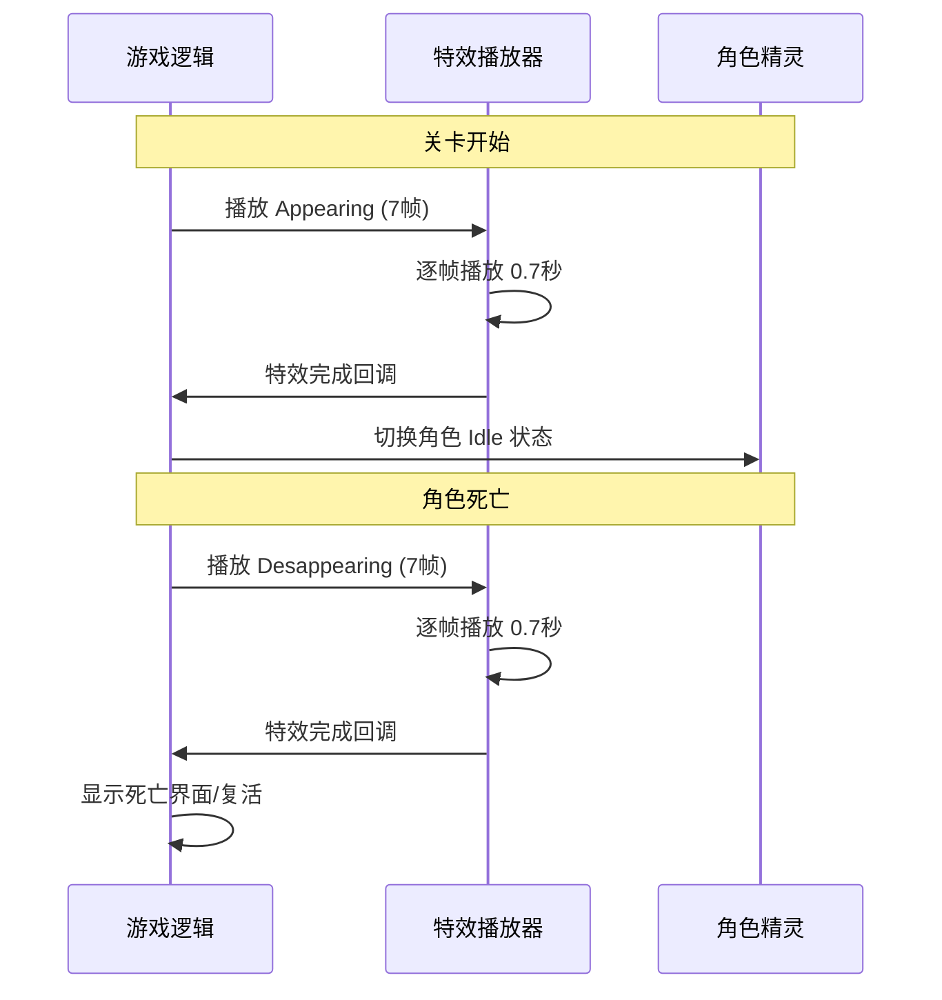

---

## 7. 动画系统详解

### 7.1 动画帧率与时长表

| 状态 | 帧数 | 帧率 | 总时长 | 循环 | 可打断 |
|------|------|------|--------|------|--------|
| Idle | 11 | 0.10s | 1.10s | 是 | 是 |
| Run | 12 | 0.08s | 0.96s | 是 | 是 |
| Jump | 1 | 静态 | - | 否 | 是 |
| Fall | 1 | 静态 | - | 否 | 是 |
| Double Jump | 6 | 0.08s | 0.48s | 否 | 是 |
| Hit | 7 | 0.10s | 0.70s | 否 | 否 |
| Wall Jump | 5 | 0.08s | 0.40s | 否 | 是 |
| Appearing | 7 | 0.10s | 0.70s | 否 | 否 |
| Desappearing | 7 | 0.10s | 0.70s | 否 | 否 |

### 7.2 动画优先级

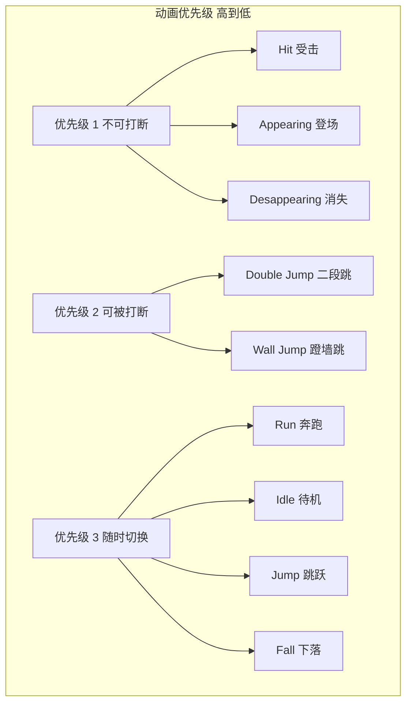

### 7.3 动画切换规则

| 当前状态 | 可切换至 | 条件 |
|---------|---------|------|
| Idle | Run | 方向键输入 |
| Idle | Jump | 跳跃键按下 |
| Idle | Hit | 接触伤害 |
| Run | Idle | 松开方向键 |
| Run | Jump | 跳跃键按下 |
| Run | Wall Jump | 贴墙 + 跳跃 |
| Jump | Fall | 垂直速度 ≤ 0 |
| Jump | Double Jump | 空中按跳跃 + 有二段跳次数 |
| Fall | Idle | 落地检测 |
| Fall | Double Jump | 空中按跳跃 |
| Fall | Wall Jump | 贴墙 + 跳跃 |
| Double Jump | Fall | 动画播完或垂直速度 ≤ 0 |
| Wall Jump | Fall | 动画播完 |
| Wall Jump | Run | 落地 |
| Hit | Idle | 动画播完 (0.7s) |

### 7.4 精灵翻转规则

| 条件 | 操作 |
|------|------|
| 向左移动 | `sprite.flip_h = true` |
| 向右移动 | `sprite.flip_h = false` |
| 蹬墙跳(左墙) | 面向右 `flip_h = false` |
| 蹬墙跳(右墙) | 面向左 `flip_h = true` |

---

## 8. 角色对比与选择

### 8.1 角色选择界面流程

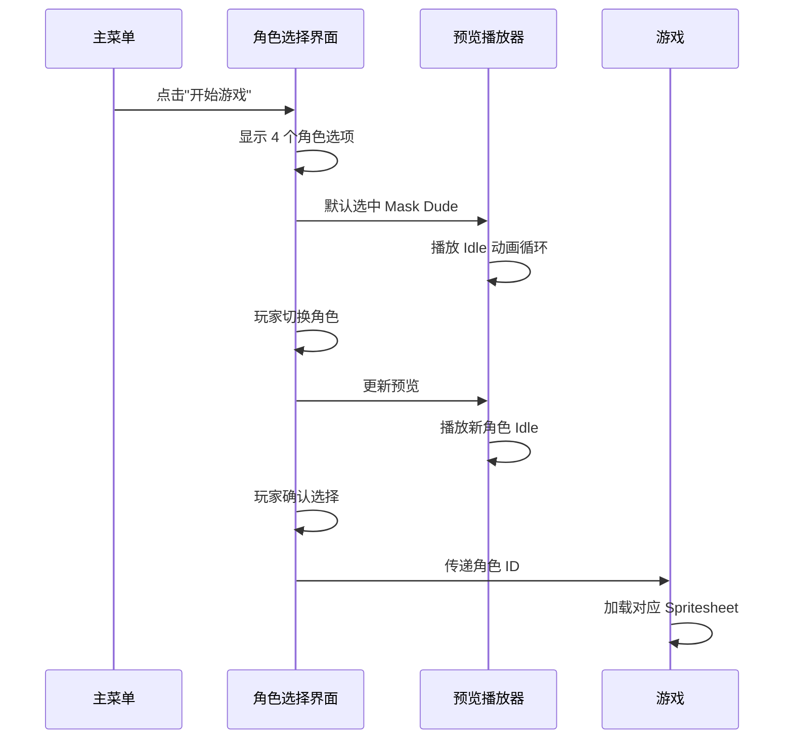

### 8.2 角色选择数据存储

| 字段 | 类型 | 说明 |
|------|------|------|
| character_id | int | 0=Mask Dude, 1=Ninja Frog, 2=Pink Man, 3=Virtual Guy |
| character_name | string | 显示名称 |
| sprite_path | string | Spritesheet 路径 |
| is_unlocked | bool | 是否已解锁 |
| play_count | int | 使用次数 |

### 8.3 角色解锁策略

| 角色 | 解锁条件 | 说明 |
|------|---------|------|
| Mask Dude | 初始解锁 | 默认角色 |
| Ninja Frog | 通关世界 1 | 奖励型解锁 |
| Pink Man | 收集 50 个水果 | 收集型解锁 |
| Virtual Guy | 通关全部关卡 | 终极解锁 |

> **注意**: 解锁策略为设计建议，实际素材中 4 个角色均已提供，技术上可随时切换。

### 8.4 四角色同屏对比

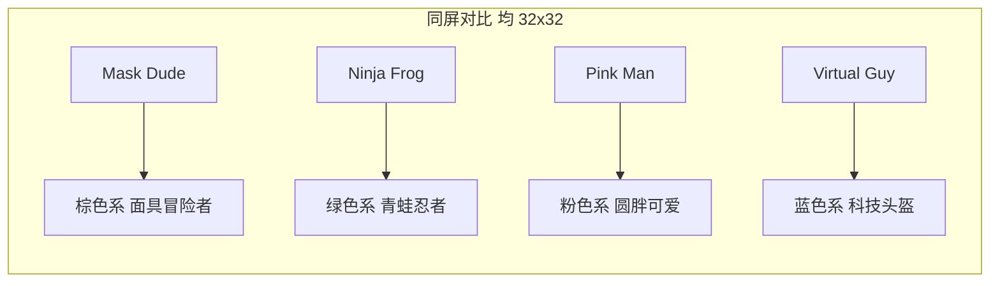

| 对比维度 | Mask Dude | Ninja Frog | Pink Man | Virtual Guy |
|---------|-----------|------------|----------|-------------|
| 辨识度 | 中 | 高 | 高 | 中 |
| 深色背景可见度 | 高 | 高 | 极高 | 中 |
| 浅色背景可见度 | 中 | 高 | 低 | 高 |
| 动画流畅感 | 稳重 | 灵活 | 可爱 | 机械 |
| 推荐新手 | 是 | 是 | 是 | 否 |

---

## 9. 碰撞与物理参数

### 9.1 碰撞箱规格

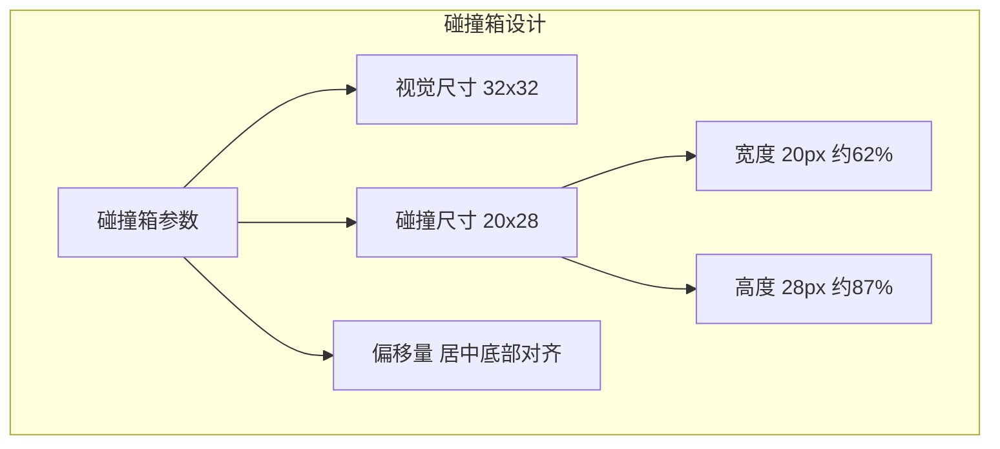

### 9.2 碰撞箱示意

```
+--------------------------------+
|                                |  32x32 视觉边界
|    +--------------------+      |
|    |                    |      |
|    |   碰撞箱 20x28     |      |
|    |                    |      |
|    |                    |      |
|    |                    |      |
|    |                    |      |
|    |                    |      |
|    +--------------------+      |
|                                |
+--------------------------------+
     ^                    ^
     |---- 6px ----|------ 6px
           (水平居中)
```

### 9.3 物理参数表

| 参数 | 数值 | 单位 | 说明 |
|------|------|------|------|
| 碰撞箱宽度 | 20 | px | 精灵宽度的 62% |
| 碰撞箱高度 | 28 | px | 精灵高度的 87% |
| 碰撞箱偏移 X | 6 | px | 从精灵左侧偏移 |
| 碰撞箱偏移 Y | 0 | px | 底部对齐 |
| 重力缩放 | 1.0 | - | 标准重力 |
| 最大下落速度 | 400 | px/s | 终端速度 |

### 9.4 移动物理参数

| 参数 | 数值 | 单位 | 说明 |
|------|------|------|------|
| 最大移动速度 | 200 | px/s | 地面最大速度 |
| 加速度 | 800 | px/s² | 地面加速度 |
| 减速度 | 1200 | px/s² | 地面减速度（松开按键） |
| 空中加速度 | 600 | px/s² | 空中水平加速度 |
| 空中减速度 | 400 | px/s² | 空中空气阻力 |
| 跳跃初速度 | -350 | px/s | 向上跳跃力 |
| 二段跳速度 | -300 | px/s | 二段跳向上力 |
| 蹬墙跳 X 速度 | 250 | px/s | 蹬墙水平弹射 |
| 蹬墙跳 Y 速度 | -320 | px/s | 蹬墙垂直弹射 |
| 墙壁滑落速度 | 50 | px/s | 贴墙下滑速度 |

### 9.5 不同地形参数修正

| 地形类型 | 速度修正 | 摩擦系数 | 跳跃修正 | 说明 |
|---------|---------|---------|---------|------|
| 普通地面 | 100% | 0.85 | 100% | 标准参数 |
| 冰面 | 120% | 0.05 | 100% | 极低摩擦滑行 |
| 泥地 | 60% | 0.95 | 80% | 大幅减速 |
| 沙地 | 75% | 0.90 | 90% | 中等减速 |
| 蹦床 | - | - | 200% | 弹射到双倍高度 |
| 风扇区域 | 50% | - | - | 向上吹力影响 |

---

**最后更新**: 2026-07-31  
**状态**: 基于实际素材重写完成  
**素材来源**: `assets/Main Characters/` (4 角色 + 2 特效)
