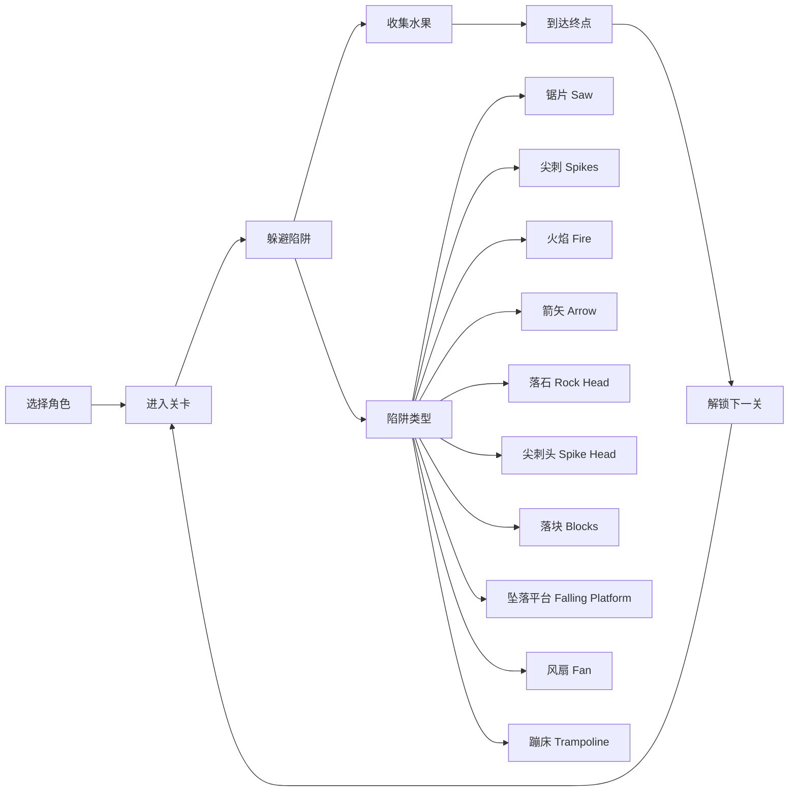
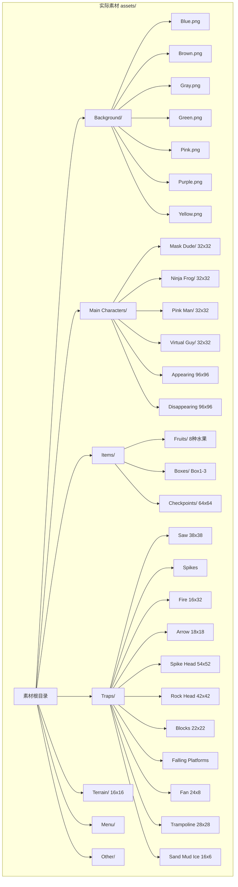
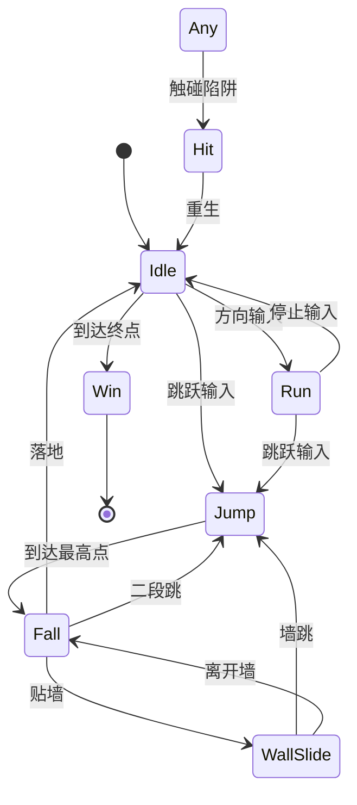
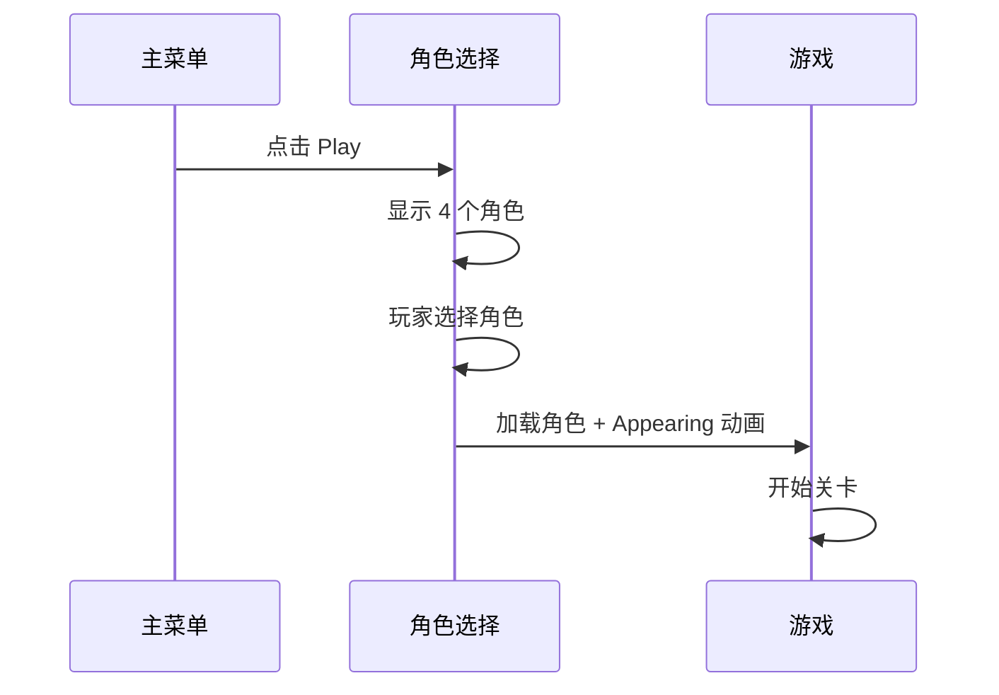
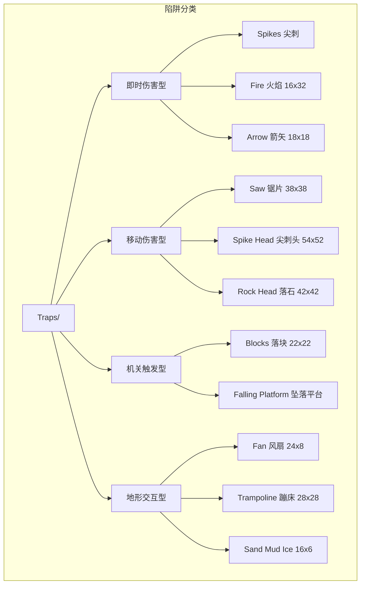
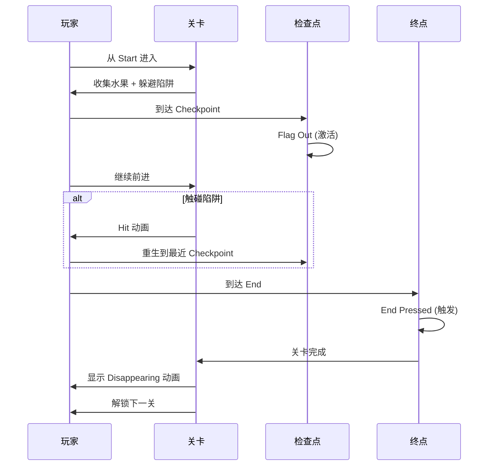
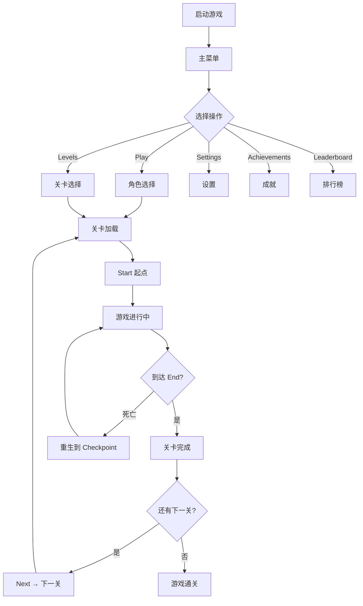

# 游戏设计文档 - Pixel Adventure

**最后更新**: 2026-07-31  
**状态**: 基于实际素材重写

> **重要**: 本文档严格基于 `assets/` 目录中的实际素材编写，所有设计决策以现有资源为准。

---

## 目录

1. [游戏概述](#1-游戏概述)
2. [核心玩法](#2-核心玩法)
3. [角色系统](#3-角色系统)
4. [陷阱系统](#4-陷阱系统)
5. [道具系统](#5-道具系统)
6. [关卡设计](#6-关卡设计)
7. [UI 系统](#7-ui-系统)
8. [游戏流程](#8-游戏流程)
9. [难度设计](#9-难度设计)

---

## 1. 游戏概述

### 1.1 游戏定位

| 属性 | 数值 |
|------|------|
| 游戏名称 | Pixel Adventure |
| 游戏类型 | 2D 横版平台跳跃 |
| 目标平台 | PC (Windows/Linux/Mac) |
| 开发引擎 | Godot 4.x |
| 美术风格 | 像素艺术 (16x16 / 32x32) |
| 关卡数量 | 50 关 (Menu/Levels 01-50) |
| 可选角色 | 4 个 |
| 收集品种类 | 8 种水果 |

### 1.2 核心概念



### 1.3 实际素材清单



---

## 2. 核心玩法

### 2.1 操作映射

| 操作 | 键盘 | 说明 |
|------|------|------|
| 左移 | A / ← | 向左移动 |
| 右移 | D / → | 向右移动 |
| 跳跃 | Space / W | 跳跃 (可变高度) |
| 二段跳 | Space (空中) | 解锁后可用 |
| 墙跳 | Space (贴墙) | 解锁后可用 |

### 2.2 物理参数表

| 参数 | 数值 | 单位 | 说明 |
|------|------|------|------|
| 最大水平速度 | 150 | px/s | 地面移动 |
| 加速度 | 800 | px/s² | 地面加速 |
| 减速度 | 1200 | px/s² | 地面减速 |
| 空中加速度 | 600 | px/s² | 空中操控降低 |
| 跳跃初速度 | -400 | px/s | 基础跳跃 |
| 二段跳速度 | -350 | px/s | 空中再跳 |
| 重力 | 1200 | px/s² | 全局重力 |
| 最大下落速度 | 600 | px/s | 终端速度 |
| 墙跳速度 | -380 | px/s | 蹬墙跳 |
| 墙壁滑落速度 | 100 | px/s | 贴墙下滑 |

### 2.3 核心循环



---

## 3. 角色系统

### 3.1 可选角色

| 角色 | 文件名 | 尺寸 | 特点 |
|------|--------|------|------|
| Mask Dude | Mask Dude/ | 32x32 | 戴面具的忍者，棕色系 |
| Ninja Frog | Ninja Frog/ | 32x32 | 青蛙忍者，绿色系 |
| Pink Man | Pink Man/ | 32x32 | 粉色角色，可爱风 |
| Virtual Guy | Virtual Guy/ | 32x32 | 蓝色虚拟人，科技感 |

### 3.2 角色动画状态

每个角色拥有相同的 7 种动画状态：

| 状态 | 文件名 | 尺寸 | 帧数 | 帧率 | 说明 |
|------|--------|------|------|------|------|
| Idle | Idle (32x32).png | 32x32 | 11 帧 | 0.1s/帧 | 待机呼吸 |
| Run | Run (32x32).png | 32x32 | 12 帧 | 0.08s/帧 | 奔跑 |
| Jump | Jump (32x32).png | 32x32 | 1 帧 | - | 跳跃上升 |
| Fall | Fall (32x32).png | 32x32 | 1 帧 | - | 下落 |
| Double Jump | Double Jump (32x32).png | 32x32 | 1 帧 | - | 二段跳 |
| Hit | Hit (32x32).png | 32x32 | 1 帧 | - | 受伤 |
| Wall Jump | Wall Jump (32x32).png | 32x32 | 1 帧 | - | 墙跳 |

### 3.3 特殊精灵

| 精灵 | 文件名 | 尺寸 | 用途 |
|------|--------|------|------|
| 出现动画 | Appearing (96x96).png | 96x96 | 角色登场特效 |
| 消失动画 | Desappearing (96x96).png | 96x96 | 角色消失/死亡特效 |

### 3.4 角色选择流程



---

## 4. 陷阱系统

### 4.1 陷阱总览



### 4.2 陷阱详细参数表

| 陷阱名称 | 尺寸 | 伤害类型 | 行为模式 | 碰撞箱 | 动画状态 |
|---------|------|---------|---------|--------|---------|
| **Spikes** | 可变 | 即时死亡 | 静态放置 | 顶部尖刺区域 | Idle (静态) |
| **Fire** | 16x32 | 即时死亡 | 静态/开关 | 16x32 | Off / On / Hit |
| **Arrow** | 18x18 | 即时死亡 | 定时发射 | 18x18 | Idle / Hit |
| **Saw** | 38x38 | 即时死亡 | 旋转/移动 | 圆形 38x38 | Off / On (旋转) |
| **Spike Head** | 54x52 | 即时死亡 | 伸缩攻击 | 54x52 | Idle / Blink / Top/Bottom/Left/Right Hit |
| **Rock Head** | 42x42 | 即时死亡 | 伸缩攻击 | 42x42 | Idle / Blink / Top/Bottom/Left/Right Hit |
| **Blocks** | 22x22 | 即时死亡 | 从上方/侧面落下 | 22x22 | Idle / Part 1 / Part 2 / HitTop / HitSide |
| **Falling Platform** | 32x10 | 坠落 | 踩上后延迟坠落 | 32x10 | Off / On |
| **Fan** | 24x8 | 无伤害 | 吹动玩家 | 24x8 | Off / On |
| **Trampoline** | 28x28 | 无伤害 | 弹跳玩家 | 28x28 | Idle / Jump |
| **Sand Mud Ice** | 16x6 | 无伤害 | 改变移动物理 | 16x6 | 静态 + 粒子 |

### 4.3 陷阱伤害判定表

| 陷阱 | 伤害值 | 结果 | 重生方式 | 无敌时间 |
|------|--------|------|---------|---------|
| Spikes | 即死 | 重生到检查点 | 最近 Checkpoint | 无 |
| Fire | 即死 | 重生到检查点 | 最近 Checkpoint | 无 |
| Arrow | 即死 | 重生到检查点 | 最近 Checkpoint | 无 |
| Saw | 即死 | 重生到检查点 | 最近 Checkpoint | 无 |
| Spike Head | 即死 | 重生到检查点 | 最近 Checkpoint | 无 |
| Rock Head | 即死 | 重生到检查点 | 最近 Checkpoint | 无 |
| Blocks | 即死 | 重生到检查点 | 最近 Checkpoint | 无 |
| Falling Platform | 坠落即死 | 重生到检查点 | 最近 Checkpoint | 无 |

### 4.4 陷阱出现世界分布

| 世界 | 主题 | 主要陷阱 | 特殊机制 |
|------|------|---------|---------|
| 1-10 | 草地 | Spikes, Falling Platform, Trampoline | 基础教学 |
| 11-20 | 森林 | Spikes, Saw, Fan | 移动陷阱引入 |
| 21-30 | 洞穴 | Fire, Arrow, Blocks | 机关触发型 |
| 31-40 | 冰雪 | Sand Mud Ice (冰面), Spikes, Saw | 滑行物理 |
| 41-50 | 城堡 | Spike Head, Rock Head, Saw, Fire | 综合高难度 |

---

## 5. 道具系统

### 5.1 收集品 - 水果

| 水果 | 文件名 | 尺寸 | 分值 | 帧数 | 说明 |
|------|--------|------|------|------|------|
| 苹果 | Apple.png | 16x16 | 10 | 17 帧 | 基础收集品 |
| 香蕉 | Bananas.png | 16x16 | 10 | 17 帧 | 基础收集品 |
| 樱桃 | Cherries.png | 16x16 | 10 | 17 帧 | 基础收集品 |
| 猕猴桃 | Kiwi.png | 16x16 | 10 | 17 帧 | 基础收集品 |
| 甜瓜 | Melon.png | 16x16 | 10 | 17 帧 | 基础收集品 |
| 橙子 | Orange.png | 16x16 | 10 | 17 帧 | 基础收集品 |
| 菠萝 | Pineapple.png | 16x16 | 10 | 17 帧 | 基础收集品 |
| 草莓 | Strawberry.png | 16x16 | 10 | 17 帧 | 基础收集品 |

**收集动画**: Collected.png — 水果被收集时的特效帧

### 5.2 道具箱

| 箱子 | 文件名 | 尺寸 | 行为 | 说明 |
|------|--------|------|------|------|
| Box1 | Idle / Hit(28x24) / Break | 可变 | 顶击 → 破碎 | 木箱风格 |
| Box2 | Idle / Hit(28x24) / Break | 可变 | 顶击 → 破碎 | 金属箱风格 |
| Box3 | Idle / Hit(28x24) / Break | 可变 | 顶击 → 破碎 | 石箱风格 |

### 5.3 检查点

| 类型 | 文件名 | 尺寸 | 用途 | 动画状态 |
|------|--------|------|------|---------|
| 检查点 | Checkpoint (Flag Idle)(64x64).png | 64x64 | 存档点 | 旗帜飘动 |
| 检查点(未激活) | Checkpoint (No Flag).png | 64x64 | 未激活检查点 | 静态 |
| 检查点(激活) | Checkpoint (Flag Out) (64x64).png | 64x64 | 已激活检查点 | 旗帜展开 |
| 起点 | Start (Idle).png | 64x64 | 关卡起点 | 静态 |
| 起点(移动) | Start (Moving) (64x64).png | 64x64 | 起点动画 | 移动 |
| 终点 | End (Idle).png | 64x64 | 关卡终点 | 静态 |
| 终点(触发) | End (Pressed) (64x64).png | 64x64 | 终点触发 | 按下 |

### 5.4 收集品分布表

| 关卡范围 | 水果/关 | 箱子/关 | 检查点/关 | 说明 |
|---------|---------|---------|----------|------|
| 1-10 | 15-25 | 3-5 | 2-3 | 教学关，水果密集 |
| 11-20 | 20-30 | 4-6 | 2-3 | 难度提升 |
| 21-30 | 25-35 | 5-8 | 2-4 | 高难度，水果分散 |
| 31-40 | 20-30 | 4-6 | 2-3 | 冰雪主题 |
| 41-50 | 15-25 | 3-5 | 2-3 | 最终挑战 |

---

## 6. 关卡设计

### 6.1 关卡结构

| 属性 | 数值 |
|------|------|
| 总关卡数 | 50 关 |
| 关卡宽度 | 3200-6400 px (200-400 图块) |
| 关卡高度 | 720-1080 px (45-67 图块) |
| 基础图块 | 16x16 (Terrain spritesheet) |
| 每关检查点 | 2-4 个 |
| 每关水果 | 15-35 个 |

### 6.2 地形图块 (Terrain 16x16)

Terrain spritesheet 包含以下地形类型：

| 地形类型 | 颜色主题 | 用途 | 碰撞类型 |
|---------|---------|------|---------|
| 草地 | 绿色 | 地面/平台 | 完整方块 |
| 泥土 | 棕色 | 地下层 | 完整方块 |
| 石头 | 灰色 | 洞穴/墙壁 | 完整方块 |
| 砖块 | 红色 | 可破坏/装饰 | 完整方块 |
| 沙地 | 黄色 | 沙漠区域 | 完整方块 (减速) |
| 冰面 | 青色 | 冰雪区域 | 完整方块 (低摩擦) |

### 6.3 背景系统

| 背景 | 文件名 | 用途 | 对应世界 |
|------|--------|------|---------|
| 蓝色 | Blue.png | 天空/白天 | 世界 1, 5 |
| 棕色 | Brown.png | 洞穴/地下 | 世界 3 |
| 灰色 | Gray.png | 城堡/工业 | 世界 6 |
| 绿色 | Green.png | 森林/草地 | 世界 1, 2 |
| 粉色 | Pink.png | 梦幻/奖励关 | 隐藏关卡 |
| 紫色 | Purple.png | 神秘/夜晚 | 世界 4 |
| 黄色 | Yellow.png | 沙漠/黄昏 | 世界 2 |

### 6.4 关卡流程图



---

## 7. UI 系统

### 7.1 菜单按钮

| 按钮 | 文件名 | 用途 | 位置 |
|------|--------|------|------|
| Play | Play.png | 开始游戏 | 主菜单 |
| Settings | Settings.png | 设置 | 主菜单 |
| Volume | Volume.png | 音量 | 设置菜单 |
| Levels | Levels.png | 关卡选择 | 主菜单 |
| Achievements | Achievements.png | 成就 | 主菜单 |
| Leaderboard | Leaderboard.png | 排行榜 | 主菜单 |
| Next | Next.png | 下一关 | 关卡完成 |
| Previous | Previous.png | 上一关 | 关卡选择 |
| Restart | Restart.png | 重新开始 | 游戏中 |
| Back | Back.png | 返回 | 子菜单 |
| Close | Close.png | 关闭 | 弹窗 |

### 7.2 关卡选择

- **50 个关卡缩略图**: `Menu/Levels/01.png` ~ `Menu/Levels/50.png`
- 未解锁关卡显示锁定状态
- 已通关关卡显示星级评价

### 7.3 字体

| 字体 | 文件名 | 尺寸 | 用途 |
|------|--------|------|------|
| 黑色文字 | Text (Black) (8x10).png | 8x10 | 浅色背景上的文字 |
| 白色文字 | Text (White) (8x10).png | 8x10 | 深色背景上的文字 |

---

## 8. 游戏流程

### 8.1 完整游戏流程



### 8.2 存档数据

| 字段 | 类型 | 说明 |
|------|------|------|
| selected_character | string | 当前角色 (Mask Dude/Ninja Frog/Pink Man/Virtual Guy) |
| unlocked_levels | int | 已解锁关卡数 (1-50) |
| level_stars | Array[50] | 每关星级 (0-3) |
| total_fruits | int | 总水果收集数 |
| achievements | Array | 已解锁成就 |
| best_times | Array[50] | 每关最佳时间 |

---

## 9. 难度设计

### 9.1 难度曲线

```mermaid
xychart-beta
    title 关卡难度曲线
    x-axis [1, 5, 10, 15, 20, 25, 30, 35, 40, 45, 50]
    y-axis "难度" 0 --> 10
    line [1, 2, 3, 3.5, 4, 5, 5.5, 6, 7, 8.5, 10]
```

### 9.2 难度分级表

| 关卡范围 | 难度 | 陷阱类型 | 陷阱密度 | 水果密度 |
|---------|------|---------|---------|---------|
| 1-5 | ★☆☆☆☆ | Spikes, Trampoline | 低 | 高 |
| 6-10 | ★★☆☆☆ | +Falling Platform, Fan | 低-中 | 高 |
| 11-20 | ★★★☆☆ | +Saw, Fire | 中 | 中 |
| 21-30 | ★★★★☆ | +Arrow, Blocks | 中-高 | 中 |
| 31-40 | ★★★★☆ | +Sand Mud Ice | 高 | 中-低 |
| 41-50 | ★★★★★ | +Spike Head, Rock Head | 很高 | 低 |

### 9.3 辅助功能

| 功能 | 说明 | 默认 |
|------|------|------|
| 无限生命 | 死亡不扣水果 | 关 |
| 陷阱预览 | 显示陷阱触发范围 | 关 |
| 慢动作 | 游戏速度 50% | 关 |

---

## 附录

### 素材与文档对照表

| 文档中的概念 | 实际素材 | 状态 |
|-------------|---------|------|
| 蘑菇怪/乌龟等敌人 | **无** | 已移除 |
| Boss 战 | **无** | 已移除 |
| 金币/星星 | 8 种水果 | 已替换 |
| 火球花/蘑菇道具 | 道具箱 (Box1-3) | 已替换 |
| NPC/公主/商人 | **无** | 已移除 |
| 6 个世界 | 50 关 (Menu/Levels) | 已调整 |
| 角色能力解锁 | 4 个可选角色 | 已调整 |
| 分层背景 | 纯色背景 (7 种) | 已调整 |

---

**文档结束**
