# 关卡设计文档 - 像素冒险

**最后更新**: 2026-07-31  
**状态**: 基于实际素材重写

> **重要**: 本文档严格基于 `assets/` 目录中的实际素材编写。本作无敌人/Boss，关卡核心挑战来自 **13 种陷阱** + **平台跳跃** + **水果收集**。

---

## 目录

1. [关卡设计原则](#1-关卡设计原则)
2. [关卡结构总览](#2-关卡结构总览)
3. [世界主题设计](#3-世界主题设计)
4. [陷阱系统详解](#4-陷阱系统详解)
5. [道具分布设计](#5-道具分布设计)
6. [关卡流程图](#6-关卡流程图)
7. [难度曲线分析](#7-难度曲线分析)
8. [关卡数据统计](#8-关卡数据统计)
9. [检查点与存档系统](#9-检查点与存档系统)

---

## 1. 关卡设计原则

### 1.1 核心设计理念

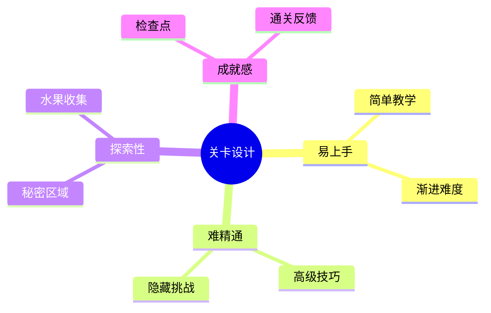

### 1.2 关卡节奏设计

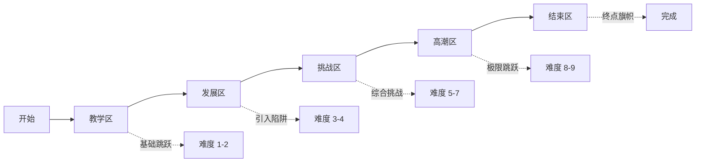

### 1.3 玩家心流曲线

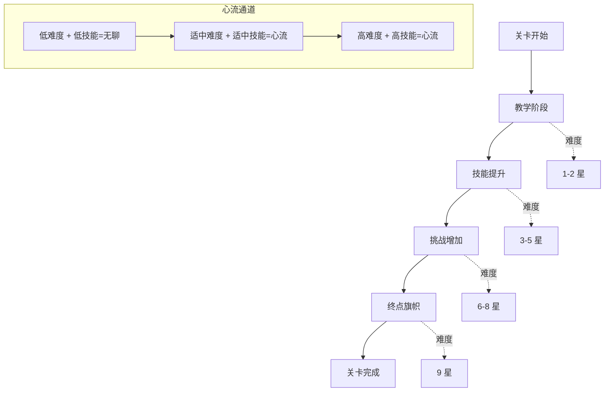

### 1.4 关卡设计四要素

| 要素 | 说明 | 实际素材对应 |
|------|------|-------------|
| **平台跳跃** | 精准跳跃挑战 | 地形图块 16x16 |
| **陷阱躲避** | 避开 13 种陷阱 | Traps/ 目录 |
| **水果收集** | 收集 8 种水果 | Items/Fruits/ 8 种 |
| **检查点** | 激活旗帜存档 | Items/Checkpoints/ |

---

## 2. 关卡结构总览

### 2.1 关卡规模

| 属性 | 数值 | 说明 |
|------|------|------|
| 总关卡数 | 50 关 | 对应 Menu/Levels/ 50 张缩略图 |
| 世界数 | 6 个 | 对应 7 种背景色 |
| 每世界关卡 | 8-9 关 | 不均匀分布 |
| 关卡平均时长 | 60-120 秒 | 快节奏设计 |
| 检查点密度 | 每关 2-3 个 | 对应 Checkpoint 素材 |

### 2.2 世界分布表

| 世界 | 名称 | 关卡范围 | 关卡数 | 背景色 | 主题 |
|------|------|---------|--------|--------|------|
| 1 | 草地世界 | 1-8 | 8 | Blue/Green | 新手教学 |
| 2 | 洞穴世界 | 9-17 | 9 | Brown | 陷阱引入 |
| 3 | 冰雪世界 | 18-25 | 8 | Gray | 冰面物理 |
| 4 | 熔岩世界 | 26-33 | 8 | Yellow | 火焰陷阱 |
| 5 | 天空世界 | 34-41 | 8 | Purple | 高空跳跃 |
| 6 | 城堡世界 | 42-50 | 9 | Pink | 综合挑战 |

### 2.3 关卡解锁流程

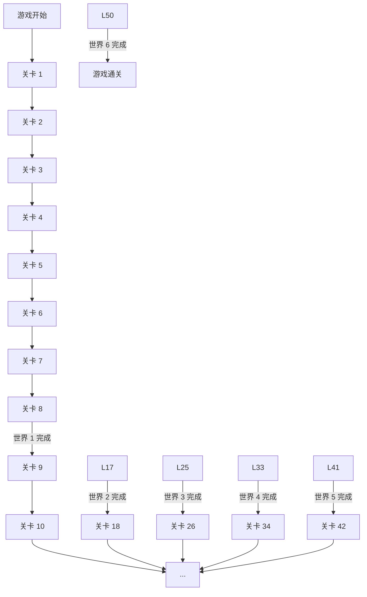

---

## 3. 世界主题设计

### 3.1 世界 1: 草地世界 (关卡 1-8)

#### 世界概述

| 属性 | 数值 |
|------|------|
| 背景色 | Blue.png / Green.png |
| 地形风格 | 草地 + 泥土 |
| 主要陷阱 | Spikes, Saw |
| 水果种类 | Apple, Orange |
| 难度范围 | 1-3 星 |

#### 关卡设计要点

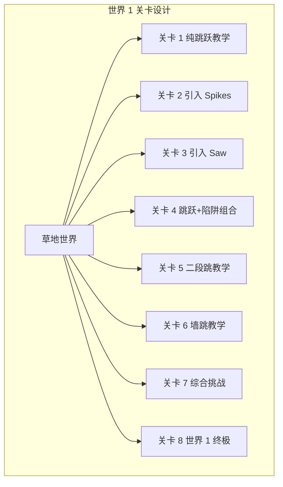

#### 陷阱引入表

| 关卡 | 引入陷阱 | 陷阱数量 | 说明 |
|------|---------|---------|------|
| 1 | 无 | 0 | 纯平台跳跃 |
| 2 | Spikes | 3-5 | 静态尖刺，地面放置 |
| 3 | Saw (Off) | 2-3 | 静止锯片，学习躲避 |
| 4 | Spikes + Saw | 5-8 | 组合挑战 |
| 5 | Spikes | 4-6 | 配合二段跳 |
| 6 | Saw (On) | 3-5 | 旋转锯片，8帧动画 |
| 7 | Spikes + Saw | 8-12 | 综合挑战 |
| 8 | 全部 | 10-15 | 世界 1 终极考验 |

#### 水果分布表

| 关卡 | Apple | Orange | 总数 | 分布特点 |
|------|-------|--------|------|---------|
| 1 | 5 | 0 | 5 | 路径引导 |
| 2 | 3 | 2 | 5 | 陷阱上方 |
| 3 | 2 | 3 | 5 | 跳跃路径 |
| 4 | 3 | 3 | 6 | 组合区域 |
| 5 | 4 | 2 | 6 | 高空区域 |
| 6 | 2 | 4 | 6 | 墙跳路径 |
| 7 | 3 | 4 | 7 | 隐藏区域 |
| 8 | 5 | 5 | 10 | 丰富收集 |

### 3.2 世界 2: 洞穴世界 (关卡 9-17)

#### 世界概述

| 属性 | 数值 |
|------|------|
| 背景色 | Brown.png |
| 地形风格 | 岩石 + 洞穴 |
| 主要陷阱 | Arrow, Fire, Blocks |
| 水果种类 | Cherries, Kiwi |
| 难度范围 | 3-5 星 |

#### 陷阱引入表

| 关卡 | 引入陷阱 | 陷阱数量 | 说明 |
|------|---------|---------|------|
| 9 | Arrow | 3-4 | 定时发射，10帧待机 |
| 10 | Fire (Off) | 2-3 | 静态火焰，学习躲避 |
| 11 | Blocks | 3-4 | 落块，接近触发 |
| 12 | Fire (On) | 3-5 | 燃烧动画，3帧循环 |
| 13 | Arrow + Spikes | 6-8 | 组合挑战 |
| 14 | Blocks + Saw | 5-7 | 上下夹击 |
| 15 | Fire + Arrow | 6-9 | 远程陷阱 |
| 16 | 全部 | 10-14 | 综合挑战 |
| 17 | 全部 | 12-18 | 世界 2 终极 |

### 3.3 世界 3: 冰雪世界 (关卡 18-25)

#### 世界概述

| 属性 | 数值 |
|------|------|
| 背景色 | Gray.png |
| 地形风格 | 冰面 + 雪地 |
| 物理特性 | 低摩擦冰面 |
| 主要陷阱 | Spike Head, Rock Head |
| 水果种类 | Melon, Pineapple |
| 难度范围 | 4-6 星 |

#### 特殊物理参数

| 地形类型 | 摩擦系数 | 速度修正 | 说明 |
|---------|---------|---------|------|
| 冰面 | 0.05 | 120% | 极低摩擦，滑行 |
| 雪地 | 0.70 | 85% | 中等减速 |
| 普通 | 0.85 | 100% | 标准参数 |

#### 陷阱引入表

| 关卡 | 引入陷阱 | 陷阱数量 | 说明 |
|------|---------|---------|------|
| 18 | Spike Head | 2-3 | 伸缩攻击，4方向 |
| 19 | Rock Head | 2-3 | 类似 Spike Head |
| 20 | Spike Head + 冰面 | 4-5 | 冰面+陷阱 |
| 21 | Rock Head + 冰面 | 4-6 | 滑动躲避 |
| 22 | Spike Head + Rock Head | 5-7 | 组合挑战 |
| 23 | + Spikes + Saw | 8-10 | 综合挑战 |
| 24 | 全部 | 10-14 | 极限挑战 |
| 25 | 全部 | 12-18 | 世界 3 终极 |

### 3.4 世界 4: 熔岩世界 (关卡 26-33)

#### 世界概述

| 属性 | 数值 |
|------|------|
| 背景色 | Yellow.png |
| 地形风格 | 熔岩 + 黑曜石 |
| 主要陷阱 | Fire, Falling Platforms |
| 水果种类 | Strawberry, Bananas |
| 难度范围 | 5-7 星 |

#### 陷阱引入表

| 关卡 | 引入陷阱 | 陷阱数量 | 说明 |
|------|---------|---------|------|
| 26 | Falling Platforms | 3-4 | 踩上后坠落 |
| 27 | Fire + Falling | 5-6 | 火焰+坠落平台 |
| 28 | Fan | 2-3 | 风扇，向上吹力 |
| 29 | Trampoline | 2-3 | 蹦床，弹射跳跃 |
| 30 | Fan + Fire | 6-8 | 风力+火焰 |
| 31 | Trampoline + Saw | 5-7 | 弹射+锯片 |
| 32 | 全部 | 10-14 | 综合挑战 |
| 33 | 全部 | 12-18 | 世界 4 终极 |

### 3.5 世界 5: 天空世界 (关卡 34-41)

#### 世界概述

| 属性 | 数值 |
|------|------|
| 背景色 | Purple.png |
| 地形风格 | 云朵 + 浮空岛 |
| 主要陷阱 | Platforms, Spiked Ball |
| 水果种类 | 全部 8 种混合 |
| 难度范围 | 6-8 星 |

#### 陷阱引入表

| 关卡 | 引入陷阱 | 陷阱数量 | 说明 |
|------|---------|---------|------|
| 34 | Platforms (Brown) | 3-4 | 移动平台 |
| 35 | Spiked Ball | 2-3 | 刺球滚动 |
| 36 | Platforms + Fan | 5-6 | 平台+风力 |
| 37 | Spiked Ball + Saw | 5-7 | 滚动+旋转 |
| 38 | Platforms + Spiked | 7-9 | 综合挑战 |
| 39 | + Trampoline | 8-11 | 弹射+平台 |
| 40 | 全部 | 12-16 | 极限挑战 |
| 41 | 全部 | 14-20 | 世界 5 终极 |

### 3.6 世界 6: 城堡世界 (关卡 42-50)

#### 世界概述

| 属性 | 数值 |
|------|------|
| 背景色 | Pink.png |
| 地形风格 | 城堡 + 机械 |
| 主要陷阱 | 全部 13 种 |
| 水果种类 | 全部 8 种混合 |
| 难度范围 | 7-9 星 |

#### 陷阱引入表

| 关卡 | 引入陷阱 | 陷阱数量 | 说明 |
|------|---------|---------|------|
| 42 | Sand Mud Ice | 3-4 | 沙/泥/冰地形 |
| 43 | 全部基础陷阱 | 8-10 | 综合回顾 |
| 44 | 高级陷阱组合 | 10-13 | 极限挑战 |
| 45 | 密集陷阱 | 12-16 | 反应测试 |
| 46 | 精准跳跃 | 10-14 | 操作测试 |
| 47 | 全陷阱混合 | 15-20 | 终极挑战 |
| 48 | 极限密度 | 18-25 | 专家级 |
| 49 | 终极挑战 | 20-30 | 大师级 |
| 50 | 最终关卡 | 25-35 | 通关考验 |

---

## 4. 陷阱系统详解

### 4.1 陷阱分类总览

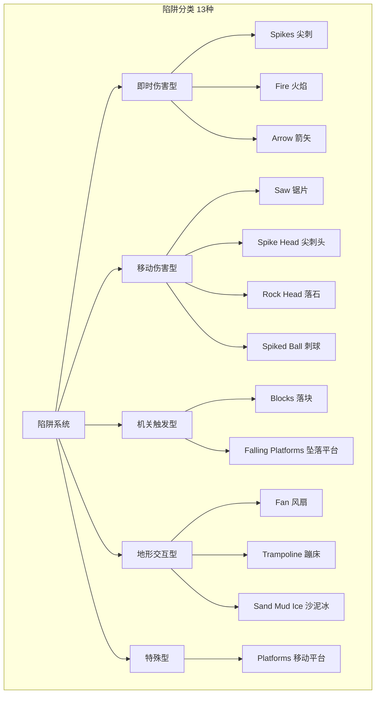

### 4.2 即时伤害型陷阱

#### Spikes 尖刺

| 属性 | 数值 |
|------|------|
| 文件 | Traps/Spikes/Idle.png |
| 尺寸 | 16x16 |
| 帧数 | 1帧 (静态) |
| 伤害 | 即死 |
| 放置 | 地面/墙壁/天花板 |
| 方向 | 可旋转 0°/90°/180°/270° |

**设计用途**: 最基础的陷阱，教会玩家躲避

#### Fire 火焰

| 属性 | 数值 |
|------|------|
| 文件 | Traps/Fire/ |
| 尺寸 | 16x32 |
| 帧数 | Off 1帧, On 3帧, Hit 4帧 |
| 伤害 | 即死 |
| 行为 | 静态/开关控制 |

**动画状态**:
- Off: 未激活 (1帧)
- On: 燃烧循环 (3帧, 0.15s/帧)
- Hit: 命中特效 (4帧, 0.10s/帧)

**设计用途**: 视觉威胁，可开关控制

#### Arrow 箭矢

| 属性 | 数值 |
|------|------|
| 文件 | Traps/Arrow/ |
| 尺寸 | 18x18 |
| 帧数 | Idle 10帧, Hit 4帧 |
| 伤害 | 即死 |
| 行为 | 定时发射，直线飞行 |

**动画状态**:
- Idle: 等待发射 (10帧, 0.20s/帧 = 2秒循环)
- Hit: 命中特效 (4帧, 0.10s/帧)

**设计用途**: 远程威胁，需要预判时机

### 4.3 移动伤害型陷阱

#### Saw 锯片

| 属性 | 数值 |
|------|------|
| 文件 | Traps/Saw/ |
| 尺寸 | 38x38 (锯片), 8x8 (链条) |
| 帧数 | Off 1帧, On 8帧 |
| 伤害 | 即死 |
| 行为 | 沿链条路径移动/旋转 |

**动画状态**:
- Off: 静止关闭 (1帧)
- On: 旋转动画 (8帧, 0.08s/帧)

**设计用途**: 巡逻型威胁，需要观察路径

#### Spike Head 尖刺头

| 属性 | 数值 |
|------|------|
| 文件 | Traps/Spike Head/ |
| 尺寸 | 54x52 |
| 帧数 | Idle 1帧, Blink 4帧, 4方向 Hit 各4帧 |
| 伤害 | 即死 |
| 行为 | 检测玩家后伸缩攻击 |

**动画状态**:
- Idle: 等待触发 (1帧)
- Blink: 眨眼预警 (4帧, 0.15s/帧)
- Top/Bottom/Left/Right Hit: 伸缩攻击 (各4帧, 0.10s/帧)

**设计用途**: 反应测试，需要快速躲避

#### Rock Head 落石

| 属性 | 数值 |
|------|------|
| 文件 | Traps/Rock Head/ |
| 尺寸 | 42x42 |
| 帧数 | Idle 1帧, Blink 4帧, 4方向 Hit 各4帧 |
| 伤害 | 即死 |
| 行为 | 类似 Spike Head，石头材质 |

**设计用途**: 同 Spike Head，视觉变化

#### Spiked Ball 刺球

| 属性 | 数值 |
|------|------|
| 文件 | Traps/Spiked Ball/ |
| 尺寸 | 28x28 |
| 帧数 | 待确认 |
| 伤害 | 即死 |
| 行为 | 滚动/弹跳移动 |

**设计用途**: 移动威胁，需要跳跃躲避

### 4.4 机关触发型陷阱

#### Blocks 落块

| 属性 | 数值 |
|------|------|
| 文件 | Traps/Blocks/ |
| 尺寸 | 22x22 |
| 帧数 | Idle 1帧, Part1 3帧, Part2 3帧, HitTop 3帧, HitSide 3帧 |
| 伤害 | 即死 |
| 行为 | 玩家接近时落下 |

**动画状态**:
- Idle: 悬挂等待 (1帧)
- HitTop/HitSide: 撞击玩家 (各3帧)
- Part1/Part2: 破碎碎片 (各3帧)

**设计用途**: 顶部威胁，需要快速反应

#### Falling Platforms 坠落平台

| 属性 | 数值 |
|------|------|
| 文件 | Traps/Falling Platforms/ |
| 尺寸 | 32x10 |
| 帧数 | Off 1帧, On 4帧 |
| 伤害 | 无 (但坠落致死) |
| 行为 | 踩上后延迟坠落，可刷新 |

**动画状态**:
- Off: 已坠落/未激活 (1帧)
- On: 可站立状态 (4帧, 0.15s/帧)

**设计用途**: 限时平台，需要快速通过

### 4.5 地形交互型陷阱

#### Fan 风扇

| 属性 | 数值 |
|------|------|
| 文件 | Traps/Fan/ |
| 尺寸 | 24x8 |
| 帧数 | Off 1帧, On 4帧 |
| 伤害 | 无 |
| 行为 | 向上吹动玩家 |

**动画状态**:
- Off: 无风 (1帧)
- On: 吹风动画 (4帧, 0.12s/帧)

**设计用途**: 影响跳跃轨迹，改变平台路径

#### Trampoline 蹦床

| 属性 | 数值 |
|------|------|
| 文件 | Traps/Trampoline/ |
| 尺寸 | 28x28 |
| 帧数 | Idle 1帧, Jump 8帧 |
| 伤害 | 无 |
| 行为 | 弹射玩家到高处 |

**动画状态**:
- Idle: 等待踩踏 (1帧)
- Jump: 弹跳动画 (8帧, 0.08s/帧)

**设计用途**: 垂直移动，到达高空区域

#### Sand Mud Ice 沙泥冰

| 属性 | 数值 |
|------|------|
| 文件 | Traps/Sand Mud Ice/ |
| 尺寸 | 16x6 (表面), 16x16 (粒子) |
| 帧数 | 143帧 (11列×13行), 粒子各1帧 |
| 伤害 | 无 |
| 行为 | 改变移动物理特性 |

**地形效果**:
- 沙地: 减速 75%
- 泥地: 减速 60%
- 冰面: 摩擦 0.05, 速度 120%

**设计用途**: 改变移动手感，增加多样性

### 4.6 特殊型陷阱

#### Platforms 移动平台

| 属性 | 数值 |
|------|------|
| 文件 | Traps/Platforms/ |
| 尺寸 | 32x8 |
| 帧数 | Brown/Grey 各 Off 1帧, On 8帧 |
| 伤害 | 无 |
| 行为 | 水平/垂直移动 |

**动画状态**:
- Off: 未激活 (1帧)
- On: 激活状态 (8帧, 0.10s/帧)

**设计用途**: 水平移动，跨越间隙

### 4.7 陷阱密度统计

| 世界 | 陷阱种类 | 平均数量/关 | 最大数量/关 | 密度等级 |
|------|---------|------------|------------|---------|
| 1 | 2-3 | 5-8 | 15 | 低 |
| 2 | 4-6 | 8-12 | 18 | 中 |
| 3 | 6-8 | 10-14 | 20 | 中高 |
| 4 | 8-10 | 12-16 | 25 | 高 |
| 5 | 10-12 | 14-18 | 30 | 很高 |
| 6 | 13 | 18-25 | 35 | 极限 |

---

## 5. 道具分布设计

### 5.1 水果收集品

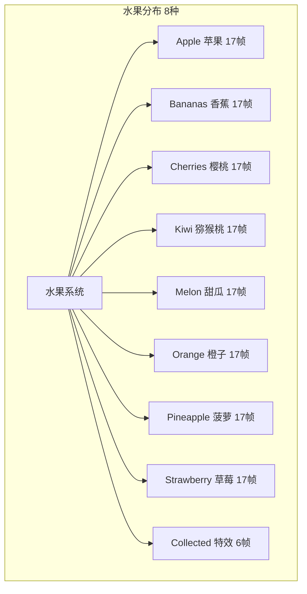

#### 水果分值表

| 水果 | 分值 | 出现世界 | 动画帧数 |
|------|------|---------|---------|
| Apple | 10 | 世界 1, 3, 5 | 17帧 |
| Orange | 10 | 世界 1, 4 | 17帧 |
| Cherries | 20 | 世界 2, 5 | 17帧 |
| Kiwi | 20 | 世界 2, 6 | 17帧 |
| Melon | 30 | 世界 3, 6 | 17帧 |
| Pineapple | 30 | 世界 3, 4 | 17帧 |
| Bananas | 40 | 世界 4, 6 | 17帧 |
| Strawberry | 40 | 世界 5, 6 | 17帧 |

#### 水果分布密度

| 世界 | 每关平均 | 每关最大 | 总水果数 | 收集特效 |
|------|---------|---------|---------|---------|
| 1 | 5-6 | 10 | 45 | Collected 6帧 |
| 2 | 6-7 | 12 | 60 | Collected 6帧 |
| 3 | 7-8 | 14 | 65 | Collected 6帧 |
| 4 | 8-9 | 16 | 70 | Collected 6帧 |
| 5 | 9-10 | 18 | 80 | Collected 6帧 |
| 6 | 10-12 | 20 | 100 | Collected 6帧 |
| **总计** | - | - | **420** | - |

### 5.2 道具箱系统

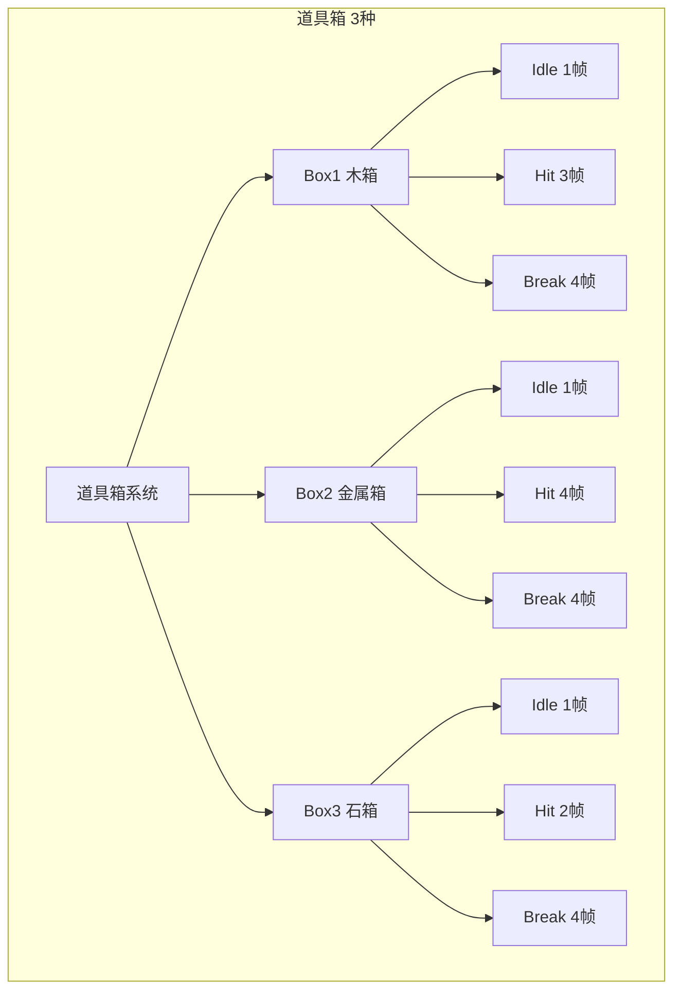

#### 道具箱参数

| 箱子 | 尺寸 | Idle | Hit | Break | 总帧数 | 内容物 |
|------|------|------|-----|-------|--------|--------|
| Box1 木箱 | 28x24 | 1帧 | 3帧 | 4帧 | 8帧 | 水果×3 |
| Box2 金属箱 | 28x24 | 1帧 | 4帧 | 4帧 | 9帧 | 水果×5 |
| Box3 石箱 | 28x24 | 1帧 | 2帧 | 4帧 | 7帧 | 水果×10 |

#### 道具箱分布

| 世界 | Box1 | Box2 | Box3 | 总数 |
|------|------|------|------|------|
| 1 | 8 | 2 | 0 | 10 |
| 2 | 6 | 4 | 1 | 11 |
| 3 | 5 | 5 | 2 | 12 |
| 4 | 4 | 6 | 3 | 13 |
| 5 | 3 | 7 | 4 | 14 |
| 6 | 2 | 8 | 5 | 15 |
| **总计** | 28 | 32 | 15 | **75** |

### 5.3 检查点系统

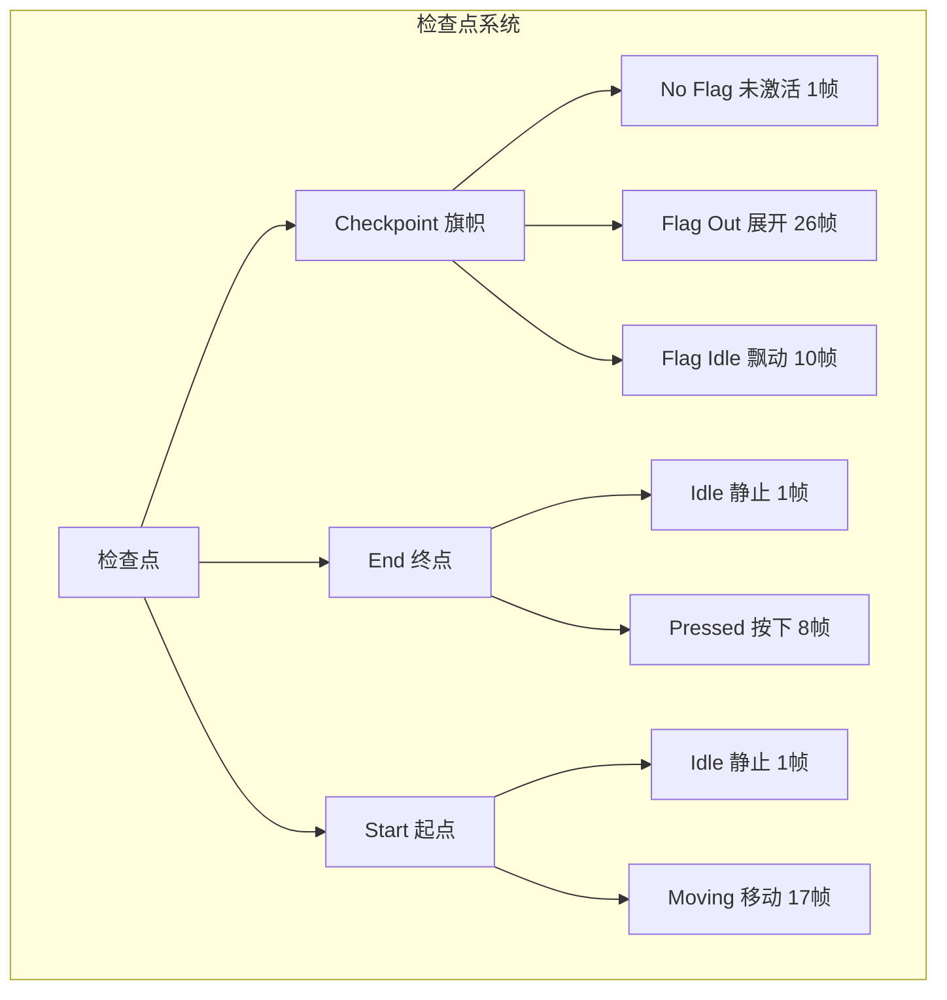

#### 检查点参数

| 类型 | 尺寸 | 帧数 | 用途 | 动画说明 |
|------|------|------|------|---------|
| Checkpoint (No Flag) | 64x64 | 1帧 | 未激活检查点 | 静态 |
| Checkpoint (Flag Out) | 64x64 | 26帧 | 刚被激活 | 旗帜展开 0.10s/帧 |
| Checkpoint (Flag Idle) | 64x64 | 10帧 | 已激活检查点 | 旗帜飘动 0.15s/帧 |
| End (Idle) | 64x64 | 1帧 | 关卡终点 | 静态 |
| End (Pressed) | 64x64 | 8帧 | 终点触发 | 按下动画 0.12s/帧 |
| Start (Idle) | 64x64 | 1帧 | 关卡起点 | 静态 |
| Start (Moving) | 64x64 | 17帧 | 起点动画 | 移动特效 0.10s/帧 |

#### 检查点分布

| 世界 | 每关检查点 | 总数 | 说明 |
|------|-----------|------|------|
| 1 | 2-3 | 20-24 | 密集，新手友好 |
| 2 | 2-3 | 20-24 | 适中 |
| 3 | 2-3 | 20-24 | 适中 |
| 4 | 2-3 | 20-24 | 适中 |
| 5 | 2-3 | 20-24 | 适中 |
| 6 | 2-3 | 20-24 | 适中 |
| **总计** | - | **120-144** | - |

---

## 6. 关卡流程图

### 6.1 标准关卡流程

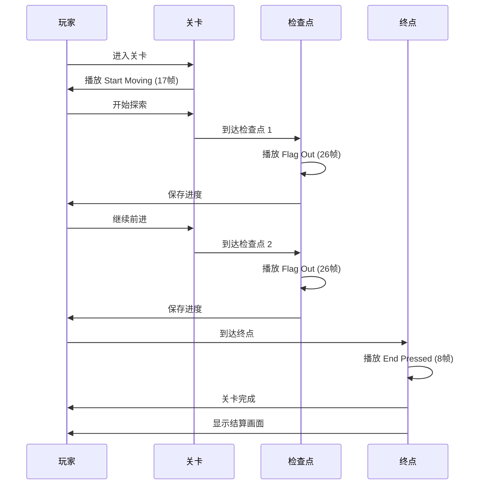

### 6.2 玩家死亡流程

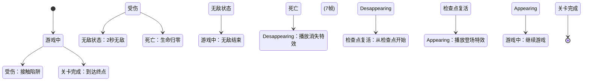

### 6.3 水果收集流程

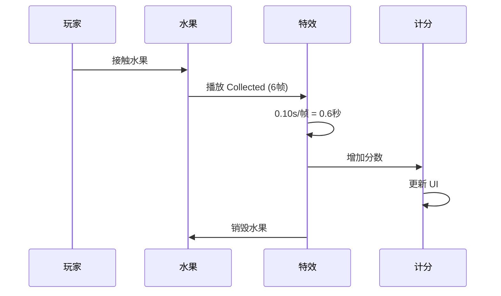

---

## 7. 难度曲线分析

### 7.1 难度曲线图

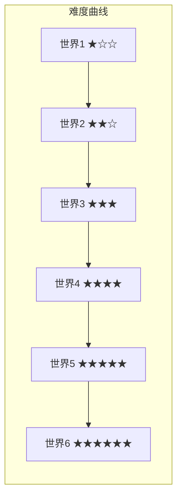

### 7.2 难度参数表

| 世界 | 难度星级 | 陷阱密度 | 跳跃难度 | 反应要求 | 综合难度 |
|------|---------|---------|---------|---------|---------|
| 1 | 1-3 | 低 | 简单 | 宽松 | 新手 |
| 2 | 3-5 | 中 | 中等 | 适中 | 入门 |
| 3 | 4-6 | 中高 | 中等 | 较快 | 进阶 |
| 4 | 5-7 | 高 | 较难 | 快 | 挑战 |
| 5 | 6-8 | 很高 | 难 | 很快 | 专家 |
| 6 | 7-9 | 极限 | 极难 | 极快 | 大师 |

### 7.3 关卡难度分布

| 难度等级 | 关卡范围 | 关卡数 | 占比 | 目标玩家 |
|---------|---------|--------|------|---------|
| 简单 | 1-8 | 8 | 16% | 新手 |
| 中等 | 9-17 | 9 | 18% | 休闲 |
| 较难 | 18-25 | 8 | 16% | 核心 |
| 困难 | 26-33 | 8 | 16% | 硬核 |
| 极难 | 34-41 | 8 | 16% | 专家 |
| 地狱 | 42-50 | 9 | 18% | 大师 |

---

## 8. 关卡数据统计

### 8.1 总体统计

| 统计项 | 数值 | 说明 |
|--------|------|------|
| 总关卡数 | 50 | 对应 50 张缩略图 |
| 总世界数 | 6 | 6 个主题世界 |
| 总陷阱数 | ~800-1000 | 所有关卡陷阱总和 |
| 总水果数 | ~420 | 所有关卡水果总和 |
| 总道具箱 | 75 | 所有关卡箱子总和 |
| 总检查点 | ~130 | 所有关卡检查点总和 |
| 平均关卡时长 | 60-120秒 | 快节奏设计 |
| 总游戏时长 | 8-12小时 | 主线通关 |

### 8.2 陷阱使用统计

| 陷阱类型 | 使用次数 | 出现世界 | 占比 |
|---------|---------|---------|------|
| Spikes | ~200 | 全部 | 20% |
| Saw | ~120 | 全部 | 12% |
| Fire | ~100 | 2-6 | 10% |
| Arrow | ~80 | 2-6 | 8% |
| Spike Head | ~70 | 3-6 | 7% |
| Rock Head | ~70 | 3-6 | 7% |
| Blocks | ~60 | 2-6 | 6% |
| Falling Platforms | ~50 | 4-6 | 5% |
| Fan | ~40 | 4-6 | 4% |
| Trampoline | ~40 | 4-6 | 4% |
| Sand Mud Ice | ~30 | 3-6 | 3% |
| Spiked Ball | ~30 | 5-6 | 3% |
| Platforms | ~30 | 5-6 | 3% |
| **总计** | **~920** | - | **100%** |

### 8.3 水果收集统计

| 水果 | 总数 | 分值 | 总分值 | 占比 |
|------|------|------|--------|------|
| Apple | ~60 | 10 | 600 | 14% |
| Orange | ~60 | 10 | 600 | 14% |
| Cherries | ~55 | 20 | 1100 | 13% |
| Kiwi | ~55 | 20 | 1100 | 13% |
| Melon | ~50 | 30 | 1500 | 12% |
| Pineapple | ~50 | 30 | 1500 | 12% |
| Bananas | ~45 | 40 | 1800 | 11% |
| Strawberry | ~45 | 40 | 1800 | 11% |
| **总计** | **~420** | - | **10000** | **100%** |

### 8.4 关卡完成度统计

| 完成度 | 条件 | 奖励 | 达成率预估 |
|--------|------|------|-----------|
| 10% | 通关世界 1 | 解锁 Ninja Frog | 95% |
| 30% | 通关世界 3 | 解锁特殊皮肤 | 75% |
| 50% | 通关世界 5 | 解锁 Virtual Guy | 50% |
| 80% | 收集 300 水果 | 解锁隐藏关卡 | 25% |
| 100% | 通关全部 50 关 | 通关证书 | 10% |

---

## 9. 检查点与存档系统

### 9.1 检查点激活流程

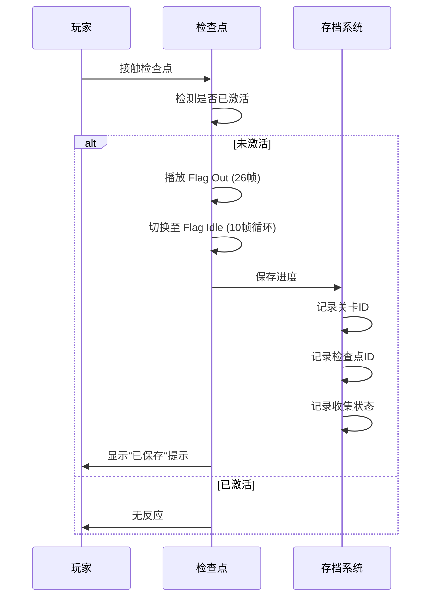

### 9.2 存档数据结构

| 字段 | 类型 | 说明 |
|------|------|------|
| level_id | int | 当前关卡 ID (1-50) |
| checkpoint_id | int | 检查点 ID (0-3) |
| character_id | int | 角色 ID (0-3) |
| fruits_collected | int | 已收集水果数 |
| boxes_broken | int | 已打破箱子数 |
| play_time | float | 游戏时长 (秒) |
| deaths | int | 死亡次数 |

### 9.3 复活流程

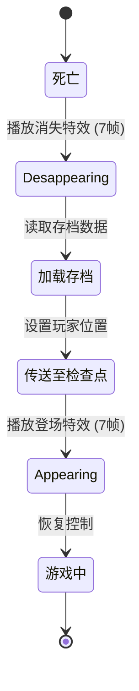

### 9.4 检查点间距设计

| 世界 | 平均间距 | 最大间距 | 说明 |
|------|---------|---------|------|
| 1 | 200-300px | 400px | 新手友好 |
| 2 | 250-350px | 500px | 适中 |
| 3 | 300-400px | 600px | 适中 |
| 4 | 350-450px | 700px | 较难 |
| 5 | 400-500px | 800px | 困难 |
| 6 | 450-550px | 900px | 极限 |

---

**最后更新**: 2026-07-31  
**状态**: 基于实际素材重写完成  
**素材来源**: `assets/Traps/`, `assets/Items/`, `assets/Terrain/`, `assets/Menu/Levels/`
