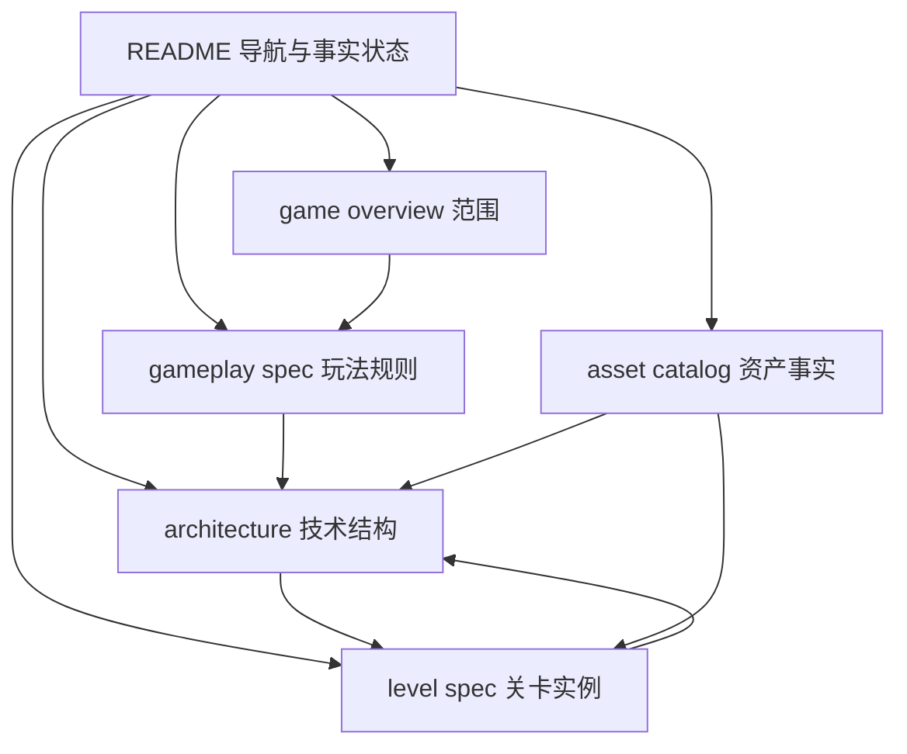

# 单关卡平台跳跃 Demo 文档

本目录是一个可执行的规格，不是商业企划案。目标是让读者仅依靠本目录和仓库中的 `Example/assets/`，在 Godot 4.7 中搭建一个完整的单关卡 2D 平台跳跃闭环。

## 当前边界

| 项目 | 状态 | 依据 |
|---|---|---|
| 项目名 | FACT | `Example/project.godot` 的 `config/name=Example` |
| 引擎与渲染 | FACT | Godot 4.7、Forward Plus |
| 窗口伸缩 | FACT | `canvas_items`、`expand` |
| 主场景 | FACT | 未配置 `run/main_scene` |
| 输入动作 | FACT | 未配置 `[input]` |
| 游戏源码与场景 | FACT | `Example` 当前没有 `.gd`、`.tscn`、`.tres`、`.gdextension` |
| 音频 | FACT | `Example` 当前没有音频文件 |
| PNG 资产 | FACT | `Example/assets/` 当前有 173 个 PNG，项目没有运行时引用 |
| Demo 内容 | TARGET | 一关、一个默认皮肤、移动、跳跃、二段跳、墙跳、静态致命陷阱、水果、检查点、终点、重生和胜利 UI |

文档中的事实等级如下:

- `FACT`: 可从文件、项目配置或资产目录直接观察到的事实。
- `TARGET`: 本次 Demo 要实现的目标规格，不代表仓库当前已经存在。
- `TODO`: 需要创建的文件、节点、脚本或资源配置。
- `VERIFY`: 必须在 Godot 中执行并确认的事项。

## 文档导航

| 文档 | 权威职责 | 何时阅读 |
|---|---|---|
| [game-overview.md](./game-overview.md) | 单关卡范围、目标、非目标和完成定义 | 开始前确认不做什么 |
| [gameplay-spec.md](./gameplay-spec.md) | 唯一玩法规则来源、目标参数、状态和事件契约 | 实现玩家与玩法时 |
| [architecture.md](./architecture.md) | 唯一技术结构来源、节点、脚本、碰撞和 MCP 顺序 | 创建场景与脚本时 |
| [level-spec.md](./level-spec.md) | 唯一关卡实例来源、坐标、分段和验收路线 | 摆放关卡内容时 |
| [asset-catalog.md](./asset-catalog.md) | 唯一 PNG 资产事实来源、路径、尺寸、帧数和消费节点 | 导入与切片时 |

## 推荐阅读路径

1. 先读 [game-overview.md](./game-overview.md)，确认目标只有一个最小闭环关卡。
2. 再读 [gameplay-spec.md](./gameplay-spec.md)，这里是移动、跳跃、死亡、收集、检查点和终点规则的唯一来源。
3. 按 [architecture.md](./architecture.md) 创建目录、节点、脚本和碰撞层。
4. 按 [level-spec.md](./level-spec.md) 使用明确坐标摆放实例。
5. 用 [asset-catalog.md](./asset-catalog.md) 导入 PNG、切片 SpriteFrames 并核对原始路径。
6. 依照架构文档的 MCP 顺序搭建和运行验证。文档只记录可用工具事实，不声称这些工具已经执行。

## 文档关系图

图目的: 展示每份文档的唯一职责以及搭建时的依赖方向。

关键判读: `gameplay-spec.md` 不从 `level-spec.md` 反推规则；`level-spec.md` 只实例化规则。资产目录只说明文件事实，不能因为文件名是 `On`、`Hit` 或 `Idle` 就推断行为。

## 搭建前置条件

- 已安装并可打开 Godot 4.7。
- 当前项目目录是 `Example/`，项目名为 `Example`。
- 已确认 `Example/assets/` 中的路径大小写、空格、括号和拼写保持原样。
- 已知插件构建命令是 `uv run build.py`。该命令构建并部署插件到 `Example/addons/godot-self-driving/`，不是游戏运行命令。
- MCP 默认端口是 `9527`，可由环境变量 `GODOT_SELF_DRIVING_PORT` 覆盖。
- 第一次搭建前不要把不存在的脚本、场景或音频当作现状；它们只能按 `TARGET` 和 `TODO` 创建。

## 验证入口

完成目标是: 从 Start 出发，经过水果和一个 Checkpoint，绕过至少一个 Spikes，触碰 End 显示胜利；接触陷阱后回到最近检查点；重复收集和重复终点触发都不会重复计数或重复结算。

- 构建插件: `uv run build.py`。
- 在 Godot 中确认项目可打开、目标场景可运行、输入动作已存在。
- 使用 [architecture.md](./architecture.md) 中的 MCP 验收顺序逐项执行。
- 使用 [level-spec.md](./level-spec.md) 中的逐步路线验证正常、死亡、重生和胜利路径。
- 完成后回填所有 `VERIFY` 项，不要把未执行项改写成 `FACT`。

## 非目标

本次不实现 50 关流程、敌人、Boss、NPC、攻击、冲刺、移动端触屏、排行榜、成就、商业化、云存档、音频系统或持久化存档。它们只在文档中作为明确边界出现，不是待偷偷接入的实现要求。
