# 音效设计文档 - 像素冒险

**最后更新**: 2026-07-31  
**状态**: 初稿

---

## 目录

1. [音频设计概述](#1-音频设计概述)
2. [音乐系统设计](#2-音乐系统设计)
3. [音效资源清单](#3-音效资源清单)
4. [音频状态机](#4-音频状态机)
5. [音频技术参数](#5-音频技术参数)
6. [音乐曲目详细设计](#6-音乐曲目详细设计)

---

## 1. 音频设计概述

### 1.1 音频设计目标

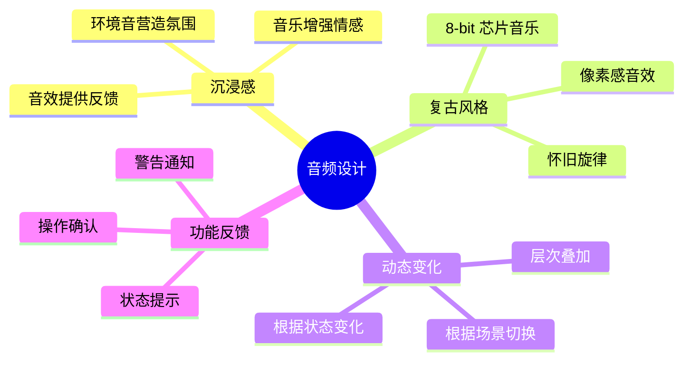

### 1.2 音频分类架构图

```mermaid
graph TB
    subgraph 音频系统 AudioSystem
        AM[AudioManager]
    end
    
    subgraph BGM 背景音乐
        BGM_TITLE[标题音乐]
        BGM_WORLD1[世界 1 音乐]
        BGM_WORLD2[世界 2 音乐]
        BGM_WORLD3[世界 3 音乐]
        BGM_WORLD4[世界 4 音乐]
        BGM_WORLD5[世界 5 音乐]
        BGM_WORLD6[世界 6 音乐]
        BGM_BOSS[Boss 音乐]
    end
    
    subgraph SFX 音效
        SFX_PLAYER[玩家音效]
        SFX_ENEMY[敌人音效]
        SFX_ITEM[道具音效]
        SFX_ENV[环境音效]
        SFX_UI[UI 音效]
    end
    
    subgraph AMBIENT 环境音
        AMB_WIND[风声]
        AMB_WATER[水声]
        AMB_FIRE[火声]
        AMB_CAVE[洞穴回声]
    end
    
    AM --> BGM_TITLE
    AM --> BGM_WORLD1
    AM --> BGM_WORLD2
    AM --> BGM_WORLD3
    AM --> BGM_WORLD4
    AM --> BGM_WORLD5
    AM --> BGM_WORLD6
    AM --> BGM_BOSS
    
    AM --> SFX_PLAYER
    AM --> SFX_ENEMY
    AM --> SFX_ITEM
    AM --> SFX_ENV
    AM --> SFX_UI
    
    AM --> AMB_WIND
    AM --> AMB_WATER
    AM --> AMB_FIRE
    AM --> AMB_CAVE
```

### 1.3 音频优先级分层

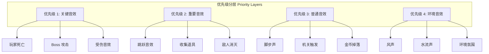

### 1.4 音频优先级表

| 优先级 | 类别 | 最大同时数 | 可被打断 | 音量范围 | 示例 |
|--------|------|-----------|---------|---------|------|
| 1 | 关键音效 | 3 | 否 | 0.8-1.0 | 死亡、Boss 攻击 |
| 2 | 重要音效 | 5 | 是 | 0.6-0.9 | 跳跃、收集、消灭 |
| 3 | 普通音效 | 8 | 是 | 0.4-0.7 | 脚步、机关 |
| 4 | 环境音效 | 4 | 是 | 0.2-0.5 | 风声、水声 |

---

## 2. 音乐系统设计

### 2.1 音乐切换流程

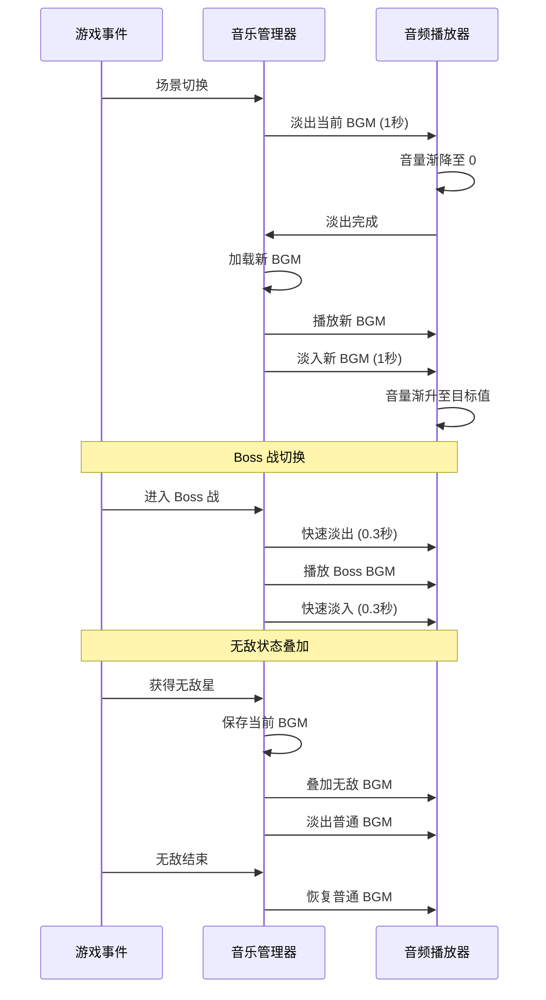

### 2.2 动态音乐层次图

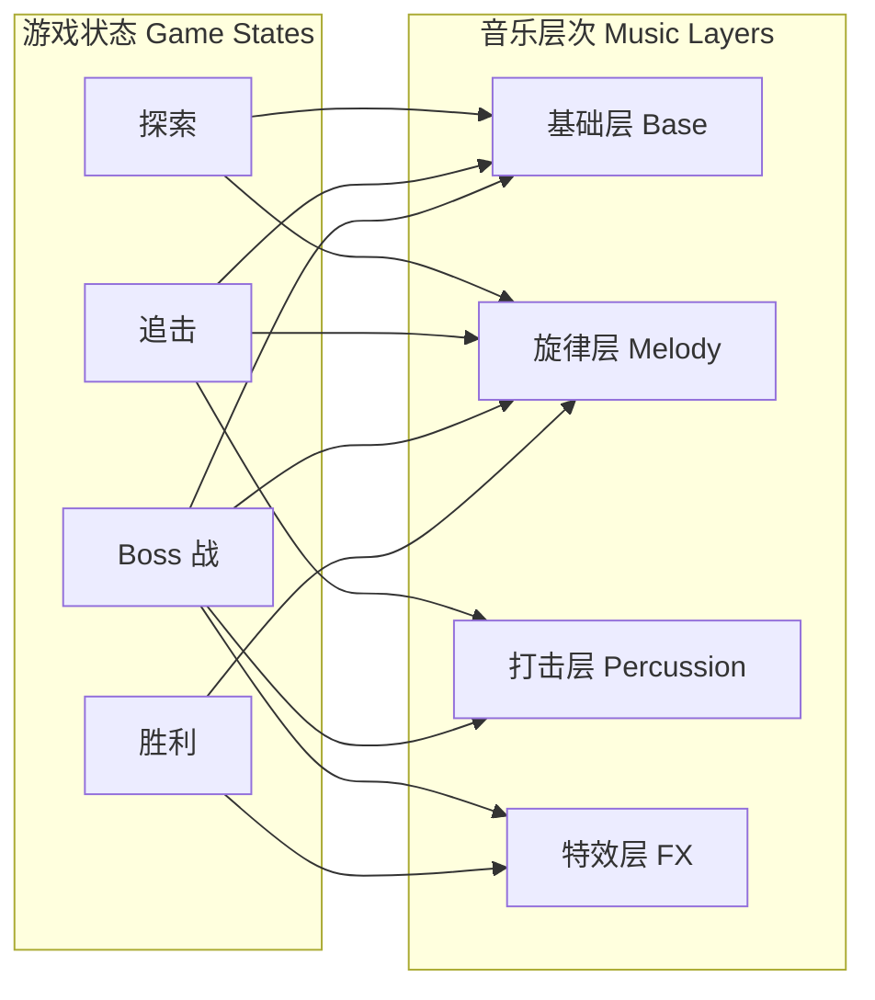

### 2.3 音乐过渡类型表

| 过渡类型 | 过渡时间 | 适用场景 | 效果描述 |
|---------|---------|---------|---------|
| 淡入淡出 | 1.0 秒 | 场景切换 | 平滑过渡 |
| 快速淡入 | 0.3 秒 | Boss 战开始 | 紧急切换 |
| 交叉淡入 | 0.5 秒 | 关卡过渡 | 两首重叠 |
| 即时切换 | 0 秒 | 死亡/重置 | 立即停止 |
| 层次叠加 | 0.5 秒 | 状态变化 | 增加/减少层次 |
| 节拍同步 | 下一小节 | 场景结束 | 节奏对齐 |

### 2.4 音乐风格定义表

| 世界 | 音乐风格 | BPM | 调式 | 主要乐器 | 情感 |
|------|---------|-----|------|---------|------|
| 标题画面 | 欢快芯片音乐 | 140 | C 大调 | 方波、噪声 | 兴奋、期待 |
| 世界 1 | 轻松田园 | 120 | C 大调 | 方波、三角波 | 愉快、轻松 |
| 世界 2 | 神秘洞穴 | 90 | A 小调 | 三角波、噪声 | 紧张、神秘 |
| 世界 3 | 寒冷冰雪 | 100 | D 小调 | 方波、三角波 | 清冷、优雅 |
| 世界 4 | 激烈熔岩 | 150 | E 小调 | 方波、噪声 | 紧迫、激烈 |
| 世界 5 | 空灵天空 | 110 | F 大调 | 三角波、方波 | 自由、开阔 |
| 世界 6 | 黑暗城堡 | 130 | G 小调 | 方波、噪声 | 压迫、决心 |
| Boss 战 | 史诗战斗 | 160 | A 小调 | 全通道 | 紧张、激昂 |
| 通关画面 | 胜利凯歌 | 140 | C 大调 | 全通道 | 喜悦、成就 |

---

## 3. 音效资源清单

### 3.1 玩家音效

#### 移动音效表

| 音效名称 | 文件名 | 时长 | 采样率 | 大小 | 触发条件 | 音量 |
|---------|--------|------|--------|------|---------|------|
| 草地脚步 | sfx_step_grass_01.wav | 0.15s | 44100 | 15 KB | 草地移动 | 0.4 |
| 石头脚步 | sfx_step_stone_01.wav | 0.12s | 44100 | 12 KB | 石头移动 | 0.4 |
| 冰面脚步 | sfx_step_ice_01.wav | 0.10s | 44100 | 10 KB | 冰面移动 | 0.3 |
| 水中脚步 | sfx_step_water_01.wav | 0.20s | 44100 | 20 KB | 水中移动 | 0.3 |
| 沙地脚步 | sfx_step_sand_01.wav | 0.18s | 44100 | 18 KB | 沙地移动 | 0.35 |
| 木板上脚步 | sfx_step_wood_01.wav | 0.12s | 44100 | 12 KB | 木板移动 | 0.4 |

#### 动作音效表

| 音效名称 | 文件名 | 时长 | 采样率 | 大小 | 触发条件 | 音量 |
|---------|--------|------|--------|------|---------|------|
| 跳跃 | sfx_jump_01.wav | 0.25s | 44100 | 25 KB | 起跳 | 0.7 |
| 二段跳 | sfx_double_jump_01.wav | 0.20s | 44100 | 20 KB | 二段跳 | 0.7 |
| 墙跳 | sfx_wall_jump_01.wav | 0.22s | 44100 | 22 KB | 蹬墙跳 | 0.7 |
| 冲刺 | sfx_dash_01.wav | 0.30s | 44100 | 30 KB | 冲刺开始 | 0.8 |
| 地面冲击 | sfx_ground_pound_01.wav | 0.40s | 44100 | 40 KB | 下压开始 | 0.8 |
| 落地冲击 | sfx_land_impact_01.wav | 0.25s | 44100 | 25 KB | 冲击落地 | 0.7 |
| 悬浮开始 | sfx_float_start_01.wav | 0.30s | 44100 | 30 KB | 悬浮激活 | 0.6 |
| 悬浮循环 | sfx_float_loop_01.wav | 1.00s | 44100 | 100 KB | 悬浮中 | 0.4 |

#### 状态音效表

| 音效名称 | 文件名 | 时长 | 采样率 | 大小 | 触发条件 | 音量 |
|---------|--------|------|--------|------|---------|------|
| 受伤 | sfx_hurt_01.wav | 0.35s | 44100 | 35 KB | 受到伤害 | 0.9 |
| 死亡 | sfx_death_01.wav | 0.80s | 44100 | 80 KB | 生命归零 | 1.0 |
| 无敌开始 | sfx_invincible_start_01.wav | 0.50s | 44100 | 50 KB | 获得无敌 | 0.8 |
| 无敌循环 | sfx_invincible_loop_01.wav | 2.00s | 44100 | 200 KB | 无敌状态 | 0.5 |
| 火球开始 | sfx_fire_start_01.wav | 0.30s | 44100 | 30 KB | 获得火球 | 0.7 |
| 火球发射 | sfx_fire_shoot_01.wav | 0.20s | 44100 | 20 KB | 发射火球 | 0.6 |
| 1UP | sfx_1up_01.wav | 0.60s | 44100 | 60 KB | 获得生命 | 0.8 |
| 检查点 | sfx_checkpoint_01.wav | 0.40s | 44100 | 40 KB | 激活检查点 | 0.7 |

### 3.2 敌人音效

#### 敌人行动音效表

| 音效名称 | 文件名 | 时长 | 采样率 | 大小 | 触发条件 | 音量 |
|---------|--------|------|--------|------|---------|------|
| 蘑菇怪脚步 | sfx_goomba_step_01.wav | 0.15s | 44100 | 15 KB | 蘑菇怪移动 | 0.3 |
| 蘑菇怪踩踏 | sfx_goomba_stomp_01.wav | 0.30s | 44100 | 30 KB | 被踩踏 | 0.6 |
| 乌龟缩壳 | sfx_koopa_shell_01.wav | 0.25s | 44100 | 25 KB | 缩入壳中 | 0.5 |
| 龟壳滑动 | sfx_shell_slide_01.wav | 0.50s | 44100 | 50 KB | 龟壳滑动 | 0.4 |
| 蝙蝠翅膀 | sfx_bat_wing_01.wav | 0.20s | 44100 | 20 KB | 蝙蝠飞行 | 0.3 |
| 幽灵出现 | sfx_ghost_appear_01.wav | 0.40s | 44100 | 40 KB | 幽灵出现 | 0.4 |
| 幽灵消失 | sfx_ghost_disappear_01.wav | 0.35s | 44100 | 35 KB | 幽灵消失 | 0.3 |
| 火球怪燃烧 | sfx_fireball_burn_01.wav | 0.30s | 44100 | 30 KB | 火球怪移动 | 0.4 |
| 火球怪爆炸 | sfx_fireball_explode_01.wav | 0.50s | 44100 | 50 KB | 火球怪爆炸 | 0.7 |
| 机械兵脚步 | sfx_robot_step_01.wav | 0.12s | 44100 | 12 KB | 机械兵移动 | 0.35 |
| 暗影怪传送 | sfx_shadow_teleport_01.wav | 0.40s | 44100 | 40 KB | 暗影传送 | 0.5 |

#### 敌人攻击音效表

| 音效名称 | 文件名 | 时长 | 采样率 | 大小 | 触发条件 | 音量 |
|---------|--------|------|--------|------|---------|------|
| 敌人射击 | sfx_enemy_shoot_01.wav | 0.20s | 44100 | 20 KB | 敌人射击 | 0.5 |
| 冰弹发射 | sfx_ice_shoot_01.wav | 0.25s | 44100 | 25 KB | 冰弹发射 | 0.5 |
| 火弹发射 | sfx_fire_shoot_01.wav | 0.22s | 44100 | 22 KB | 火弹发射 | 0.5 |
| 箭矢发射 | sfx_arrow_shoot_01.wav | 0.18s | 44100 | 18 KB | 箭矢发射 | 0.45 |
| Boss 咆哮 | sfx_boss_roar_01.wav | 1.00s | 44100 | 100 KB | Boss 登场 | 0.9 |
| Boss 攻击 | sfx_boss_attack_01.wav | 0.50s | 44100 | 50 KB | Boss 攻击 | 0.8 |
| Boss 受伤 | sfx_boss_hurt_01.wav | 0.40s | 44100 | 40 KB | Boss 受伤 | 0.7 |
| Boss 死亡 | sfx_boss_death_01.wav | 2.00s | 44100 | 200 KB | Boss 死亡 | 1.0 |

### 3.3 道具音效

#### 收集音效表

| 音效名称 | 文件名 | 时长 | 采样率 | 大小 | 触发条件 | 音量 |
|---------|--------|------|--------|------|---------|------|
| 金币收集 | sfx_coin_01.wav | 0.15s | 44100 | 15 KB | 收集金币 | 0.6 |
| 金币连击 | sfx_coin_combo_01.wav | 0.30s | 44100 | 30 KB | 连续收集 | 0.7 |
| 星星收集 | sfx_star_01.wav | 0.50s | 44100 | 50 KB | 收集星星 | 0.8 |
| 钻石收集 | sfx_diamond_01.wav | 0.40s | 44100 | 40 KB | 收集钻石 | 0.7 |
| 蘑菇收集 | sfx_mushroom_01.wav | 0.35s | 44100 | 35 KB | 收集蘑菇 | 0.7 |
| 火球花收集 | sfx_fire_flower_01.wav | 0.45s | 44100 | 45 KB | 收集火球花 | 0.8 |
| 无敌星收集 | sfx_super_star_01.wav | 0.60s | 44100 | 60 KB | 收集无敌星 | 0.9 |
| 1UP 收集 | sfx_1up_collect_01.wav | 0.50s | 44100 | 50 KB | 获得 1UP | 0.8 |

#### 使用音效表

| 音效名称 | 文件名 | 时长 | 采样率 | 大小 | 触发条件 | 音量 |
|---------|--------|------|--------|------|---------|------|
| 药水使用 | sfx_potion_use_01.wav | 0.40s | 44100 | 40 KB | 使用药水 | 0.6 |
| 道具出现 | sfx_item_spawn_01.wav | 0.30s | 44100 | 30 KB | 道具出现 | 0.5 |
| 问号块击打 | sfx_question_block_01.wav | 0.20s | 44100 | 20 KB | 顶击问号块 | 0.6 |
| 砖块破碎 | sfx_brick_break_01.wav | 0.35s | 44100 | 35 KB | 砖块破碎 | 0.6 |
| 开关触发 | sfx_switch_01.wav | 0.15s | 44100 | 15 KB | 触发开关 | 0.5 |
| 门开启 | sfx_door_open_01.wav | 0.50s | 44100 | 50 KB | 门打开 | 0.6 |
| 弹簧跳 | sfx_spring_01.wav | 0.25s | 44100 | 25 KB | 踩弹簧 | 0.7 |

### 3.4 环境音效

#### 世界 1 环境音表

| 音效名称 | 文件名 | 时长 | 循环 | 大小 | 描述 | 音量 |
|---------|--------|------|------|------|------|------|
| 草地风声 | amb_grass_wind_01.wav | 5.00s | 是 | 500 KB | 轻柔风声 | 0.2 |
| 鸟鸣 | amb_bird_chirp_01.wav | 2.00s | 是 | 200 KB | 远处鸟鸣 | 0.15 |
| 溪流 | amb_stream_01.wav | 10.00s | 是 | 1000 KB | 溪流水声 | 0.25 |
| 树叶沙沙 | amb_leaves_01.wav | 3.00s | 是 | 300 KB | 树叶声 | 0.15 |

#### 世界 2 环境音表

| 音效名称 | 文件名 | 时长 | 循环 | 大小 | 描述 | 音量 |
|---------|--------|------|------|------|------|------|
| 洞穴回声 | amb_cave_echo_01.wav | 8.00s | 是 | 800 KB | 洞穴回声 | 0.2 |
| 水滴 | amb_water_drip_01.wav | 4.00s | 是 | 400 KB | 水滴声 | 0.3 |
| 地下河 | amb_underground_river_01.wav | 10.00s | 是 | 1000 KB | 地下河声 | 0.25 |
| 蝙蝠叫声 | amb_bat_call_01.wav | 2.00s | 是 | 200 KB | 远处蝙蝠 | 0.15 |

#### 世界 3 环境音表

| 音效名称 | 文件名 | 时长 | 循环 | 大小 | 描述 | 音量 |
|---------|--------|------|------|------|------|------|
| 暴风雪 | amb_blizzard_01.wav | 8.00s | 是 | 800 KB | 风雪声 | 0.3 |
| 冰裂 | amb_ice_crack_01.wav | 3.00s | 是 | 300 KB | 冰面裂声 | 0.2 |
| 寒风 | amb_cold_wind_01.wav | 6.00s | 是 | 600 KB | 刺骨寒风 | 0.25 |
| 雪落 | amb_snow_fall_01.wav | 5.00s | 是 | 500 KB | 轻柔雪声 | 0.15 |

#### 世界 4 环境音表

| 音效名称 | 文件名 | 时长 | 循环 | 大小 | 描述 | 音量 |
|---------|--------|------|------|------|------|------|
| 岩浆冒泡 | amb_lava_bubble_01.wav | 6.00s | 是 | 600 KB | 岩浆声 | 0.35 |
| 火焰燃烧 | amb_fire_burn_01.wav | 5.00s | 是 | 500 KB | 火焰声 | 0.3 |
| 岩石碎裂 | amb_rock_crumble_01.wav | 3.00s | 是 | 300 KB | 岩石声 | 0.2 |
| 热浪 | amb_heat_wave_01.wav | 4.00s | 是 | 400 KB | 热浪声 | 0.2 |

#### 世界 5 环境音表

| 音效名称 | 文件名 | 时长 | 循环 | 大小 | 描述 | 音量 |
|---------|--------|------|------|------|------|------|
| 高空风声 | amb_sky_wind_01.wav | 8.00s | 是 | 800 KB | 高空风声 | 0.25 |
| 雷声 | amb_thunder_01.wav | 3.00s | 是 | 300 KB | 远处雷声 | 0.2 |
| 风铃 | amb_wind_chime_01.wav | 4.00s | 是 | 400 KB | 风铃声 | 0.15 |
| 鹰叫 | amb_eagle_call_01.wav | 2.00s | 是 | 200 KB | 远处鹰叫 | 0.1 |

#### 世界 6 环境音表

| 音效名称 | 文件名 | 时长 | 循环 | 大小 | 描述 | 音量 |
|---------|--------|------|------|------|------|------|
| 城堡风声 | amb_castle_wind_01.wav | 6.00s | 是 | 600 KB | 城堡风声 | 0.2 |
| 火把噼啪 | amb_torch_crackle_01.wav | 4.00s | 是 | 400 KB | 火把声 | 0.25 |
| 锁链摇晃 | amb_chain_rattle_01.wav | 3.00s | 是 | 300 KB | 锁链声 | 0.2 |
| 黑暗低语 | amb_dark_whisper_01.wav | 5.00s | 是 | 500 KB | 黑暗低语 | 0.15 |

### 3.5 UI 音效

#### 菜单音效表

| 音效名称 | 文件名 | 时长 | 采样率 | 大小 | 触发条件 | 音量 |
|---------|--------|------|--------|------|---------|------|
| 菜单选择 | sfx_ui_select_01.wav | 0.10s | 44100 | 10 KB | 菜单选择 | 0.5 |
| 菜单确认 | sfx_ui_confirm_01.wav | 0.15s | 44100 | 15 KB | 确认操作 | 0.6 |
| 菜单取消 | sfx_ui_cancel_01.wav | 0.12s | 44100 | 12 KB | 取消操作 | 0.5 |
| 菜单移动 | sfx_ui_move_01.wav | 0.08s | 44100 | 8 KB | 光标移动 | 0.4 |
| 菜单打开 | sfx_ui_open_01.wav | 0.20s | 44100 | 20 KB | 打开菜单 | 0.5 |
| 菜单关闭 | sfx_ui_close_01.wav | 0.15s | 44100 | 15 KB | 关闭菜单 | 0.5 |
| 音量调节 | sfx_ui_volume_01.wav | 0.10s | 44100 | 10 KB | 调节音量 | 0.4 |
| 成就解锁 | sfx_achievement_01.wav | 0.80s | 44100 | 80 KB | 解锁成就 | 0.8 |
| 存档保存 | sfx_save_01.wav | 0.30s | 44100 | 30 KB | 保存存档 | 0.5 |

---

## 4. 音频状态机

### 4.1 BGM 状态机

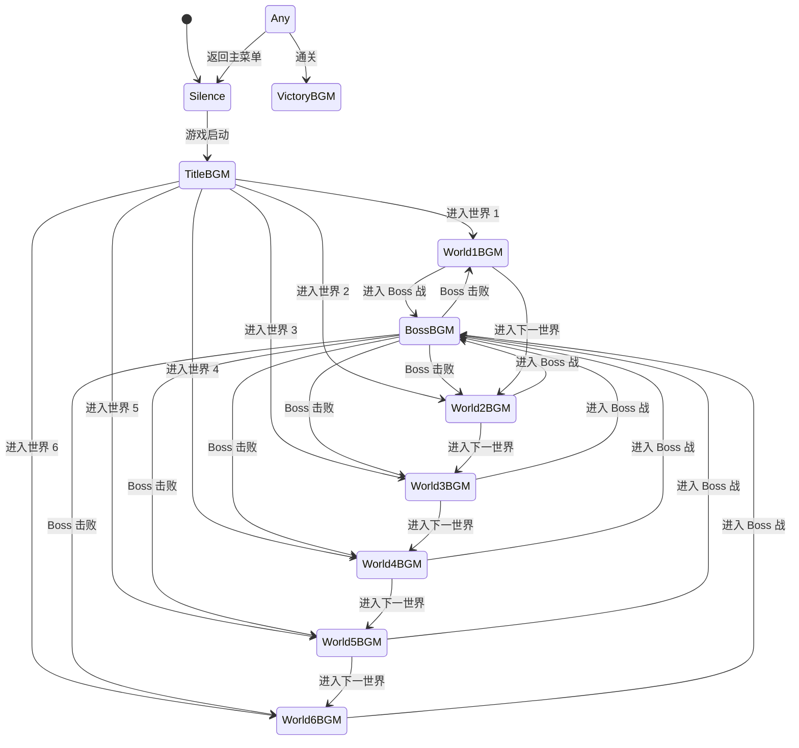

### 4.2 音效播放状态机

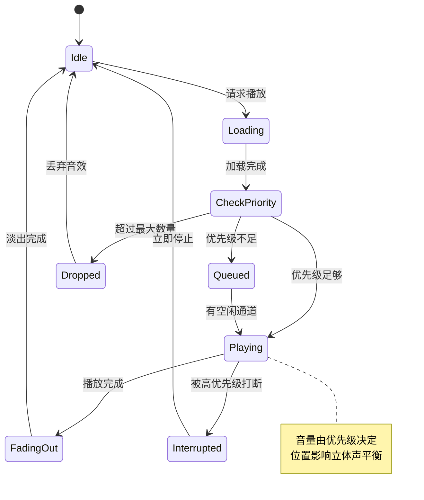

### 4.3 环境音混合状态机

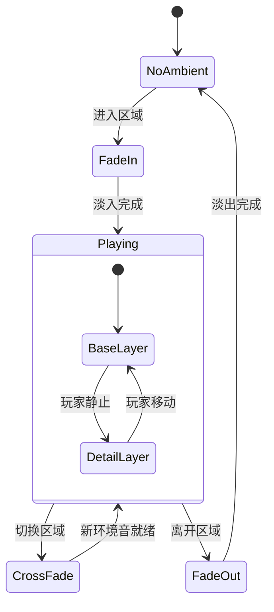

### 4.4 音频通道分配表

| 通道编号 | 类型 | 用途 | 最大实例 | 优先级范围 |
|---------|------|------|---------|-----------|
| 0 | BGM | 背景音乐 | 1 | 最高 |
| 1-2 | BGM_Layer | 音乐层次 | 2 | 高 |
| 3-4 | Ambient | 环境音 | 2 | 低 |
| 5-8 | SFX_Player | 玩家音效 | 4 | 高 |
| 9-12 | SFX_Enemy | 敌人音效 | 4 | 中 |
| 13-16 | SFX_Item | 道具音效 | 4 | 中 |
| 17-20 | SFX_Env | 环境音效 | 4 | 低 |
| 21-24 | SFX_UI | UI 音效 | 4 | 中 |

---

## 5. 音频技术参数

### 5.1 音频格式规格表

| 类型 | 格式 | 采样率 | 位深度 | 声道 | 比特率 | 适用场景 |
|------|------|--------|--------|------|--------|---------|
| 短音效 | WAV | 44100 Hz | 16 bit | 单声道 | 706 kbps | < 1 秒音效 |
| 中等音效 | WAV | 44100 Hz | 16 bit | 立体声 | 1411 kbps | 1-3 秒音效 |
| 长音效 | OGG | 44100 Hz | 16 bit | 立体声 | 128 kbps | > 3 秒音效 |
| BGM | OGG | 44100 Hz | 16 bit | 立体声 | 192 kbps | 背景音乐 |
| 环境音 | OGG | 22050 Hz | 16 bit | 单声道 | 64 kbps | 环境氛围 |

### 5.2 音量参数表

| 参数 | 默认值 | 最小值 | 最大值 | 步进 | 说明 |
|------|--------|--------|--------|------|------|
| 主音量 | 1.0 | 0.0 | 1.0 | 0.05 | 全局音量 |
| BGM 音量 | 0.8 | 0.0 | 1.0 | 0.05 | 背景音乐 |
| SFX 音量 | 1.0 | 0.0 | 1.0 | 0.05 | 所有音效 |
| 环境音量 | 0.5 | 0.0 | 1.0 | 0.05 | 环境音 |
| UI 音量 | 0.7 | 0.0 | 1.0 | 0.05 | UI 音效 |
| 淡入时间 | 1.0s | 0.1s | 3.0s | 0.1s | BGM 淡入 |
| 淡出时间 | 1.0s | 0.1s | 3.0s | 0.1s | BGM 淡出 |
| 空间音效距离 | 320px | 100px | 1000px | 10px | 立体声距离 |

### 5.3 空间音频参数表

| 参数 | 数值 | 说明 |
|------|------|------|
| 最大监听距离 | 320 像素 | 超过此距离音量为 0 |
| 最小监听距离 | 32 像素 | 此距离内音量为最大 |
| 衰减曲线 | 线性 | 音量随距离线性衰减 |
| 立体声平衡 | 基于 X 坐标 | 左侧声道左，右侧声道右 |
| 多普勒效果 | 关闭 | 像素风格不需要 |

### 5.4 音频资源统计

#### 资源数量统计表

| 类别 | 数量 | 总时长 | 总大小 | 平均大小 |
|------|------|--------|--------|---------|
| BGM | 25 首 | ~75 分钟 | ~15 MB | ~600 KB |
| 玩家音效 | 25 个 | ~8 秒 | ~800 KB | ~32 KB |
| 敌人音效 | 20 个 | ~7 秒 | ~700 KB | ~35 KB |
| 道具音效 | 15 个 | ~5 秒 | ~500 KB | ~33 KB |
| 环境音效 | 24 个 | ~120 秒 | ~12 MB | ~500 KB |
| UI 音效 | 12 个 | ~2 秒 | ~200 KB | ~17 KB |
| **总计** | **121** | **~215 秒** | **~29 MB** | **~240 KB** |

---

## 6. 音乐曲目详细设计

### 6.1 标题画面音乐

#### 标题音乐详细参数表

| 段落 | 时间 | 小节数 | 和弦进行 | 旋律特点 | 乐器配置 |
|------|------|--------|---------|---------|---------|
| 前奏 | 0:00-0:08 | 4 | C-Am-F-G | 上行音阶 | 方波 + 噪声 |
| 主旋律 A | 0:08-0:24 | 8 | C-G-Am-F | 欢快跳跃 | 方波 + 三角波 |
| 过渡 | 0:24-0:32 | 4 | F-G-C-Am | 下行过渡 | 方波 |
| 主旋律 B | 0:32-0:48 | 8 | Am-F-C-G | 变化重复 | 方波 + 三角波 |
| 副歌 | 0:48-1:12 | 12 | C-Am-F-G-C | 高潮旋律 | 全通道 |
| 间奏 | 1:12-1:20 | 4 | F-G-C | 短暂休息 | 三角波 |

### 6.2 世界 1 音乐 - 绿野草原

#### 曲目结构图

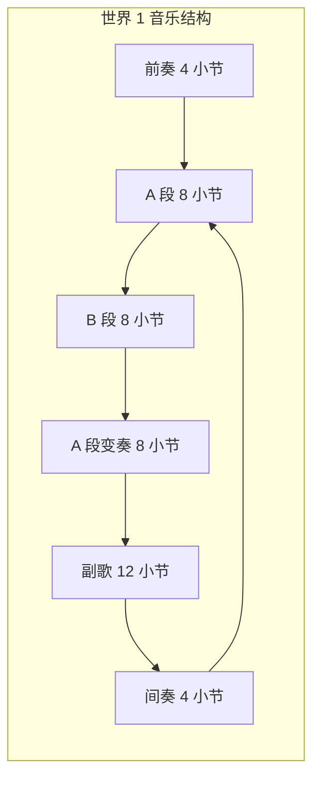

#### 世界 1 音乐参数表

| 参数 | 数值 | 说明 |
|------|------|------|
| BPM | 120 | 中等速度 |
| 调式 | C 大调 | 明亮欢快 |
| 拍号 | 4/4 | 标准拍号 |
| 总时长 | 1:45 | 循环长度 |
| 主旋律乐器 | 方波 | 8-bit 风格 |
| 和声乐器 | 三角波 | 低音伴奏 |
| 打击乐器 | 噪声通道 | 鼓点节奏 |
| 情感关键词 | 愉快、轻松、冒险 | 设计方向 |

### 6.3 Boss 战音乐结构

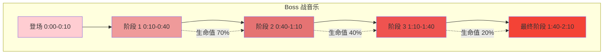

#### Boss 音乐阶段参数表

| 阶段 | 时间 | BPM | 调式 | 乐器增加 | 紧张度 |
|------|------|-----|------|---------|--------|
| 登场 | 0:00-0:10 | 140 | A 小调 | 方波 + 噪声 | ★★★☆☆ |
| 阶段 1 | 0:10-0:40 | 150 | A 小调 | + 三角波 | ★★★☆☆ |
| 阶段 2 | 0:40-1:10 | 160 | A 小调 | + 和声层 | ★★★★☆ |
| 阶段 3 | 1:10-1:40 | 170 | A 小调 | + 打击层 | ★★★★★ |
| 最终阶段 | 1:40-2:10 | 180 | A 小调 | 全通道 | ★★★★★ |

### 6.4 完整曲目列表

| 编号 | 曲目名称 | 时长 | BPM | 调式 | 循环 | 触发条件 |
|------|---------|------|-----|------|------|---------|
| BGM-01 | 标题画面 | 1:20 | 140 | C 大调 | 是 | 主菜单 |
| BGM-02 | 绿野草原 | 1:45 | 120 | C 大调 | 是 | 世界 1 |
| BGM-03 | 地下洞穴 | 2:00 | 90 | A 小调 | 是 | 世界 2 |
| BGM-04 | 冰雪山脉 | 1:50 | 100 | D 小调 | 是 | 世界 3 |
| BGM-05 | 熔岩地狱 | 1:30 | 150 | E 小调 | 是 | 世界 4 |
| BGM-06 | 天空之城 | 1:55 | 110 | F 大调 | 是 | 世界 5 |
| BGM-07 | 黑暗城堡 | 1:40 | 130 | G 小调 | 是 | 世界 6 |
| BGM-08 | Boss 战 | 2:10 | 160 | A 小调 | 是 | Boss 战 |
| BGM-09 | 最终 Boss | 3:00 | 170 | G 小调 | 是 | 最终 Boss |
| BGM-10 | 通关画面 | 1:30 | 140 | C 大调 | 否 | 通关 |
| BGM-11 | 游戏结束 | 0:30 | 80 | C 小调 | 否 | Game Over |
| BGM-12 | 隐藏关卡 | 2:00 | 140 | D 小调 | 是 | 隐藏关卡 |
| BGM-13 | 奖励关卡 | 1:45 | 160 | F 大调 | 是 | 奖励关卡 |
| BGM-14 | 商店 | 1:30 | 100 | G 大调 | 是 | 商店界面 |
| BGM-15 | 排行榜 | 1:00 | 120 | C 大调 | 是 | 排行榜 |

---

## 附录

### 音效命名规范

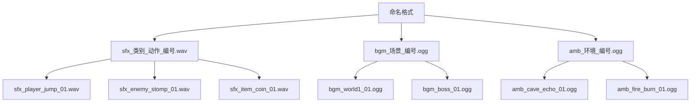

### 音频制作工具推荐表

| 工具 | 用途 | 平台 | 价格 | 推荐度 |
|------|------|------|------|--------|
| Famitracker | 芯片音乐制作 | Windows | 免费 | ★★★★★ |
| Bfxr | 8-bit 音效生成 | 全平台 | 免费 | ★★★★★ |
| Audacity | 音频编辑 | 全平台 | 免费 | ★★★★☆ |
| FL Studio | 音乐制作 | 全平台 | 付费 | ★★★★☆ |
| Ableton Live | 音乐制作 | 全平台 | 付费 | ★★★★☆ |
| sfxr/jsfxr | 复古音效生成 | 全平台 | 免费 | ★★★★★ |

---

**文档结束**
