# 技术设计文档 - 像素冒险

**最后更新**: 2026-07-31  
**状态**: 初稿

---

## 目录

1. [系统架构](#1-系统架构)
2. [核心系统设计](#2-核心系统设计)
3. [数据结构设计](#3-数据结构设计)
4. [性能优化](#4-性能优化)
5. [平台适配](#5-平台适配)
6. [技术规格表](#6-技术规格表)

---

## 1. 系统架构

### 1.1 整体架构图

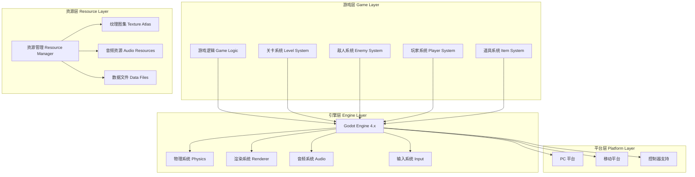

### 1.2 模块依赖关系图

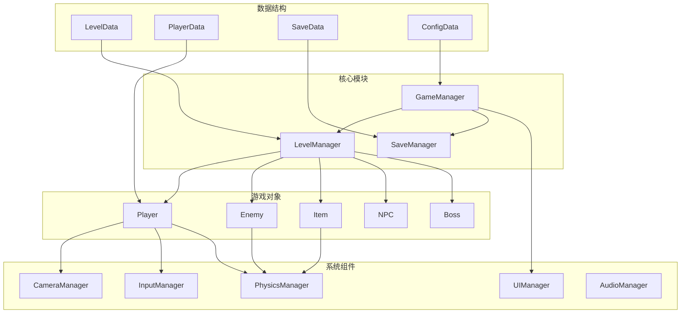

### 1.3 场景层级结构

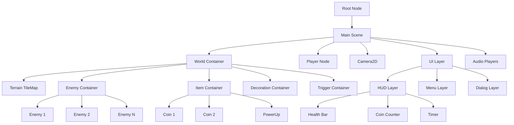

---

## 2. 核心系统设计

### 2.1 玩家控制器状态机

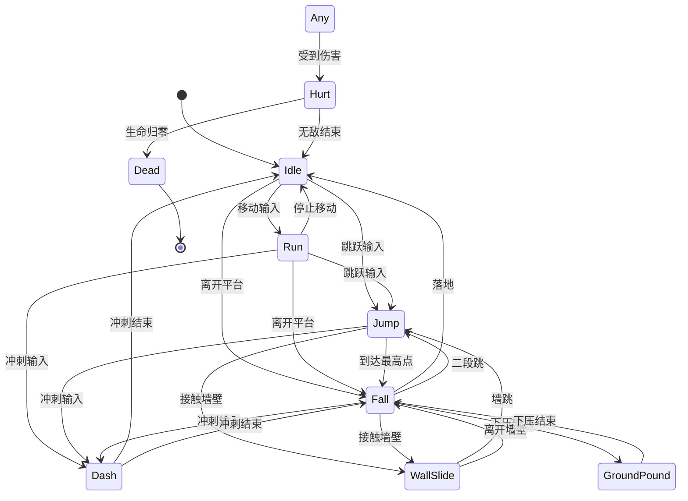

### 2.2 敌人 AI 状态机

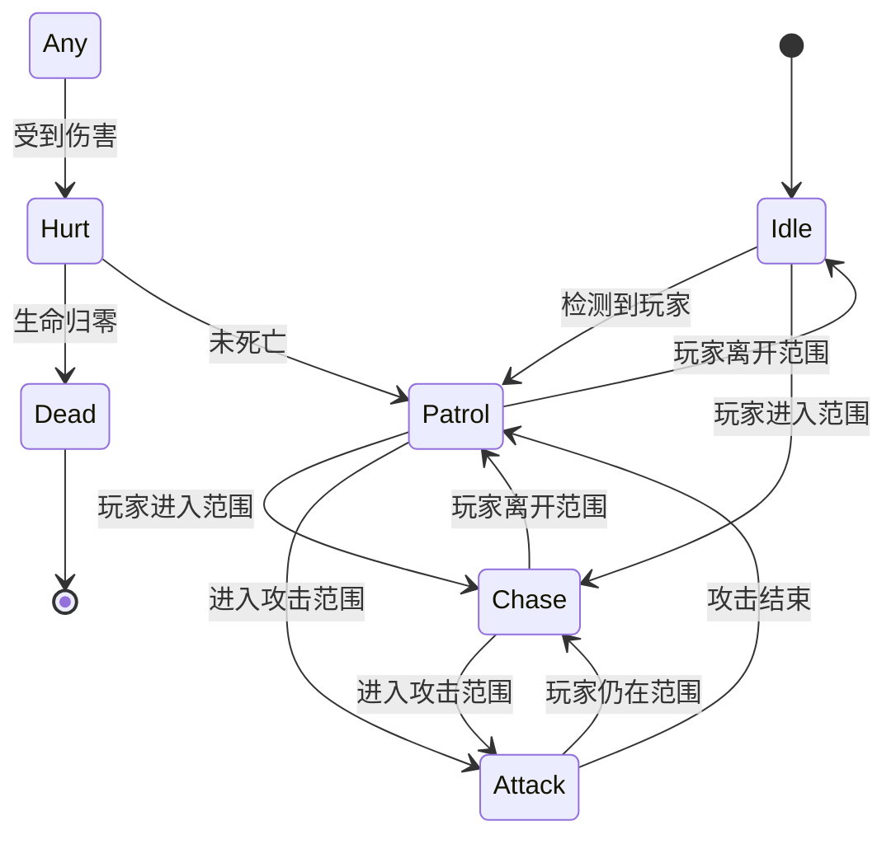

### 2.3 物理系统架构图

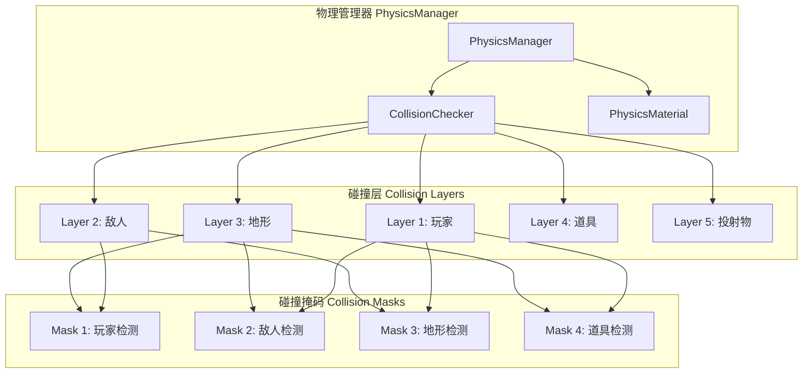

### 2.4 碰撞检测矩阵

| 对象 A | 对象 B | 碰撞类型 | 响应动作 | 优先级 |
|--------|--------|---------|---------|--------|
| 玩家 | 地形 | 物理碰撞 | 停止移动/跳跃 | 高 |
| 玩家 | 敌人 | Area2D | 受伤/踩踏 | 高 |
| 玩家 | 道具 | Area2D | 收集道具 | 中 |
| 玩家 | 投射物 | Area2D | 受伤 | 高 |
| 敌人 | 地形 | 物理碰撞 | 转向/停止 | 中 |
| 敌人 | 玩家 | Area2D | 攻击/受伤 | 高 |
| 敌人 | 投射物 | Area2D | 受伤 | 中 |
| 道具 | 地形 | 物理碰撞 | 停止移动 | 低 |
| 投射物 | 地形 | Area2D | 销毁/反弹 | 中 |
| 投射物 | 敌人 | Area2D | 造成伤害 | 高 |

### 2.5 输入系统流程图

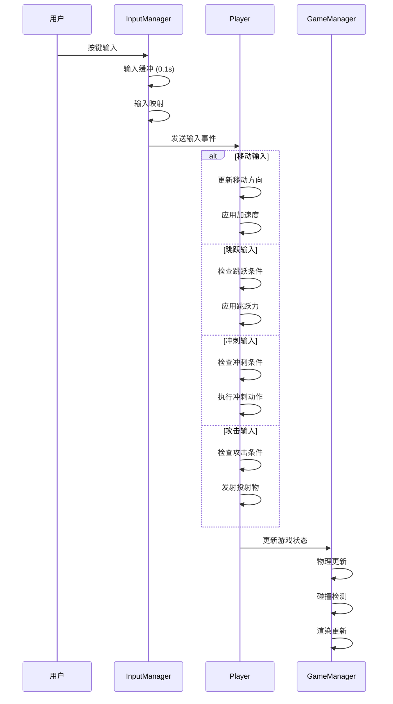

### 2.6 输入映射配置表

| 动作名称 | 键盘按键 | 手柄按键 | 触屏控件 | 优先级 |
|---------|---------|---------|---------|--------|
| move_left | A, ← | 左摇杆左 | 左按钮 | 高 |
| move_right | D, → | 左摇杆右 | 右按钮 | 高 |
| jump | Space, W | A 键 | 跳跃按钮 | 高 |
| dash | Shift | B 键 | 冲刺按钮 | 中 |
| attack | J | X 键 | 攻击按钮 | 中 |
| interact | E | Y 键 | 互动按钮 | 低 |
| pause | Esc | Start | 暂停按钮 | 高 |
| menu | Tab | Select | 菜单按钮 | 低 |

---

## 3. 数据结构设计

### 3.1 类图 - 游戏对象

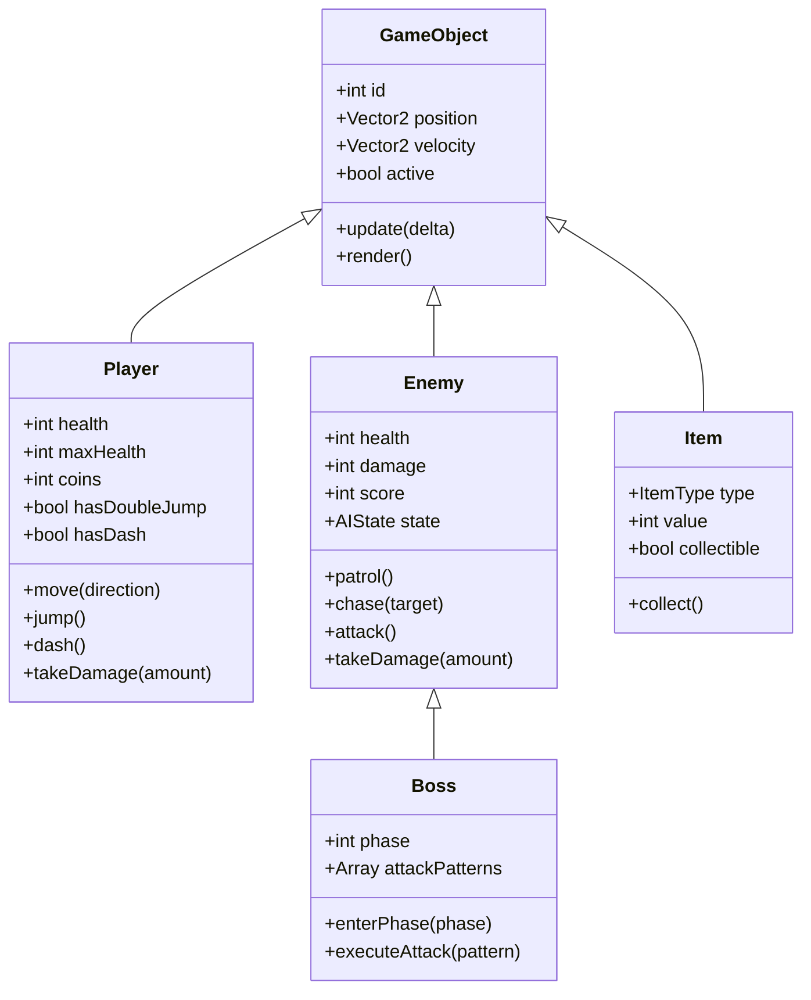

### 3.2 类图 - 管理系统

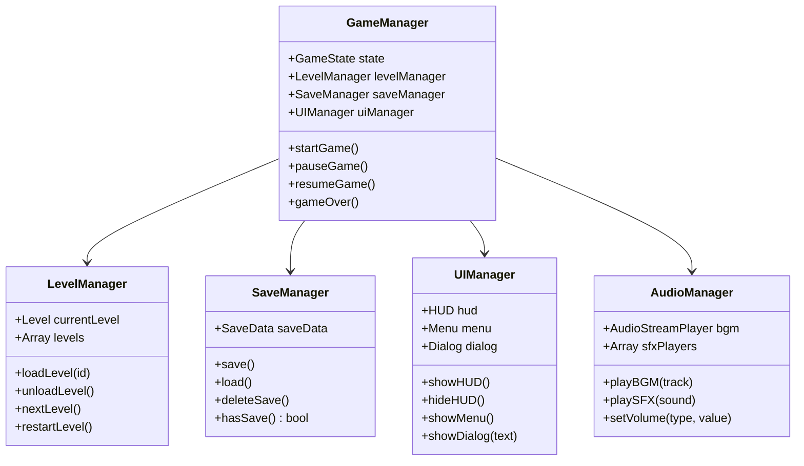

### 3.3 数据结构 - 关卡数据

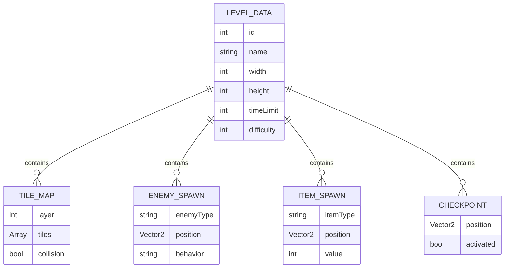

### 3.4 存档数据结构表

| 字段名 | 类型 | 大小 | 说明 | 默认值 |
|--------|------|------|------|--------|
| player_name | String | 16 | 玩家名称 | "Player" |
| current_world | int | 1 | 当前世界 | 1 |
| current_level | int | 1 | 当前关卡 | 1 |
| health | int | 1 | 当前生命 | 3 |
| max_health | int | 1 | 最大生命 | 3 |
| coins | int | 4 | 金币总数 | 0 |
| stars | int | 2 | 星星总数 | 0 |
| lives | int | 1 | 剩余生命 | 3 |
| unlocked_worlds | int | 1 | 解锁世界数 | 1 |
| completed_levels | Array | 72 | 完成关卡列表 | [] |
| unlocked_abilities | Array | 5 | 解锁能力列表 | [] |
| achievements | Array | 50 | 解锁成就列表 | [] |
| play_time | int | 4 | 游戏时间 (秒) | 0 |
| total_score | int | 4 | 总分数 | 0 |

### 3.5 配置文件结构表

| 配置项 | 类型 | 默认值 | 范围 | 说明 |
|--------|------|--------|------|------|
| graphics.resolution | Vector2 | 1920x1080 | - | 屏幕分辨率 |
| graphics.fullscreen | bool | false | - | 全屏模式 |
| graphics.vsync | bool | true | - | 垂直同步 |
| graphics.pixel_perfect | bool | true | - | 像素完美渲染 |
| audio.master_volume | float | 1.0 | 0.0-1.0 | 主音量 |
| audio.bgm_volume | float | 0.8 | 0.0-1.0 | 背景音乐音量 |
| audio.sfx_volume | float | 1.0 | 0.0-1.0 | 音效音量 |
| controls.keyboard_layout | String | "default" | - | 键盘布局 |
| controls.controller_enabled | bool | true | - | 控制器支持 |
| controls.vibration | bool | true | - | 震动反馈 |
| gameplay.difficulty | String | "normal" | easy/normal/hard | 游戏难度 |
| gameplay.language | String | "zh_CN" | - | 游戏语言 |
| gameplay.auto_save | bool | true | - | 自动存档 |

---

## 4. 性能优化

### 4.1 渲染优化策略

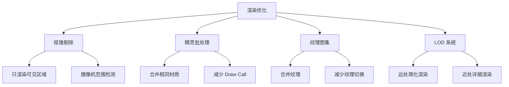

### 4.2 内存管理策略

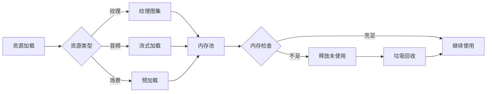

### 4.3 性能指标表

| 指标 | PC 目标 | 移动端目标 | 最低要求 | 测量方法 |
|------|---------|-----------|---------|---------|
| 帧率 | 60 FPS | 30 FPS | 24 FPS | FPS 计数器 |
| 帧时间 | 16.6 ms | 33.3 ms | 41.6 ms | 性能分析器 |
| 内存占用 | < 500 MB | < 300 MB | < 200 MB | 内存监控 |
| 加载时间 | < 3 秒 | < 5 秒 | < 10 秒 | 计时器 |
| Draw Call | < 50 | < 30 | < 100 | 渲染统计 |
| CPU 使用率 | < 30% | < 50% | < 80% | 系统监控 |
| GPU 使用率 | < 40% | < 60% | < 90% | 系统监控 |
| 存档大小 | < 10 MB | < 10 MB | < 10 MB | 文件系统 |

### 4.4 优化技术清单

| 优化类型 | 技术 | 效果 | 优先级 | 实现难度 |
|---------|------|------|--------|---------|
| 渲染优化 | 纹理图集 | 减少 50% Draw Call | 高 | 中 |
| 渲染优化 | 视锥剔除 | 减少 30% 渲染量 | 高 | 低 |
| 渲染优化 | 精灵批处理 | 减少 40% Draw Call | 高 | 中 |
| 内存优化 | 对象池 | 减少 60% GC | 高 | 中 |
| 内存优化 | 资源预加载 | 消除加载卡顿 | 中 | 低 |
| 内存优化 | 流式加载 | 降低内存峰值 | 中 | 高 |
| CPU 优化 | 物理简化 | 减少 40% 物理计算 | 中 | 低 |
| CPU 优化 | AI 分帧 | 减少 30% AI 计算 | 中 | 中 |
| CPU 优化 | 碰撞简化 | 减少 50% 碰撞检测 | 高 | 低 |
| 音频优化 | 音频压缩 | 减少 70% 音频大小 | 低 | 低 |
| 音频优化 | 流式播放 | 降低内存占用 | 中 | 低 |

---

## 5. 平台适配

### 5.1 平台特性对比表

| 特性 | PC (Windows) | PC (Linux) | PC (Mac) | iOS | Android |
|------|--------------|------------|----------|-----|---------|
| 分辨率 | 1920x1080+ | 1920x1080+ | 1920x1080+ | 可变 | 可变 |
| 帧率 | 60 FPS | 60 FPS | 60 FPS | 30/60 FPS | 30/60 FPS |
| 输入方式 | 键鼠/手柄 | 键鼠/手柄 | 键鼠/手柄 | 触屏/手柄 | 触屏/手柄 |
| 存储 | 文件系统 | 文件系统 | 文件系统 | 沙盒 | 沙盒 |
| 音频格式 | WAV/OGG | WAV/OGG | WAV/OGG | CAF/OGG | WAV/OGG |
| 存档位置 | AppData | ~/.config | Library | Documents | Files |
| 控制器 | XInput/DInput | SDL | GCController | MFi | 标准控制器 |

### 5.2 分辨率适配表

| 设备类型 | 分辨率 | 缩放比例 | UI 缩放 | 安全区域 |
|---------|--------|---------|---------|---------|
| PC 1080p | 1920x1080 | 6x | 1.0 | 无 |
| PC 1440p | 2560x1440 | 8x | 1.0 | 无 |
| PC 4K | 3840x2160 | 12x | 1.5 | 无 |
| iPad | 2048x1536 | 6.4x | 1.2 | 有 |
| iPhone | 1920x1080 | 6x | 1.0 | 有 |
| Android 1080p | 1920x1080 | 6x | 1.0 | 有 |
| Android 720p | 1280x720 | 4x | 0.8 | 有 |

### 5.3 触屏控件布局图

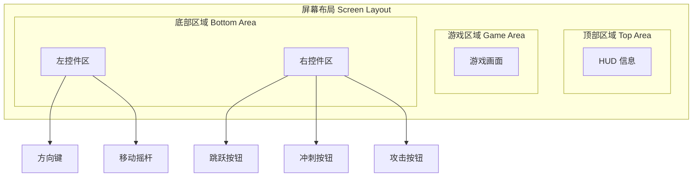

### 5.4 触屏控件尺寸表

| 控件名称 | 尺寸 | 位置 | 透明度 | 反馈效果 |
|---------|------|------|--------|---------|
| 移动摇杆 | 120x120 | 左下 | 50% | 触觉反馈 |
| 跳跃按钮 | 80x80 | 右下 | 50% | 触觉反馈 |
| 冲刺按钮 | 60x60 | 右侧 | 50% | 触觉反馈 |
| 攻击按钮 | 60x60 | 右上 | 50% | 触觉反馈 |
| 暂停按钮 | 40x40 | 右上 | 30% | 无 |

---

## 6. 技术规格表

### 6.1 引擎规格表

| 规格项 | 数值 | 说明 |
|--------|------|------|
| 引擎版本 | Godot 4.x | 最新稳定版 |
| 编程语言 | GDScript / C# | 主要语言 |
| 物理引擎 | Godot Physics | 内置物理 |
| 渲染后端 | Vulkan / OpenGL | 可配置 |
| 音频引擎 | Godot Audio | 内置音频 |
| 最大精灵数 | 1000+ | 同屏显示 |
| 最大图块数 | 5000+ | 单关卡 |
| 物理更新频率 | 60 Hz | 固定频率 |
| 脚本更新频率 | 60 Hz | 每帧更新 |

### 6.2 资源规格表

| 资源类型 | 格式 | 最大尺寸 | 压缩方式 | 加载方式 |
|---------|------|---------|---------|---------|
| 精灵图 | PNG | 32x32 | 无损 | 预加载 |
| 纹理图集 | PNG | 2048x2048 | 无损 | 预加载 |
| 背景音乐 | OGG | 10 MB | 有损 | 流式 |
| 音效 | WAV | 1 MB | 无损 | 预加载 |
| 关卡数据 | JSON | 100 KB | 无 | 预加载 |
| 存档数据 | JSON | 10 KB | 无 | 即时 |
| 配置文件 | INI | 5 KB | 无 | 启动时 |

### 6.3 物理参数表

| 参数名称 | 数值 | 单位 | 说明 |
|---------|------|------|------|
| 重力 | 1200 | 像素/秒² | 全局重力 |
| 玩家最大速度 | 150 | 像素/秒 | 水平移动 |
| 玩家加速度 | 800 | 像素/秒² | 地面加速 |
| 玩家减速度 | 1200 | 像素/秒² | 地面减速 |
| 玩家跳跃力 | -400 | 像素/秒 | 初始跳跃 |
| 玩家二段跳力 | -350 | 像素/秒 | 二段跳跃 |
| 最大下落速度 | 600 | 像素/秒 | 终端速度 |
| 墙壁滑落速度 | 100 | 像素/秒 | 墙壁下滑 |
| 冲刺距离 | 64 | 像素 | 冲刺位移 |
| 冲刺时间 | 0.15 | 秒 | 冲刺持续 |
| 无敌时间 | 2.0 | 秒 | 受伤后 |
| 地面摩擦 | 0.8 | 系数 | 普通地面 |
| 冰面摩擦 | 0.95 | 系数 | 冰面滑行 |
| 沙滩摩擦 | 0.6 | 系数 | 沙滩减速 |

### 6.4 摄像机参数表

| 参数名称 | 数值 | 单位 | 说明 |
|---------|------|------|------|
| 跟随速度 X | 5.0 | 系数 | 水平跟随 |
| 跟随速度 Y | 3.0 | 系数 | 垂直跟随 |
| 前瞻距离 | 50 | 像素 | 移动方向 |
| 最小缩放 | 0.5 | 系数 | 缩小极限 |
| 最大缩放 | 2.0 | 系数 | 放大极限 |
| 默认缩放 | 1.0 | 系数 | 标准缩放 |
| 缩放平滑 | 0.5 | 秒 | 缩放过渡 |
| 边界限制 | true | 布尔 | 关卡边界 |
| 震动强度 | 5 | 像素 | 屏幕震动 |
| 震动时间 | 0.3 | 秒 | 震动持续 |

### 6.5 音频参数表

| 参数名称 | 数值 | 单位 | 说明 |
|---------|------|------|------|
| 主音量 | 1.0 | 系数 | 0.0-1.0 |
| BGM 音量 | 0.8 | 系数 | 0.0-1.0 |
| SFX 音量 | 1.0 | 系数 | 0.0-1.0 |
| BGM 淡入 | 1.0 | 秒 | 淡入时间 |
| BGM 淡出 | 1.0 | 秒 | 淡出时间 |
| SFX 最大同时数 | 8 | 个 | 同时播放 |
| 音频采样率 | 44100 | Hz | 标准采样 |
| 音频位深度 | 16 | bit | 标准位深 |
| 音频声道数 | 2 | 声道 | 立体声 |

### 6.6 存档系统规格表

| 规格项 | 数值 | 说明 |
|--------|------|------|
| 存档槽位 | 3 | 支持 3 个存档 |
| 自动存档 | 是 | 检查点自动保存 |
| 存档格式 | JSON | 可读格式 |
| 存档加密 | 否 | 简单存储 |
| 存档大小 | < 10 KB | 单个存档 |
| 存档位置 | 平台相关 | 见平台适配 |
| 云同步 | 否 | 本地存档 |
| 备份存档 | 是 | 自动备份 |

---

## 附录

### A. 技术风险评估表

| 风险项 | 可能性 | 影响 | 风险等级 | 缓解措施 |
|--------|--------|------|---------|---------|
| 性能不足 | 中 | 高 | 高 | 性能优化、降级方案 |
| 兼容性问题 | 中 | 中 | 中 | 充分测试、适配层 |
| 存档丢失 | 低 | 高 | 中 | 自动备份、云同步 |
| 内存泄漏 | 中 | 高 | 高 | 内存监控、对象池 |
| 输入延迟 | 低 | 中 | 低 | 输入缓冲、优化 |
| 音频不同步 | 低 | 低 | 低 | 音频预加载 |

### B. 开发工具链表

| 工具 | 用途 | 版本 | 必要性 |
|------|------|------|--------|
| Godot Engine | 游戏引擎 | 4.x | 必需 |
| VS Code | 代码编辑 | 最新 | 推荐 |
| Aseprite | 像素画 | 最新 | 推荐 |
| Audacity | 音频编辑 | 最新 | 可选 |
| Git | 版本控制 | 最新 | 必需 |
| Godot Debugger | 调试工具 | 内置 | 必需 |

### C. 版本历史表

| 版本 | 日期 | 变更内容 | 负责人 |
|------|------|---------|--------|
| 1.0.0 | 2026-07-31 | 初始版本 | 技术团队 |

---

**文档结束**
