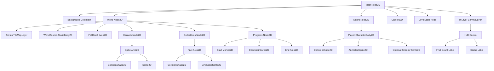
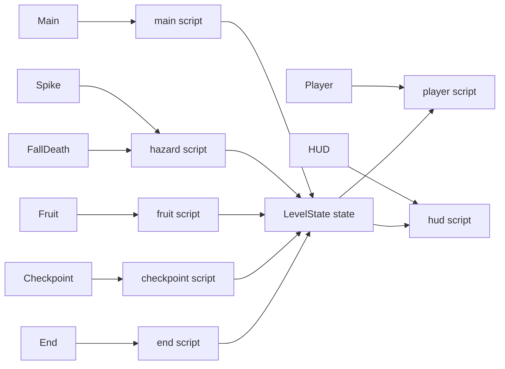
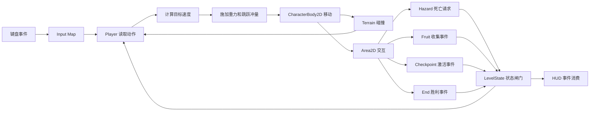
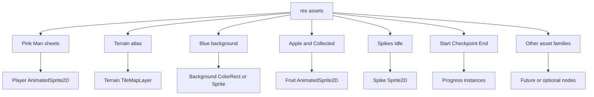
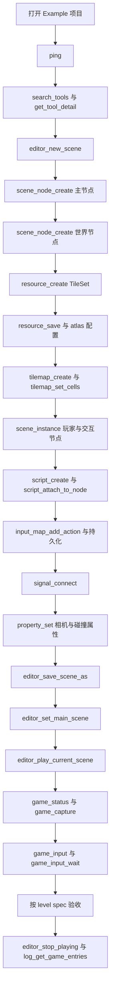
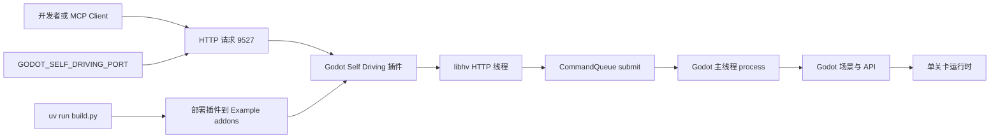

# 技术架构规格

本文件是首个单关卡 Demo 的技术结构唯一来源。所有路径带 `TARGET` 或 `TODO` 的文件当前并不存在，创建后才可称为实现。

## 权威交叉引用

- 玩法和目标数字: [gameplay-spec.md](./gameplay-spec.md)。
- 关卡节点和坐标: [level-spec.md](./level-spec.md)。
- PNG 路径和尺寸: [asset-catalog.md](./asset-catalog.md)。
- 范围与完成定义: [game-overview.md](./game-overview.md)。

## 当前项目事实

- `Example/project.godot` 是 Godot 4.7、Forward Plus 项目。
- 当前没有主场景、输入动作、GDScript、场景资源或音频。
- 插件构建命令是 `uv run build.py`，部署目录是 `Example/addons/godot-self-driving/`。
- MCP 默认端口是 `9527`；Godot API 只能由 Godot 主线程调用。
- HTTP 线程提交的操作必须经过 `CommandQueue::submit()`，由主线程 `_process()` 排空。

## 目标目录树

```text
Example/
  assets/                         FACT
  scenes/                         TODO
    main.tscn                     TODO 目标主场景
    player.tscn                   TODO 目标玩家场景
    fruit.tscn                    TODO 目标水果场景
    checkpoint.tscn               TODO 目标检查点场景
    end.tscn                      TODO 目标终点场景
    spike.tscn                    TODO 目标静态陷阱场景
  scripts/                        TODO
    main.gd                       TODO 关卡编排
    player.gd                     TODO 玩家物理与状态
    fruit.gd                      TODO 幂等收集
    checkpoint.gd                 TODO 检查点状态
    end.gd                        TODO 单次胜利
    hazard.gd                     TODO 致命触发转发
    hud.gd                        TODO UI 事件消费
  project.godot                  FACT, 不在本次修改范围
```

## 完整单关卡场景树

图目的: 给出从主场景到每类节点的完整目标树，避免把逻辑散落在无名节点中。



关键判读: `LevelState` 管理会话数据，`Player` 不直接修改 HUD；`Terrain` 负责静态碰撞，危险、收集、检查点和终点使用 Area2D 事件。

## 节点与脚本结构图

图目的: 把场景节点和目标脚本的一对一职责画出来，便于按图创建文件和挂载脚本。



关键判读: `FallDeath` 和 `Spike` 可以共用危险事件转发脚本，但不能共用节点实例状态；`LevelState` 是事件闸门，脚本之间通过信号或明确方法交互。

## 节点与脚本职责

| 节点 | 类型 | 目标脚本 | 主要职责 | 不负责 |
|---|---|---|---|---|
| `Main` | Node2D | `main.gd` | 连接事件、初始化会话、设置相机边界 | 玩家物理 |
| `LevelState` | Node | `main.gd` 内部或独立脚本 | 收集 ID、最近检查点、游戏状态 | 绘制 UI |
| `Player` | CharacterBody2D | `player.gd` | 输入、速度、跳跃、状态、动画 | 关卡布局 |
| `Terrain` | TileMapLayer | 无或资源配置 | 图块绘制和地形碰撞 | 角色状态 |
| `FallDeath` | Area2D | `hazard.gd` | 处理掉出关卡的死亡触发 | 修改相机或玩家速度 |
| `Spike` | Area2D | `hazard.gd` | 发出危险触发 | 计算玩家物理 |
| `Fruit` | Area2D | `fruit.gd` | 幂等收集和视觉播放 | 修改其他水果 |
| `Checkpoint` | Area2D | `checkpoint.gd` | 一次性激活并提供位置 | 磁盘存档 |
| `End` | Area2D | `end.gd` | 一次性胜利事件 | 加载下一关 |
| `HUD` | CanvasLayer | `hud.gd` | 消费事件、更新文字 | 决定游戏状态 |

## 节点属性目标

| 节点 | 关键属性 | TARGET 要求 |
|---|---|---|
| `Player` | `motion_mode` | `MOTION_MODE_GROUNDED` |
| `Player` | `collision_layer` | 玩家层 |
| `Player` | `collision_mask` | 只检测 Terrain 物理层 |
| `Player/BodyShape` | `shape` | RectangleShape2D，尺寸来自玩法规格 |
| `Terrain` | `tile_set` | 使用 Terrain 图集和已配置物理层 |
| `Spike` | `monitoring` | 开启；mask 只监听玩家层 |
| `Fruit` | `monitoring` | 开启；mask 只监听玩家层 |
| `Checkpoint` | `monitoring` | 开启；mask 只监听玩家层 |
| `End` | `monitoring` | 开启；mask 只监听玩家层 |
| `Camera2D` | `position_smoothing_enabled` | 可选，先保证边界正确再调平滑 |
| `HUD` | `layer` | 位于世界上方，不随 Camera2D 运动 |

## 信号契约

```gdscript
signal fruit_collected(item_id: StringName, value: int)
signal checkpoint_activated(checkpoint_id: StringName, respawn_position: Vector2)
signal player_died()
signal player_respawned(checkpoint_id: StringName)
signal level_won(level_id: StringName)
```

连接规则:

- `Fruit.collected` -> `LevelState.on_fruit_collected` -> `HUD.on_fruit_count_changed`。
- `Checkpoint.activated` -> `LevelState.on_checkpoint_activated` -> `HUD.on_checkpoint_activated`。
- `Player.died` -> `LevelState.on_player_died` -> `Player.respawn_at`。
- `End.level_won` -> `LevelState.on_level_won` -> `HUD.on_level_won`。
- 任何信号只连接一次；重复初始化必须先断开或用明确的初始化闸门。

## 输入到状态的数据流

图目的: 把输入、物理、碰撞和游戏状态连接起来，明确每个阶段的责任。



关键判读: Area2D 只报告事件，`LevelState` 决定是否接受事件；UI 不反向驱动物理。`move_and_slide` 和碰撞查询必须在 Godot 主线程完成。

## 碰撞层与掩码

下表是目标位分配，数字是 `TARGET`，实现后在 Godot Inspector 中 `VERIFY`。

| 层 | 位值 | 对象 |
|---|---:|---|
| World | 1 | Terrain 和边界 StaticBody2D |
| Player | 2 | Player CharacterBody2D |
| Hazard | 4 | Spike 等危险 Area2D |
| Collectible | 8 | Fruit Area2D |
| Progress | 16 | Start、Checkpoint、End Area2D |

| 对象 | `collision_layer` | `collision_mask` | 目的 |
|---|---:|---:|---|
| Player | 2 | 1 | 与 Terrain 产生物理碰撞 |
| Terrain | 1 | 2 | 接收玩家物理碰撞 |
| Spike | 4 | 2 | 监听玩家进入 |
| Fruit | 8 | 2 | 监听玩家进入 |
| Checkpoint | 16 | 2 | 监听玩家进入 |
| End | 16 | 2 | 监听玩家进入 |

此矩阵没有敌人层、投射物层或攻击层。若未来增加对象，必须先扩展矩阵，不能复用 Progress 层造成隐式碰撞。

## 资源加载与消费关系

图目的: 说明资产从 `res://assets/` 到目标节点的消费关系，并把可选资源与首版必选资源分开。



关键判读: `asset-catalog.md` 的路径是唯一事实；这里的消费者节点是 TARGET。PNG 导入成功不等于 SpriteFrames 或 TileSet 已经创建。

## SpriteFrames 与 TileSet 创建规则

### SpriteFrames

1. 在 FileSystem 中确认路径完全匹配 [asset-catalog.md](./asset-catalog.md)。
2. 对 Pink Man 的每张横向图按 `32 x 32` 切片，创建 `idle`、`run`、`jump`、`fall`、`double_jump`、`hit`、`wall_jump` 动画。
3. 每个动画的帧数以资产事实为准，播放速度是目标实现参数，不把文件总宽误当成单帧宽。
4. Apple 和 Collected 同样按资产目录的单帧规格切片。
5. Start、Checkpoint、End 的视觉状态分别使用各自确实存在的路径；不要拼接不存在的文件名。

### TileSet

1. 使用 `res://assets/Terrain/Terrain (16x16).png` 创建 Atlas source。
2. 创建一个物理层，给首版使用的地面和平台图块配置碰撞多边形。
3. 用 TileMapLayer 摆放地形，碰撞形状必须与可站立表面一致。
4. 不根据图集颜色或位置猜测材质行为；首版只需要普通地面，特殊材质留作 VERIFY 或扩展。

## MCP 从空项目到运行验证

图目的: 给出可复刻的调用顺序。所有工具名是已确认可用的工具事实；下图中的调用仍是 TODO，不能描述为已执行。



关键判读: 该顺序先验证工具和编辑器状态，再创建资源、场景、脚本和输入，最后才运行；图中的每一步都是 TODO，不代表已经执行。

推荐元工具和领域工具范围:

- 元工具: `ping`、`search_tools`、`list_categories`、`get_tool_detail`、`call_tool`、`batch_execute`、`code_execute`。
- 场景与属性: `editor_new_scene`、`scene_node_create`、`scene_instance`、`property_set`、`signal_connect`、`editor_save_scene_as`、`editor_save_scene`。
- 脚本与资源: `script_create`、`script_attach_to_node`、`script_execute_gdscript`、`resource_create`、`resource_save`、`resource_load`、`spriteframes_create`、`spriteframes_add_animation`、`spriteframes_add_frame`。
- TileMap: `tileset_create`、`tileset_add_atlas_source`、`tileset_add_physics_layer`、`tileset_set_tile_collision`、`tilemap_create`、`tilemap_set_cell`、`tilemap_set_cells`。
- 输入与运行: `input_map_add_action`、`input_map_action_add_event`、`input_map_action_set_deadzone`、`input_map_persist`、`input_map_get_actions`、`input_map_has_action`、`editor_set_main_scene`、`editor_open_scene`、`editor_play_current_scene`、`editor_stop_playing`、`game_status`、`game_eval`、`game_input`、`game_input_wait`、`game_input_status`、`game_capture`、`log_get_game_entries`。

## 部署与运行边界

图目的: 区分插件构建、HTTP MCP 线程、Godot 主线程和游戏运行时，避免把插件端口当作游戏网络功能。



关键判读: HTTP 线程不得直接调用 Godot API；`uv run build.py` 只负责插件构建部署。游戏是否能运行要由 Godot 主场景和输入配置单独验证。

## 技术验收

- [ ] 目标目录树创建完成，所有脚本挂在约定节点。
- [ ] `Terrain` TileSet 物理层已配置，地面和边界可阻挡玩家。
- [ ] 碰撞层和掩码与本文件一致。
- [ ] 信号连接唯一，重复运行初始化不会重复连接。
- [ ] MCP 调用遵循从空项目到运行验证的顺序。
- [ ] `editor_set_main_scene` 后可以从项目运行入口进入单关卡。
- [ ] 日志中没有缺失资源、无效节点路径或跨线程 Godot API 错误。
