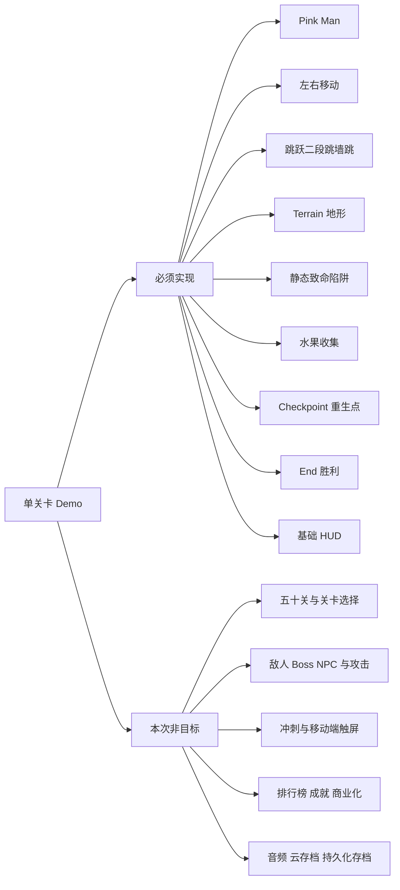
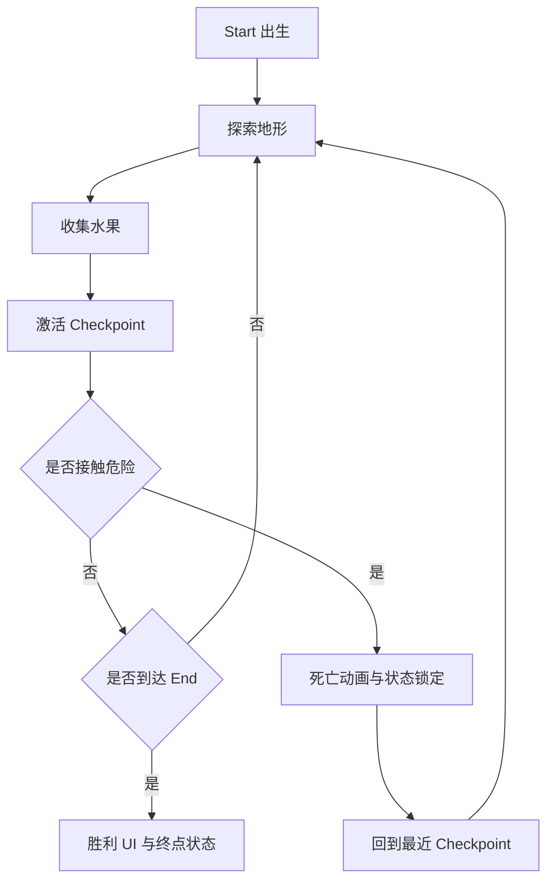

# 单关卡游戏概览

状态: `TARGET` 规格，事实以 [README.md](./README.md) 和 [asset-catalog.md](./asset-catalog.md) 为准。

## 权威交叉引用

- 玩法规则唯一来源: [gameplay-spec.md](./gameplay-spec.md)。
- 技术结构唯一来源: [architecture.md](./architecture.md)。
- 关卡实例唯一来源: [level-spec.md](./level-spec.md)。
- PNG 文件事实唯一来源: [asset-catalog.md](./asset-catalog.md)。

## 一句话目标

使用默认的 Pink Man，在一张横向平台关卡中从 Start 出发，使用左右移动、跳跃、二段跳和墙跳通过 Terrain，收集至少一个水果，激活一个 Checkpoint，避开静态 Spikes，抵达 End 并显示胜利状态。

## 范围表

| 范围项 | 本次 Demo |
|---|---|
| 关卡数量 | 1 个目标关卡，不实现关卡选择 |
| 默认角色 | Pink Man；其他 3 个皮肤共用同一玩法契约，但首个版本不需要选择界面 |
| 移动 | 左右移动 |
| 跳跃 | 基础跳跃、一次二段跳、接触墙面后的墙跳 |
| 场景内容 | Terrain、Start、Checkpoint、End、水果、至少一个静态 Spikes |
| 结果 | 死亡后重生；到达 End 后只结算一次胜利 |
| UI | 水果计数、Checkpoint 激活提示、死亡或重生提示、胜利提示 |
| 存档 | 仅当前运行会话内保留检查点和收集状态，不写磁盘 |

## 目标与非目标范围图

图目的: 把必须闭环的内容和明确排除的内容放在同一张图中，防止实现范围膨胀。

关键判读: 资产目录中存在的素材不等于本次范围必须使用的内容；没有实现所需的素材也不能凭空创建事实。扩展只允许在闭环验收通过后单独立项。

## 核心循环

图目的: 描述玩家每次尝试的最短可验证流程。

关键判读: Checkpoint 是会话内的重生位置，不是磁盘存档；水果的已收集状态必须保持幂等，不能因为重生而重复计数。

## 完成定义

### 功能完成

- [ ] 项目可以在 Godot 中运行目标场景。
- [ ] 使用 `move_left` 和 `move_right` 可以在地面和空中控制角色。
- [ ] 地面跳跃、一次二段跳、左右墙跳均能触发，次数和条件符合 [gameplay-spec.md](./gameplay-spec.md)。
- [ ] Terrain 具有可站立碰撞，玩家不会穿过地面或墙。
- [ ] 接触静态 Spikes 会死亡，控制输入在死亡流程中被锁定。
- [ ] 死亡后玩家回到最近已激活 Checkpoint；没有激活时回到 Start。
- [ ] 水果只计数一次，并播放已存在的 `res://assets/Items/Fruits/Collected.png` 视觉效果或明确跳过该可选效果。
- [ ] End 只触发一次，显示胜利 UI，胜利后不再接受移动和重复结算。

### 内容完成

- [ ] 关卡坐标和节点命名与 [level-spec.md](./level-spec.md) 一致。
- [ ] 资源路径全部来自 [asset-catalog.md](./asset-catalog.md)，没有虚构音频或不存在的 PNG。
- [ ] 所有目标参数只以 [gameplay-spec.md](./gameplay-spec.md) 为准。

### 工程完成

- [ ] 场景树和脚本职责符合 [architecture.md](./architecture.md)。
- [ ] 所有 Godot API 调用在主线程执行；来自 MCP HTTP 线程的操作先进入 `queue.submit()`。
- [ ] 通过正常、死亡重生、重复收集、重复终点和边界路线验收。

## 已知限制与未来扩展

- 当前项目没有主场景、输入动作、游戏脚本或音频，这是 FACT；本 Demo 的创建项仍是 TODO。
- 4 个皮肤的 PNG 已存在，但首个版本只默认加载 Pink Man；皮肤选择是未来扩展。
- 其余陷阱、箱子、移动平台、菜单按钮和 50 张缩略图是可选扩展，不加入首个最小闭环。
