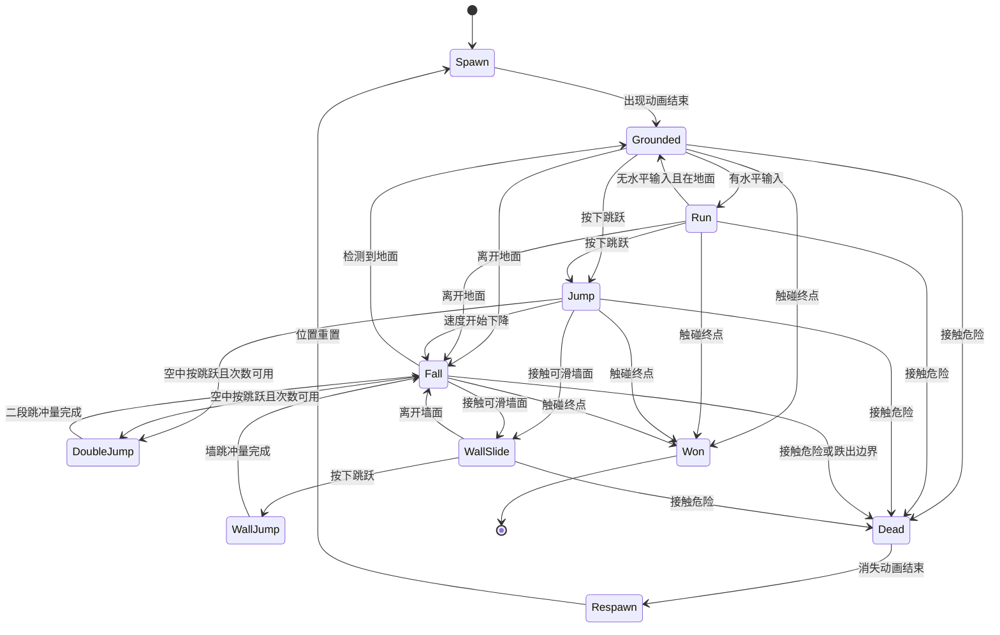
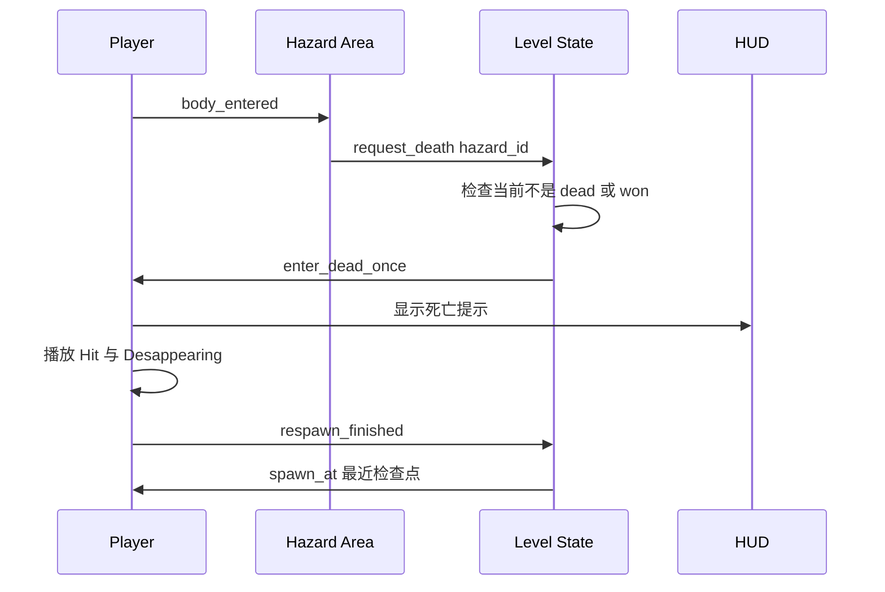
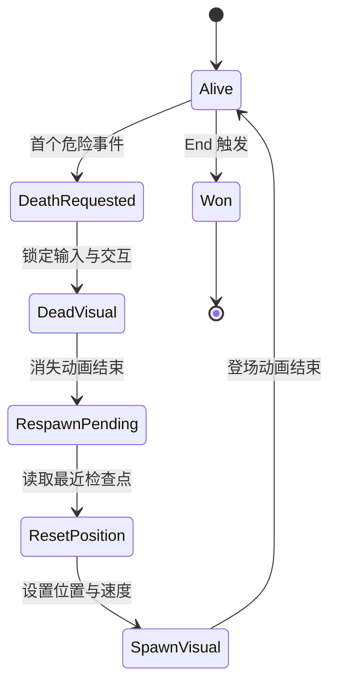

# 玩法规格

本文件是所有玩法规则和目标数值的唯一权威来源。本文中的数值若没有 `FACT` 标记，均为 `TARGET`，需要在 Godot 中调试后通过 `VERIFY` 验收。

## 权威交叉引用

- 玩法唯一来源: 本文件。
- 技术结构: [architecture.md](./architecture.md)。
- 关卡实例: [level-spec.md](./level-spec.md)。
- 资产事实: [asset-catalog.md](./asset-catalog.md)。

## 事实等级与不变式

| 标记 | 含义 |
|---|---|
| `FACT` | 项目或 PNG 目录可直接观察到的事实 |
| `TARGET` | 要实现的参数、规则、节点行为或伪接口 |
| `TODO` | 尚未创建的实现工作 |
| `VERIFY` | 必须在运行场景中确认的结果 |

不可变式:

- `dead`、`won`、`collected` 等一次性状态只能从未完成变为完成，不能被重复事件回退。
- 一次死亡流程结束前不能开启第二次死亡流程。
- 一个水果 ID 只能增加计数一次。
- 一个 End 触发器只能发出一次胜利事件。
- 玩家重生后位置取最近一次已激活检查点，否则取 Start。
- 首个版本没有生命数、伤害值、敌人或攻击；任何致命危险都直接进入死亡流程。

## 目标参数表

### 坐标与视图

| 参数 | TARGET | 单位 | 用途 |
|---|---:|---|---|
| 网格边长 | 16 | px | Terrain 和关卡坐标基准 |
| 设计视口宽 | 320 | px | Camera2D 设计宽度 |
| 设计视口高 | 180 | px | Camera2D 设计高度 |
| 玩家精灵 | 32 x 32 | px | 角色视觉尺寸，资产 FACT |
| 玩家碰撞盒 | 20 x 28 | px | CharacterBody2D 的 CollisionShape2D |
| 玩家碰撞盒水平偏移 | 0 | px | 以玩家节点中心为基准 |
| 玩家碰撞盒底部对齐 | 是 | - | 让脚底贴合地面 |

### 玩家物理

| 参数 | TARGET | 单位 | 说明 |
|---|---:|---|---|
| 最大水平速度 | 120 | px/s | 左右方向最终速度 |
| 地面加速度 | 900 | px/s2 | 有方向输入时 |
| 地面减速度 | 1200 | px/s2 | 松开方向时 |
| 空中加速度 | 700 | px/s2 | 空中水平控制 |
| 空中减速度 | 500 | px/s2 | 空中松开方向 |
| 重力 | 900 | px/s2 | 向下加速度 |
| 最大下落速度 | 500 | px/s | 终端速度 |
| 基础跳跃初速度 | -320 | px/s | `velocity.y` 负值向上 |
| 二段跳初速度 | -290 | px/s | 每次空中尝试最多一次 |
| 墙跳水平速度 | 220 | px/s | 方向背离墙面 |
| 墙跳垂直速度 | -300 | px/s | 触发墙跳时 |
| 墙滑最大下落速度 | 80 | px/s | 接触可滑墙面且向下时 |
| 蹭墙容错时间 | 0.08 | s | 可选，离开墙后短时间允许墙跳 |
| 跳跃输入缓冲 | 0.10 | s | 可选，提前按键后落地触发 |
| 死亡动画目标时长 | 0.70 | s | 目标值，视觉帧率见资产目录 |
| 重生保护输入锁定 | 0.70 | s | 从死亡到重新可控的目标时长 |

若调参改变，只修改本表和引用本表的实现，不在其他文档复制另一套数字。

### 触发与计数

| 参数 | TARGET | 说明 |
|---|---:|---|
| 每个关卡必需 Checkpoint | 1 | level spec 实例化一个 |
| 首个版本静态致命陷阱 | 1 | 使用 Spikes |
| 首个版本水果 | 1 | 使用 Apple |
| 终点 | 1 | End 只结算一次 |
| 会话水果初始计数 | 0 | 新加载关卡时 |
| 会话水果计数增量 | 1 | 每个水果 ID 只增一次 |

## 输入契约

当前 `Example/project.godot` 没有 `[input]`，下表是要创建的 `TARGET` 输入动作，不代表现状。

| 动作 | 键盘事件 | 允许状态 | 结果 |
|---|---|---|---|
| `move_left` | A、左方向键 | Spawn 后的可控状态 | 目标水平速度为负 |
| `move_right` | D、右方向键 | Spawn 后的可控状态 | 目标水平速度为正 |
| `jump` | Space、W | Grounded、Jump、Fall、WallSlide | 按条件执行基础跳、二段跳或墙跳 |
| `restart` | R | Dead、Won | 重载当前关卡会话 |

不添加手柄、触屏、攻击、冲刺或菜单动作到首个版本。`jump` 必须使用按下事件而非持续按住事件计数二段跳。

## 玩家状态机

图目的: 说明移动、跳跃、墙面、死亡和胜利的完整状态边界。



关键判读: `Hit` 是角色资产中的动画名，不是额外生命系统；死亡一旦发生，玩家输入和所有交互必须锁定，直到 `Respawn` 完成。

## 玩家更新契约

目标脚本: `res://scripts/player.gd`，当前不存在，属于 `TODO`。

```gdscript
func _physics_process(delta: float) -> void:
    if state in [State.DEAD, State.RESPAWN, State.WON]:
        return

    var axis := Input.get_axis("move_left", "move_right")
    velocity.x = move_toward(velocity.x, axis * MAX_SPEED, horizontal_rate(delta))
    apply_gravity(delta)
    try_jump_once_per_press()
    move_and_slide()
    update_ground_and_wall_flags()
    update_animation()
```

实现要求:

- `move_and_slide()` 后再读取 `is_on_floor()`、`is_on_wall()`，避免使用上一帧碰撞结果。
- 落地时把二段跳剩余次数重置为一次；离地后只允许消耗一次。
- 墙跳必须确认玩家正贴着左墙或右墙，并把水平冲量指向远离墙的一侧。
- `velocity.y` 不得无限增长，按最大下落速度限制。
- 死亡、重生、胜利期间不读取新的移动和跳跃输入。
- 初次生成和重生使用同一个 `spawn_at(position: Vector2)`，保证两条路径幂等。

## 动画契约

动画文件、单帧和帧数是 [asset-catalog.md](./asset-catalog.md) 的 FACT；本节只规定状态消费关系。

| 玩家状态 | 目标动画 | 选择条件 |
|---|---|---|
| Spawn | Appearing | 生成和重生时播放一次 |
| Grounded | Idle | 地面且水平速度接近零 |
| Run | Run | 地面或空中有有效水平输入，首版可仅地面使用 |
| Jump | Jump | 向上运动且不是二段跳 |
| Fall | Fall | 向下运动 |
| DoubleJump | Double Jump | 二段跳触发后播放一次 |
| WallJump | Wall Jump | 墙跳触发后播放一次 |
| Dead | Hit 后 Desappearing | 先锁定控制，再播放死亡表现 |
| Won | Desappearing 或静态胜利表现 | 终点只触发一次 |

动画的 `Idle`、`On`、`Off`、`Hit` 等文件名只代表视觉资源名称。行为由脚本状态和碰撞事件决定。

## 收集品规则

目标节点: `Fruit`，类型 `Area2D`，脚本 `res://scripts/fruit.gd`。

```gdscript
signal collected(item_id: StringName, value: int)

func collect_once() -> void:
    if collected_flag:
        return
    collected_flag = true
    monitoring = false
    collected.emit(item_id, 1)
    play_collect_effect()
    queue_free()
```

- `item_id` 必须在关卡中唯一，例如 `fruit_apple_01`。
- `body_entered` 只接受属于玩家碰撞层的对象。
- 计数器先检查 ID 集合，再增加显示值；重复信号不能重复加一。
- 当前会话死亡后不恢复已收集水果，避免玩家通过重复路线刷计数。
- 物理流程和 UI 更新顺序: `body_entered` -> `collect_once` -> `collected` -> `LevelState` 记录 ID -> HUD 更新 -> 节点移除。

## 陷阱规则

首个版本只把 `res://assets/Traps/Spikes/Idle.png` 作为静态致命陷阱。其他陷阱虽然存在于资产目录，但不属于首版关卡。

| 类型 | 首版行为 | 碰撞 | 结果 |
|---|---|---|---|
| Spikes | 静态放置，脚本不移动 | Area2D 触发区 | 立即进入 Dead |
| 其他陷阱 | 可选扩展，行为未由文件名证明 | 待扩展 | 不得在首版验收中依赖 |

图目的: 说明危险 Area2D 如何把一次碰撞转成不可重入的死亡流程。



关键判读: 陷阱不直接销毁或移动玩家；它只提交死亡请求，`LevelState` 负责判断当前状态并协调玩家和 HUD。

## Checkpoint、重生和终点

### Checkpoint

目标节点: `Checkpoint`，类型 `Area2D`。它只记录位置，不写入磁盘。

```gdscript
signal activated(checkpoint_id: StringName, respawn_position: Vector2)

func activate_once() -> void:
    if is_active:
        return
    is_active = true
    activated.emit(checkpoint_id, global_position)
```

- 初始最近检查点是 Start 的重生位置。
- 玩家进入未激活检查点时，先更新会话状态，再切换视觉到已激活状态。
- 已激活检查点再次进入不发出新的激活事件。
- 关卡重载会清空会话状态；首版不保存到 `user://`。

### 死亡与重生

图目的: 明确一次死亡从触发到恢复控制的单向过程和幂等边界。



关键判读: `DeathRequested` 之后没有取消路径；第二个危险事件必须被状态闸门忽略，只有重生完成才能恢复 `Alive`。

死亡实现要求:

- `request_death` 使用布尔闸门或状态枚举，第二个陷阱事件被忽略。
- 清零水平和垂直速度，清理墙跳和二段跳临时状态。
- 重生时先设置全局位置，再恢复监测和输入，避免出生点重叠导致同帧再次死亡。
- 若检查点自身处于危险触发区，必须在 Godot 中验证并调整关卡坐标，而不是添加隐形例外。

### End

目标节点: `End`，类型 `Area2D`。

```gdscript
signal level_won(level_id: StringName)

func trigger_once() -> void:
    if triggered:
        return
    triggered = true
    level_won.emit(level_id)
```

End 触发顺序: 禁止玩家输入 -> 禁止收集和危险处理 -> 播放 End 的目标视觉状态 -> 发出 `level_won` -> HUD 显示胜利。不存在下一关自动加载。

## UI 事件契约

首版 UI 可以使用 Godot `Label`，不要求使用 Menu 文字图集；文字图集只是可选视觉资源。

| 事件或方法 | 签名 | 触发方 | HUD 结果 |
|---|---|---|---|
| 水果变化 | `fruit_count_changed(count: int)` | LevelState | 更新 `Fruit: count` |
| 检查点激活 | `checkpoint_activated(id: StringName)` | Checkpoint | 显示一次激活提示 |
| 死亡开始 | `player_died()` | Player | 显示死亡提示并锁定输入 |
| 重生完成 | `player_respawned(id: StringName)` | LevelState | 清除死亡提示 |
| 胜利 | `level_won(id: StringName)` | End | 显示胜利提示并锁定场景 |

UI 只消费事件，不直接修改玩家速度、检查点或收集集合。

## 边界情况清单

- 玩家同时接触水果和陷阱: 以物理帧事件顺序为准，但死亡后的对象不得继续产生收集事件；验收时应让关卡避免重叠。
- 玩家同时接触 Checkpoint 和陷阱: Checkpoint 激活必须在同一物理帧先记录，死亡后回到该点；验收时仍应避免重叠。
- 玩家在胜利同帧接触陷阱: `Won` 一旦先锁定，忽略后续危险；必须用明确状态闸门验证。
- 玩家掉出关卡下边界: 作为死亡来源，边界值和节点见 [level-spec.md](./level-spec.md)。
- 重启当前关卡: 清空收集集合和检查点状态，回到 Start，不伪造持久化存档。
- 资源导入失败: 不用替代路径静默回退，应在 Godot 输出中暴露具体 `res://assets/` 路径。

## 玩法验收

- [ ] 输入动作存在且按键只触发对应动作。
- [ ] 目标参数自洽，玩家不会因重力、速度或碰撞盒异常穿透 Terrain。
- [ ] 二段跳一次后被消耗，落地后恢复一次。
- [ ] 墙跳只在墙面接触条件成立时触发。
- [ ] 静态 Spikes 触发一次死亡流程，重复碰撞不重入。
- [ ] 水果 ID 只计数一次，死亡重生不重复计数。
- [ ] Checkpoint 激活一次，死亡回到最近点。
- [ ] End 只发出一次胜利事件。
