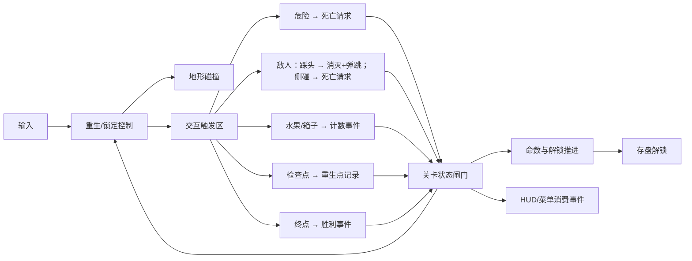

# 游戏设计文档（GDD）

本文是游戏设计的总纲：系统总览、内容范围与完成定义。各系统的详细规格位于同目录下的专项文档：

- 玩法机制与数值 → [mechanics.md](./mechanics.md)
- UI 与 HUD → [ui-hud.md](./ui-hud.md)
- 关卡实例 → [level-design.md](./level-design.md)
- 美术资源与方向 → [../art/asset-catalog.md](../art/asset-catalog.md)、[../art/art-direction.md](../art/art-direction.md)

## 游戏概念

一款致敬经典横版平台跳跃玩法的**三关卡、带敌人与菜单**小游戏。玩家是一名 32×32 像素的小人，在三张横向世界里向右推进；核心挑战是跳跃手感、踩头时机与路线规划；危险是静态尖刺、巡逻敌人、轨道锯与定时火焰（碰到即死，巡逻怪可踩头消灭）；收集与进度包含多枚水果、问号箱、每关 1–2 个检查点与终点；通关解锁下一关并写盘保存。

设计支柱（详见 [一页纸设计](../pitch/one-page-design.md)）：**可预期、宽容、清晰**。

## 系统总览

| 系统 | 职责 | 详细规格 |
|---|---|---|
| 移动 | 地面/空中水平控制、加减速 | [mechanics.md](./mechanics.md) |
| 跳跃 | 基础跳、二段跳、输入缓冲 | 同上 |
| 墙面 | 墙滑、墙跳、蹭墙容错 | 同上 |
| 敌人 | 石怪巡逻、轨道锯往复、定时火喷发、踩头消灭规则 | 同上 |
| 危险 | 静态尖刺/锯/燃火触发死亡；世界下方死亡边界 | 同上 |
| 收集 | 水果幂等计数与消失；问号箱顶触发出果 | 同上 |
| 进度 | 检查点记录重生位置；终点一次性胜利并推进解锁 | 同上 |
| 命数 | 整局 3 命、死亡扣命、归零 GameOver、通关加命 | 同上 |
| 暂停 | Esc/P 暂停、 physics 与计时冻结、暂停菜单 | 同上 |
| 菜单流程 | 主菜单/选关/结算/GameOver导航与解锁读盘 | 同上 |
| 存档 | 解锁进度写盘 `user://save.cfg` | 同上 |
| UI/HUD | 水果计数、命数、关卡名与各类提示 | [ui-hud.md](./ui-hud.md) |
| 相机 | 跟随玩家并限制在世界内 | [level-design.md](./level-design.md) |

关键交互关系：

## 内容范围

| 范围项 | 本次设计 |
|---|---|
| 关卡数量 | 3 个目标关卡（`level_01/02/03`）+ 关卡选择与解锁 |
| 默认角色 | Pink Man；其余 3 个皮肤共用同一玩法契约，本版不要求选择界面 |
| 移动 | 左右移动 |
| 跳跃 | 基础跳跃、一次二段跳、墙面接触后的墙滑与墙跳、踩头弹跳 |
| 场景内容 | 可站立地形与平台、起点、检查点、终点、水果、问号箱、静态尖刺、巡逻石怪、轨道锯、定时火、掉出世界的死亡边界 |
| 敌人 | 石怪（可踩）、轨道锯（不可踩）、定时火（燃时致命）；均只监听玩家 |
| 结果 | 死亡扣命后重生；命尽 GameOver；到达终点结算并解锁下一关 |
| 菜单 | 主菜单、选关、暂停菜单、结算面板、GameOver 面板、退出游戏 |
| HUD | 水果计数、命数、关卡名、检查点激活提示、死亡/重生提示、胜利提示 |
| 状态保留 | 检查点与收集状态仅当前关卡会话内保留；解锁进度写盘保存 |

## 完成定义

### 行为完成（设计级，可客观验证）

- [ ] 使用左/右输入可在地面与空中控制角色移动。
- [ ] 地面跳、一次二段跳、左右墙跳均能触发，次数与条件符合 [mechanics.md](./mechanics.md)。
- [ ] 地形阻挡玩家：不会穿透地面或墙体，不会卡出世界。
- [ ] 接触尖刺/锯/燃火进入死亡流程，死亡期间输入被锁定。
- [ ] 巡逻石怪可被踩头消灭并弹跳玩家；侧面接触进入死亡流程；锯不可踩。
- [ ] 问号箱从下方顶触发出果并计数，每箱仅一次。
- [ ] 死亡扣 1 命后回到最近已激活检查点；未激活时回到起点；命归零进 GameOver。
- [ ] 水果只计数一次，重复经过不再计数；已收集水果在本次会话内不再出现。
- [ ] 终点只触发一次胜利并结算；胜利后移动与结算不再响应；解锁下一关并写盘。
- [ ] 掉出世界下边界按死亡流程处理。
- [ ] Esc/P 可暂停与恢复；暂停期间 physics 与计时冻结；暂停菜单五项可用。
- [ ] 主菜单 Play 进最高解锁关；选关未解锁置灰不可进；删档后重锁。

### 内容完成

- [ ] 关卡内容与 [level-design.md](./level-design.md) 的分段、坐标与安全要求一致（允许在交付说明中记录已校准的偏差）。
- [ ] 使用的每个 PNG 都能在 [asset-catalog.md](../art/asset-catalog.md) 中找到，路径保持原样。
- [ ] 所有数值以 [mechanics.md](./mechanics.md) 为准，不复用第二套数字。

### 交付完成

- [ ] 游戏可从工程入口启动，完整走通"菜单→选关→通关解锁 / 死亡重生 / 命尽 GameOver / 暂停退出 / 重复触发幂等"路线。
- [ ] 运行期间无脚本错误、无缺失资源告警。
- [ ] 画面效果类验收项具备编辑器/游戏运行截图证据（见 [../test/test-plan.md](../test/test-plan.md)）。

## 非目标

本次不实现：50 关全量、皮肤选择、Boss、NPC、攻击、冲刺、移动端触屏、Settings/音量、排行榜、成就、商业化、音频系统、云存档。其他陷阱（箭矢、蹦床、坠落平台等）与装饰不属于本版闭环。

## 已知限制与扩展方向

- 剩余陷阱、移动平台、Settings/Volume/Achievements/Leaderboard 素材已存在，但属于可选扩展，不进入本版闭环。
- 音频素材不存在，本版不实现音频；Settings 菜单不做。
- 若未来扩展为 50 关，只需按现有解锁与选关规则追加关卡表，无需改存档格式（`unlocked` 上限随之放宽）。
