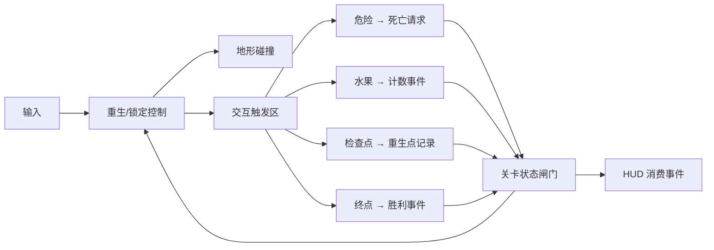

# 游戏设计文档（GDD）

本文是游戏设计的总纲：系统总览、内容范围与完成定义。各系统的详细规格位于同目录下的专项文档：

- 玩法机制与数值 → [mechanics.md](./mechanics.md)
- UI 与 HUD → [ui-hud.md](./ui-hud.md)
- 关卡实例 → [level-design.md](./level-design.md)
- 美术资源与方向 → [../art/asset-catalog.md](../art/asset-catalog.md)、[../art/art-direction.md](../art/art-direction.md)

## 游戏概念

一款致敬经典横版平台跳跃玩法的**单关卡、无战斗**小游戏。玩家是一名 32×32 像素的小人，在 1600×320 像素的世界里向右推进；核心挑战是跳跃手感与平台通过性；危险是静态的（碰到即死）；收集与进度轻量（一枚水果、一个检查点、一个终点）。

设计支柱（详见 [一页纸设计](../pitch/one-page-design.md)）：**可预期、宽容、清晰**。

## 系统总览

| 系统 | 职责 | 详细规格 |
|---|---|---|
| 移动 | 地面/空中水平控制、加减速 | [mechanics.md](./mechanics.md) |
| 跳跃 | 基础跳、二段跳、输入缓冲 | 同上 |
| 墙面 | 墙滑、墙跳、蹭墙容错 | 同上 |
| 危险 | 静态尖刺触发死亡；世界下方死亡边界 | 同上 |
| 收集 | 水果幂等计数与消失 | 同上 |
| 进度 | 检查点记录重生位置；终点一次性胜利 | 同上 |
| 状态与重生 | 死亡流程、重生位置、会话状态 | 同上 |
| UI/HUD | 水果计数与各类提示 | [ui-hud.md](./ui-hud.md) |
| 相机 | 跟随玩家并限制在世界内 | [level-design.md](./level-design.md) |

关键交互关系：

## 内容范围

| 范围项 | 本次设计 |
|---|---|
| 关卡数量 | 1 个目标关卡（`level_01`），无关卡选择 |
| 默认角色 | Pink Man；其余 3 个皮肤共用同一玩法契约，首版不要求选择界面 |
| 移动 | 左右移动 |
| 跳跃 | 基础跳跃、一次二段跳、墙面接触后的墙滑与墙跳 |
| 场景内容 | 可站立地形与平台、起点、检查点、终点、水果、静态尖刺、掉出世界的死亡边界 |
| 结果 | 死亡后重生；到达终点后只结算一次胜利 |
| HUD | 水果计数、检查点激活提示、死亡/重生提示、胜利提示 |
| 状态保留 | 仅当前运行会话内保留检查点与收集状态，不写磁盘 |

## 完成定义

### 行为完成（设计级，可客观验证）

- [ ] 使用左/右输入可在地面与空中控制角色移动。
- [ ] 地面跳、一次二段跳、左右墙跳均能触发，次数与条件符合 [mechanics.md](./mechanics.md)。
- [ ] 地形阻挡玩家：不会穿透地面或墙体，不会卡出世界。
- [ ] 接触尖刺进入死亡流程，死亡期间输入被锁定。
- [ ] 死亡后回到最近已激活检查点；未激活时回到起点。
- [ ] 水果只计数一次，重复经过不再计数；已收集水果在本次会话内不再出现。
- [ ] 终点只触发一次胜利；胜利后移动与结算不再响应。
- [ ] 掉出世界下边界按死亡流程处理。

### 内容完成

- [ ] 关卡内容与 [level-design.md](./level-design.md) 的分段、坐标与安全要求一致（允许在交付说明中记录已校准的偏差）。
- [ ] 使用的每个 PNG 都能在 [asset-catalog.md](../art/asset-catalog.md) 中找到，路径保持原样。
- [ ] 所有数值以 [mechanics.md](./mechanics.md) 为准，不复用第二套数字。

### 交付完成

- [ ] 游戏可从工程入口启动，完整走通"正常通关 / 死亡重生 / 重复触发幂等"三条路线。
- [ ] 运行期间无脚本错误、无缺失资源告警。
- [ ] 画面效果类验收项具备编辑器/游戏运行截图证据（见 [../test/test-plan.md](../test/test-plan.md)）。

## 非目标

本次不实现：多关卡流程/关卡选择、敌人、Boss、NPC、攻击、冲刺、移动端触屏、排行榜、成就、商业化、音频系统、云存档或磁盘持久化。皮肤选择、其余陷阱与箱子等扩展不属于首版闭环。

## 已知限制与扩展方向

- 4 个皮肤、其余陷阱、箱子、移动平台、菜单按钮与 50 张关卡缩略图素材已存在，但属于可选扩展，不进入首版闭环。
- 音频素材不存在，首版不实现音频。
- 若未来扩展为 50 关，需先扩展玩法规格（存档、关卡选择、机关）后再实施。
