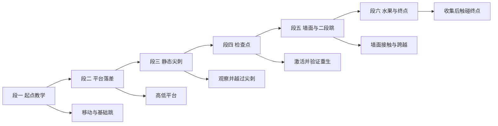
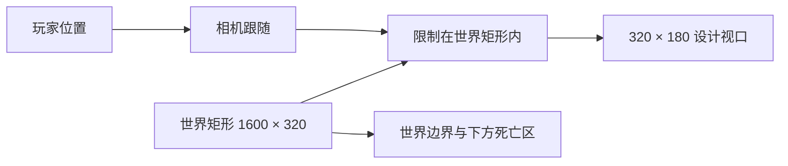

# 关卡设计（level_01）

本文是关卡实例的**唯一权威**：坐标、区域、内容布置与验收路线。玩法参数见 [mechanics.md](./mechanics.md)，素材路径见 [../art/asset-catalog.md](../art/asset-catalog.md)。

## 关卡标识与坐标系

| 项目 | 目标值 |
|---|---|
| 关卡 ID | `level_01` |
| 世界尺寸 | 1600 × 320 px |
| 网格 | 16 px |
| 设计视口 | 320 × 180 px |
| 原点 | 世界左上角 (0, 0) |
| Y 轴 | 向下 |
| 坐标单位 | 像素 |
| 坐标语义 | 交互对象与角色使用**中心点**；地形区域表使用**左上角 tile 坐标** |

**命名建议**：为便于验收与自动化核对，建议每个交互对象使用稳定且唯一的名称（例如表中 ID），但具体命名规则由实现者决定；关卡逻辑不得依赖显示文本。

## 关卡分段流程

图目的：把一关拆成可逐段验收的路线，每段只引入一个新的操作重点。

关键判读：每段都能独立复现一个验收目标；不引入移动平台、火焰或其他动态机关。

## 地形布置

地面与平台均为 16px 网格上的矩形区域。**碰撞语义**两种：

- `实体`：六面阻挡（地面块、墙）；
- `顶部可站立`：仅顶面可站立（浮空平台）。

| 区域 ID | 左上角 tile | 尺寸（tile） | 语义 | 用途 |
|---|---|---|---|---|
| `ground_a` | (0, 17) | 20 × 3 | 实体 | 起点到第一段地面 |
| `platform_a` | (8, 14) | 6 × 1 | 顶部可站立 | 起点上方的低平台 |
| `ground_b` | (20, 17) | 16 × 3 | 实体 | 第一落差后的地面 |
| `platform_b` | (25, 13) | 6 × 1 | 顶部可站立 | 水果所在平台 |
| `ground_c` | (36, 17) | 18 × 3 | 实体 | 尖刺后的安全地面 |
| `ground_d` | (54, 17) | 20 × 3 | 实体 | 检查点前后通道 |
| `wall_left` | (60, 12) | 1 × 5 | 实体 | 墙面段左墙（顶面 192px 高） |
| `wall_right` | (68, 12) | 1 × 5 | 实体 | 墙面段右墙（顶面 192px 高） |
| `platform_c` | (61, 13) | 7 × 1 | 顶部可站立 | 双墙之间的中段平台 |
| `ground_e` | (74, 17) | 26 × 3 | 实体 | 终点前安全路线 |

要点：

- 五段地面在 x 方向**首尾相连**，全关卡地面连续无坑；世界下方另有死亡边界兜底。
- 地面顶面高度 = y 272px；`platform_a` 顶面 224px（离地 48px）；`platform_b`/`platform_c` 顶面 208px（离地 64px）。
- 两侧墙高 80px（顶面 192px）。**设计意图**：单跳（约 57px）不足以直接越过，二段跳（约 108px）有约 29px 余量；墙面可触发墙滑/墙跳，但不要求仅靠墙跳登顶——通过方式不限，只要求该段可通过。

## 关键坐标（交互对象）

坐标均为对象中心点。视觉锚点要求：**尖刺、检查点、起点、终点等视觉对象的底边应贴住所在地面/平台表面**（表格数值已按此校准）。

| ID | 类型 | 中心坐标 | 视觉尺寸 | 触发范围（建议） | 行为 |
|---|---|---:|---:|---:|---|
| `start_01` | 起点 | (96, 240) | 64 × 64 | — | 玩家初始出生位置 |
| `fruit_apple_01` | 水果 | (432, 192) | 32 × 32 | 16 × 16 | 计数 +1 并消失，只一次 |
| `spike_01` | 危险 | (560, 264) | 16 × 16 | 12 × 12 | 接触即死；视觉底边贴地 |
| `checkpoint_01` | 检查点 | (768, 240) | 64 × 64 | 32 × 64 | 记录会话内重生点，只一次 |
| `end_01` | 终点 | (1504, 240) | 64 × 64 | 48 × 64 | 只触发一次胜利 |

位置关系说明：

- `fruit_apple_01` 悬于 `platform_b`（顶面 208px）上方：其 32×32 视觉底边恰好落在平台表面；从地面需二段跳才能够到。
- `spike_01` 位于 `ground_b`/`ground_c` 交界处的地面上，玩家可原地跳过；直接走入则死亡。
- `checkpoint_01` 位于 `ground_d` 安全地面上；玩家步行经过即可激活，重生落点安全。
- `end_01` 位于 `ground_e` 上，前方保持连续安全地面以便独立验收。

## 相机与边界

图目的：说明相机跟随范围与死亡边界的分工。

- 相机**必须跟随玩家**（水平与垂直），并把可视范围限制在世界矩形 (0,0)–(1600,320) 内：不允许露出版图外的空白。
- 相机跟随不应在死亡或胜利时把视图带出世界。
- 掉出世界的死亡检测覆盖世界下方；不得与终点或地面语义重叠。

## 逐步验收路线

### 正常通关

1. 从起点出生，玩家站在地面上，HUD 水果计数为 0。
2. 向右移动并跳上 `platform_a`，观察 Idle/Run/Jump 动画切换与相机跟随。
3. 二段跳上 `platform_b`，触碰水果：计数 +1；再次经过该位置不会二次计数。
4. 落地向右，越过 `spike_01`（跳跃通过；验收时不要求故意触碰）。
5. 触碰 `checkpoint_01`：激活一次、HUD 提示一次。
6. 通过墙面段：贴墙可触发墙滑/墙跳；采用任意方式越过两面墙与中段平台。
7. 触碰 `end_01`：显示胜利并锁定控制。

### 死亡重生

1. 重开关卡，从不激活检查点直接触碰 `spike_01`：死亡表现 + 输入锁定 + 一次死亡事件。
2. 确认重生位置是起点（此时无检查点）。
3. 激活 `checkpoint_01` 后再触碰危险：重生位置应为该检查点。
4. 确认水果不会重新计数；重复死亡每次都能完整重置，不叠加回调。

### 边界与幂等

- 从左右边界向外移动，玩家不能离开世界。
- 从世界下方跌落，按死亡流程重生。
- 多次进入检查点不重复激活；多次进入终点不重复结算。
- 死亡同帧的收集与终点事件按玩法闸门处理（见 [mechanics.md](./mechanics.md) 边界情况）。

## 关卡验收

- [ ] 关卡只有一张，没有多关解锁或下一关逻辑。
- [ ] 地形区域与上表一致；地面连续、平台可站立、墙可阻挡且可触发墙滑。
- [ ] 尖刺、检查点、水果、终点、起点的位置与锚点要求一致，视觉贴地关系正确（截图核对）。
- [ ] 相机跟随玩家且不露出世界外区域（截图核对）。
- [ ] 从起点到终点存在一条可实际操作的通过路线（通过方式不限）。
- [ ] 使用的每个 PNG 都可在 [asset-catalog.md](../art/asset-catalog.md) 中找到。
