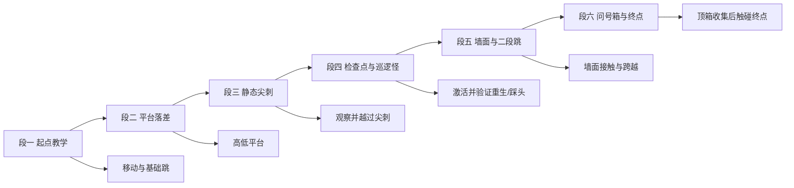
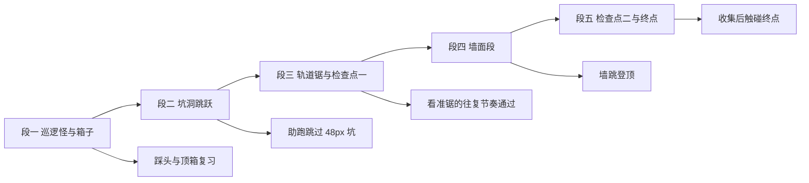
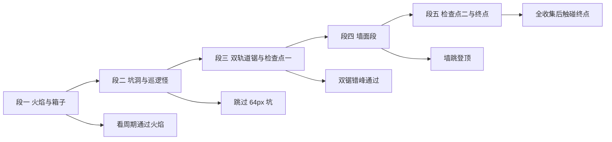

# 关卡设计（level_01 / level_02 / level_03）

本文是关卡实例的**唯一权威**：坐标、区域、内容布置与验收路线。玩法参数（含敌人行为数值、踩头规则、命数、箱子规则）见 [mechanics.md](./mechanics.md)，素材路径见 [../art/asset-catalog.md](../art/asset-catalog.md)。

## 全局坐标系与通用规则

| 项目 | 目标值 |
|---|---|
| 网格 | 16 px |
| 设计视口 | 320 × 180 px |
| 原点 | 世界左上角 (0, 0) |
| Y 轴 | 向下 |
| 坐标单位 | 像素 |
| 坐标语义 | 交互对象与角色使用**中心点**；地形区域表使用**左上角 tile 坐标**；敌人巡逻区间与轨道端点使用**中心点像素坐标** |

通用规则（三关一致）：

- 地面顶面高度统一为 y 272px（tile 行 17）。
- 视觉锚点：**尖刺、检查点、起点、终点、火焰底座、问号箱底边应贴住所在地面/平台表面**；水果底边贴住所在平台表面或按表悬空；巡逻怪与圆锯的中心 y 按表给出。
- **命名建议**：每个交互对象使用稳定且唯一的名称（表中 ID），关卡逻辑不得依赖显示文本。
- 相机**必须跟随玩家**（水平与垂直），并把可视范围限制在世界矩形内：不允许露出版图外的空白；死亡或胜利时不得把视图带出世界。
- 掉出世界的死亡检测覆盖世界下方；不得与终点或地面语义重叠。
- 关卡 ID 为 `level_01` / `level_02` / `level_03`；通关当关终点即解锁下一关（解锁写盘规则见 [mechanics.md](./mechanics.md)）。

---

## 第一关 level_01（教学关）

| 项目 | 目标值 |
|---|---|
| 关卡 ID | `level_01` |
| 世界尺寸 | 1600 × 320 px |
| 解锁条件 | 默认解锁 |
| 水果种类 | Apple |
| 新机制 | 移动、基础跳、平台落差、静态尖刺、检查点、墙面与二段跳、巡逻怪、问号箱 |

### 关卡分段流程

关键判读：每段都能独立复现一个验收目标；本关不引入圆锯、火焰等动态机关。

### 地形布置

地面与平台均为 16px 网格上的矩形区域。**碰撞语义**两种：

- `实体`：六面阻挡（地面块、墙）；
- `顶部可站立`：仅顶面可站立（浮空平台）。

| 区域 ID | 左上角 tile | 尺寸（tile） | 语义 | 用途 |
|---|---|---|---|---|
| `ground_a` | (0, 17) | 20 × 3 | 实体 | 起点到第一段地面 |
| `platform_a` | (8, 14) | 6 × 1 | 顶部可站立 | 起点上方的低平台 |
| `ground_b` | (20, 17) | 16 × 3 | 实体 | 第一落差后的地面 |
| `platform_b` | (25, 13) | 6 × 1 | 顶部可站立 | 水果所在平台 |
| `ground_c` | (36, 17) | 18 × 3 | 实体 | 尖刺后的安全地面 |
| `ground_d` | (54, 17) | 20 × 3 | 实体 | 检查点前后通道 |
| `wall_left` | (60, 12) | 1 × 5 | 实体 | 墙面段左墙（顶面 192px 高） |
| `wall_right` | (68, 12) | 1 × 5 | 实体 | 墙面段右墙（顶面 192px 高） |
| `platform_c` | (61, 13) | 7 × 1 | 顶部可站立 | 双墙之间的中段平台 |
| `ground_e` | (74, 17) | 26 × 3 | 实体 | 终点前安全路线 |

要点：

- 五段地面在 x 方向**首尾相连**，全关卡地面连续无坑；世界下方另有死亡边界兜底。
- 地面顶面高度 = y 272px；`platform_a` 顶面 224px（离地 48px）；`platform_b`/`platform_c` 顶面 208px（离地 64px）。
- 两侧墙高 80px（顶面 192px）。**设计意图**：单跳（约 57px）不足以直接越过，二段跳（约 108px）有约 29px 余量；墙面可触发墙滑/墙跳，但不要求仅靠墙跳登顶——通过方式不限，只要求该段可通过。

### 关键坐标（交互对象）

| ID | 类型 | 中心坐标 | 视觉尺寸 | 触发范围（建议） | 行为 |
|---|---|---:|---:|---:|---|
| `start_01` | 起点 | (96, 240) | 64 × 64 | — | 玩家初始出生位置 |
| `fruit_apple_01` | 水果 | (432, 192) | 32 × 32 | 16 × 16 | 计数 +1 并消失，只一次 |
| `spike_01` | 危险 | (560, 264) | 16 × 16 | 12 × 12 | 接触即死；视觉底边贴地 |
| `checkpoint_01` | 检查点 | (768, 240) | 64 × 64 | 32 × 64 | 记录会话内重生点，只一次 |
| `rock_01` | 巡逻怪 | 巡逻区间 (600, 251)–(700, 251) | 42 × 42 | 36 × 36 | 地面来回巡逻；可踩头消灭，侧碰致死 |
| `box_01` | 问号箱 | (910, 200) | 28 × 24 | 28 × 12（顶部触发带） | 头顶触发，出 1 水果并切 Hit 图，仅一次 |
| `end_01` | 终点 | (1504, 240) | 64 × 64 | 48 × 64 | 只触发一次通关结算 |

位置关系说明：

- `fruit_apple_01` 悬于 `platform_b`（顶面 208px）上方：其 32×32 视觉底边恰好落在平台表面；从地面需二段跳才能够到。
- `spike_01` 位于 `ground_b`/`ground_c` 交界处的地面上，玩家可原地跳过；直接走入则死亡。
- `checkpoint_01` 位于 `ground_d` 安全地面上；玩家步行经过即可激活，重生落点安全。
- `rock_01` 在 `ground_c`（px 576–864）中段巡逻，巡逻区间不接触尖刺与检查点触发区。
- `box_01` 悬于 `ground_d` 上方：玩家在地面跳跃时头顶可触及箱底（箱底 y 212px）。
- `end_01` 位于 `ground_e` 上，前方保持连续安全地面以便独立验收。

### 逐步验收路线

#### 正常通关

1. 从起点出生，玩家站在地面上，HUD 水果计数为 0、命数为 3。
2. 向右移动并跳上 `platform_a`，观察 Idle/Run/Jump 动画切换与相机跟随。
3. 二段跳上 `platform_b`，触碰水果：计数 +1；再次经过该位置不会二次计数。
4. 落地向右，越过 `spike_01`（跳跃通过；验收时不要求故意触碰）。
5. 触碰 `checkpoint_01`：激活一次、HUD 提示一次。
6. 踩头消灭 `rock_01`（下落中触顶），确认敌人消失且玩家弹跳；另起一路侧碰确认死亡流程。
7. 顶 `box_01` 出水果并计数，确认箱子切 Hit 图且再次顶无产出。
8. 通过墙面段：贴墙可触发墙滑/墙跳；采用任意方式越过两面墙与中段平台。
9. 触碰 `end_01`：显示结算并解锁 `level_02`。

#### 死亡重生

1. 重打本关，从不激活检查点直接触碰 `spike_01`：死亡表现 + 输入锁定 + 扣 1 命。
2. 确认重生位置是起点（此时无检查点）。
3. 激活 `checkpoint_01` 后再触碰危险：重生位置应为该检查点。
4. 确认水果不会重新计数；重复死亡每次都能完整重置，不叠加回调。

#### 边界与幂等

- 从左右边界向外移动，玩家不能离开世界。
- 从世界下方跌落，按死亡流程重生。
- 多次进入检查点不重复激活；多次进入终点不重复结算。
- 死亡同帧的收集与终点事件按玩法闸门处理（见 [mechanics.md](./mechanics.md) 边界情况）。

---

## 第二关 level_02（机关关）

| 项目 | 目标值 |
|---|---|
| 关卡 ID | `level_02` |
| 世界尺寸 | 2000 × 320 px |
| 解锁条件 | 通关 `level_01` |
| 水果种类 | Apple、Banana、Cherry |
| 新机制 | 坑洞跳跃、轨道圆锯、双检查点 |

### 关卡分段流程

### 地形布置

| 区域 ID | 左上角 tile | 尺寸（tile） | 语义 | 用途 |
|---|---|---|---|---|
| `ground_a` | (0, 17) | 24 × 3 | 实体 | 起点与巡逻怪区域 |
| `platform_a` | (10, 14) | 6 × 1 | 顶部可站立 | 苹果所在平台 |
| `ground_b` | (27, 17) | 20 × 3 | 实体 | 坑后地面 |
| `ground_c` | (47, 17) | 22 × 3 | 实体 | 圆锯段地面 |
| `platform_b` | (52, 13) | 6 × 1 | 顶部可站立 | 香蕉所在平台 |
| `ground_d` | (69, 17) | 24 × 3 | 实体 | 墙面段前后通道 |
| `wall_left` | (76, 12) | 1 × 5 | 实体 | 墙面段左墙 |
| `wall_right` | (84, 12) | 1 × 5 | 实体 | 墙面段右墙 |
| `platform_c` | (77, 13) | 7 × 1 | 顶部可站立 | 双墙之间的中段平台 |
| `ground_e` | (93, 17) | 32 × 3 | 实体 | 终点前安全路线 |

要点：

- `ground_a`（px 0–384）与 `ground_b`（px 432–752）之间为 3 tile（48px）坑洞，掉落按死亡流程处理；其余地面首尾相连。
- `platform_a` 顶面 224px；`platform_b`/`platform_c` 顶面 208px；双墙顶面 192px（同第一关设计意图）。

### 关键坐标（交互对象）

| ID | 类型 | 中心坐标 | 视觉尺寸 | 触发范围（建议） | 行为 |
|---|---|---:|---:|---:|---|
| `start_02` | 起点 | (96, 240) | 64 × 64 | — | 玩家初始出生位置 |
| `rock_01` | 巡逻怪 | 巡逻区间 (200, 251)–(320, 251) | 42 × 42 | 36 × 36 | 地面来回巡逻 |
| `box_01` | 问号箱 | (238, 200) | 28 × 24 | 28 × 12 | 头顶触发，出 1 水果，仅一次 |
| `fruit_apple_02` | 水果 | (208, 208) | 32 × 32 | 16 × 16 | 底边贴 `platform_a` 表面 |
| `box_02` | 问号箱 | (526, 200) | 28 × 24 | 28 × 12 | 头顶触发，出 1 水果，仅一次 |
| `spike_01` | 危险 | (648, 264) | 16 × 16 | 12 × 12 | 接触即死 |
| `saw_01` | 轨道锯 | 轨道端点 (820, 180)–(980, 180) | 38 × 38 | 30 × 30 | 沿轨道往复，不可踩，碰即死 |
| `fruit_banana_02` | 水果 | (880, 192) | 32 × 32 | 16 × 16 | 底边贴 `platform_b` 表面 |
| `rock_02` | 巡逻怪 | 巡逻区间 (1000, 251)–(1100, 251) | 42 × 42 | 36 × 36 | 地面来回巡逻 |
| `checkpoint_01` | 检查点 | (960, 240) | 64 × 64 | 32 × 64 | 记录会话内重生点，只一次 |
| `checkpoint_02` | 检查点 | (1472, 240) | 64 × 64 | 32 × 64 | 记录会话内重生点，只一次 |
| `fruit_cherry_02` | 水果 | (1632, 256) | 32 × 32 | 16 × 16 | 底边贴 `ground_e` 表面 |
| `spike_02` | 危险 | (1768, 264) | 16 × 16 | 12 × 12 | 接触即死 |
| `end_02` | 终点 | (1968, 240) | 64 × 64 | 48 × 64 | 只触发一次通关结算 |

位置关系说明：

- 坑洞（px 384–432）需助跑跳过； direct 走入掉落按死亡处理。
- `saw_01` 轨道（y 180px）悬于 `ground_c` 上方，玩家需看准往复节奏从下方通过或跳过。
- `checkpoint_01` 在圆锯段之后，`checkpoint_02` 在墙面段之后，重生落点均为安全地面。

### 逐步验收路线

1. 出生 → 踩 `rock_01` → 顶 `box_01` → 上 `platform_a` 吃苹果。
2. 助跑跳过坑洞 → 顶 `box_02` → 越过 `spike_01`。
3. 看节奏通过 `saw_01`（不得穿判定）→ 激活 `checkpoint_01`。
4. 通过墙面段 → 激活 `checkpoint_02` → 吃樱桃 → 越过 `spike_02` → 触终点结算并解锁 `level_03`。
5. 死亡路线：在圆锯处死亡，确认重生于 `checkpoint_01` 且命数 -1。

---

## 第三关 level_03（决战关）

| 项目 | 目标值 |
|---|---|
| 关卡 ID | `level_03` |
| 世界尺寸 | 2400 × 320 px |
| 解锁条件 | 通关 `level_02` |
| 水果种类 | Melon、Orange、Pineapple、Kiwi |
| 新机制 | 定时火焰、双轨道锯、复合路段 |

### 关卡分段流程

### 地形布置

| 区域 ID | 左上角 tile | 尺寸（tile） | 语义 | 用途 |
|---|---|---|---|---|
| `ground_a` | (0, 17) | 24 × 3 | 实体 | 起点与火焰区域 |
| `platform_a` | (10, 13) | 6 × 1 | 顶部可站立 | 甜瓜所在平台 |
| `ground_b` | (24, 17) | 20 × 3 | 实体 | 巡逻怪与箱子区域 |
| `ground_c` | (48, 17) | 20 × 3 | 实体 | 第一段轨道锯区域 |
| `ground_d` | (68, 17) | 24 × 3 | 实体 | 第二段轨道锯与火焰区域 |
| `platform_b` | (96, 13) | 6 × 1 | 顶部可站立 | 橙子所在平台 |
| `ground_e` | (92, 17) | 20 × 3 | 实体 | 墙面段前后通道 |
| `wall_left` | (100, 12) | 1 × 5 | 实体 | 墙面段左墙 |
| `wall_right` | (108, 12) | 1 × 5 | 实体 | 墙面段右墙 |
| `platform_c` | (101, 13) | 7 × 1 | 顶部可站立 | 双墙之间的中段平台 |
| `ground_f` | (112, 17) | 38 × 3 | 实体 | 终点前长路线 |

要点：

- `ground_b`（px 384–704）与 `ground_c`（px 768–1088）之间为 4 tile（64px）坑洞，需助跑 + 跳跃通过。
- `platform_a`/`platform_b`/`platform_c` 顶面 208px；双墙顶面 192px（同前两关设计意图）。

### 关键坐标（交互对象）

| ID | 类型 | 中心坐标 | 视觉尺寸 | 触发范围（建议） | 行为 |
|---|---|---:|---:|---:|---|
| `start_03` | 起点 | (96, 240) | 64 × 64 | — | 玩家初始出生位置 |
| `fire_01` | 定时火 | (304, 256) | 16 × 32 | 12 × 28 | 周期喷发，燃时接触死 |
| `box_01` | 问号箱 | (238, 200) | 28 × 24 | 28 × 12 | 头顶触发，出 1 水果，仅一次 |
| `fruit_melon_03` | 水果 | (208, 192) | 32 × 32 | 16 × 16 | 底边贴 `platform_a` 表面 |
| `rock_01` | 巡逻怪 | 巡逻区间 (420, 251)–(540, 251) | 42 × 42 | 36 × 36 | 地面来回巡逻 |
| `saw_01` | 轨道锯 | 轨道端点 (800, 160)–(960, 160) | 38 × 38 | 30 × 30 | 沿轨道往复，不可踩 |
| `checkpoint_01` | 检查点 | (992, 240) | 64 × 64 | 32 × 64 | 记录会话内重生点，只一次 |
| `saw_02` | 轨道锯 | 轨道端点 (1150, 180)–(1300, 180) | 38 × 38 | 30 × 30 | 沿轨道往复，不可踩 |
| `fire_02` | 定时火 | (1200, 256) | 16 × 32 | 12 × 28 | 周期喷发，燃时接触死 |
| `rock_02` | 巡逻怪 | 巡逻区间 (1320, 251)–(1430, 251) | 42 × 42 | 36 × 36 | 地面来回巡逻 |
| `fruit_orange_03` | 水果 | (1584, 192) | 32 × 32 | 16 × 16 | 底边贴 `platform_b` 表面 |
| `checkpoint_02` | 检查点 | (1888, 240) | 64 × 64 | 32 × 64 | 记录会话内重生点，只一次 |
| `spike_01` | 危险 | (1928, 264) | 16 × 16 | 12 × 12 | 接触即死 |
| `box_02` | 问号箱 | (1998, 200) | 28 × 24 | 28 × 12 | 头顶触发，出 1 水果，仅一次 |
| `fruit_pineapple_03` | 水果 | (2032, 256) | 32 × 32 | 16 × 16 | 底边贴 `ground_f` 表面 |
| `box_03` | 问号箱 | (2094, 200) | 28 × 24 | 28 × 12 | 头顶触发，出 1 水果，仅一次 |
| `spike_02` | 危险 | (2184, 264) | 16 × 16 | 12 × 12 | 接触即死 |
| `fruit_kiwi_03` | 水果 | (2256, 256) | 32 × 32 | 16 × 16 | 底边贴 `ground_f` 表面 |
| `spikehead_01` | 刺头（可选） | (2112, 240) 附近空域 | 54 × 52 | 按 mechanics 行为 | 定向冲刺机关，本关可选 |
| `end_03` | 终点 | (2368, 240) | 64 × 64 | 48 × 64 | 只触发一次通关结算（通关全游戏） |

位置关系说明：

- `fire_01` / `fire_02` 底座贴地，玩家看熄燃周期通过。
- 双锯轨道错峰布置，玩家需连续看准两次节奏。
- `spikehead_01` 为可选机关：实现后按 [mechanics.md](./mechanics.md) 行为验收，缺席不影响通关路线。

### 逐步验收路线

1. 出生 → 看周期过 `fire_01` → 顶 `box_01` → 上 `platform_a` 吃甜瓜。
2. 踩 `rock_01` → 跳过 64px 坑 → 错峰通过 `saw_01` → 激活 `checkpoint_01`。
3. 通过 `saw_02` + `fire_02` 复合段 → 踩 `rock_02` → 上 `platform_b` 吃橙子。
4. 通过墙面段 → 激活 `checkpoint_02` → 连吃菠萝/猕猴桃 → 越过双尖刺 → 触终点显示全通关结算。

---

## 跨关卡验收

- [ ] 三关地形区域与上表一致；地面连续（除标明坑洞外）、平台可站立、墙可阻挡且可触发墙滑。
- [ ] 尖刺、检查点、水果、终点、起点、敌人、箱子、火焰的位置与锚点要求一致，视觉贴地关系正确（截图核对）。
- [ ] 相机三关均跟随玩家且不露出世界外区域（截图核对）。
- [ ] 每关从起点到终点都存在一条可实际操作的通过路线（通过方式不限）。
- [ ] 通关当关终点解锁下一关；`level_03` 通关显示全通关结算。
- [ ] 使用的每个 PNG 都可在 [asset-catalog.md](../art/asset-catalog.md) 中找到。
