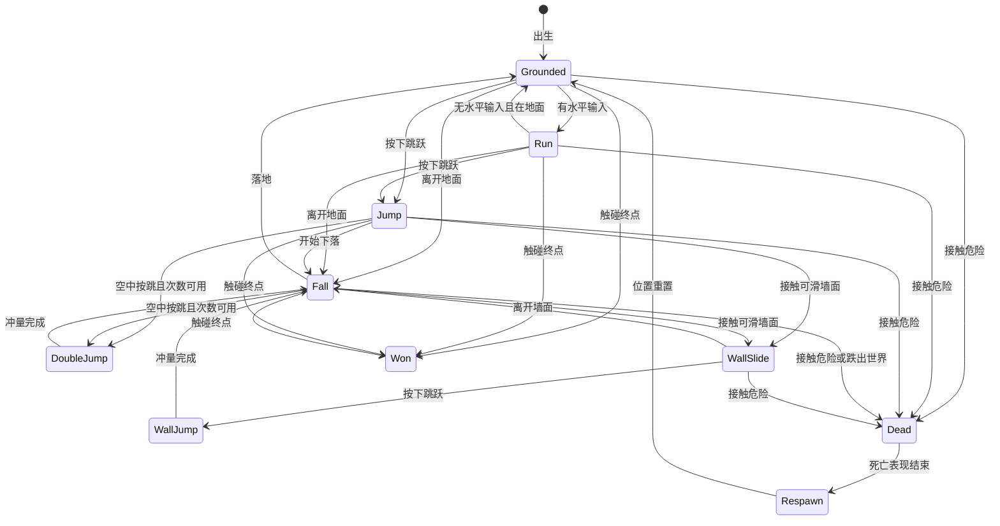
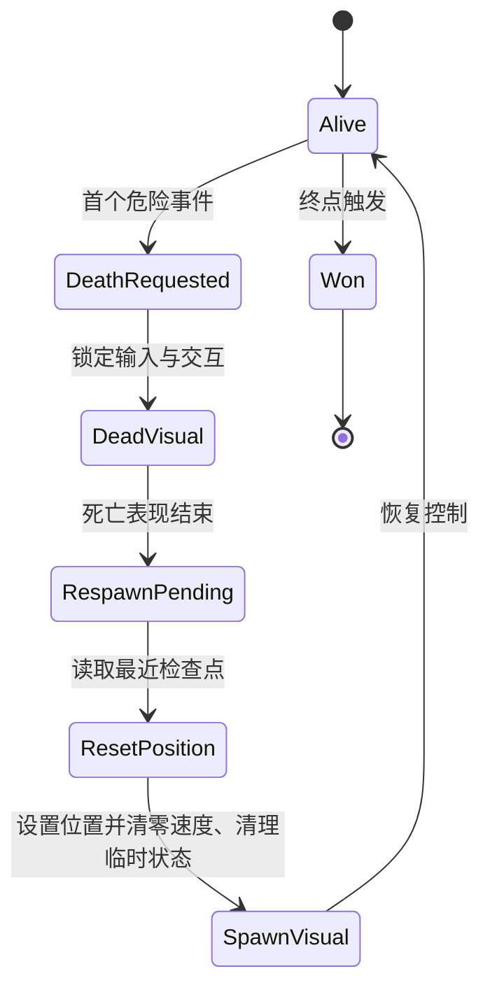

# 玩法机制规格

本文是玩法规则与数值的**唯一权威**。HUD/提示规格见 [ui-hud.md](./ui-hud.md)；关卡几何见 [level-design.md](./level-design.md)；动画素材见 [../art/asset-catalog.md](../art/asset-catalog.md)。

数值为设计目标值；实现者在证明原值不可行时可以调整，但必须记录"改了什么、为什么、验证证据"。

## 不变式（任何实现都必须成立）

- `死亡`、`胜利`、`已收集` 等一次性状态只能从未完成变为完成，不能被重复事件回退。
- 一次死亡流程结束前不能开启第二次死亡流程。
- 一个水果标识只能使计数增加一次。
- 一个终点触发器只能发出一次胜利事件、只结算一次。
- 重生位置 = 最近一次已激活的检查点；没有激活过则取起点。
- 首版没有生命数、伤害值、敌人或攻击；任何致命危险都直接进入死亡流程。

## 输入语义

| 动作 | 建议键位 | 允许状态 | 行为要求 |
|---|---|---|---|
| 左移 | A、← | 可控状态 | 目标水平速度为负 |
| 右移 | D、→ | 可控状态 | 目标水平速度为正 |
| 跳跃 | 空格、W | 可控状态 | 按条件执行基础跳、二段跳或墙跳 |
| 重开 | R | 死亡或胜利后 | 重载当前关卡会话，清空收集与检查点状态 |

- 键位是**建议**，实现者可替换，但必须至少支持键盘可玩；重开动作必须存在。
- 跳跃必须以"按键按下的瞬间"计数，不能因按住而连续触发二段跳。
- 不添加手柄、触屏、攻击、冲刺或菜单动作到首版。

## 坐标与视图

| 参数 | 目标值 | 单位 | 用途 |
|---|---:|---|---|
| 网格边长 | 16 | px | 地形与关卡坐标基准 |
| 设计视口 | 320 × 180 | px | 相机应覆盖的世界范围 |
| 玩家视觉尺寸 | 32 × 32 | px | 来自素材事实 |
| 玩家碰撞体 | 20 × 28 | px | 水平居中、底部与视觉脚底对齐 |

**像素呈现**：画面按像素艺术呈现——素材以原始像素尺寸显示，屏幕放大应为整数倍（例如 4× 对应 1280×720），避免非整数缩放造成模糊。具体分辨率与窗口策略由实现者决定。

## 玩家能力与物理参数

### 水平与重力

| 参数 | 目标值 | 单位 | 说明 |
|---|---:|---|---|
| 最大水平速度 | 120 | px/s | 左右方向最终速度 |
| 地面加速度 | 900 | px/s² | 有方向输入时 |
| 地面减速度 | 1200 | px/s² | 松开方向时 |
| 空中加速度 | 700 | px/s² | 空中水平控制 |
| 空中减速度 | 500 | px/s² | 空中松开方向 |
| 重力 | 900 | px/s² | 向下加速度 |
| 最大下落速度 | 500 | px/s | 终端速度 |

### 跳跃与墙面

| 参数 | 目标值 | 单位 | 说明 |
|---|---:|---|---|
| 基础跳跃初速度 | -320 | px/s | 向上为负 |
| 二段跳初速度 | -290 | px/s | 每次离地最多使用一次 |
| 墙跳水平速度 | 220 | px/s | 方向背离墙面 |
| 墙跳垂直速度 | -300 | px/s | 触发墙跳时 |
| 墙滑最大下落速度 | 80 | px/s | 贴墙且下落时 |
| 蹭墙容错时间 | 0.08 | s | 可选：离墙后的短时间仍可墙跳 |
| 跳跃输入缓冲 | 0.10 | s | 可选：提前按键、落地即触发 |

**派生高度参考**（供关卡设计使用，不是额外参数）：基础跳约 57px；二段跳合计约 108px；墙跳单次约再抬升 50px。

## 玩家状态与行为

图目的：说明移动、跳跃、墙面、死亡与胜利的完整状态边界。

实现要求（行为级）：

- 二段跳：落地时重置为可用一次；离地后最多消耗一次；消耗后直到落地不能再用。
- 墙滑：仅在"空中 + 接触竖直墙面 + 正在下落"时生效，下落速度被限制在上表上限以内。
- 墙跳：仅在接触墙面（或蹭墙容错窗口内）时触发；水平冲量方向背离墙面；触发后短时间内不应因反复贴墙而连续触发。
- 死亡、重生、胜利期间不读取新的移动与跳跃输入。
- 初次出生与重生走同一条位置重置路径，保证两条路径结果一致。
- 同一帧内死亡与其他事件冲突时，以"死亡/胜利状态闸门"为准：进入死亡后忽略后续收集与胜利；进入胜利后忽略后续危险。

## 动画反馈映射

动画资源见 [asset-catalog.md](../art/asset-catalog.md)；本节只规定**状态与视觉的对应关系**，具体播放速度与过渡方式由实现者决定。

| 玩家状态 | 视觉 | 选择条件 |
|---|---|---|
| 待机 | Idle | 在地面且水平速度接近零 |
| 奔跑 | Run | 有水平输入（首版可只在地面使用） |
| 上升 | Jump | 向上运动 |
| 下落 | Fall | 向下运动 |
| 二段跳 | Double Jump | 二段跳触发后播放一次 |
| 墙跳 | Wall Jump | 墙跳触发后播放一次 |
| 死亡 | Hit（必要时接消失特效） | 进入死亡流程后播放一次 |
| 胜利 | 消失特效或静止胜利姿态 | 终点触发后播放 |

关键判读：动画只表达状态，不决定行为；行为由玩法状态与碰撞事件决定。

## 死亡与重生

- 死亡流程：锁定输入与交互 → 播放死亡表现（目标时长 0.70s）→ 回到重生位置 → 恢复控制（从死亡到重新可控的目标总时长 0.70s 左右）。
- 重生时先完成位置重置，再恢复交互与监测，避免出生点与危险区重叠导致同帧二次死亡。
- 死亡表现与状态时序：

## 交互对象的行为契约

### 水果（收集品）

- 玩家接触未收集的水果时：计数 +1、该水果标记为已收集并从场景中消失、播放已存在的收集特效（可选）。
- 每个水果有唯一的会话内标识；计数前先检查标识集合，重复信号不能重复加一。
- 死亡重生不恢复已收集水果，避免刷计数。
- 水果消失有短暂延迟（用于播放特效）时，延迟期间不得再次计数。

### 尖刺（静态致命陷阱）

- 静态放置，不移动；玩家接触即进入死亡流程。
- 陷阱不直接销毁或移动玩家——它只提交死亡请求，由关卡状态决定是否接受。
- 其他陷阱素材（火焰、锯片等）不属于首版。

### 检查点

- 玩家进入未激活检查点时：记录重生位置、切换为"已激活"视觉、HUD 显示一次激活提示（提示规格见 [ui-hud.md](./ui-hud.md)）。
- 已激活的检查点再次进入不发出新的事件。
- 关卡重载会清空会话状态；不写入磁盘。

### 终点

- 玩家触碰终点触发一次：锁定输入与交互 → 播放终点目标视觉 → 显示胜利提示（见 [ui-hud.md](./ui-hud.md)）。
- 不存在下一关自动加载。

### 世界边界

- 左右边界为不可穿越的物理边界，玩家不能离开世界。
- 世界下方有死亡检测区：玩家跌出后按死亡流程处理；该区域不得与终点或地面语义重叠。

## 边界情况清单

- 同一物理帧内玩家同时接触水果与危险：以死亡状态闸门为准，死亡后不得再产生收集事件；关卡验收时应避免两者重叠放置。
- 同一物理帧内同时接触检查点与危险：检查点必须先记录激活再进入死亡；重生位置为该检查点。
- 胜利同一帧接触危险：胜利状态先锁定则忽略危险，反之亦然；必须用明确的状态闸门保证确定性。
- 玩家跌出世界下边界：按死亡处理。
- 重开关卡：清空收集集合与检查点状态，回到起点；不伪造持久化存档。
- 资源缺失/导入失败：应在运行日志中暴露具体资源路径，不得静默回退到替代素材。

## 玩法验收

- [ ] 左/右输入在地面与空中均能控制角色；角色朝向与移动方向一致。
- [ ] 基础跳高度接近 57px；二段跳在基础跳之上再抬升接近 50px；二段跳每次离地只可用一次，落地恢复。
- [ ] 贴墙下落时速度被限制；墙跳触发方向背离墙面；左右墙均可触发。
- [ ] 玩家不会穿透地形，也不会因重力、速度或碰撞体异常跌出世界（除死亡边界外）。
- [ ] 接触尖刺只触发一次死亡流程；死亡期间输入无效；重生回到最近检查点。
- [ ] 水果只计数一次；死亡重生不重复计数；已收集水果不再出现。
- [ ] 检查点只激活一次；重复进入不重复提示。
- [ ] 终点只触发一次胜利；胜利后不再响应移动、收集与危险。
- [ ] 重开动作在死亡或胜利后可用，且正确清空会话状态。
