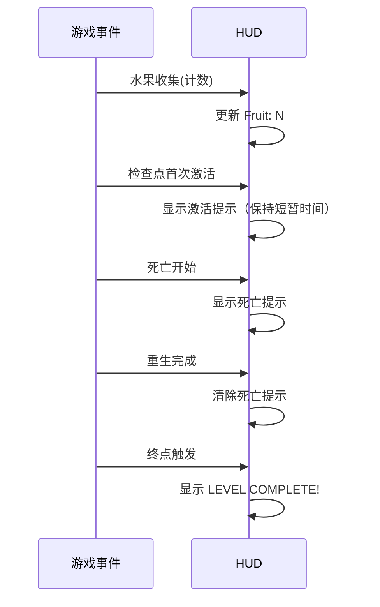

# UI 与 HUD 规格

本文规定 HUD 需要**展示什么、何时更新**。玩法规则见 [mechanics.md](./mechanics.md)；呈现方式（字体、布局、颜色）由实现者决定。

## 设计原则

- **零遮挡**：HUD 不遮挡玩家与危险物的关键判定区域（建议贴顶放置）。
- **即时反馈**：状态变化当帧或下一帧内可见；提示文字在事件结束后清除。
- **零文字教学**：关卡本身承担教学职责；HUD 只报告状态，不做教程。

## 信息契约

HUD 只消费事件，不修改玩法状态。

| 信息 | 更新时机 | 展示要求 |
|---|---|---|
| 水果计数 | 会话开始为 0；每次有效收集 +1 | 常驻显示，形如 `Fruit: N` |
| 检查点提示 | 检查点首次激活时显示 | 显示一次激活信息（含检查点标识即可） |
| 死亡提示 | 死亡流程开始时显示；重生完成后清除 | 死亡期间可见 |
| 胜利提示 | 终点触发后显示 | 持续可见，如 `LEVEL COMPLETE!` |

- 文字内容可自定（英文/中文均可），但**语义与时机**必须一致。
- 首版允许使用普通文本标签，不要求使用 `Menu/Text` 位图字体图集。
- 重开关卡后，HUD 必须恢复到初始状态（计数 0、无提示）。

## 提示时机时序

## UI 验收

- [ ] 水果计数在每次有效收集后正确 +1，重复触碰不重复计数。
- [ ] 检查点提示只在首次激活时出现且只出现一次。
- [ ] 死亡提示在死亡流程期间可见，重生完成后被清除。
- [ ] 胜利提示在终点触发后出现，且此后不再响应任何玩法事件。
- [ ] 重开后 HUD 恢复初始状态。
- [ ] HUD 不遮挡关键玩法区域（截图核对）。
