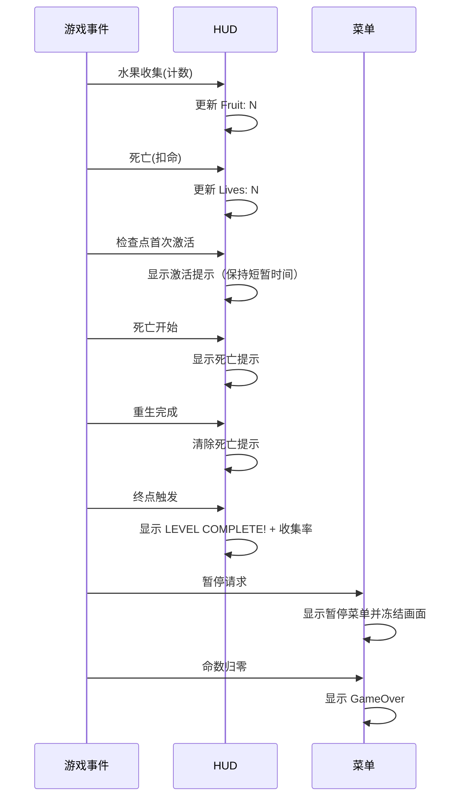

# UI 与 HUD 规格

本文规定 HUD 与各菜单需要**展示什么、何时更新**。玩法规则（含命数、解锁、暂停语义）见 [mechanics.md](./mechanics.md)；呈现方式（字体、布局、颜色）由实现者决定；菜单按钮与关卡缩略图素材见 [../art/asset-catalog.md](../art/asset-catalog.md)。

## 设计原则

- **零遮挡**：HUD 不遮挡玩家与危险物的关键判定区域（建议贴顶放置）。
- **即时反馈**：状态变化当帧或下一帧内可见；提示文字在事件结束后清除。
- **零文字教学**：关卡本身承担教学职责；HUD 与菜单只报告状态，不做教程。
- **菜单只消费状态**：菜单不直接改玩法数值，只发导航请求（继续 / 重打 / 选关 / 主菜单 / 退出游戏），由流程状态机执行切换。

## HUD 信息契约

HUD 只消费事件，不修改玩法状态。

| 信息 | 更新时机 | 展示要求 |
|---|---|---|
| 水果计数 | 本关会话开始为 0；每次有效收集 +1 | 常驻显示，形如 `Fruit: N` |
| 命数 | 整局开始为 3；死亡扣 1；通关 +1（上限 5） | 常驻显示，形如 `Lives: N` |
| 关卡名 | 进入关卡时确定 | 常驻显示，如 `Level 1` |
| 检查点提示 | 检查点首次激活时显示 | 显示一次激活信息（含检查点标识即可） |
| 死亡提示 | 死亡流程开始时显示；重生完成后清除 | 死亡期间可见 |
| 结算提示 | 终点触发后显示，含本关收集率 | 持续可见，如 `LEVEL COMPLETE! 3/3` |

- 文字内容可自定（英文/中文均可），但**语义与时机**必须一致。
- 允许使用普通文本标签，不要求使用 `Menu/Text` 位图字体图集。
- 重打本关后，HUD 必须恢复到本关初始状态（计数 0、无提示；命数不变）。
- 暂停期间 HUD 冻结显示，不更新。

## 菜单信息契约

### 主菜单（MainMenu）

| 选项 | 前置条件 | 行为 |
|---|---|---|
| Play | 常驻 | 进入最高已解锁关卡 |
| Levels | 常驻 | 进入关卡选择 |
| Quit | 常驻 | 退出游戏（关闭窗口，无残留进程） |

### 关卡选择（LevelSelect）

- 三个槽位对应 `level_01` / `level_02` / `level_03`，使用 `Levels/01.png`–`03.png` 缩略图。
- 已解锁槽位常亮可选；未解锁置灰加锁且不可选中。
- 选中已解锁槽位即载入对应关卡。

### 暂停菜单（Paused）

| 选项 | 行为 |
|---|---|
| Resume | 恢复本关（physics 与计时继续） |
| Restart | 重打本关（命数不变，收集/检查点清空） |
| LevelSelect | 退出到选关（本关进度不保存） |
| MainMenu | 退出到主菜单 |
| Quit | 退出游戏 |

- 暂停时 physics 与计时停止，HUD 冻结，输入只响应菜单。
- 暂停菜单仅在 Playing 状态可打开（Esc/P），结算与死亡流程中不可打开。

### 结算菜单（LevelComplete）

- 显示本关收集率（如 `Fruits 3/3`）与命数变化。
- 选项：Next（下一关；末关则显示全通关并回选关）、Retry（重打本关）、Levels（回选关）。
- 显示时解锁已写盘（见 [mechanics.md](./mechanics.md) 存档规则）。

### 失败菜单（GameOver）

- 命数归零时显示。
- 选项：Retry（重打本关，命数回满 3）、Levels（回选关）。

## 提示时机时序

## UI 验收

- [ ] 水果计数在每次有效收集后正确 +1，重复触碰不重复计数。
- [ ] 命数在死亡后 -1、通关后 +1（上限 5），HUD 同步更新。
- [ ] 关卡名与当前关卡一致，常驻可见。
- [ ] 检查点提示只在首次激活时出现且只出现一次。
- [ ] 死亡提示在死亡流程期间可见，重生完成后被清除。
- [ ] 结算提示在终点触发后出现，含收集率，且此后不再响应任何玩法事件。
- [ ] 主菜单三选项行为正确；Quit 退出后无残留进程。
- [ ] 选关界面未解锁槽位置灰加锁且不可选中；已解锁可进入。
- [ ] 暂停菜单五选项行为正确；暂停期间 physics 停止、HUD 冻结。
- [ ] GameOver 的 Retry 使命数回满并重打本关。
- [ ] 重打后 HUD 恢复本关初始状态（命数不变）。
- [ ] HUD 不遮挡关键玩法区域（截图核对）。
