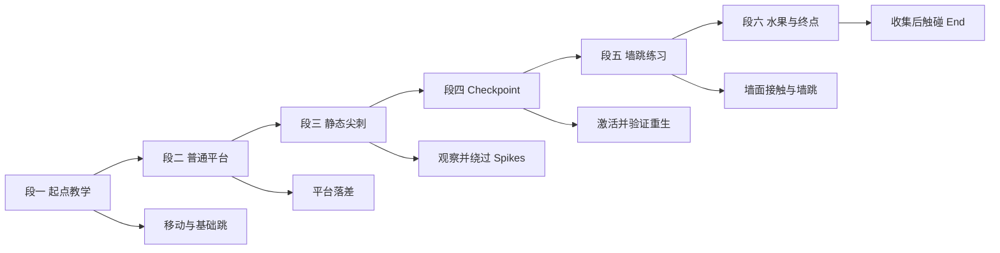
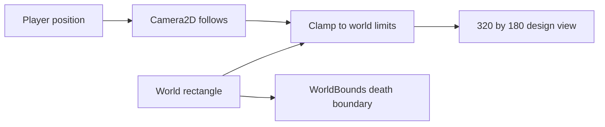

# 单关卡实例规格

本文件是唯一的关卡实例来源。所有坐标都是 `TARGET`，不是当前仓库已有的场景事实。玩法参数仍以 [gameplay-spec.md](./gameplay-spec.md) 为准。

## 权威交叉引用

- 玩法规则和玩家参数: [gameplay-spec.md](./gameplay-spec.md)。
- 节点、脚本、碰撞与创建顺序: [architecture.md](./architecture.md)。
- 资产路径、尺寸和帧数: [asset-catalog.md](./asset-catalog.md)。
- 单关卡范围和完成定义: [game-overview.md](./game-overview.md)。

## 关卡标识与坐标系

| 项目 | TARGET |
|---|---|
| 关卡 ID | `level_01` |
| 目标场景路径 | `res://scenes/main.tscn`，待创建 |
| 世界宽 | 1600 px |
| 世界高 | 320 px |
| 网格 | 16 px |
| 设计视口 | 320 x 180 px，数值权威在 `gameplay-spec.md` |
| 原点 | 世界左上角 `0,0` |
| 坐标单位 | 像素 |
| 节点位置语义 | 交互节点使用中心点；Terrain 表格使用左上角 tile 坐标 |
| 相机边界 | 左 `0`、上 `0`、右 `1600`、下 `320` |

Y 轴向下。所有实例名称使用稳定 ID，脚本不得依赖节点显示文本或 sibling 顺序。

## 关卡分段流程

图目的: 把一关拆成可逐段验收的路线，每段只引入一个新的操作重点。



关键判读: 每段都能独立复现一个验收目标；不在一段中同时引入未实现的移动平台、火焰或其他动态机关。

## 场景树实例

```text
Main
  Background
  World
    Terrain
    WorldBounds
    FallDeath
    Hazards
      Spike_01
    Collectibles
      Fruit_Apple_01
    Progress
      Start_01
      Checkpoint_01
      End_01
  Actors
    Player
  Camera2D
  LevelState
  UILayer
    HUD
```

| 节点名 | 类型 | 目标位置或范围 | 资源 |
|---|---|---|---|
| `Start_01` | Marker2D 或 Node2D | `96,240` 中心点 | `res://assets/Items/Checkpoints/Start/Start (Idle).png` |
| `Checkpoint_01` | Area2D | `768,192` 中心点 | `res://assets/Items/Checkpoints/Checkpoint/Checkpoint (No Flag).png`，可选过渡和循环路径见资产目录 |
| `End_01` | Area2D | `1504,240` 中心点 | `res://assets/Items/Checkpoints/End/End (Idle).png` 与 `res://assets/Items/Checkpoints/End/End (Pressed) (64x64).png` |
| `Fruit_Apple_01` | Area2D | `432,192` 中心点 | `res://assets/Items/Fruits/Apple.png` |
| `Spike_01` | Area2D | `560,272` 中心点 | `res://assets/Traps/Spikes/Idle.png` |
| `Player` | CharacterBody2D | 初始从 `Start_01` 读取 | `res://assets/Main Characters/Pink Man/` 下的动画组 |
| `Camera2D` | Camera2D | 跟随 Player | 无额外 PNG |

## Terrain 摆放表

以下表格是目标 TileMap 几何，不规定图集中的 tile ID。tile ID 必须在 Godot TileSet 配置后记录并验证，不能凭猜测填入。

| 区域 ID | tile 左上坐标 | tile 尺寸 | 用途 | 碰撞 |
|---|---|---|---|---|
| `ground_a` | `(0,17)` | `20 x 3` | 起点到第一段地面 | 全部实体 tile |
| `platform_a` | `(8,14)` | `6 x 1` | Start 上方低平台 | 顶部可站立 |
| `ground_b` | `(20,17)` | `16 x 3` | 第一落差后的地面 | 全部实体 tile |
| `platform_b` | `(25,13)` | `6 x 1` | 水果路线平台 | 顶部可站立 |
| `ground_c` | `(36,17)` | `18 x 3` | Spikes 前的安全地面 | 全部实体 tile |
| `ground_d` | `(54,17)` | `20 x 3` | Checkpoint 前后通道 | 全部实体 tile |
| `wall_left` | `(60,11)` | `1 x 6` | 墙跳练习左墙 | 全部实体 tile |
| `wall_right` | `(68,11)` | `1 x 6` | 墙跳练习右墙 | 全部实体 tile |
| `platform_c` | `(61,13)` | `7 x 1` | 墙跳中间落脚点 | 顶部可站立 |
| `ground_e` | `(74,17)` | `26 x 3` | 终点前安全路线 | 全部实体 tile |

空隙区域下方必须由 `WorldBounds` 或死亡边界覆盖，不能让玩家掉出后永远不触发死亡。Terrain 图块具体外观和碰撞多边形以 [asset-catalog.md](./asset-catalog.md) 及 Godot 中的 TileSet 配置为准。

## 关键坐标表

坐标是节点中心点。像素坐标必须落在 16 px 网格或能解释为角色中心偏移的位置。

| ID | 类型 | 中心坐标 | 交互尺寸 TARGET | 行为 |
|---|---|---:|---:|---|
| `start_01` | Start | `96,240` | 64 x 64 视觉 | 玩家初始出生位置 |
| `fruit_apple_01` | Fruit | `432,192` | 32 x 32 视觉，触发盒待调 | 计数加一并移除 |
| `spike_01` | Hazard | `560,272` | 16 x 16 视觉，触发盒待调 | 接触即死 |
| `checkpoint_01` | Checkpoint | `768,192` | 64 x 64 视觉，触发盒待调 | 保存会话内重生点 |
| `end_01` | End | `1504,240` | 64 x 64 视觉，触发盒待调 | 只触发一次胜利 |

### 安全性说明

- `spike_01` 放置在 `ground_c` 的安全跳跃路线中，玩家可以从地面或平台绕过；首次验收不要求故意触碰。
- `checkpoint_01` 必须位于无危险、可站立表面上，避免重生即死亡。
- `end_01` 前保持连续安全地面，让终点逻辑可以独立验收。
- 实际视觉锚点、碰撞盒和地面高度在 Godot 中以运行结果校准，若需要偏移，只更新本表和场景实例。

## 相机与边界

图目的: 说明相机跟随范围，防止视口露出关卡外部或被玩家带出世界。



关键判读: Camera2D 只负责视口跟随和边界夹取，掉出世界的死亡由 `FallDeath` 处理，不把相机边界误当成死亡碰撞。

目标设置:

- `Camera2D.limit_left = 0`。
- `Camera2D.limit_top = 0`。
- `Camera2D.limit_right = 1600`。
- `Camera2D.limit_bottom = 320`。
- 相机不得因为胜利或死亡继续跟随到世界外。
- `WorldBounds` 的死亡检测应覆盖世界下方，具体触发高度需要在运行时 `VERIFY`，不能让它与 End 或地面重叠。

## 关卡创建步骤

1. 创建 `res://scenes/main.tscn`，按场景树建立根节点和容器。
2. 创建 Terrain TileSet，导入 `res://assets/Terrain/Terrain (16x16).png`，配置一个物理层和首版实体 tile。
3. 按 Terrain 摆放表填充地面、平台和墙。
4. 创建 `Player` 场景，使用 Pink Man 的 SpriteFrames，配置玩法规格中的碰撞盒。
5. 创建 Start、Fruit、Spike、Checkpoint、End 实例，名称严格使用本文件的 ID。
6. 按关键坐标表设置位置，设置相机四个边界。
7. 创建 `LevelState` 和 HUD，连接 gameplay spec 中的事件契约。
8. 创建输入动作并保存项目设置；当前项目没有输入动作，所以这一步是 TODO。
9. 在世界下方创建 `FallDeath` Area2D，确认掉出关卡能进入同一死亡流程。
10. 保存场景，设置主场景，运行并按验收路线逐段检查。

## 逐步验收路线

### 正常通关

1. 从 `Start_01` 出生，确认玩家站在地面且 HUD 水果计数为零。
2. 向右移动并跳上 `platform_a`，确认角色从 Idle 切到 Run 和 Jump。
3. 触碰 `Fruit_Apple_01`，确认计数变为一且再次经过不会增加。
4. 绕过 `Spike_01`，确认碰撞盒没有误触危险。
5. 触碰 `Checkpoint_01`，确认一次激活和一次 HUD 提示。
6. 完成墙跳段，确认左右墙均可作为墙跳条件。
7. 触碰 `End_01`，确认显示胜利并锁定控制。

### 死亡重生

1. 重新加载关卡，从 Start 经过 Checkpoint。
2. 主动触碰 `Spike_01`，确认死亡动画、输入锁定和一次死亡事件。
3. 确认重生位置是 `Checkpoint_01`，不是 Start。
4. 确认 Apple 不会重新计数。
5. 重复触碰危险，确认每次死亡都能完整重置而不会叠加回调。

### 边界和幂等

- 从左边界向左移动，玩家不能离开相机和世界。
- 从世界下方掉落，按死亡路径重生。
- 多次进入 Checkpoint，不重复激活。
- 多次进入 End，不重复显示或发出胜利事件。
- 死亡后同帧的收集和终点事件按玩法规格闸门处理。

## 关卡验收清单

- [ ] 所有实例名和坐标与本文件一致。
- [ ] 关卡只有一张，没有 50 关解锁或下一关逻辑。
- [ ] 初始路线至少包含移动、基础跳跃、水果和静态危险。
- [ ] Checkpoint 可激活，死亡后可重生。
- [ ] End 可到达且只触发一次。
- [ ] 视口和相机边界正确。
- [ ] 使用的每个 PNG 都能在 [asset-catalog.md](./asset-catalog.md) 找到。
