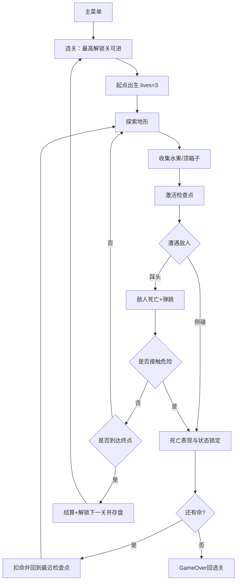

# 一页纸设计（One-Page Design）

| 项目 | 内容 |
|---|---|
| 暂定名 | 《Pink Man 大冒险》 |
| 类型 | 2D 横版平台跳跃（3 关卡，马里奥-like） |
| 引擎与平台 | Godot 4.x；桌面键鼠；像素艺术 |
| 单关时长 | 2–5 分钟（熟练）；整局约 10–15 分钟 |
| 目标体验 | 紧凑、爽快、低惩罚的跳跃手感，踩头打怪的爽快感与逐关解锁的收集成就感 |
| 状态 | 设计规格（TARGET），本工程为插件测试床 |

## 一句话

在三张横向关卡里，用**跳跃、二段跳、墙跳与踩头**越过地形、尖刺与巡逻敌人，顶箱子、收集水果、激活检查点，抵达终点解锁下一关。

## 概念与钩子

- **钩子**：两件事做到位——**跳跃手感**与**踩头打怪**。移动/二段跳/墙滑/墙跳围绕"精准但宽容的操控反馈"设计；敌人围绕"可踩可躲、风险可读"设计。
- **低惩罚重试**：危险碰到即死，但检查点 + 3 条命让重试成本接近零；鼓励玩家"再来一次"。
- **零文字教学**：第一关第一段地形本身就是教学——低平台教基础跳，落差教二段跳，双墙教墙面互动，第一只巡逻怪教踩头。
- **渐进解锁**：通关即解锁下一关并写盘保存；选关界面用缩略图展示进度，未解锁置灰上锁。

## 设计支柱

1. **可预期**：数值与判定稳定，同样的输入永远得到同样的结果。
2. **宽容**：输入缓冲、蹭墙容错、踩头容差等辅助机制让"差一点"的输入也能成功。
3. **清晰**：危险物、可交互物、敌人状态在视觉上一眼可辨；死亡、胜利、暂停的反馈即时且明确。

## 核心循环

## 范围速览

| 做 | 不做 |
|---|---|
| 3 关卡、关卡选择、解锁存盘 | 皮肤界面、50 关全量 |
| 默认角色 Pink Man | 角色切换 |
| 左右移动、基础跳、二段跳、墙滑、墙跳、踩头弹跳 | 冲刺、攻击、攀爬 |
| 静态尖刺、巡逻石怪、轨道锯、定时火、水果、问号箱、检查点、终点 | Boss、NPC、动态 Boss 机关 |
| 主菜单/选关/暂停/结算/GameOver 菜单与 HUD（计数、命数、关卡名） | Settings、音量、成就、排行 |
| 命数系统（3 命，通关 +1 上限 5） | 计时竞速 |

## 成功标准

- 玩家能从主菜单进关、通关三关并解锁全部，且六条路线（正常通关 / 死亡重生 / 幂等边界 / 菜单解锁 / 暂停退出 / 命尽 GameOver）全部可复验。
- 跳跃段存在可实际操作通过的路线；墙面可触发墙滑与墙跳；每只巡逻怪都可踩死也可绕过。
- 删档即重锁：删除 `user://save.cfg` 后选关回到仅第一关解锁。
- 涉及画面效果的验收项有编辑器/游戏运行截图证据。
- 作为插件测试床：全过程仅通过 MCP 工具完成对工程文件的创建与修改，并能据此产出对插件能力的客观评估。
