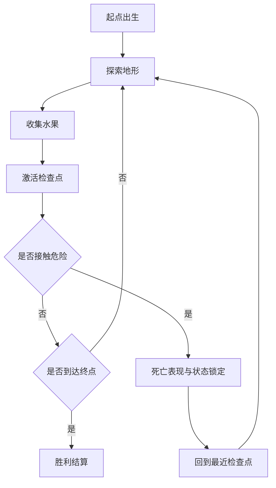

# 一页纸设计（One-Page Design）

| 项目 | 内容 |
|---|---|
| 暂定名 | 《Pink Man 的单关冒险》 |
| 类型 | 2D 横版平台跳跃（单关卡） |
| 引擎与平台 | Godot 4.x；桌面键鼠；像素艺术 |
| 单局时长 | 1–3 分钟（熟练） |
| 目标体验 | 紧凑、爽快、低惩罚的跳跃手感练习 |
| 状态 | 设计规格（TARGET），本工程为插件测试床 |

## 一句话

在一张 1600×320 像素的横向关卡里，用**跳跃、二段跳与墙跳**越过地形与尖刺，收集水果、激活检查点，抵达终点。

## 概念与钩子

- **钩子**：只做一件事并做到位——**跳跃手感**。所有系统（移动、二段跳、墙滑、墙跳）都围绕"精准但宽容的操控反馈"设计。
- **低惩罚重试**：危险是静态的、碰到即死，但检查点让重试成本接近零；鼓励玩家"再来一次"。
- **零文字教学**：第一段地形本身就是教学——低平台教基础跳，落差教二段跳，双墙教墙面互动。

## 设计支柱

1. **可预期**：数值与判定稳定，同样的输入永远得到同样的结果。
2. **宽容**：输入缓冲、蹭墙容错等辅助机制让"差一点"的输入也能成功。
3. **清晰**：危险物与可交互物在视觉上一眼可辨；死亡与胜利的反馈即时且明确。

## 核心循环

## 范围速览

| 做 | 不做 |
|---|---|
| 单关卡、默认角色 Pink Man | 多关卡、关卡选择、皮肤界面 |
| 左右移动、基础跳、二段跳、墙滑、墙跳 | 冲刺、攻击、攀爬 |
| 静态尖刺、水果、检查点、终点 | 敌人、Boss、NPC、动态机关 |
| 基础 HUD（计数与提示） | 菜单系统、音频、存档、成就 |

## 成功标准

- 玩家能从起点到终点完整通关，且三条路线（正常通关 / 死亡重生 / 幂等边界）全部可复验。
- 跳跃段（含双墙）存在可实际操作通过的路线；墙面可触发墙滑与墙跳。
- 涉及画面效果的验收项有编辑器/游戏运行截图证据。
- 作为插件测试床：全过程仅通过 MCP 工具完成对工程文件的创建与修改，并能据此产出对插件能力的客观评估。
