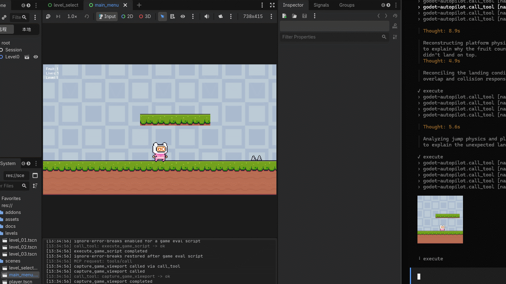

# Godot-Autopilot

[](LICENSE)
[](https://github.com/jesspig/Godot-Autopilot/actions)


[](https://modelcontextprotocol.io/)


> **Let an AI agent build, playtest, and debug your Godot game — from inside the editor.**

[中文版说明](README.md)

Godot-Autopilot is an [MCP](https://modelcontextprotocol.io/) server that lives **inside the Godot editor** as a plugin. Once installed, your AI coding assistant (Claude Code, Cursor, Codex, OpenCode, …) can operate your project the way you do: build scenes, tweak properties, run the game, press buttons, take screenshots, and read the logs — then iterate on what it sees.

No bridge process, no copy-pasting errors into a chat window. The server starts when your project opens and stops when it closes.

## End-to-end demo

AI controlling a game character in real time during end-to-end tests:



## What it can do

Over **385 tools** covering the whole editor-to-game loop (the exact count grows with each version — ask the agent to check via `search_tools`). Highlights:

- **Build scenes** — create, rename, move, and delete nodes; read and write properties; connect signals (e.g. `create_scene_node`, `property_set`, `signal_connect`, `scene_tree_items`).
- **Look, sound, and feel** — meshes and materials, lights and environments, audio playback, animations, UI themes, tilemaps (e.g. `create_animation`, `play_audio_player`, `fill_tilemap_rect`).
- **Physics and navigation** — ray/shape casts, rigid bodies, navigation maps and path queries (e.g. `intersect_physics_3d_ray`, `create_nav_3d_map`, `get_nav_3d_map_path`).
- **Hands: input and UI automation** — simulate keys, mouse, and gamepad; click editor controls by name; run editor shortcuts; click buttons in the running game (e.g. `click_input_mouse`, `get_editor_ui_elements`, `click_editor_element`, `run_editor_shortcut`, `click_game_ui_element`).
- **Scripts and debugging** — run GDScript in the editor or in the game, launch long game scripts as background jobs, read plugin/game/script-error logs (e.g. `execute_script`, `execute_game_script`, `start_game_job`, `get_plugin_log`).
- **Project and knowledge** — read/search project files, inspect project settings, query the engine's built-in API docs offline (e.g. `read_file`, `find_in_files`, `get_project_settings`, `get_docs_class`).
- **Play and verify visually** — launch the current scene, inject timed input sequences, screenshot the editor and the game, and diff before/after (e.g. `play_editor_current_scene`, `queue_game_input`, `capture_editor_viewport`, `capture_game_viewport`, `review_scene_visually`).

## How the agent works with it

You don't need to memorize tool names. The agent follows a simple loop:

1. **Discover** — `search_tools` to find candidates, `get_tool_detail` to confirm parameters (never guess names).
2. **Act** — `call_tool` for one step, `batch_execute` for a batch.
3. **Verify** — screenshot the result, compare with the previous capture, fix, and repeat.

To make agents good at this out of the box, the plugin ships **8 skill books** (scenes, resources, scripting, runtime, servers, content, C#, plus an overview) and **7 starter guides** (3D scene, character controller, physics debugging, input map, GUI, …). One click in the **MCP Config** panel renders the skills into your project's `.agents/skills/`.

Two editor panels come with the plugin:

- **MCP Config** — server status and port, one-click client configuration, capability switches, skill generation.
- **Log** — plugin-only log with level/category filters and search, so misbehaving calls are easy to trace.

## Getting started

Requires **Godot 4.7+**.

1. **Get the plugin** — download `godot-autopilot-<version>.zip` from the project's GitHub Releases page ([jesspig/Godot-Autopilot](https://github.com/jesspig/Godot-Autopilot)) and copy the `godot-autopilot/` folder into your project's `addons/` directory:
   ```
   your-project/
   └── addons/
       └── godot-autopilot/
           ├── godot-autopilot.dll      (Windows)
           ├── libgodot-autopilot.so    (Linux)
           ├── libgodot-autopilot.dylib (macOS)
           └── godot-autopilot.gdextension
   ```
2. **Open your project** — the server starts automatically on the port from the plugin settings (default `http://127.0.0.1:9527/mcp`). No enable toggle needed.
3. **Connect your AI client** — in the editor's **MCP Config** panel, pick your client and click **Generate**. 20 clients are supported, including Claude Code, Codex, Cursor, OpenCode, and Copilot. Approve the generated config file in the client if it asks.
4. **Unlock powerful capabilities (optional)** — script execution (`code_execute`) and game control (`game_runtime`) are off by default; tick them in the panel when you need them.
5. **Ask for something** — e.g. “create a player character that can run and jump, then playtest it and fix what looks wrong.”

Want to build from source or contribute? See [docs/wiki/](docs/wiki/) (start at [index.md](docs/wiki/index.md), building at [build.md](docs/wiki/build.md)) and [tests/README.md](tests/README.md).

## Safety notes

The server only listens on your machine's loopback address (port from the plugin settings, 9527 by default, fixed path `/mcp`) and refuses non-local addresses. Script execution, game control, and OS process tools are **denied by default** — enable them only in a local project you trust. Details: [docs/wiki/security_contract.md](docs/wiki/security_contract.md).

## Asset attribution

The `Example/` test project uses pixel art from [Pixel Adventure 1](https://pixelfrog-assets.itch.io/pixel-adventure-1) by Pixel Frog.

## License

MIT
