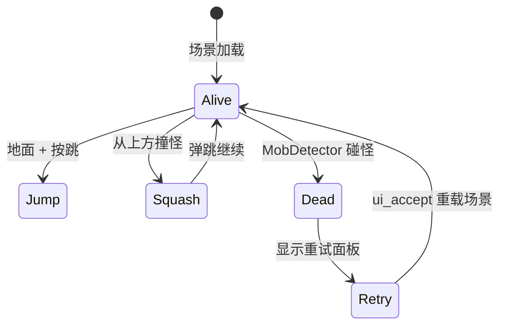

# 玩法机制实录

本文是玩法规则与数值的**唯一权威**。HUD 规格见 [ui-hud.md](./ui-hud.md)；关卡几何见 [level-design.md](./level-design.md)；资产见 [../art/asset-catalog.md](../art/asset-catalog.md)；接线见 [../tech/tdd.md](../tech/tdd.md)。

全部数值直接抄自磁盘脚本与源库工程原件；记录的是现状，不存在"目标值"。

## 不变式（代码实际保证的）

- 一只 Mob 只结算一次：`squash()` 发出信号后立即 `queue_free`；`Player.gd` 压扁分支命中后 `break`，防止一帧多发。
- 出屏 Mob 销毁：`VisibleOnScreenNotifier3D.screen_exited` → `queue_free`。
- 玩家死亡即移除：`die()` 发出 `hit` 后 `queue_free`；Main 收到 `hit` 后停止 `MobTimer` 并显示重试。
- 重试即整场景重载：`get_tree().reload_current_scene()`，分数与生成状态全部重置。

## 输入语义（源库原件）

源库原件指源库 `3d/squash_the_creeps/project.godot` 的 `[input]` 节；工作树内 `project.godot` 已被清洗为最小模板，无 `[input]` 节（见 [tdd.md](../tech/tdd.md)）。

| 动作 | 键盘 | 鼠标/手柄 | 说明 |
|---|---|---|---|
| move_left | 左方向键、A | 左摇杆 X 轴负向 | deadzone 0.2 |
| move_right | 右方向键、D | 左摇杆 X 轴正向 | deadzone 0.2 |
| move_forward | 上方向键、W | 左摇杆 Y 轴负向 | deadzone 0.2 |
| move_back | 下方向键、S | 左摇杆 Y 轴正向 | deadzone 0.2 |
| jump | 空格（physical_keycode 32） | 鼠标右键（button_index 2）、手柄按钮 0（A/Cross） | deadzone 0.2 |

- 重试确认：`ui_accept`（引擎内置动作，本工程未自定义；`Main.gd` 在 `_unhandled_input` 中监听，玩家死亡后重试面板可见时按确认键重载场景；官方 README 与重试 Label 文字均写"按空格或回车重试"）。
- 键位细节以源库原件的 `InputEventKey`/`InputEventJoypadMotion`/`InputEventMouseButton`/`InputEventJoypadButton` 条目为准；上表只转述人类可读部分。

## 玩家能力与物理参数（`Player.gd` 导出变量）

| 参数 | 值 | 单位 | 说明 |
|---|---:|---|---|
| speed | 14 | 米/秒 | 水平移动速度（`velocity.x/z = direction * speed`） |
| jump_impulse | 20 | 米/秒 | 地面跳跃垂直初速度（`velocity.y += jump_impulse`） |
| bounce_impulse | 16 | 米/秒 | 压扁成功后的弹跳速度（`velocity.y = bounce_impulse`） |
| fall_acceleration | 75 | 米/秒² | 每帧施加的重力（`velocity.y -= fall_acceleration * delta`） |

行为补充（`Player.gd` 原文行为）：

- 方向由四个移动动作合成后归一化；移动时 `basis = Basis.looking_at(direction)` 转向，`AnimationPlayer.speed_scale = 4`，静止时为 1。
- 跳跃仅在 `is_on_floor()` 且本帧按下跳跃时触发。
- 跳跃弧线表现：`rotation.x = PI / 6 * velocity.y / jump_impulse`（前倾/后仰，未核实实际观感）。

## 挤压判定（`Player.gd` 第 48–62 行）

- 判定入口：`move_and_slide()` 之后遍历本帧全部 `get_slide_collision_count()` 碰撞。
- 目标过滤：`collision.get_collider().is_in_group(&"mob")`（`Mob.tscn` 根节点确在 `mob` 组）。
- 顶部判定：`Vector3.UP.dot(collision.get_normal()) > 0.1` 时视为从上方落地。
- 成功：`mob.squash()`（Mob 发出 `squashed` 并自删），玩家 `velocity.y = bounce_impulse`，`break`（一只怪只加一分）。
- 失败侧：非顶部接触不触发此分支；玩家死亡改由 `MobDetector`（Area3D）`body_entered` → `die()` 处理。

## 敌人生成（`Main.gd` 第 27–42 行）

| 参数 | 值 | 说明 |
|---|---|---|
| 生成间隔 | 0.5 秒 | `MobTimer.wait_time = 0.5`，`autostart = true` |
| 生成位置 | `SpawnPath/SpawnLocation`，`progress_ratio = randf()` | 路径几何见 [level-design.md](./level-design.md) |
| 朝向 | `mob.initialize(生成点, 玩家位置)` | 详见下节 |
| 计分接线 | 每次生成后 `mob.squashed.connect($UserInterface/ScoreLabel._on_Mob_squashed)` | 一怪一连 |

## 小怪行为（`Mob.gd`）

| 参数 | 值 | 说明 |
|---|---|---|
| min_speed | 10.0 米/秒 | 随机速度下限 |
| max_speed | 18.0 米/秒 | 随机速度上限 |
| 朝向扰动 | ±45 度（`randf_range(-PI/4, PI/4)`） | 不直冲玩家，带随机偏角 |
| 动画速率 | `random_speed / min_speed` | 越快的小怪浮动动画越快 |

- `initialize()` 忽略玩家高度（取玩家 x/z、生成点 y），`look_at_from_position` 后加随机偏航，速度为 `Vector3.FORWARD * 随机值` 再绕 Y 轴旋转。
- `_physics_process` 仅 `move_and_slide()`，直线冲锋，无追踪、无跳跃。
- `squash()`：发出 `squashed` → `queue_free`。
- 出屏：`VisibleOnScreenNotifier3D.screen_exited` → `queue_free`。

## 计分与失败（`ScoreLabel.gd`、`Main.gd`）

- 计分：`score += 1`，`text = "Score: %s" % score`，初始 `score = 0`；Main 场景 Label 初始文字为 `"Score: 0"`。
- 失败：`Player.hit` → Main `_on_player_hit` → `$MobTimer.stop()` + `$UserInterface/Retry.show()`。
- 重试：`_unhandled_input` 中 `event.is_action_pressed(&"ui_accept")` 且重试面板可见 → `reload_current_scene()`。`_ready()` 中默认 `$UserInterface/Retry.hide()`。

## 玩家状态简图（按代码整理）

## 边界情况清单

- 同一帧撞多只怪：`break` 保证只结算第一只，其余同帧忽略。
- 压扁与被撞同帧：压扁分支走 `move_and_slide` 碰撞循环，被撞走 `MobDetector` 的 `body_entered`；两者竞态时序未核实，文档不裁决，以实际运行为准。
- 玩家被删后：Main 已停表并显示重试，不再生成新怪；旧怪直线冲锋，出屏自删。
- 重试：整场景重载，分数/位置/生成器全部回到初始态，无持久化数据（磁盘上无存档文件与存档代码）。
- 资源缺失：`mob_scene` 为导出 `PackedScene`，若未指定则生成时报错；当前 `Main.tscn` 已指定为 `Mob.tscn`，属实。

## 玩法验收索引

可执行验证点不在此展开，见 [../test/acceptance.md](../test/acceptance.md)（移动、跳跃、压扁得分、被撞重试、生成、出屏销毁、音乐自动播放）。
