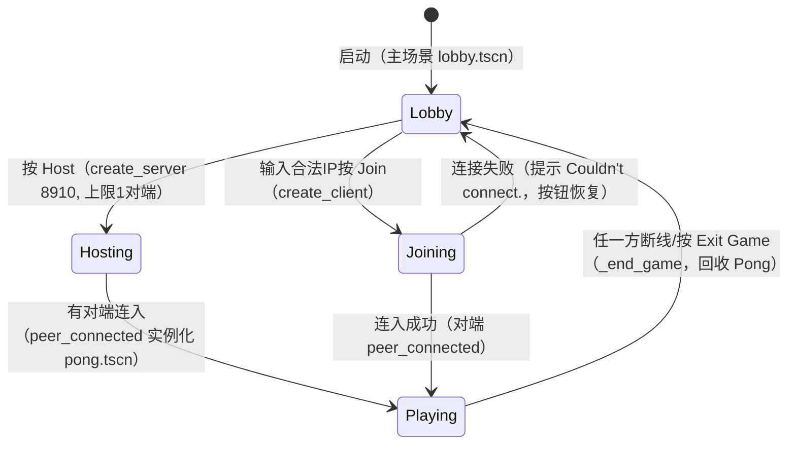

# 玩法与联机机制规格

本文是规则、参数与同步机制的**唯一权威**。界面文案见 [ui-hud.md](./ui-hud.md)；球场坐标见 [level-design.md](./level-design.md)；资产见 [../art/asset-catalog.md](../art/asset-catalog.md)；RPC 总表见 [../tech/tdd.md](../tech/tdd.md)。

数值来自磁盘源码（`logic/*.gd`）与源库原件 `project.godot`；凡未运行验证的运行时行为标注"未核实"。

## 不变式（任何验证都必须成立）

- 单房间最多 2 人（server 上限 1 个对端）。
- 球拍权限固定：左拍归 server、右拍归 client；非权限方只做位置跟随，不读输入。
- 球的左右出界各自由"自己一侧"的权限方判定（server 判左、client 判右）。
- 得分只通过 `update_score` RPC 递增；先到 10 分者胜，胜负只结算一次（胜后球停止）。
- 一局结束后必须回收 `/root/Pong` 并恢复大厅按钮可用；不断连残留 peer。

## Host/Join 流程

| 参数 | 目标值 | 来源 |
|---|---:|---|
| 默认端口 `DEFAULT_PORT` | 8910 | `logic/lobby.gd:6` |
| 单房对端上限 | 1 | `logic/lobby.gd:91` |
| 压缩 | `COMPRESS_RANGE_CODER` | `logic/lobby.gd:96,117` |
| 地址默认值 | `127.0.0.1` | `lobby.tscn:76` |

行为要求（按代码原样）：

- Host 成功：两按钮禁用、状态行显示 `Waiting for player...`、窗口标题追加 `: Server`、端口转发提示与公网 IP 链接可见。
- Join：先校验 `is_valid_ip_address`，非法显示 `IP address is invalid.` 并直接返回；合法则建 client、状态行显示 `Connecting...`、标题追加 `: Client`。
- 连接失败：状态行显示 `Couldn't connect.`，清空 peer，两按钮恢复可用。
- 任一方断线：server 侧按 `Client disconnected.`、client 侧按 `Server disconnected.` 结束（未核实：实际双实例断线文案，需运行时截图确认）。
- `_connected_ok` 为空实现（注释说明本工程不需要）。

## 对战与权限

- `pong.gd:_ready`：server 把 `Player2` 的 multiplayer 权限交给 `get_peers()[0]`；client 把 `Player2` 权限交给自己（`get_unique_id()`）。`Player1` 默认归 server（未核实：依赖"server 节点默认继承 master"的注释假设）。
- 球（`Ball`）权限默认归 server，但两侧都在本地仿真运动；权限只决定"谁判哪一侧出界"。

## 球运动与出界

| 参数 | 目标值 | 单位 | 来源 |
|---|---:|---|---|
| 初始速度 `DEFAULT_SPEED` | 100.0 | px/s | `logic/ball.gd:3` |
| 每帧加速 | `+delta`（即每秒 +1） | px/s² | `logic/ball.gd:12` |
| 弹跳加速 | `×1.1` | — | `logic/ball.gd:52` |
| 初始方向 | 左 | — | `logic/ball.gd:5` |

行为要求（按代码原样）：

- 未停止时每帧 `translate(_speed * delta * direction)`；上下出屏（`y<0` 且上行，或 `y>高` 且下行）反转 `direction.y`。
- 左侧出界（`x<0`）仅由 server 判定：`update_score.rpc(false)`（右方得分）+ `_reset_ball.rpc(false)`（向右发球）。
- 右侧出界（`x>宽`）仅由 client 判定：`update_score.rpc(true)`（左方得分）+ `_reset_ball.rpc(true)`（向左发球）。
- `bounce(left, random)`：`left` 为真则 `direction.x` 取正（向右），否则取负；`direction.y = random*2-1` 后归一化；由击球拍的权限方经 `_on_paddle_area_enter` 以 `randf()` 发起。
- `_reset_ball`：回中点、速度回 100（方向按上条）。
- `stop`：胜负后冻结球运动。

## 球拍

| 参数 | 目标值 | 单位 | 来源 |
|---|---:|---|---|
| 移动速度 `MOTION_SPEED` | 150 | px/s | `logic/paddle.gd:3` |
| 垂直钳制 | 16 ～ 高−16 | px | `logic/paddle.gd:32` |
| 同步方式 | `unreliable` RPC 逐帧发位置+速度 | — | `logic/paddle.gd:24,36` |

行为要求：权限方读 `Input.get_axis(move_up, move_down)`，首次有输入时隐藏自己拍上的 `You` 标签；非权限方首帧即隐藏 `You` 标签。碰撞（`area_entered`）仅权限方处理并发起 `bounce`。

## 输入语义

源库原件 `project.godot` 的 `[input]`（工作树当前为最小模板，无此段，见 [../tech/tdd.md](../tech/tdd.md)）：

| 动作 | 键位（原件） | 手柄（原件） | 用途 |
|---|---|---|---|
| `move_up` | Up（物理键 4194320）、W（87） | 手柄按钮 11、上摇杆上（axis1 −1） | 球拍上移 |
| `move_down` | Down（物理键 4194322）、S（83） | 手柄按钮 12、下摇杆下（axis1 +1） | 球拍下移 |
| 死区 | 0.2 | — | 两动作共用 |

- 大厅按钮为鼠标点击（Host/Join/Exit Game/FindPublicIP）；退出对战经 `ExitGame` 按钮（`game_finished` 信号 → 大厅 `_end_game`）。

## 记分与胜负

| 参数 | 目标值 | 来源 |
|---|---|---|
| 胜分 `SCORE_TO_WIN` | 10 | `logic/pong.gd:5` |

- `update_score(add_to_left)` 为 `any_peer + call_local`：真则左分 +1 并刷新 `ScoreLeft`，否则右分 +1 刷新 `ScoreRight`。
- 任一比分到 10：显示同侧 `WinnerLeft`/`WinnerRight`（`The Winner!`）、显示 `ExitGame`、对 `Ball` 发起 `stop.rpc()`。
- 按 `ExitGame`：发射 `game_finished`，大厅 `_end_game` 回收 `/root/Pong`、显示大厅、清空 peer、恢复按钮。

## 边界情况清单

- 端口被占用：Host 显示 `Can't host, address in use.` 并直接返回（peer 已创建但未挂载，未核实：残留 peer 是否影响下一次 Host）。
- 非法 IP：Join 直接返回，不建 peer。
- 高延迟下两侧球位置可能轻微不一致（设计如此，注释原文见 `logic/ball.gd:13-15`）；出界判定分侧承担以避免跨端误判。
- 胜负同帧再进球：`stop` 后 `_process` 不再位移，但 `update_score` 本身无胜后守卫（未核实：胜负后是否可能多加分，需运行时确认）。

## 玩法验收（摘要，完整版见验收）

- [ ] Host 显示等待文案、Join 非法 IP 被拒、无 Join 时不开局。
- [ ] 双实例开局后双方各控一拍，上下输入方向正确，拍不出上下界。
- [ ] 球上下边反弹、过拍后加速、左右出界记分方向正确（左出界右得分）。
- [ ] 先到 10 分出现胜负标签 + Exit Game，球停住；按 Exit 回大厅且按钮可用。
- [ ] 任一方断线，另一方回大厅并显示原因。
