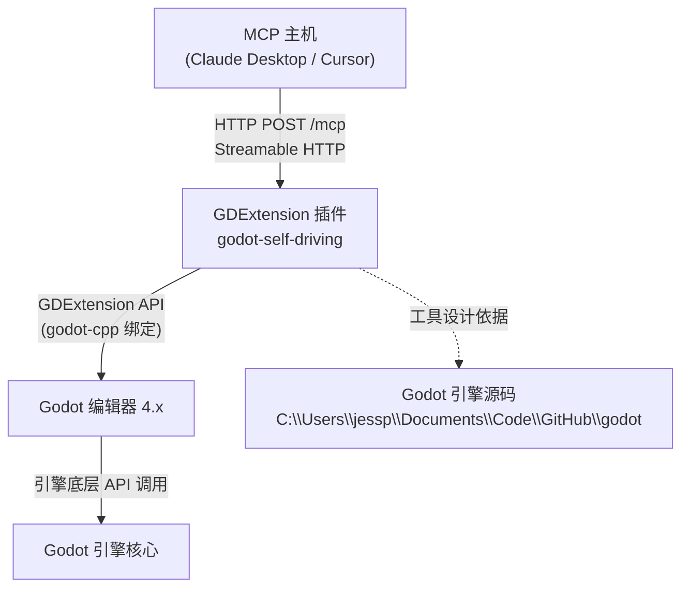
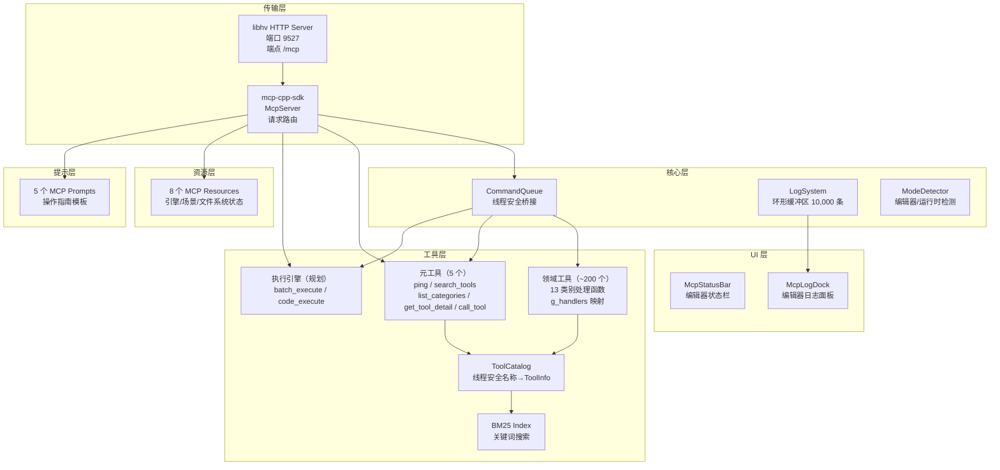
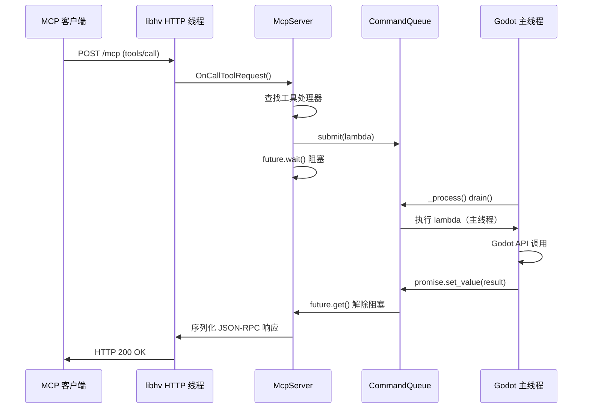
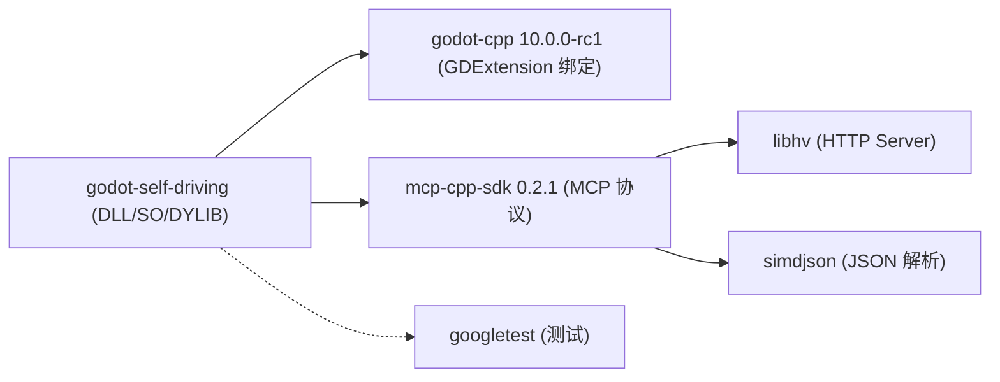

# 系统架构概览

> **版本**: 0.1.0 | **更新**: 2026-07-29
>
> **摘要**: godot-self-driving 是一个 GDExtension 插件，将 MCP 服务器直接嵌入 Godot 编辑器进程。AI 代理通过 HTTP 连接该服务器，直接调用引擎底层 API 控制 Godot，而非通过 UI 自动化。
>
> **关联文档**:
> - [thread-model.md](thread-model.md) — 线程安全模型与 CommandQueue 实现
> - [startup-sequence.md](startup-sequence.md) — 初始化与终止流程
> - [design-decisions.md](design-decisions.md) — 架构决策及其理由

---

## 1. 系统愿景

为 AI 代理提供对 Godot 引擎的**程序化、底层、实时**控制能力。区别于传统的 UI 自动化方案（模拟鼠标点击/按键），本项目让 AI 代理直接调用 Godot 引擎 API。

覆盖能力范围：
- 场景树操作（创建/删除/查询节点）
- 属性读写（任何 Object 的 property）
- 资源管理（加载/保存/导入/创建）
- GDScript 执行与脚本操作
- 物理引擎控制（射线/形状投射、碰撞体、力/冲量）
- 渲染管线控制（摄像机、光照、材质、粒子、CanvasItem）
- 导航系统操作（NavMap/NavRegion/NavAgent）
- 音频总线与流控制
- 输入模拟（动作、按键、鼠标、手柄）
- 编辑器操作（选择、保存、UndoRedo、插件管理）
- 项目/编辑器配置读写
- 调试与性能监控

## 2. 架构原则

| 原则 | 说明 | 工程体现 |
|------|------|----------|
| **Engine-Source-Driven** | 工具以引擎底层 API 为设计依据，不从 UI 视角抽象 | 每个工具直接对应 Godot 引擎类的 1~N 个 API 调用 |
| **渐进式发现** | 面对 ~200 个工具，采用 3 层渐进发现避免 Token 爆炸 | L1 元工具 → L2 `call_tool` 代理 → L3 目录搜索 |
| **线程安全桥接** | Godot API 只能在主线程调用 | `CommandQueue` + `_process()` drain + `std::promise`/`std::future` |
| **程序化执行优先** | 对低频长尾操作，GDScript 执行比注册大量工具更 Token 高效 | 直接工具覆盖高频操作，`code_execute` 覆盖自定义逻辑 |
| **零额外进程** | MCP 服务器直接嵌入编辑器进程 | GDExtension 加载到编辑器进程空间 |
| **可验证构建** | 所有变更有自动化构建验证 | CMake Preset + Ninja + clang-cl |

## 3. 系统上下文图 (C4 Level 1)



### 3.1 外部接口

| 接口方向 | 协议 | 端点 | 说明 |
|----------|------|------|------|
| 客户端 → 插件 | HTTP POST | `127.0.0.1:9527/mcp` | Streamable HTTP 传输，JSON-RPC 2.0 |
| 插件 → 编辑器 | GDExtension API | 进程内调用 | godot-cpp 10.0.0 绑定，`EditorPlugin` 接口 |
| 插件 → 源码 | 引用/参考 | 本地文件系统 | 工具签名从 Godot 引擎源码 `core/` 和 `servers/` 导出 |

### 3.2 端口配置

默认 **9527**，通过环境变量 `GODOT_SELF_DRIVING_PORT` 覆盖。

## 4. 内部组件架构



### 4.1 各层职责

| 层 | 组件 | 文件 | 职责 |
|----|------|------|------|
| 传输 | libhv HTTP Server | mcp-cpp-sdk 内部 | 监听 TCP 端口，HTTP 请求解析 |
| 传输 | StreamableHttpTransport | mcp-cpp-sdk | Streamable HTTP 传输实现 |
| 传输 | McpServer | mcp-cpp-sdk | MCP 协议核心：`RegisterTool`/`RegisterResource`/`RegisterPrompt` |
| 核心 | CommandQueue | `src/core/command_queue.hpp` | 生产者-消费者队列，线程安全桥接 |
| 核心 | LogSystem | `src/core/log_system.cpp` | 10,000 条环形缓冲区日志 |
| 核心 | ModeDetector | `src/core/mode_detector.cpp` | 通过 `Engine::is_editor_hint()` 检测模式 |
| 核心 | ServerContext | `src/core/server_context.cpp` | 生命周期管理器 |
| 工具 | 元工具 | `src/tools/register_all.cpp` | 5 个直接注册到 McpServer 的工具 |
| 工具 | 领域工具 | `src/tools/*_ops.cpp`（13 文件） | 每个命名空间提供 `handle_*` 函数 |
| 工具 | g_handlers | `src/tools/register_all.cpp` | `unordered_map<string, ToolHandler>` 名称→函数 |
| 工具 | ToolCatalog | `src/tools/tool_catalog.cpp` | 线程安全 ToolInfo 目录 |
| 工具 | Bm25Index | `src/util/bm25_index.cpp` | BM25 关键词搜索（k1=1.5, b=0.75） |
| UI | McpStatusBar | `src/ui/mcp_status_bar.cpp` | 编辑器顶部状态栏 |
| UI | McpLogDock | `src/ui/mcp_log_dock.cpp` | 编辑器底部日志面板 |
| 资源 | Resource Handlers | `src/resources/resource_handlers.cpp` | 8 个只读 MCP Resources |
| 提示 | Prompt Handlers | `src/prompts/prompt_handlers.cpp` | 5 个中文操作指南模板 |

## 5. 数据流全景

以下是一次完整工具调用的数据流：



详细线程机制见 [thread-model.md](thread-model.md)。启动流程见 [startup-sequence.md](startup-sequence.md)。所有设计决策的理由见 [design-decisions.md](design-decisions.md)。

## 6. 项目目录结构

```
godot-self-driving/
├── cmake/                          # CMake 模块
│   ├── BuildOptimization.cmake     # Unity 构建 / 并行作业池
│   ├── Cache.cmake                 # ccache/sccache 自动探测
│   ├── CompilerOptions.cmake       # 编译器标志
│   ├── FetchDependencies.cmake     # godot-cpp + mcp-cpp-sdk FetchContent
│   ├── Lto.cmake                   # LTO/ThinLTO 配置
│   └── Platform.cmake              # 平台检测
├── docs/plan/                      # ← 本文档所在目录
├── Example/addons/godot-self-driving/  # 构建产物部署目标
├── src/
│   ├── main.cpp                    # GDExtension 入口点 + EditorPlugin
│   ├── core/                       # 核心基础设施
│   │   ├── command_queue.hpp       # 线程安全消息队列（纯头文件）
│   │   ├── log_system.hpp/cpp      # 环形缓冲区日志系统
│   │   ├── mode_detector.hpp/cpp   # 编辑器/运行时模式检测
│   │   └── server_context.hpp/cpp  # MCP 服务器生命周期管理
│   ├── tools/                      # 工具系统
│   │   ├── register_all.hpp/cpp    # 全局注册入口 + g_handlers 映射
│   │   ├── tool_catalog.hpp/cpp    # ToolInfo 目录（线程安全）
│   │   ├── scene_ops.hpp/cpp       # 场景树（3 工具）
│   │   ├── property_ops.hpp/cpp    # 属性读写（4 工具）
│   │   ├── resource_ops.hpp/cpp    # 资源管理（20 工具）
│   │   ├── script_ops.hpp/cpp      # GDScript 操作（10 工具）
│   │   ├── physics_ops.hpp/cpp     # 物理引擎（36 工具）
│   │   ├── render_ops.hpp/cpp      # 渲染管线（29 工具）
│   │   ├── nav_ops.hpp/cpp         # 导航系统（15 工具）
│   │   ├── audio_ops.hpp/cpp       # 音频控制（15 工具）
│   │   ├── input_ops.hpp/cpp       # 输入模拟（10 工具）
│   │   ├── editor_ops.hpp/cpp      # 编辑器操作（20 工具）
│   │   ├── config_ops.hpp/cpp      # 配置读写（13 工具）
│   │   ├── debug_ops.hpp/cpp       # 调试监控（15 工具）
│   │   └── doc_ops.hpp/cpp         # 文档查询（4 工具）
│   ├── resources/                  # MCP Resources
│   │   └── resource_handlers.hpp/cpp   # 8 个资源处理器
│   ├── prompts/                    # MCP Prompts
│   │   └── prompt_handlers.hpp/cpp     # 5 个提示模板
│   ├── ui/                         # Godot 编辑器 UI
│   │   ├── mcp_status_bar.hpp/cpp      # 状态栏
│   │   └── mcp_log_dock.hpp/cpp        # 日志面板
│   └── util/                       # 工具函数
│       ├── bm25_index.hpp/cpp      # BM25 全文搜索
│       └── variant_json.hpp/cpp    # Variant ↔ JsonValue 序列化
├── CMakeLists.txt                  # 顶层 CMake 构建定义
├── CMakePresets.json               # debug / release 预设
├── build.py                        # 自动化构建部署脚本
├── AGENTS.md                       # AI 代理开发指南
├── README.md / README_zh.md        # 文档
```

## 7. 构建系统与依赖

### 7.1 依赖关系



所有依赖通过 CMake `FetchContent` 在配置阶段自动拉取。缓存目录 `build/<preset>/_deps/` **切勿删除**。

### 7.2 构建预设

| 预设 | 构建类型 | 优化 | 调试符号 | LTO | Unity Build |
|------|----------|------|----------|-----|-------------|
| `debug` | Debug | 无 | 完整 PDB | 否 | 是 |
| `release` | Release | `-O2` | 否 | ThinLTO/LTCG | 是 |

### 7.3 构建命令

```bash
# Debug 构建 + 部署
uv run build.py

# Release 构建（先清理）+ 部署
uv run build.py --release

# 手动构建
cmake --preset release
cmake --build --preset release
```

## 8. 版本规划

| 版本 | 目标 | 状态 |
|------|------|------|
| 0.1.0 | 基础 MCP 服务器 + ~200 领域工具 + Resources + Prompts | 当前版本 |
| 0.2.0 | 执行引擎（`batch_execute` + `code_execute`）| 规划中 |
| 0.3.0 | Server 层 API 扩展（DisplayServer/OS/RenderingServer）| 规划中 |
| 0.4.0 | JSON Schema 完善 + 会话管理 | 规划中 |
| 1.0.0 | 稳定 API + 完整测试覆盖 | 远期目标 |
