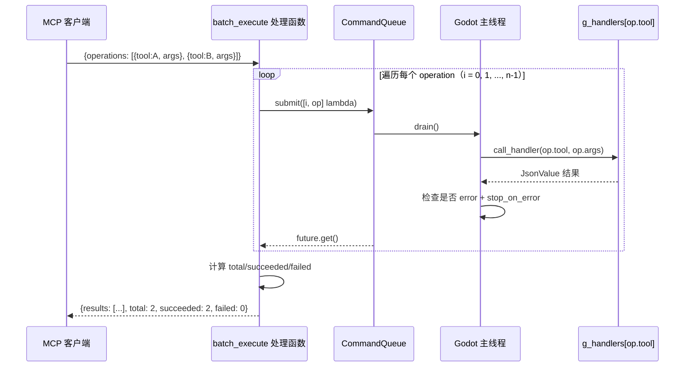
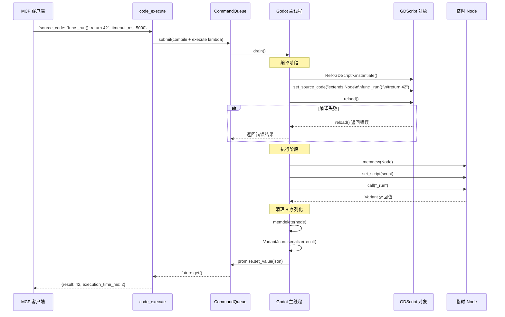
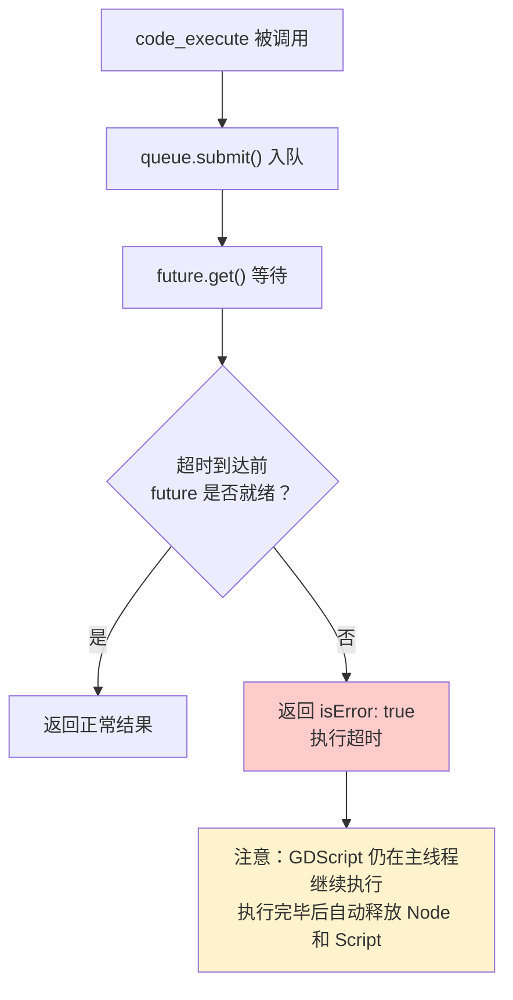
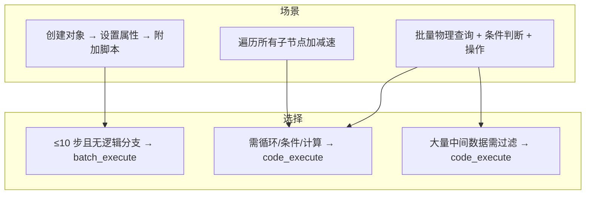

# 执行引擎设计

> **版本**: 0.1.0 | **更新**: 2026-07-29
>
> **摘要**: 执行引擎是增强 AI 代理编程能力的核心组件，包含两个新元工具：`batch_execute`（批量指令编排）和 `code_execute`（GDScript 多语句执行）。前者减少 HTTP 往返，后者消除中间结果的 Token 消耗。
>
> **关联文档**:
> - [tool-discovery.md](tool-discovery.md) — 执行引擎作为元工具的注册方式
> - [tool-catalog.md](tool-catalog.md) — 被编排的现有工具清单
> - [implementation-plan.md](implementation-plan.md) — 实施任务分解

---

## 1. 设计目标

- **减少往返**：Agent 单次提交编排多个有序操作（消除 N 次 HTTP 往返）
- **消除中间 Token**：Agent 编写 GDScript 执行任意复杂逻辑，仅最终结果进入上下文
- **复用现有架构**：复用 `g_handlers` 和 `CommandQueue` 线程模型

## 2. batch_execute

### 2.1 输入 Schema

```json
{
  "type": "object",
  "properties": {
    "operations": {
      "type": "array",
      "items": {
        "type": "object",
        "properties": {
          "tool": {"type": "string", "description": "工具名称"},
          "args": {"type": "object", "description": "工具参数"}
        },
        "required": ["tool"]
      },
      "description": "按序执行的操作列表"
    },
    "stop_on_error": {
      "type": "boolean",
      "description": "遇到错误是否停止",
      "default": true
    }
  },
  "required": ["operations"]
}
```

### 2.2 输出 Schema

```json
{
  "type": "object",
  "properties": {
    "results": {
      "type": "array",
      "items": {
        "type": "object",
        "properties": {
          "index": {"type": "integer"},
          "tool": {"type": "string"},
          "status": {"type": "string", "enum": ["ok", "error"]},
          "data": {"type": "object"},
          "error": {"type": "string"}
        }
      }
    },
    "total": {"type": "integer"},
    "succeeded": {"type": "integer"},
    "failed": {"type": "integer"}
  }
}
```

### 2.3 执行流程



### 2.4 实现位置

- **文件**: `src/tools/code_exec_ops.hpp`（声明）+ `src/tools/code_exec_ops.cpp`（实现）
- **注册**: 在 `register_all.cpp` 中作为元工具注册（与 ping/search_tools 同级），非 g_handlers
- **核心逻辑**: 约 80 行 C++，循环调用 `call_handler()`

## 3. code_execute

### 3.1 输入 Schema

```json
{
  "type": "object",
  "properties": {
    "source_code": {
      "type": "string",
      "description": "GDScript 源代码（需包含目标函数）"
    },
    "function_name": {
      "type": "string",
      "description": "要执行的函数名",
      "default": "_run"
    },
    "timeout_ms": {
      "type": "integer",
      "description": "执行超时（毫秒）",
      "default": 5000,
      "maximum": 30000
    }
  },
  "required": ["source_code"]
}
```

### 3.2 自动包装模板

Agent 提供的代码自动包装为：

```gdscript
extends Node

func _run():
    # Agent 提供的 source_code 插入此处
    var root = get_tree().root
    var child = root.get_child(0)
    child.position = Vector2(100, 100)
    return child.position
```

约束：
- 必须继承 Node（自动注入 `extends Node`）
- 函数名可配置（默认 `_run`）
- 返回值通过 `VariantJson::serialize()` 序列化为 JSON

### 3.3 执行流程



### 3.4 超时处理



**关于超时**：Godot 的 GDScript 解释器不提供中断机制。超时后 HTTP 侧返回错误，但主线程的 GDScript 会继续执行直到完成，之后自动释放资源。这不会导致编辑器崩溃。

### 3.5 结果序列化

使用现有 `VariantJson::serialize()` 工具函数，支持所有 Variant 类型：
- 基础类型：null, bool, int, float, String
- 数学类型：Vector2/3/4, Color, Transform2D/3D, Quaternion, Plane
- 容器类型：Array, Dictionary
- 对象类型：转为 `{"class": "...", "path": "..."}` 形式

## 4. 使用场景对比



## 5. 错误场景

| 场景 | 表现 |
|------|------|
| source_code 缺失 | isError, "missing required parameter: source_code" |
| GDScript 编译失败 | isError, 编译错误详情 |
| GDScript 运行时异常 | isError, 异常信息 |
| code_execute 超时 | isError, "Execution timed out after N ms" |
| batch_execute 某步工具不存在 | 该步 status: "error" |
| batch_execute 某步失败 + stop_on_error | 中断，返回已执行的结果 |

## 6. 与现有架构的集成

- **注册位置**: `register_all.cpp` 中 `register_all_tools()`，与 ping 同级
- **实现文件**: `src/tools/code_exec_ops.hpp` + `src/tools/code_exec_ops.cpp`
- **依赖**: `call_handler()` 函数（已在 `register_all.hpp` 声明）
- **无需修改**: `CommandQueue`、`ServerContext`、`ToolCatalog`
