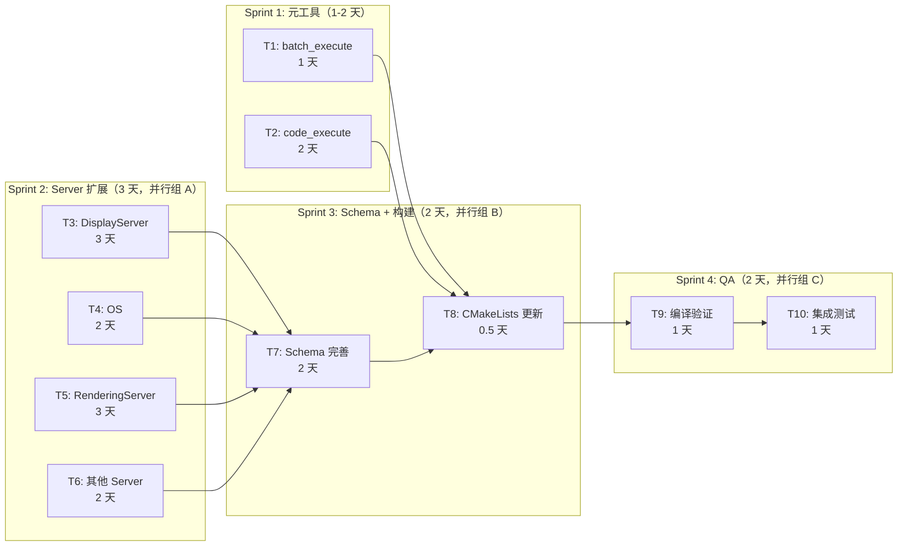
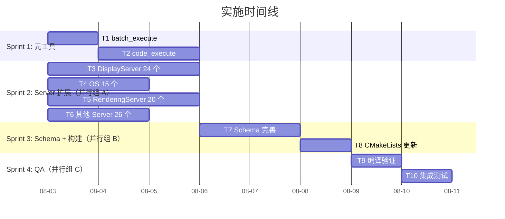

# 实施计划

> **版本**: 0.1.0 | **更新**: 2026-07-29
>
> **摘要**: 完整的任务分解、DAG 依赖关系、并行化策略和风险评估。所有工作分 4 个 Sprint 执行，预估总工期 15.5 人·天，通过并行化压缩至 10 日历天。
>
> **关联文档**:
> - [execution-engine.md](execution-engine.md) — Sprint 1 交付物设计
> - [tool-expansion.md](tool-expansion.md) — Sprint 2-3 交付物设计
> - [architecture-overview.md](architecture-overview.md) — 系统架构上下文
> - [tool-catalog.md](tool-catalog.md) — 被修改的现有工具文件

---

## 1. 任务总览

| 编号 | 名称 | 类型 | 新文件 | 预估人天 | 并行组 |
|------|------|------|--------|---------|--------|
| T1 | batch_execute 元工具 | 元工具 | `code_exec_ops.hpp/.cpp` | 1 | - |
| T2 | code_execute 元工具 | 元工具 | `code_exec_ops.hpp/.cpp` | 2 | - |
| T3 | DisplayServer 工具（24 个） | 工具扩展 | `display_ops.hpp/.cpp` | 3 | A |
| T4 | OS 工具（15 个） | 工具扩展 | `os_ops.hpp/.cpp` | 2 | A |
| T5 | RenderingServer 扩展（20 个） | 工具扩展 | `render_ops.hpp/.cpp` 扩充 | 3 | A |
| T6 | 其他 Server 扩展（~26 个） | 工具扩展 | 多文件 | 2 | A |
| T7 | Schema 完善 | 修补 | `register_all.cpp` | 2 | B |
| T8 | CMakeLists 更新 | 构建 | `CMakeLists.txt` | 0.5 | B |
| T9 | 编译验证 | QA | - | 1 | C |
| T10 | 集成测试 | QA | - | 1 | C |

---

## 2. DAG 依赖关系

---

## 3. 甘特图

---

## 4. 子任务分解

### T1: batch_execute（1 天）

| 子步骤 | 描述 | 文件 | 预估行数 |
|--------|------|------|---------|
| T1.1 | 创建 code_exec_ops.hpp，声明 handle_batch_execute | `code_exec_ops.hpp` | ~15 |
| T1.2 | 实现遍历循环：迭代 operations 数组 | `code_exec_ops.cpp` | ~25 |
| T1.3 | 实现 call_handler 调用 + 结果聚合 | `code_exec_ops.cpp` | ~25 |
| T1.4 | 注册到 register_all.cpp 作为元工具 | `register_all.cpp` | ~20 |

### T2: code_execute（2 天）

| 子步骤 | 描述 | 文件 | 预估行数 |
|--------|------|------|---------|
| T2.1 | 声明 handle_code_execute | `code_exec_ops.hpp` | ~5 |
| T2.2 | GDScript 编译：instantiate + set_source_code + reload | `code_exec_ops.cpp` | ~30 |
| T2.3 | 临时 Node 执行：memnew → set_script → call | `code_exec_ops.cpp` | ~25 |
| T2.4 | 结果序列化：VariantJson::serialize | `code_exec_ops.cpp` | ~15 |
| T2.5 | 超时机制：future.get() + 时间检查 | `code_exec_ops.cpp` | ~15 |
| T2.6 | 错误处理：编译失败/运行时异常/超时 | `code_exec_ops.cpp` | ~20 |
| T2.7 | 注册到 register_all.cpp | `register_all.cpp` | ~20 |

### T3: DisplayServer 工具（3 天）

| 子步骤 | 描述 | 文件 | 预估行数 |
|--------|------|------|---------|
| T3.1 | 创建 display_ops.hpp，声明 24 个 handle 函数 | `display_ops.hpp` | ~30 |
| T3.2 | 窗口类工具实现（9 个）：create/delete/set_*/move/request | `display_ops.cpp` | ~120 |
| T3.3 | 屏幕类工具实现（4 个）：count/size/position/dpi/refresh | `display_ops.cpp` | ~60 |
| T3.4 | 鼠标/剪贴板工具实现（5 个）：position/mode/warp/clipboard | `display_ops.cpp` | ~60 |
| T3.5 | 其他工具实现（6 个）：TTS/dialog/screenshot | `display_ops.cpp` | ~80 |
| T3.6 | 注册到 register_all.cpp：g_handlers + catalog + BM25 | `register_all.cpp` | ~80 |

### T4: OS 工具（2 天）

| 子步骤 | 描述 | 文件 | 预估行数 |
|--------|------|------|---------|
| T4.1 | 创建 os_ops.hpp，声明 15 个 handle 函数 | `os_ops.hpp` | ~20 |
| T4.2 | 进程类工具（3 个）：execute/create_process/kill | `os_ops.cpp` | ~50 |
| T4.3 | 环境/系统信息工具（6 个）：env get/set, system_info, locale, time, unique_id | `os_ops.cpp` | ~60 |
| T4.4 | 文件/UI 工具（6 个）：user_data_dir, shell_open, alert, trash, fonts | `os_ops.cpp` | ~50 |
| T4.5 | 注册到 register_all.cpp | `register_all.cpp` | ~50 |

### T5: RenderingServer 扩展（3 天）

| 子步骤 | 描述 | 文件 | 预估行数 |
|--------|------|------|---------|
| T5.1 | 在 render_ops.hpp 添加 20 个新声明 | `render_ops.hpp` | ~25 |
| T5.2 | 纹理/着色器工具（3 个） | `render_ops.cpp` | ~45 |
| T5.3 | 环境效果工具（4 个）：glow/ssr/tonemap/sdfgi/volumetric_fog | `render_ops.cpp` | ~60 |
| T5.4 | 天空/粒子工具（4 个） | `render_ops.cpp` | ~60 |
| T5.5 | 其他工具（9 个）：decal/reflection_probe/fog/instance/global_param | `render_ops.cpp` | ~100 |
| T5.6 | 注册到 register_all.cpp | `register_all.cpp` | ~70 |

### T6: 其他 Server 扩展（2 天）

| 子步骤 | 描述 | 文件 | 预估行数 |
|--------|------|------|---------|
| T6.1 | scene_tree_ops（8 个工具） | 新文件 | ~120 |
| T6.2 | input_map_ops（8 个工具） | 新文件 | ~100 |
| T6.3 | text_ops（10 个工具） | 新文件 | ~150 |
| T6.4 | audio_ops 补充（5 个） | 扩充 | ~60 |
| T6.5 | debug_ops 补充（8 个） | 扩充 | ~80 |
| T6.6 | physics_ops 补充（10 个） | 扩充 | ~130 |
| T6.7 | 注册所有新工具到 register_all.cpp | `register_all.cpp` | ~100 |

### T7: Schema 完善（2 天）

| 子步骤 | 描述 | 文件 | 预估行数 |
|--------|------|------|---------|
| T7.1 | 为 ~193 个空 Schema 工具补全 JSON Schema | `register_all.cpp` | ~2000 |
| T7.2 | 添加 ToolOptions 标注（read_only_hint/destructive/idempotent） | `register_all.cpp` | ~200 |
| T7.3 | 验证每个 Schema 与处理函数实现一致 | `register_all.cpp` | 审查 |

### T8: CMakeLists 更新（0.5 天）

| 子步骤 | 描述 | 文件 |
|--------|------|------|
| T8.1 | 添加新建 .cpp 文件到 source file list | `CMakeLists.txt` |

### T9: 编译验证（1 天）

| 子步骤 | 描述 |
|--------|------|
| T9.1 | 运行 `uv run build.py --release` |
| T9.2 | 修复编译错误（如有） |
| T9.3 | 确保 0 警告 |

### T10: 集成测试（1 天）

| 子步骤 | 验证内容 |
|--------|----------|
| T10.1 | batch_execute 返回正确的聚合结果 |
| T10.2 | code_execute 返回正确的 GDScript 执行结果 |
| T10.3 | code_execute 编译失败返回 isError |
| T10.4 | DisplayServer 工具返回正确响应 |
| T10.5 | OS 工具返回正确响应 |

---

## 5. 并行化策略

| 并行组 | 包含任务 | 并行度 | 说明 |
|--------|---------|--------|------|
| A（Sprint 2）| T3, T4, T5, T6 | 4 路 | 操作不同文件，完全无冲突 |
| B（Sprint 3）| T7, T8 | 2 路 | T7 修改 register_all.cpp，T8 修改 CMakeLists.txt |
| C（Sprint 4）| T9, T10 | 顺序 | T10 必须在 T9 通过后执行 |

Sprint 1 的 T1 和 T2 可部分并行（修改同文件，需顺序）。

---

## 6. 文件变更清单

### 新文件（5 个文件对 = 10 文件）

| 文件 | 包含工具数 | 引擎源 |
|------|-----------|--------|
| `src/tools/code_exec_ops.hpp/.cpp` | 2 元工具 | 无（执行引擎） |
| `src/tools/display_ops.hpp/.cpp` | 24 | `servers/display/display_server.h` |
| `src/tools/os_ops.hpp/.cpp` | 15 | `core/os/os.h` |
| `src/tools/scene_tree_ops.hpp/.cpp` | 8 | `scene/main/scene_tree.h` |
| `src/tools/input_map_ops.hpp/.cpp` | 8 | `core/input/input_map.h` |

### 扩充文件（5 个文件对 = 10 文件）

| 文件 | 新增工具数 | 引擎源 |
|------|-----------|--------|
| `src/tools/render_ops.hpp/.cpp` | +20 | `servers/rendering/rendering_server.h` |
| `src/tools/debug_ops.hpp/.cpp` | +8 | `main/performance.h` |
| `src/tools/physics_ops.hpp/.cpp` | +10 | `servers/physics_*d/` |
| `src/tools/audio_ops.hpp/.cpp` | +5 | `servers/audio/audio_server.h` |
| `src/tools/text_ops.hpp/.cpp` | +10 | `servers/text/text_server.h` |

### 修改文件

| 文件 | 修改内容 |
|------|----------|
| `src/tools/register_all.cpp` | 添加 ~280 条注册 + ~193 个 Schema |
| `CMakeLists.txt` | 添加新 .cpp 文件 |

---

## 7. 风险矩阵

| 风险 | 概率 | 影响 | 缓解措施 | 等级 |
|------|------|------|---------|------|
| godot-cpp 缺少某些 Server 绑定类 | 中 | 高 | 回退到 `Object::call()` 方式；通过 `Engine::get_singleton()->get_singleton("ServerName")` 获取 | P1 |
| code_execute 死循环卡主线程 | 低 | 中 | HTTP 侧超时切断响应；文档明确警告避免无限循环 | P1 |
| MSVC 编译失败（与 clang-cl 差异） | 低 | 中 | 优先 clang-cl；特定头文件加条件编译 | P2 |
| register_all.cpp 膨胀难维护 | 中 | 低 | 后续可拆分为 per-category 注册文件（0.4.0 版本） | P3 |
| BM25 性能下降 | 低 | 低 | 280 工具 < 100KB，每次搜索遍历 < 1ms | - |

---

## 8. 验证标准

| 任务 | 验证方法 | 通过标准 |
|------|---------|---------|
| T1 | 编译后发 HTTP 请求 | batch_execute 返回正确聚合结果 |
| T2 | 编译后发 HTTP 请求 | code_execute 返回正确 GDScript 结果 |
| T3 | 编译后发 HTTP 请求 | display_window_create 返回窗口 ID |
| T4 | 编译后发 HTTP 请求 | os_get_system_info 返回 JSON |
| T7 | 代码审查 | 所有 ~280 工具具有非空 JSON Schema |
| T8 | 编译 | CMake 配置无 error |
| T9 | `uv run build.py --release` | 0 error, 0 warning |
| T10 | 手动测试脚本 | 批量和代码执行全流程通过 |
