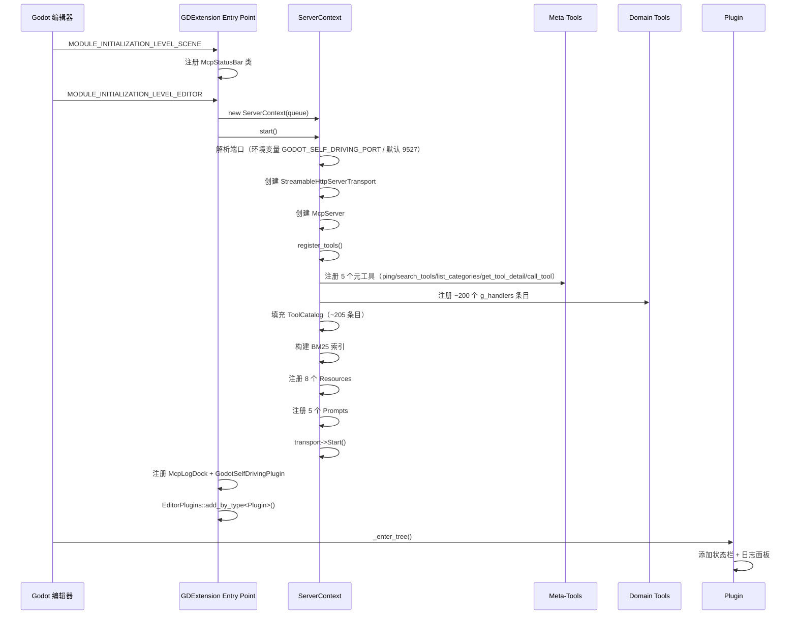
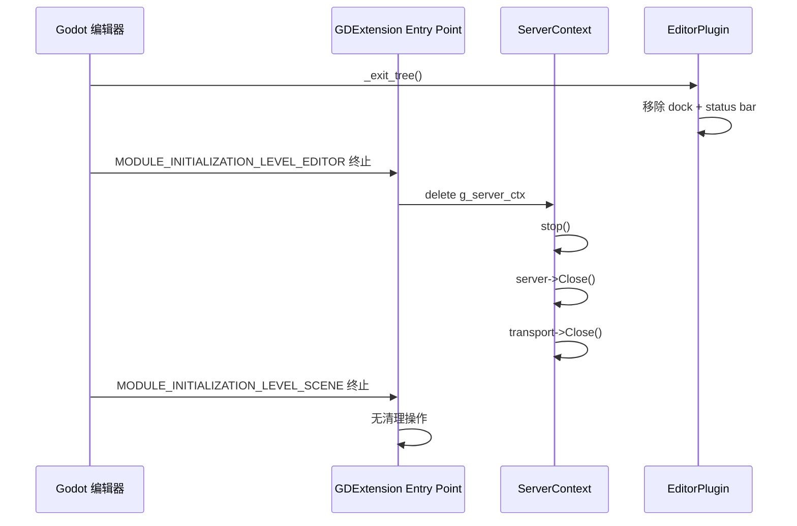

# 启动序列

> **版本**: 0.1.0 | **更新**: 2026-07-29
>
> **摘要**: GDExtension 插件的初始化分为两个 Godot 初始化级别：SCENE 阶段注册 UI 类，EDITOR 阶段创建 ServerContext、注册所有工具并启动 HTTP 服务器。终止时逆向销毁。
>
> **关联文档**:
> - [architecture-overview.md](architecture-overview.md) — 系统组件上下文
> - [thread-model.md](thread-model.md) — _process() drain 的触发机制

---

## 1. 初始化流程



## 2. 初始化级别

| 级别 | 触发时机 | 执行内容 |
|------|----------|----------|
| `MODULE_INITIALIZATION_LEVEL_SCENE` | 场景类型系统就绪 | 注册 `McpStatusBar`（需要 HBoxContainer 基类） |
| `MODULE_INITIALIZATION_LEVEL_EDITOR` | 编辑器完全初始化 | 创建 `ServerContext`、注册所有工具、启动服务器 |

## 3. 终止序列



## 4. 启动日志输出

```
[System Info] ==== Godot Self-Driving plugin starting ====
[System Info] Runtime mode: Editor
[Transport Info] Server configured on port 9527
[Transport Info] MCP server started on 127.0.0.1:9527
[Tools Info] 206 tools registered via catalog
[Resources Info] 8 resource handlers registered
[Prompts Info] 5 prompt templates registered
[System Debug] Toolbar status bar attached
[System Debug] Bottom log dock registered
[System Info] Plugin ready
```
