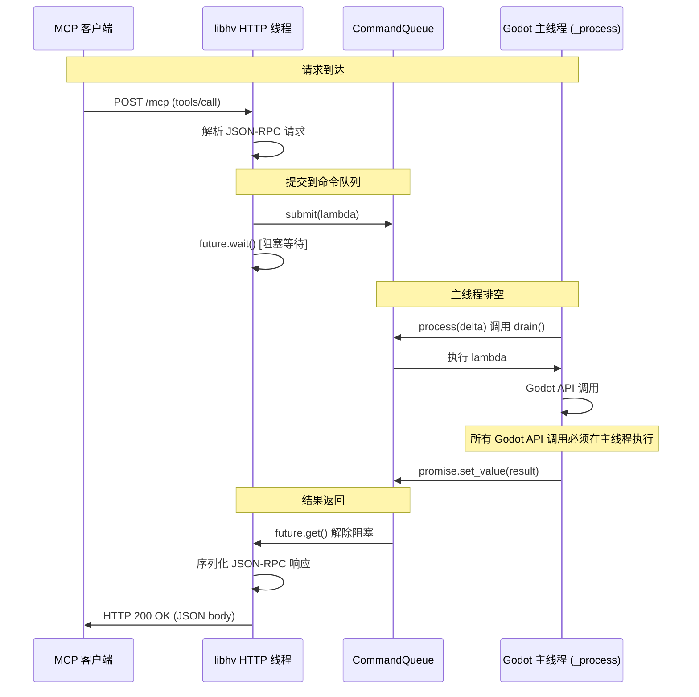

# 线程模型

> **版本**: 0.1.0 | **更新**: 2026-07-29
>
> **摘要**: Godot 引擎要求所有 API 调用只能在主线程执行。HTTP 线程（libhv）接收 MCP 请求后，通过 `CommandQueue` 将任务桥接到 Godot 主线程，使用 `std::promise`/`std::future` 实现同步式编程模型。
>
> **关联文档**:
> - [architecture-overview.md](architecture-overview.md) — 系统组件架构
> - [startup-sequence.md](startup-sequence.md) — _process() 的启动上下文

---

## 1. 核心约束

**Godot 引擎的所有 API 调用只能在主线程（`_process()` / `_physics_process()`）中进行。** HTTP 线程（libhv）直接调用 Godot API 会导致崩溃、数据竞争或未定义行为。

## 2. 线程通信架构



## 3. CommandQueue 实现

位于 `src/core/command_queue.hpp`，核心是模板化的生产者-消费者队列：

```cpp
template <typename Fn>
auto submit(Fn&& fn) -> std::future<std::invoke_result_t<Fn>> {
    auto task = std::make_unique<Task<Fn>>(std::forward<Fn>(fn));
    auto future = task->promise.get_future();
    {
        std::lock_guard<std::mutex> lock(mutex_);
        tasks_.push(std::move(task));
    }
    return future;
}

void drain() {
    std::queue<std::unique_ptr<TaskBase>> batch;
    {
        std::lock_guard<std::mutex> lock(mutex_);
        batch.swap(tasks_);
    }
    while (!batch.empty()) {
        batch.front()->execute();
        batch.pop();
    }
}
```

### 3.1 关键设计要点

| 要点 | 说明 |
|------|------|
| **批量排空** | `drain()` 通过 swap 将待处理任务移到局部队列，最小化锁持有时间 |
| **异常传播** | `Task::execute()` 将异常捕获到 `promise.set_exception()`，HTTP 线程通过 `future.get()` 重新抛出 |
| **void 特化** | `std::is_void_v` 特化处理返回 void 的 lambda，避免 `set_value(void)` 编译错误 |
| **无堆分配优化** | `std::unique_ptr<TaskBase>` + 虚函数 `execute()` 实现类型擦除 |

## 4. 主线程 drain 触发

在 `src/main.cpp` 的 `GodotSelfDrivingPlugin::_process(double)` 中调用：

```cpp
void GodotSelfDrivingPlugin::_process(double) {
    s_queue.drain();
    if (log_dock) {
        log_dock->poll_new_entries();
    }
}
```

Godot 每帧调用 `_process()`，因此 HTTP 线程最长等待时间约为一帧（~16ms @ 60fps）。

## 5. 同步式编程模型

HTTP 线程通过 `std::promise` / `std::future` 实现"伪同步"风格：

```cpp
// HTTP 线程视角——看似同步调用
auto result = queue.submit([&]() {
    // 这段 lambda 在主线程执行
    auto* engine = godot::Engine::get_singleton();
    return engine->get_version_info();
}).get(); // 阻塞直到主线程执行完毕
```

这意味着 HTTP 线程的每个请求处理都会阻塞等待 `future.get()` 完成。由于 Streamable HTTP 本质上是请求-响应模式，无需并发处理多个请求。

## 6. 线程间异常传播

```cpp
// Task::execute() 内部
try {
    promise.set_value(fn());
} catch (...) {
    promise.set_exception(std::current_exception());
}
```

当前工具处理函数不主动抛出异常，而是返回 `{"error": "..."}` JSON 对象。

## 7. 性能特征

| 路径节点 | 瓶颈 | 估算延迟 |
|----------|------|----------|
| HTTP 请求接收 | libhv 事件循环 | < 1ms |
| JSON-RPC 解析 | simdjson | < 1ms |
| 队列提交 | `std::lock_guard` | < 0.1ms |
| 主线程等待 | `_process()` 调用频率 | 0~16ms |
| Godot API 调用 | 工具逻辑复杂度 | 1~100ms |
| JSON 序列化 | mcp::JsonValue::Dump() | < 1ms |

**最大理论延迟**: ~16ms（等待下一个 `_process()`）+ 工具执行时间
