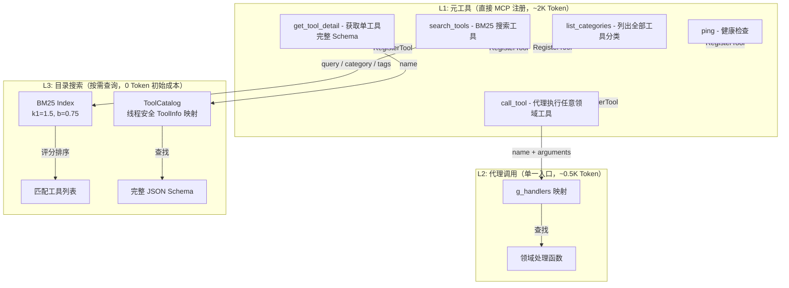

# 工具发现机制

> **版本**: 0.1.0 | **更新**: 2026-07-29
>
> **摘要**: 面对 ~200 个工具，采用 3 层渐进式发现策略，避免将全部工具暴露给 MCP 客户端造成的 Token 膨胀。初始化仅注册 5 个元工具（~2K Token），客户端按需搜索和获取具体工具 Schema。
>
> **关联文档**:
> - [tool-catalog.md](tool-catalog.md) — 全部工具清单
> - [tool-expansion.md](tool-expansion.md) — 计划扩展的工具
> - [execution-engine.md](execution-engine.md) — 执行引擎（作为元工具注册）
> - [architecture-overview.md](architecture-overview.md) — 系统组件上下文

---

## 1. 三层发现概览



## 2. Token 成本对比

| 层级 | 机制 | MCP 注册方式 | 数量 | 初始 Token | 单次调用 Token |
|------|------|-------------|------|------------|---------------|
| L1 元工具 | 直接注册到 McpServer | `RegisterTool` | 5 | ~2,000 | 极小 |
| L2 代理调用 | `call_tool` 单一入口 | `RegisterTool("call_tool")` | 1 | ~500 | 中等 |
| L3 目录搜索 | `search_tools` + `get_tool_detail` 按需查询 | 进程内，不注册到 MCP | ~200 | 0 | 按需 |

## 3. L1 元工具详解

| 工具名 | 用途 | 输入参数 |
|--------|------|----------|
| `ping` | 健康检查 | 无 |
| `search_tools` | BM25 关键词搜索工具目录 | `query`（必填, string）, `category`（可选, string）, `tags`（可选, string[]） |
| `list_categories` | 列出所有分类及工具数量 | 无 |
| `get_tool_detail` | 获取单个工具的完整信息（含 JSON Schema） | `name`（必填, string） |
| `call_tool` | 调用任意领域工具（代理执行） | `name`（必填, string）, `arguments`（可选, object） |

## 4. L2 代理调用机制

所有 ~200 个领域工具**不直接注册**到 MCP 服务器，而是通过 `call_tool` 单一入口代理调用。

客户端调用流程：
1. 客户端调用 `call_tool({ name: "physics_3d_ray_cast", arguments: {...} })`
2. HTTP 线程接收请求，解析 `name`
3. `queue.submit()` 将执行推送到主线程
4. 主线程在 `g_handlers` 中查找 `"physics_3d_ray_cast"`
5. 调用对应的 `physics_ops::handle_3d_ray_cast(args)`
6. 返回结果 → HTTP 线程 → 客户端

`g_handlers` 定义在 `src/tools/register_all.cpp`:
```cpp
namespace {
std::unordered_map<std::string, ToolHandler> g_handlers;
}

using ToolHandler = std::function<mcp::JsonValue(const mcp::JsonValue&)>;
```

## 5. L3 目录搜索

当客户端需要查找合适工具时，使用 `search_tools` 进行 BM25 关键词搜索：

| 参数 | 值 |
|------|-----|
| 算法 | BM25（Okapi BM25） |
| k1 | 1.5 |
| b | 0.75 |
| 索引内容 | `name + description + category + tags` 分词后建索引 |
| 搜索维度 | 关键词全文 + 分类筛选 + 标签筛选 |
| 排序 | BM25 评分降序，Top 10 返回 |

找到目标工具后，通过 `get_tool_detail` 获取完整 JSON Schema，然后通过 `call_tool` 调用。

## 6. 典型客户端发现流程

```
步骤 1: 客户端调用 tools/list (MCP 标准方法)
        → 获取 5 个元工具（~2K Token）
        
步骤 2: 客户端调用 list_categories
        → 获取 14 个工具分类及工具数量
        
步骤 3: 客户端调用 search_tools({ query: "ray cast" })
        → 获取匹配的工具名称列表（physics_3d_ray_cast, physics_2d_ray_cast 等）
        
步骤 4: 客户端调用 get_tool_detail({ name: "physics_3d_ray_cast" })
        → 获取该工具的完整 JSON Schema
        
步骤 5: 客户端调用 call_tool({ name: "physics_3d_ray_cast", arguments: {...} })
        → 执行领域工具
```

## 7. 工具分类

当前 14 个工具分类：

| 分类 | 工具数 | 说明 |
|------|--------|------|
| Meta | 5 | 元工具（ping, search_tools, list_categories, get_tool_detail, call_tool） |
| Scene | 3 | 场景节点操作 |
| Property | 4 | 对象属性读写 |
| Resources | 20 | 资源加载/保存/创建 |
| Scripts | 10 | GDScript 执行与脚本操作 |
| Physics | 36 | 2D/3D 物理引擎（射线、形状、刚体、关节、区域） |
| Render | 29 | 渲染管线控制（摄像机、光照、材质、粒子） |
| Navigation | 15 | 2D/3D 导航系统 |
| Audio | 15 | 音频总线与流控制 |
| Input | 10 | 输入模拟（动作、按键、鼠标、手柄） |
| Editor | 20 | 编辑器操作（选择、保存、UndoRedo、插件） |
| Config | 13 | 项目/编辑器配置 |
| Debug | 15 | 调试与性能监控 |
| Docs | 4 | Godot API 文档查询 |

## 8. listChanged 通知计划

利用 mcp-cpp-sdk 的 `SendToolListChanged()` 方法，在以下场景发送通知：
- 新工具分类注册完成时
- 工具 Schema 更新时
- 工具启用/禁用状态变更时

当前未实现（计划 0.3.0 版本加入）。
