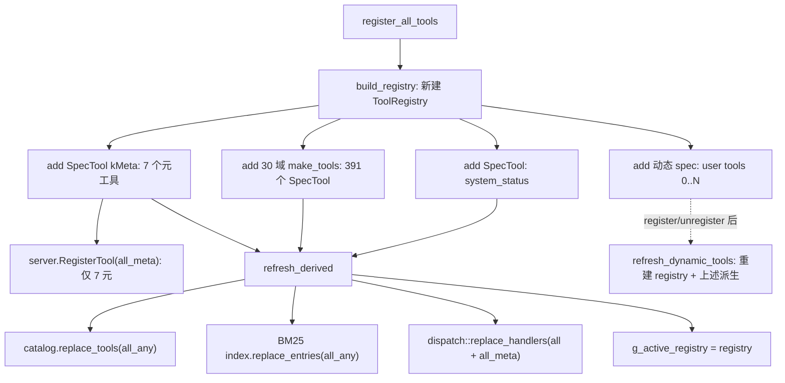

# 工具注册表（src/tools/ 注册管线）

> 审计日期：2026-09-19（2026-08-29 随 0.2.2 版本与全量审计同步；09-02 随 T0 安全边界与并发契约同步；09-13 上午随反馈修复批次同步工具数 365/372/373、Resources 26、SIDE 排除 49；09-13 下午随收口批次同步工具数 366/373/374 与 get_plugin_log；09-13 17:50 随 B 组知识库审计同步——修正契约缺口行号引用、schema 基线行号与元工具 schema 口径；09-13 晚随 0.2.4 版知识库全量审计同步——补正 populate_default_tools 存留状态与命名首段动词的 5 个既有例外；09-15 随 Computer Use grounding 批次同步工具数 379/386/387、非 SIDE 322 / SIDE 57、类别分布与遍历 warnings 实测 4 条；09-16 随失败修复批次同步工具数 384/391/392、非 SIDE 324 / SIDE 60；09-16 随视觉辅助批次同步工具数 385/392/393、Capture 1→2；09-18 随 E2E 优化批次同步工具数 391/398/399 与新增 6 工具；09-19 随 ToolSpec 数据化重构整体重写——全量工具改为 `ToolSpec` 数据记录（不再有宏/真类），删除 `tool_decl.hpp`/`fn_tool.hpp`/`meta_tools.hpp`/`IMetaTool` 与 8 个 `schema_*_ops.cpp`/`schema_fills.hpp`，新增 `tool_args`/`tool_pipeline`/`dynamic_spec_store`/`autopilot_tools` 与 `tests/guard/` 迁移守卫；catalog 399、MCP 恒 7、遍历改为运行时枚举 392 条后按 `side_effect`/`mutating`/`dynamic` 排除，实测 330 个进入两步骤；09-19 收尾第二轮随 traits/invoke/rescan/batch 同步图片附件 flag 判定与 rescan 入口）。
> 覆盖范围：`register_all.cpp/hpp`、`dispatch.cpp/hpp`、`tool_catalog.cpp/hpp`、`schema_builder.cpp/hpp`、`tool_spec.hpp`、`tool_args.cpp/hpp`、`tool_pipeline.cpp/hpp`、`tool_base.hpp`、`tool_registry.hpp`、`dynamic_spec_store.hpp`、`autopilot_tools.cpp/hpp`、30 个域 `*_tools.hpp`，对照 `tests/runner/traversal.cpp`、`tests/unit/register_all_test.cpp`、`tests/unit/tool_registry_test.cpp`、`tests/guard/`、`tests/config/03_tools_contract.json` 与仓库根 `AGENTS.md` 工具段。
> 相关页面：[ToolSpec 数据层与执行管线](../tool_base_design.md) · [测试体系](../tests.md) · [工具实现 A 组](../modules/tools_ops_a.md) · [工具实现 B 组](../modules/tools_ops_b.md) · [入口与运行时](../modules/entry_runtime.md) · [架构总览](../overview.md)

## 注册管线流程（ToolRegistry 单一来源 + 全量 ToolSpec，自 2026-09-19）

工具注册发生在 `register_all_tools()`（`src/tools/register_all.cpp`），现为 **ToolRegistry 单一来源**且 **391 域工具 + `system_status` + 7 元工具全部为 `ToolSpec` 数据记录**（`make_spec_tool` → `SpecTool`，细节见 [ToolSpec 数据层与执行管线](../tool_base_design.md)）。域工具定义在 `src/tools/<域>_tools.hpp`（30 个域文件），每域提供 `make_tools()` 返回 `vector<unique_ptr<ToolBase>>`；每个工具 = 参数表 `const std::vector<ParamSpec>` + 一行 `make_spec_tool(ToolSpec{...})`（元信息/副作用/flags/handler/schema 全部内联）。`build_registry()` 先 add `system_status`（SpecTool），再逐一注册 30 个域的 `make_tools()`，再 add 7 个元工具（`flags = kMeta` 自动归类），最后追加 `dynamic_specs::store()` 中的用户脚本工具（`kDynamic`）；`refresh_derived()` 从 registry 派生 catalog/BM25/dispatch handlers。

- **数据记录（非宏/非真类）**：`ToolSpec{name, description, category, tags, side_effect, flags, params, handler, raw_schema}`；`flags` 为 `tool_flags` 位标志（`kMeta`/`kDynamic`/`kMutating`/`kObserve`/`kCaptureImage`/`kSceneTarget`/`kUndoable`）。`ToolRegistry::add()` 按 `flags & kMeta` 自动路由（meta_ vs 域表），不再依赖 `dynamic_cast`。
- **schema 单一源**：`SpecTool` 构造时 `schema_ = raw_schema.IsObject() ? raw_schema : schema::build_schema(params)`；域工具 schema 全部从参数表派生，7 元工具中 `search_tools`/`batch_execute`/`code_execute` 因嵌套结构手写 JSON 存入 `raw_schema`，其余经 `build_schema`（含 `system_status`）。
- **取参统一 `Args`**（`tool_args.hpp/cpp`）：`opt_*`/`require_*`/`get_*` + `reject_unknown()`；`null` 视为缺失，`integer` 接受整数值 double、拒绝小数与越界，`boolean` 严格。错误消息 "missing required parameter: X" / "invalid parameter: X must be a ..." 由 handler 抛出后经 dispatch 统一包装。
- **生命周期**：`g_active_registry` 为 mutex 保护的 `shared_ptr<ToolRegistry>`；`register_all_tools`/`refresh_dynamic_tools` 每次先构建局部 registry，再经 `refresh_derived` 批量替换 catalog/index/dispatch；dispatch handler lambda 捕获 registry 并在调用时 `find` 取工具，旧请求持有的 registry 由共享所有权延长生命周期。
- **动态工具**：`AutopilotTools`（`autopilot_tools.cpp`）注册的用户工具 spec 存 `dynamic_spec_store.hpp` 的 store()（互斥保护），注册/注销后调 `refresh_dynamic_tools()` 全量重建；工具带 `kDynamic`；重名/与内置碰撞拒绝。执行受 `user_tools` capability 门（env `GODOT_AUTOPILOT_ALLOW` 优先于配置 `allow`）。目录批量注册入口 `rescan(directory)`（默认 `res://addons/godot-autopilot-tools`；门禁/marshal/前缀校验/256 文件/深度 8/逐文件错误隔离，返回 scanned/registered/failed/errors）；约定、示例与 L2 `27_user_tools_rescan` 见 [ToolSpec 数据层与执行管线](../tool_base_design.md)的目录扫描小节。
- **分类边界**：`get_debug_object_info`（handler `physics_ops::handle_resolve_object`）归 `physics_tools` 但 Category "Debug"；`read_file/find_in_files/write_file`（handler `text_ops`）归 `os_tools`；Scene Tree 类工具 Category 均为 "Scene"、按 handler 分 `scene_tools`/`scene_tree_tools`；InputMap 工具 Category "Input"、归 `input_map_tools`。

## 三层结构

| 层 | 载体 | 数量 | 内容 |
|---|---|---|---|
| 单一来源层 | `ToolRegistry`（`g_active_registry`） | **399** | `all()`=392（391 域 + system_status）+ `all_meta()`=7 |
| MCP 服务器层 | `server.RegisterTool()`（派生自 registry） | **7** | 元工具（`kMeta`，见下） |
| 分发层 | `dispatch::g_handlers`+`g_meta_handlers`（派生） | **399** | 392 域/系统 + 7 元 |
| 目录层 | `ToolCatalog`（派生） | **399** | 391 域 + system_status + 7 元 |

领域工具不注册进 MCP 工具列表，只能经 `call_tool` 元工具代理调用；`ToolCatalog` 399 = 391 域工具 + `system_status` + 7 元工具（`refresh_derived` 对 `all_any()` 逐一 `make_tool_info` 派生，`dynamic`/`mutating` 字段来自 `tool_flags`）。MCP 工具总数 = 7 元（不变）；经 `call_tool` 代理可达 398（7 元 + 391 域）。

## 数值核算总表（与 AGENTS.md 逐项对比）

| # | 声称（AGENTS.md） | 核算结果 | 结论 |
|---|---|---|---|
| 1 | 元工具 7 个：ping/search_tools/list_categories/get_tool_detail/call_tool/batch_execute/code_execute，均作为顶层工具提供 | 7 个经 registry `add()`（`kMeta` 自动入 meta_），统一在 `register_all.cpp` 循环 `server.RegisterTool`（描述/schema 取自 registry 工具）；名单由 `g_active_registry->all_meta()` 派生，与 `register_all_test.cpp` 的 `kMetaToolNames` 一致；L1 断言 `ListTools` 恰好 7 个 | **一致** |
| 2 | 领域工具 391 个 | 30 个 `*_tools.hpp` 的 `make_tools()` 共 391 个 `SpecTool`（`GDA_TOOL_CLASS` 宏与真类已删）；registry `all()`=**392** = 391 + system_status | **一致** |
| 3 | 工具总体 = 7 元 + 391 域 | registry `all_any()`=**399**（392 域/系统 + 7 元）；MCP 顶层 7 元工具，MCP 可达总数 398 | **一致** |
| 4 | ToolCatalog 399 条 | 由 registry `all_any()` 逐一 `make_tool_info` 派生 399 = 391 域 + system_status + 7 元；原 `populate_default_tools`/meta 快照链路已删除，catalog 完全由 `replace_tools` 动态填充 | **一致**（单一来源派生，无独立填表） |
| 5 | schema 非空/空数 | 无静态填表；`SpecTool` 构造时从参数表（或元工具 `raw_schema`）生成，catalog 级非空/空数**以运行时 `SchemaStatisticsBaseline` 观测为准**（当前精确基线 399 = 336 非空 + 63 空） | **运行时统计口径** |
| 6 | SchemaStatisticsBaseline 运行时统计断言 | `register_all_test.cpp:135-152` 断言 catalog 399 总条、非空 336、空 63（与 `tools.size()` 联动） | **一致** |
| 7 | 3 个契约缺口 + 4 条遍历 warnings | 见下方契约缺口表；warnings 以运行时报告为准 | **一致** |
| 8 | 遍历排除机制 | 遍历运行时枚举 392 条（391 域 + system_status），跳过 7 元工具，再按 `side_effect` 非空 / `mutating` / `dynamic` 任一命中排除；实测 330 个进入空参+冒烟两步骤（**以运行时 `03_tools_contract` 统计为准**） | **运行时统计口径** |
| 9 | 命名约定 `<动词>_<类别>_<维度>_<对象>_<修饰>`（动词置首） | 391 个名字全部小写 snake_case；绝大多数首段为动词（create/get/set/add/remove/apply/intersect/play/stop/save/…），5 个名词置首的历史例外（property_get/property_set/property_get_list、signal_connect/signal_disconnect） | **一致（含 5 个既有例外）** |

## 元工具与分发层

- 7 个元工具均为 `SpecTool` + `flags = kMeta`，经 `register_all.cpp` 派生循环 `server.RegisterTool`；`g_meta_handlers`（`refresh_derived` 从 `all_meta()` 派生）供分发层复用——`call_handler` 未命中 `g_handlers` 时查 `g_meta_handlers`（`dispatch.cpp`）。
- `call_tool`/`code_execute` 的错误翻转在 RegisterTool 回调统一处理：结果 JSON 含 `error` 字段时置 `is_error = true`。
- 图片附件按 `kCaptureImage` flag 判定（`register_all.cpp` 的 `call_tool` 回调）：registry 已知工具含该 flag 时经 `util::try_attach_image_data` 附加截图 image content，仅未知工具名才走旧白名单 `is_image_capture_tool` 兜底（`util::try_attach_image_content`）；L1 `tool_pipeline_traits_test.cpp` 覆盖附件判定纯逻辑 4 项（含无 flag 透传）。
- `call_tool` 对带 `__gda_pending` 的异步结果做等待与 `capture_game_viewport` 结果定型（`runtime_ops::wait_pending_response`）；`call_tool` 与 `batch_execute(await_async=true)` 的编排回调在 MCP 线程执行（不占用主线程消息泵），领域工具 handler 仍由 dispatch 路由回主线程。

## Schema 统计口径

- 非空判定：`input_schema.properties` 存在且为非空对象；空 schema 仍保留空 `properties` 对象。
- 全部 schema 由 `SpecTool` 构造期生成：域工具与 `system_status` 经 `schema::build_schema(params)`，`ping`/`list_categories`/`get_tool_detail`/`call_tool` 亦经 `build_schema`；`search_tools`/`batch_execute`/`code_execute` 手写 JSON 存 `raw_schema`（嵌套结构 `ParamDef` 不可表达）。schema_builder API 面为 `ParamDef`、`build_schema(initializer_list<ParamDef>)`、`build_schema(const std::vector<ParamDef>&)`、`add_required_flag`。
- 非空/空数以运行时 `SchemaStatisticsBaseline` 观测为准（当前基线 399 = 336 + 63，不硬编码为通用常量）。

## 契约缺口表（遍历记 warnings，不 FAIL）

| 工具 | schema 必填声明 | 实际行为 | 来源 |
|---|---|---|---|
| `create_scene_node` | name/type 标 required，但描述注明默认值 NewNode/Node | 空参被默认值吞掉，不报 "missing required"；仅当运行期存在编辑场景时命中 | `scene_tools.hpp` 参数表 |
| `start_input_gamepad_vibration` | device/weak/strong 标 required，但描述注明默认值 0 / 0.5 / 0.5 | 空参被默认值吞掉，不报 "missing required" | `input_tools.hpp` 参数表 |
| `stop_input_gamepad_vibration` | device 标 required，但描述注明默认值 0 | 空参被默认值吞掉，不报 "missing required" | `input_tools.hpp` 参数表 |
| `get_resource_extensions` | type 标 required | handler 缺省时传空串给 `get_recognized_extensions_for_type("")`，返回全类型而非报错 | `resource_ops.cpp` |
| `reimport_resource_files` | path 标 required（files 可选，handler 两者皆读） | 空参时 files/path 均缺失走 count=0 静默成功 | `resource_ops.cpp` |

warnings 判定逻辑在 `tests/runner/traversal.cpp`（"schema 声明必填但空参未报错"记 warning 不 FAIL）；当前 warnings 清单以运行时报告为准，历史基线 4 条（`start_input_gamepad_vibration`、`stop_input_gamepad_vibration`、`get_resource_extensions`、`reimport_resource_files`）。

## 遍历排除机制（flags 驱动）

- 遍历经 `call_tool` 元工具代理，工具来源为**运行时** `search_tools` 空 query 枚举（`list_tool_names`，392 条 = 391 域 + `system_status`），跳过 7 个协议级元工具。
- 每工具先 `get_tool_detail`（响应含 `side_effect`/`dynamic`/`mutating` 字段），三者任一命中即排除；动态工具（`dynamic=true`）在用户脚本注册期间才会出现，L2 无注册、该分支为防回归保留。
- 排除后 330 个进入 `empty_args`（空参契约）与 `heuristic_smoke`（按 schema properties 类型生成启发值）两步骤（上限 660 步；实测全过，精确步数与 warnings 以运行时 `03_tools_contract` 报告为准）。
- 新增副作用工具只需在 `ToolSpec` 填对应 `side_effect` + `kMutating`（可选 `kDynamic` 由动态注册自动置位），遍历自动排除，**无需手改** `tests/runner/traversal.cpp`。

## 分发与错误路径（dispatch.cpp）

- `call_handler`：编辑器队列存在且不在主线程时，经 `CommandQueue::execute_sync` 排到主线程执行；handler map 在锁内替换、复制后锁外执行。
- 查找顺序：`g_handlers`（`all()` 派生 392 项）→ 命中即执行；异常捕获分两路——`std::exception` 透出 `ex.what()`（业务校验错误即经此路径透出），其余按 `unexpected C++ exception` 兜底；未命中再查 `g_meta_handlers`（7 元，`all_meta()` 派生）；否则返回 `domain tool 'X' not found — use search_tools to discover available tools`。
- 导出保护：全部 7 个元工具回调前置 `ExportGuard::is_exporting()` 检查，命中返回 `export_blocked_result()`。
- RegisterTool 回调分发：`call_tool` 直接在当前（MCP）线程执行 `tool->execute(args)`，`batch_execute` 在 `await_async=true` 时同样走 MCP 线程；其余元工具经 `queue.execute_sync` 投递主线程。
- `debugger_access.hpp` 为 runtime_ops 提供的自由函数接口（capture/broadcast/cancel/continue/breaked/reload_scripts），实现于 `debugger_access.cpp`；依赖方向 runtime_ops.cpp → debugger_access.hpp、debugger_ops.cpp → runtime_ops.hpp，无环。

## 命名约定抽查

- 391 个工具名全部匹配 `^[a-z0-9_]+$`（小写 snake_case，无大写、无连字符）；绝大多数首段为动词（create/get/set/add/remove/apply/intersect/play/stop/save/seek/move/warp/…），另有 5 个名词置首的既有例外（`property_get`/`property_set`/`property_get_list`、`signal_connect`/`signal_disconnect`）。
- 段数随粒度自然变化：2 段（`instantiate_scene`、`property_get`…）、3-4 段（`create_physics_2d_body`、`intersect_physics_2d_ray`…）、5 段+（`get_scene_tree_nodes_in_group`、`set_input_map_action_deadzone`…）。规范约束动词置首与 snake_case，段数与类别段选取以表达清晰为准。

## 类别分布（391 领域工具，27 个类别）

> 权威总数以 30 个域 `*_tools.hpp` 的 `make_tools()`/`ToolSpec` 条目为准（=391），registry `all()`=392（+system_status）；下表为按分类的细分（category 字段统计，09-18 实测 + 09-18 E2E 批次增量）。数量以运行时 `list_categories`/catalog 统计为准。

| 类别 | 数量 | 类别 | 数量 |
|---|---|---|---|
| Render | 49 | Scene | 16 |
| Physics | 47 | Config | 13 |
| Resources | 26 | Text | 10 |
| Display | 25 | Animation | 10 |
| Editor | 32 | Scripts | 11 |
| Audio | 20 | Game | 15 |
| Input | 23 | Theme | 8 |
| OS | 18 | TileMap | 8 |
| Debug | 16 | Debugger | 6 |
| Navigation | 15 | Properties | 5 |
| Docs | 4 | Group | 3 |
| SpriteFrames | 3 | Analysis | 3 |
| Testing | 2 | System | 1 |
| Capture | 2 | | |

注：InputMap 类别已并入 Input；`get_debug_object_info` 挂 physics_ops 模块但归 **Debug** 类；`write_file` 归 OS 类；`capture_editor_viewport` 归 Capture。09-18 E2E 优化批次增量：Editor +1（`verify_scene_saved`）、Scripts +1（`patch_script`）、Game +3（`sample_game_property`/`collect_game_evidence`/`validate_game_ui_layout`）、Scene +1（`build_nodes_from_spec`），27 类合计 385→391。

## 与 AGENTS.md 不一致点清单

1. **耗时声称**：AGENTS.md 不再写遍历耗时；以运行时为准。
2. **ToolCatalog 构成口径（已更新）**：现 399 = 391 域 + `system_status` + 7 元，全部由 registry `all_any()` 单一来源派生；原 343/332/5 默认 + 3 快照 + Auto 补录口径已废除。
3. **g_handlers 口径（已更新）**：现由 registry `all()` 派生共 392（391 域 + system_status），不再手写。
4. **旧宏与 schema 文件（已删除）**：`GDA_TOOL_CLASS`/`tool_decl.hpp`/`fn_tool.hpp`/`meta_tools.hpp`/`IMetaTool`/`tool_input_schema`/`schema_fills.hpp`/`schema_*_ops.cpp` 全仓零残留，由 `tests/guard/migration_guard.cmake` 的 strict 模式守护。
5. **生命周期约束**：`g_active_registry` 为文件级静态 `shared_ptr`（程序存活期），register_all/refresh_dynamic_tools 每次重建内容；避免对局部 registry 的悬垂引用（L1 `RegistryIsSingleSourceOfTools` 断言护航）。

## 出站链接

- [ToolSpec 数据层与执行管线](../tool_base_design.md)
- [测试体系](../tests.md)
- [工具实现 A 组](../modules/tools_ops_a.md)
- [工具实现 B 组](../modules/tools_ops_b.md)
- [入口与运行时](../modules/entry_runtime.md)
- [架构总览](../overview.md)
- [安全边界与并发契约](../security_contract.md)
